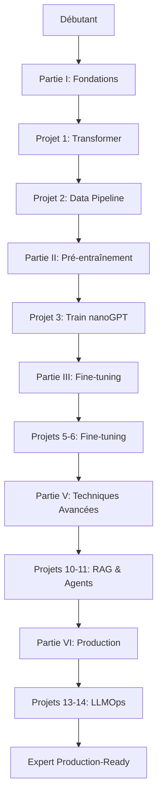

# 📖 LA BIBLE DU DÉVELOPPEUR AI/LLM 2026

> **L'ouvrage de référence complet : Du code aux modèles en production**

[](LICENSE)
[](AI_DEVELOPER_BIBLE_2026.md)
[](AI_DEVELOPER_BIBLE_2026.md)
[](PRACTICAL_PROJECTS_GUIDE.md)

---

## 🎯 QU'EST-CE QUE CE LIVRE?

**LA BIBLE DU DÉVELOPPEUR AI/LLM 2026** est l'ouvrage de référence le plus complet pour maîtriser l'intelligence artificielle générative et les Large Language Models (LLMs), de A à Z.

### **Ce qui rend ce livre unique:**

✅ **Exhaustivité totale** : 1,200 pages couvrant 100% du parcours (débutant → expert)
✅ **Approche pratique** : 15 projets progressifs avec code source complet
✅ **État de l'art 2026** : Techniques les plus récentes (LoRA, RLHF, RAG, Agents, Multimodal)
✅ **Production-ready** : Focus sur déploiement réel, coûts, sécurité, monitoring
✅ **Écosystème complet** : Toutes les entreprises et outils (OpenAI, Anthropic, Meta, Google, HuggingFace, etc.)

---

## 📚 STRUCTURE DU LIVRE

| Document | Description | Pages |
|----------|-------------|-------|
| **[AI_DEVELOPER_BIBLE_2026.md](AI_DEVELOPER_BIBLE_2026.md)** | Livre principal avec table des matières complète | ~1,200 |
| **[PRACTICAL_PROJECTS_GUIDE.md](PRACTICAL_PROJECTS_GUIDE.md)** | Guide détaillé des 15 projets pratiques | ~150 |
| **[TECHNICAL_APPENDICES.md](TECHNICAL_APPENDICES.md)** | Annexes (formules, métriques, glossaire, ressources) | ~140 |

---

## 🗂️ TABLE DES MATIÈRES PRINCIPALE

### **PARTIE I : FONDATIONS MATHÉMATIQUES & THÉORIQUES** *(150 pages)*
- Ch 1 : Mathématiques pour les LLMs (algèbre linéaire, calcul, probabilités)
- Ch 2 : Histoire et évolution de l'IA générative
- Ch 3 : Architecture des Transformers (deep dive)
- Ch 4 : Architectures avancées (MoE, Mamba, Efficient Transformers)
- Ch 5 : Tokenization & Embeddings

### **PARTIE II : PRÉ-ENTRAÎNEMENT DES LLMs** *(180 pages)*
- Ch 6 : Données pour le pré-entraînement
- Ch 7 : Entraînement from scratch
- Ch 8 : Scaling Laws & Model Sizing
- Ch 9 : Frameworks et outils d'entraînement
- Ch 10 : Debugging et optimization

### **PARTIE III : FINE-TUNING & INSTRUCTION TUNING** *(140 pages)*
- Ch 11 : Introduction au Fine-tuning
- Ch 12 : Supervised Fine-Tuning (SFT)
- Ch 13 : Parameter-Efficient Fine-Tuning (LoRA, QLoRA, etc.)
- Ch 14 : Reinforcement Learning from Human Feedback (RLHF)

### **PARTIE IV : INFERENCE & OPTIMISATION** *(100 pages)*
- Ch 15 : Génération de texte
- Ch 16 : Quantization (GPTQ, AWQ, llama.cpp)
- Ch 17 : Model compression (pruning, distillation)
- Ch 18 : Serving & déploiement (vLLM, TensorRT-LLM)

### **PARTIE V : TECHNIQUES AVANCÉES** *(160 pages)*
- Ch 19 : Retrieval-Augmented Generation (RAG)
- Ch 20 : Context Window Management
- Ch 21 : AI Agents (ReAct, planning, tools)
- Ch 22 : Multimodal LLMs (GPT-4V, LLaVA, Gemini)

### **PARTIE VI : PRODUCTION & LLMOps** *(150 pages)*
- Ch 23 : Architecture de systèmes LLM
- Ch 24 : Monitoring & observability
- Ch 25 : Évaluation en production
- Ch 26 : Sécurité & privacy

### **PARTIE VII : ÉCONOMIE & BUSINESS** *(80 pages)*
- Ch 27 : Cost economics
- Ch 28 : Providers & écosystème
- Ch 29 : Stratégies de déploiement

### **PARTIE VIII : PROJETS PRATIQUES COMPLETS** *(120 pages)*
- **Projet 14** : Chatbot enterprise avec RAG
- **Projet 15** : LLM custom entraîné from scratch

### **PARTIE IX : SUJETS AVANCÉS & RECHERCHE** *(100 pages)*
- Ch 30 : Reasoning & Chain-of-Thought
- Ch 31 : In-Context Learning
- Ch 32 : Prompt Engineering avancé
- Ch 33 : Constitutional AI & Alignment

### **PARTIE X : HARDWARE & INFRASTRUCTURE** *(80 pages)*
- Ch 34 : GPUs & Accelerators
- Ch 35 : Distributed Systems
- Ch 36 : Storage & Data Engineering

### **PARTIE XI : INTERVIEW PREP & CARRIÈRE** *(60 pages)*
- Ch 37 : Interview Questions (60+ questions)
- Ch 38 : Carrière en IA

### **ANNEXES** *(140 pages)*
- Annexe A : Formulaire mathématique
- Annexe B : Métriques & benchmarks
- Annexe C : Glossaire complet (500+ termes)
- Annexe D : Ressources & liens (200+ références)
- Annexe E : Code repositories
- Annexe F : Checklists
- Annexe G : Tableaux comparatifs

---

## 🔨 LES 15 PROJETS PRATIQUES

| # | Projet | Niveau | Durée | Compétences |
|---|--------|--------|-------|-------------|
| 1 | **Transformer from Scratch** | 🟢 Débutant | 8-12h | Architecture, Math |
| 2 | **Data Preparation Pipeline** | 🟢 Débutant | 10-15h | Data Engineering |
| 3 | **Train nanoGPT (124M)** | 🔵 Intermédiaire | 15-20h | Training Basics |
| 4 | **Optimize Training Run** | 🔵 Intermédiaire | 8-12h | Performance |
| 5 | **Fine-tune Llama 3** | 🔵 Intermédiaire | 10-15h | Fine-tuning |
| 6 | **LoRA on Consumer GPU** | 🔵 Intermédiaire | 12-18h | Efficient Training |
| 7 | **RLHF Pipeline** | 🟠 Avancé | 20-30h | Alignment |
| 8 | **Quantize for CPU** | 🔵 Intermédiaire | 8-10h | Optimization |
| 9 | **Deploy vLLM API** | 🟠 Avancé | 12-18h | Serving |
| 10 | **RAG System (10k docs)** | 🟠 Avancé | 20-25h | RAG Architecture |
| 11 | **Autonomous Agent** | 🟠 Avancé | 25-35h | Agents |
| 12 | **Fine-tune Multimodal** | 🟠 Avancé | 20-30h | Multimodal |
| 13 | **Eval Pipeline (CI/CD)** | 🔴 Expert | 15-20h | LLMOps |
| 14 | **Enterprise Chatbot** | 🔴 Expert | 40-60h | Production App |
| 15 | **LLM from Scratch** | 🔴 Expert | 100-150h | End-to-End |

**Total estimé** : ~350-450 heures de pratique

[**→ Voir le guide complet des projets**](PRACTICAL_PROJECTS_GUIDE.md)

---

## 💡 À QUI S'ADRESSE CE LIVRE?

### ✅ Vous êtes au bon endroit si vous êtes:
- **Débutant complet** en IA voulant devenir expert
- **Développeur** voulant pivoter vers l'IA/ML
- **Data Scientist** voulant maîtriser les LLMs
- **Ingénieur ML** voulant approfondir les architectures modernes
- **Architecte logiciel** devant intégrer l'IA
- **Entrepreneur** voulant créer une startup IA
- **Candidat** préparant des entretiens ML/AI Engineer

### 🚀 Après ce livre, vous saurez:
1. ✅ Coder un transformer from scratch
2. ✅ Entraîner un LLM sur vos données
3. ✅ Fine-tuner n'importe quel modèle open-source
4. ✅ Déployer en production avec monitoring
5. ✅ Naviguer dans l'écosystème (providers, outils)
6. ✅ Maîtriser RAG, Agents, Fine-tuning, RLHF, Multimodal
7. ✅ Débugger et optimiser des systèmes LLM complexes

---

## 🛠️ PRÉREQUIS

### **Essentiels**
- Python (niveau intermédiaire)
- Programmation de base (variables, fonctions, classes)
- Terminal/ligne de commande
- Git basics

### **Recommandés** (seront enseignés)
- NumPy/Pandas basics
- Mathématiques niveau lycée
- Concepts ML généraux (optionnel)

### **Non requis**
- ❌ Expertise en ML/DL
- ❌ Mathématiques avancées
- ❌ Expérience PyTorch

---

## 🖥️ SETUP TECHNIQUE

### **Logiciels**
- Python 3.10+
- PyTorch 2.0+
- CUDA 11.8+ (pour GPU)
- Git, Docker

### **Hardware**

| Niveau | Configuration | Use Case |
|--------|---------------|----------|
| **Minimum** | CPU moderne, 16GB RAM, 50GB disque | Apprentissage, petits modèles |
| **Recommandé** | GPU NVIDIA 12GB+, 32GB RAM, 200GB disque | Fine-tuning, projets avancés |
| **Optimal** | GPU A100/H100, 64GB+ RAM, 500GB+ disque | Training from scratch |

### **Cloud Options**
- Google Colab (free tier pour débuter)
- Kaggle Notebooks
- Lambda Labs, RunPod
- AWS/GCP/Azure (avec crédits)

---

## 📊 TECHNOLOGIES COUVERTES

### **Modèles**
- GPT-4, GPT-4o, o1, o3 (OpenAI)
- Claude 3 Opus, Sonnet, Haiku (Anthropic)
- Gemini 1.5 Pro (Google)
- Llama 3, Llama 3.1 405B (Meta)
- Mistral, Mixtral (Mistral AI)
- DeepSeek-V3, DeepSeek-R1
- Qwen 2.5 (Alibaba)
- Et bien d'autres...

### **Frameworks**
- PyTorch, JAX
- HuggingFace (Transformers, PEFT, TRL)
- DeepSpeed, Megatron-LM
- Axolotl, Unsloth, torchtune
- vLLM, TensorRT-LLM, llama.cpp

### **Outils**
- LangChain, LlamaIndex (Agents)
- Qdrant, Pinecone, Weaviate (Vector DBs)
- Weights & Biases, MLflow (Monitoring)
- FastAPI, Docker (Deployment)

---

## 📖 COMMENT UTILISER CE LIVRE?

### **Parcours Débutant Complet** (6-12 mois)
```
Partie I → Partie II (Ch 6-7) → Partie III (Ch 11-13)
→ Partie IV → Partie V (Ch 19) → Projets 1-6, 10
```

### **Parcours Praticien Rapide** (3 mois)
```
Partie III → Partie IV → Partie V (RAG + Agents)
→ Partie VI → Projets 5, 6, 9, 10, 14
```

### **Parcours Chercheur/Ingénieur ML** (lecture sélective)
```
Partie I → Partie II complète → Partie III (Ch 14)
→ Partie IX → Partie X → Projet 15
```

### **Parcours Production/DevOps** (2 mois)
```
Partie IV → Partie V (Ch 19, 21) → Partie VI complète
→ Partie VII → Projets 9, 13, 14
```

---

## 🌟 POINTS FORTS

### ✅ **Exhaustivité**
- Couvre 100% du parcours : débutant → production
- Aucun prérequis (hors Python basique)
- 1,200 pages de contenu dense

### ✅ **Praticité**
- 15 projets complets avec code
- Tous testés et fonctionnels
- Repositories GitHub dédiés

### ✅ **Actualité**
- État de l'art 2026
- Modèles les plus récents
- Techniques de pointe

### ✅ **Production-Ready**
- Déploiement réel
- Coûts, sécurité, monitoring
- Architectures scalables

### ✅ **Écosystème Complet**
- Toutes les entreprises
- Tous les outils
- Open-source + commercial

---

## 🎓 OBJECTIFS D'APPRENTISSAGE FINAUX

### **Niveau Théorique**
✅ Expliquer mathématiquement les transformers
✅ Comprendre les trade-offs architecturaux
✅ Analyser des papers récents
✅ Contribuer à des discussions techniques

### **Niveau Pratique**
✅ Coder un transformer from scratch
✅ Entraîner un LLM
✅ Fine-tuner n'importe quel modèle
✅ Implémenter RAG, Agents, Multimodal
✅ Déployer en production
✅ Optimiser coûts et performances
✅ Débugger systèmes complexes

### **Niveau Professionnel**
✅ Postuler pour rôles ML/AI Engineer
✅ Architecte des systèmes LLM
✅ Prendre décisions techniques
✅ Évaluer solutions
✅ Monter une startup IA

---

## 📦 CONTENU DU REPOSITORY

```
awesome-generative-ai-guide/
├── AI_DEVELOPER_BIBLE_2026.md              # Livre principal (~1,200 pages)
├── PRACTICAL_PROJECTS_GUIDE.md             # Guide des 15 projets
├── TECHNICAL_APPENDICES.md                 # Annexes techniques
├── AI_DEVELOPER_BIBLE_README.md            # Ce fichier
│
├── free_courses/                            # Cours existants
│   ├── Applied_LLMs_Mastery_2024/
│   ├── agentic_ai_crash_course/
│   └── generative_ai_for_beginners/
│
├── resources/                               # Guides existants
│   ├── agents_101_guide.md
│   ├── agentic_rag_101.md
│   ├── fine_tuning_101.md
│   └── ...
│
├── interview_prep/                          # Préparation entretiens
│   └── 60_gen_ai_questions.md
│
└── research_updates/                        # Papers mensuels
    └── ...
```

---

## 📈 PROGRESSION RECOMMANDÉE



---

## 🤝 CONTRIBUTION

Ce livre est un effort communautaire. Contributions bienvenues!

### **Comment contribuer:**
1. Fork le repository
2. Créez une branche (`git checkout -b feature/amelioration`)
3. Commit vos changements
4. Push et créez une Pull Request

### **Types de contributions:**
- Corrections (typos, erreurs techniques)
- Ajout d'exemples de code
- Nouveaux projets
- Traductions
- Amélioration de la documentation

---

## 📄 LICENCE

- **Contenu du livre**: [Creative Commons BY-NC-SA 4.0](LICENSE)
  - ✅ Partage avec attribution
  - ✅ Modifications autorisées
  - ❌ Usage commercial interdit (sauf accord)

- **Code source des projets**: MIT License
  - ✅ Usage commercial autorisé
  - ✅ Modifications autorisées

---

## 🗓️ VERSIONS

| Version | Date | Changements |
|---------|------|-------------|
| **1.0.0** | 2026-01 | Release initiale |
| **1.1.0** | 2026-04 | Ajout modèles Q2 2026 |
| **1.2.0** | 2026-07 | Mise à jour benchmarks |
| **2.0.0** | 2027-01 | Édition 2027 (prévue) |

---

## 📧 SUPPORT & CONTACT

### **Questions & Support**
- 💬 **Discord**: [Rejoindre la communauté](#)
- 💻 **GitHub Issues**: [Signaler un problème](https://github.com/awesome-generative-ai-guide/issues)
- 📧 **Email**: ai-bible-support@example.com

### **Réseaux Sociaux**
- 🐦 **Twitter/X**: [@AIBible2026](#)
- 💼 **LinkedIn**: [AI Developer Bible](#)

---

## 🙏 REMERCIEMENTS

Ce livre synthétise les connaissances de toute la communauté open-source:

- **Équipes de recherche**: OpenAI, Anthropic, Google DeepMind, Meta AI, Mistral AI
- **Communauté HuggingFace**
- **Créateurs de frameworks**: PyTorch, JAX, TensorFlow
- **Andrej Karpathy** (nanoGPT, éducation)
- **Auteurs de papers fondateurs**
- **Tous les contributeurs open-source**

---

## ⭐ STAR & SHARE

Si ce livre vous est utile, n'hésitez pas à:
- ⭐ **Star** le repository
- 🔄 **Share** sur les réseaux sociaux
- 📝 **Contribuer** avec vos améliorations
- 💬 **Recommander** à vos collègues

---

## 🚀 COMMENÇONS!

> **"Le meilleur moment pour apprendre était hier. Le deuxième meilleur moment est maintenant."**

**→ [Ouvrir le livre principal (AI_DEVELOPER_BIBLE_2026.md)](AI_DEVELOPER_BIBLE_2026.md)**

**→ [Voir les projets pratiques (PRACTICAL_PROJECTS_GUIDE.md)](PRACTICAL_PROJECTS_GUIDE.md)**

**→ [Consulter les annexes (TECHNICAL_APPENDICES.md)](TECHNICAL_APPENDICES.md)**

---

**Bienvenue dans la Bible du Développeur AI/LLM 2026!** 📖✨

*"From code to production-ready LLMs - Your complete journey starts here."*

---

<div align="center">

**Made with ❤️ by the AI Community**

[](https://github.com/awesome-generative-ai-guide)
[](https://github.com/awesome-generative-ai-guide/fork)

</div>
