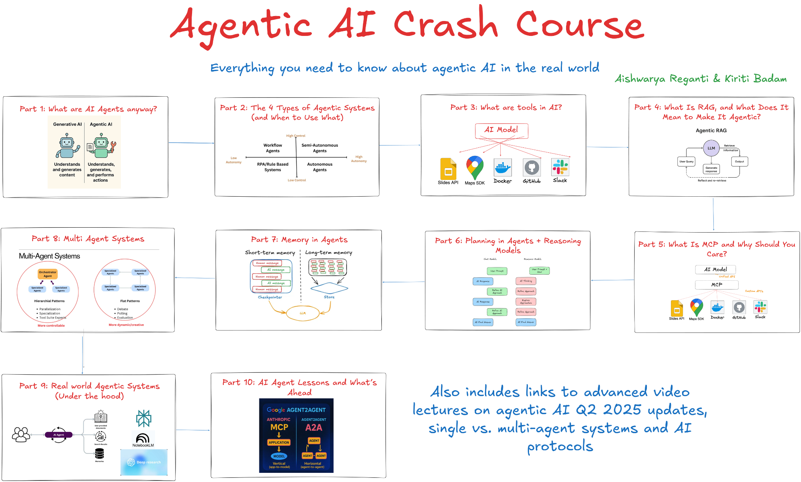

# Agentic AI Crash Course

**Everything you need to know about agentic AI in the real world**

*Created by [Aishwarya Reganti](https://www.linkedin.com/in/areganti/) & [Kiriti Badam](https://www.linkedin.com/in/sai-kiriti-badam/)*

---

## ❗❗Please read before engaging with the course since many influencers have shared incorrect details

**Claim: This course was taught at MIT and Oxford** 
Truth: The instructors have taught professional AI programs at MIT and Oxford, but this specific course was never offered there.

**Claim: This course costs USD 2500 and is now free** 
Truth: This is a short intro course, the heading clearly says "crash course". We would never price this at 2500, it has always been free.

**Claim: This course will change your life and guarantee jobs** 
Truth: This course gives you a solid way to enter the topic, build confidence, and feel good about the space. It is not a magic ticket and we never promise outcomes like that.

We put a lot of care into keeping it simple, useful, and a genuinely good starter. We love that it is getting attention, but we want people to engage with it for the right reasons, not for promises we never made.

---
## 📚 Course Parts

### [Part 1: What Are AI Agents Anyway?](./part1_what_are_ai_agents_anyway.md)
Understanding the fundamental differences between generative AI and agentic AI, core capabilities, and real-world applications.

### [Part 2: The 4 Types of Agentic Systems (and When to Use What)](./part2_the_4_types_of_agentic_systems.md)
Explore workflow agents, semi-autonomous agents, rule-based systems, and autonomous agents with decision frameworks.

### [Part 3: What Are Tools in AI?](./part3_what_are_tools_in_ai.md)
Learn about AI model integration, API connections, tool ecosystems, and custom tool development.

### [Part 4: What Is RAG, and What Does It Mean to Make It Agentic?](./part4_what_is_rag_and_agentic.md)
Deep dive into Retrieval-Augmented Generation, traditional vs agentic RAG, and implementation patterns.

### [Part 5: What Is MCP and Why Should You Care?](./part5_what_is_mcp_and_why_care.md)
Understanding Model Context Protocol, AI model integration strategies, and enterprise implementation.

### [Part 6: Planning in Agents + Reasoning Models](./part6_planning_in_agents_reasoning_models.md)
Agent planning strategies, reasoning model integration, and advanced reasoning capabilities.

### [Part 7: Memory in Agents](./part7_memory_in_agents.md)
Short-term and long-term memory systems, architecture patterns, and performance optimization.

### [Part 8: Multi-Agent Systems](./part8_multi_agent_systems.md)
Multi-agent architecture, hierarchical patterns, coordination strategies, and scalability considerations.

### [Part 9: Real-World Agentic Systems (Under the Hood)](./part9_real_world_agentic_systems.md)
Case studies of production systems, architecture patterns, and lessons from enterprise implementations.

### [Part 10: AI Agent Lessons and What's Ahead](./part10_ai_agent_lessons_whats_ahead.md)
Latest developments, future trends, industry roadmap, and emerging technologies in agentic AI.

---

## 🎥 Advanced Video Lectures

### Core System Design & Applications
- [Master Generative AI System Design](https://maven.com/p/8c3221/master-generative-ai-system-design)
- [Why AI Agents Aren't Enough for Real-World Applications](https://maven.com/p/20f0ed/why-ai-agents-aren-t-enough-for-real-world-applications)
- [Designing Agentic AI Applications for Enterprise Use Cases](https://maven.com/p/497d05/designing-agentic-ai-applications-for-enterprise-use-cases)
- [Building Agentic AI Applications in 2025](https://maven.com/p/82345a/building-agentic-ai-applications-in-2025)
- [Evaluating Agentic AI Applications: Beyond Vibe Checks](https://maven.com/p/6f0e97/evaluating-agentic-ai-applications-beyond-vibe-checks)

### Product & Enterprise Implementation
- [AI Native Products: What Every PM Needs to Know and Do](https://maven.com/p/9a34b0/ai-native-products-what-every-pm-needs-to-know-and-do)
- [Designing Agentic AI Systems for Enterprise Use Cases - Part 1](https://maven.com/p/466e22/1-designing-agentic-ai-systems-for-enterprise-use-cases)
- [Designing Agentic AI Systems for Enterprise Use Cases - Part 2](https://maven.com/p/a0cdf1/2-designing-agentic-ai-systems-for-enterprise-use-cases)

### Advanced Topics & Q2 2025 Updates
- [Building Agentic AI Applications: 2025 Q2 Updates - Part 1](https://maven.com/p/b8470c/1-building-agentic-ai-applications-2025-q2-updates)
- [AI Protocols 101: What You Should Know About MCP, A2A, etc.](https://maven.com/p/e2b5db/2-ai-protocols-101-what-you-should-know-about-mcp-a2a-etc)
- [Single vs Multi-Agent AI Systems](https://maven.com/p/0e0e15/3-single-vs-multi-agent-ai-systems)
- [Don't Build AI Products Like Traditional Software](https://maven.com/p/88a325/don-t-build-ai-products-like-traditional-software) 

---

## 🚀 Getting Started

Navigate to **Part 1** to begin your journey into the world of agentic AI!

[🎯 Start with Part 1: What Are AI Agents Anyway?](./part1_what_are_ai_agents_anyway.md)

---

**Happy Learning!** 🎉

