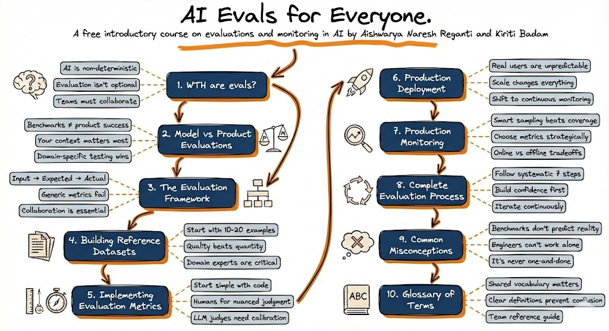

# AI Evals for Everyone - Free Course 🎯

Welcome to **AI Evals for Everyone**, a beginner-friendly 101 course that clears up all the confusion around AI evaluation. No matter your background, this course will equip you with practical knowledge to build evaluations that actually work.

## 🎬 NEW: Watch on YouTube!

**The complete course is now available as a video series!**

**Bonus Content**: The YouTube series includes **3 additional hands-on chapters** on **Building Evals with Arize AI** - practical tutorials to implement everything you've learned!

[**Watch the Full Playlist →**](https://www.youtube.com/playlist?list=PLZoalK-hTD4VPIkRXNdSEwcTCt2QUgEPR)

## 🎓 Get Certified!

**Follow these simple steps to earn your AI Evals certification:**

1. **📚 Read all 10 chapters or watch the videos on YouTube** - Complete the course content at your own pace
2. **📝 Take the final assessment** - Test your knowledge with our [certification quiz](https://ai-evals-course-website-2025.vercel.app/quiz-google.html)
3. **🏆 Get your certificate** - Receive a personalized certificate upon completion

**[Start Your Certification Journey →](https://ai-evals-course-website-2025.vercel.app/quiz-google.html)**

## 📚 Course Overview

Start from zero and learn step-by-step how to build AI evaluation systems. This 101 course cuts through the hype and confusion to give you clear, practical guidance you can implement immediately.

**Created by:** [Aishwarya Naresh Reganti](https://www.linkedin.com/in/areganti/) & [Kiriti Badam](https://www.linkedin.com/in/sai-kiriti-badam/)

## 📖 Course Chapters

1. **[WTH are AI Evals?](./chapters/01_wth_are_ai_evals.md)** - Understanding why AI evaluation is different and unavoidable
2. **[Model Evaluations vs Product Evaluations](./chapters/02_model_vs_product_evaluations.md)** - Learning the crucial distinction that trips up most teams
3. **[The Evaluation Framework](./chapters/03_evaluation_building_blocks.md)** - Core components for systematic evaluation
4. **[Building Reference Datasets](./chapters/04_building_reference_datasets.md)** - Creating reference datasets before you launch your product
5. **[How to Build Evaluation Metrics](./chapters/05_building_evaluation_metrics.md)** - Practical approaches from code-based metrics to LLM judges and more
6. **[Production Challenges](./chapters/06_production_challenge.md)** - Why production breaks all your assumptions (and evals sometimes)
7. **[Production Monitoring Strategies](./chapters/07_production_monitoring_strategies.md)** - Real-world monitoring to understand emerging patterns
8. **[The Complete Evaluation Process](./chapters/08_evaluation_process.md)** - Building confidence incrementally through iterations
9. **[Common Misconceptions About AI Evaluation](./chapters/09_case_studies.md)** - Real examples from AI products at scale
10. **[Glossary of Terms](./chapters/10_common_pitfalls.md)** - Summary of terms generally used in evaluation process

## 🚀 Who Should Take This Course?

- **AI Engineers** building production systems
- **Product Managers** responsible for AI products
- **Data Scientists** transitioning to production
- **Engineering Leaders** making evaluation strategy decisions
- **Quality Engineers** expanding into AI testing

## 💡 What You'll Learn

- Why AI systems need evaluation (it's simpler than you think!)
- The difference between testing models vs testing your actual product
- How to build your first evaluation dataset in just a few hours
- Three straightforward approaches to measuring AI quality
- How to monitor your AI system once it's live
- Common mistakes everyone makes (and how to avoid them)

## 🏆 Course Features

- **Beginner-Friendly** - No prior evaluation experience needed
- **Practical & Hands-On** - Build real evaluation systems as you learn
- **Clear Examples** - Every concept explained with concrete examples
- **Get Certified** - Earn your AI Evals certification
- **Self-Paced** - Learn at your own speed

## 🔗 Additional Resources

### 🎬 YouTube Video Series
**[Watch the Complete Video Course](https://www.youtube.com/playlist?list=PLZoalK-hTD4VPIkRXNdSEwcTCt2QUgEPR)** - All chapters available as videos, plus 3 bonus hands-on chapters on building evals with Arize AI!

### 📅 Attend Our Live Session
**[Join our upcoming free session on State of Applied AI in 2025](https://maven.com/p/ad857c/state-of-applied-ai-in-2025-report)** on January 5th! Get insights into the latest trends, challenges, and opportunities in production AI systems.

### 🎯 Our Maven Courses

**Choose the course that fits your learning journey:**

- **[#1 Rated Enterprise AI Course](https://maven.com/aishwarya-kiriti/genai-system-design)** - New to AI? Start here! A comprehensive program for building timeless enterprise AI systems from scratch.

- **[Advanced Evals Course](https://maven.com/aishwarya-kiriti/evals-problem-first)** - Already building AI? Take our newly launched course focused on systematically improving your AI products through advanced evaluation techniques.

*📝 Note: Use code **GITHUB15** for a limited 15% off on Maven courses (valid until January 15th, 2025)*

### 📱 Stay Connected
- **Follow [Aishwarya on LinkedIn](https://www.linkedin.com/in/areganti/)** for AI evaluation insights and updates
- **Follow [Kiriti on LinkedIn](https://www.linkedin.com/in/sai-kiriti-badam/)** for production AI learnings
- Get the latest resources, tips, and industry updates directly in your feed!

## 📄 License

This course is released under the MIT License. Feel free to use, share, and adapt the content with attribution.
