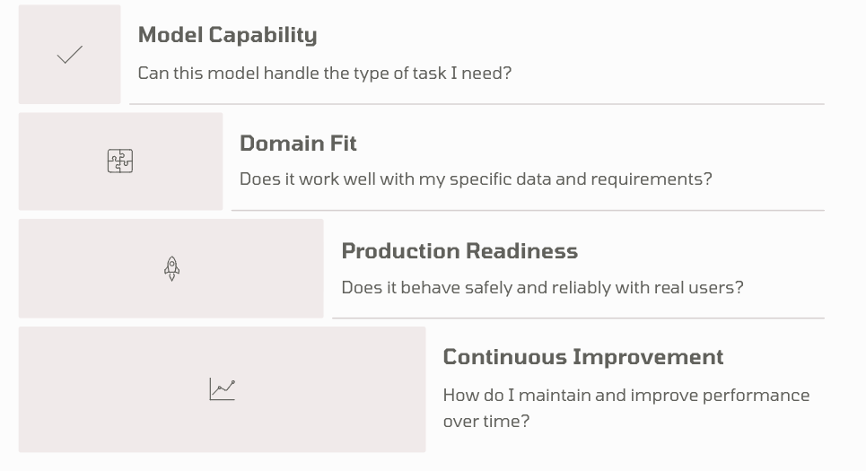
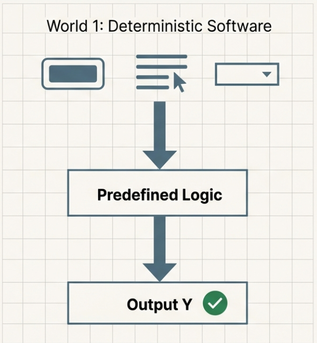
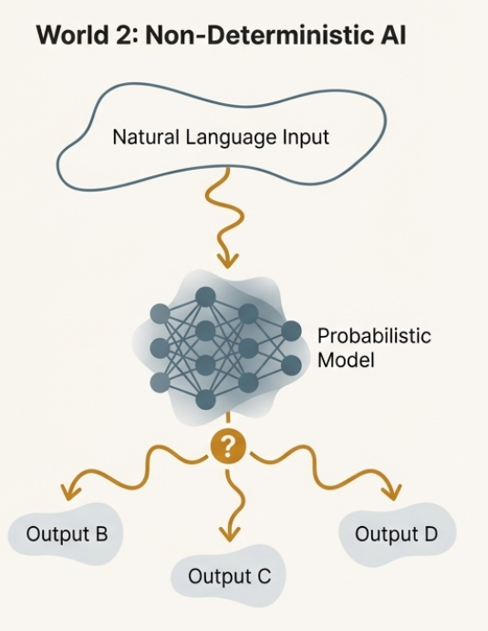
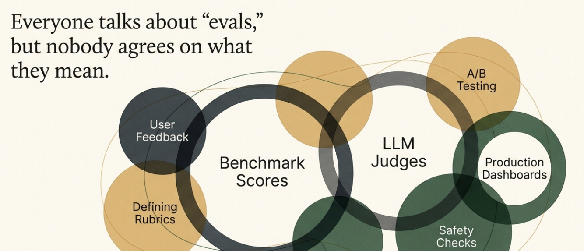

# Chapter 1: WTH are AI Evals?

## What Are Evals and Why Do They Suddenly Matter?

If you have been following recent AI updates, especially in the product space, you have probably heard the term *evals* come up repeatedly. It shows up in conversations, blog posts, product reviews, and conference talks. Everyone seems to use it casually, yet everyone also seems to mean something different by it.

The usefulness of evals is debated heavily, often without clarity on what people are actually referring to or where they are coming from. This lack of precision has led to a growing number of misconceptions as teams build AI solutions in the real world.

We put together this guide as a practical starting point. Think of it as a 101. The goal is to explain *why* evaluation is needed, *what* it actually refers to in practice, and *where* people commonly misunderstand it when building AI products.

Our hope is that by the end of this course, you are able to separate noise from signal, understand how practitioners on the ground think about evaluation, and start building evaluations using a first principles approach.

## The Shift That Makes Evals Unavoidable

Before getting into evaluation itself, we need to build intuition for a much larger shift. AI systems and AI products are fundamentally *non-deterministic*. We will use this term often throughout this chapter and the rest of the course, because it is the single biggest reason evals exist in the first place.

Most of us have spent our careers working with traditional software products. In those systems, the number of actions a user can perform is usually limited. Users click buttons, fill out forms, upload a photo, submit a request, or complete a predefined flow. In most cases, both the input and the expected output are known ahead of time. If a user uploads a photo, the system should store it. If they submit a form, the backend should validate and process it. The code is written to explicitly enforce these expectations.

To make sure the product behaves as intended, teams rely on unit tests and integration tests. The core assumption is simple. Given an input x, the system should reliably produce output y. If you can verify this offline, you can be reasonably confident the product will behave the same way in production.

The standard software lifecycle follows a familiar pattern. You build version one of the product, add tests to ensure it works, test it with different users, fix bugs, and then continue building on top of that foundation.

The expectation is that if you have tested x to y thoroughly before shipping, production issues will be relatively rare and manageable. When problems do occur, they are often clear outliers that can be debugged and fixed.

## How AI Products Break Classical Assumptions

AI products break these assumptions in two fundamental ways.

**First, the input space becomes effectively unbounded.** Most AI products accept text, voice, images, or video as input. Users are no longer selecting from predefined flows or filling structured forms. They are expressing intent in natural language, often ambiguously, incompletely, or in ways the product team never anticipated. You no longer control how users frame their requests. You only control how the system attempts to respond.

**Second, the output is no longer guaranteed.** The same input, or even small changes in phrasing, can yield different responses across runs. This is a property of the models powering these products. They are highly sensitive to context and phrasing, and they produce probabilistic outputs rather than fixed answers.

Traditional unit and integration tests answer a narrow question. *Did the system do exactly what we expected?* In AI products, there are two unknowns that make this question insufficient.

First, you do not fully know how end users will interact with your system.

Second, you do not have direct visibility into how the model arrives at its answers.

Large language models are black boxes. There is no simple pass or fail signal.

## So How Do Teams Build with Confidence?

In practice, teams start by estimating how users might interact with the system. For example, if you are building an agent to help answer customer queries for a large retail company like Amazon or Walmart, you can look at historical customer support data to understand commonly asked questions. You can then test how your system responds to those questions before launch.

A simple way to think about this is a table like the following:

| User Question | Expected Correct Answer | Agent Generated Answer |
|--------------|------------------------|----------------------|
| I can't seem to refund my shoes, it's been 45 days | Explain return policy and escalate | [System Response] |
| I requested a refund a week ago and haven't gotten it | Check status and provide update | [System Response] |

This is often where people first encounter the idea of evaluation. It is also where confusion usually starts.

## Why the Word "Evals" Causes Confusion

A major source of confusion is that the term *evals* is used loosely to refer to very different things. In this course, we will use the word *evaluation* intentionally, because *evals* has become a catch-all term that hides important distinctions.

Broadly, there are two kinds of evaluations.

### Model Evaluations

**Model evaluations** are primarily conducted by frontier labs and research teams. Their goal is to answer a specific question. *How capable is this model in general compared to others?*

These evaluations rely on standardized benchmarks that test reasoning, factual recall, coding ability, or performance on academic style tasks. They are usually run on fixed datasets with predefined expected answers, and the model's outputs are scored across multiple dimensions using evaluation metrics.

Model evaluations are valuable. They help researchers measure progress, help infrastructure teams choose base models, and help vendors communicate improvements.

However, they are intentionally broad and domain agnostic. They are not designed to tell you whether a model will work well inside a specific product, workflow, or business context.

### AI Product Evaluations

**AI product evaluations** are what practitioners should care about most when building real products. Product evaluations focus on whether a system behaves acceptably in a specific domain, for a specific workflow, and for real users.

Real world data is far more nuanced than benchmark datasets. Domain rules, edge cases, risk tolerance, and downstream consequences matter deeply. A model that performs well in general may still fail in ways that are unacceptable for your product.

Even if frontier labs have done extensive model evaluations, product teams still need their own evaluation process. Model evaluations tell you what a model can do in general. Product evaluations tell you whether it should be used in your system.

In the rest of this course, we focus on AI product evaluations and product evaluation metrics, not model evaluations. This is the level at which product teams actually make decisions and manage risk.

## Clearing Up the Terminology

Before moving on, let us clearly define the terms we will use throughout this course. These words are often used interchangeably in conversations, which is one of the main reasons people get confused about evaluation.

**Evaluation** refers to the overall process of assessing how an AI system behaves. It is not a single test, score, or dashboard. Evaluation is the act of checking whether a system's outputs meet certain expectations under specific conditions. This can happen before launch, after launch, or continuously in production.

**A benchmark or evaluation harness** is the setup used to run evaluations in a repeatable way. This usually includes a dataset of example inputs, any required context, and a defined execution process. Benchmarks exist to ensure consistency across different evaluation runs and make results comparable.

**Evaluation metrics** are the dimensions along which system behavior is judged. A metric answers the question, *what does good mean in this context?* Common examples include correctness, relevance, completeness, safety, tone, or helpfulness. Metrics can be objective or subjective, but they are always context dependent.

The same metric can mean very different things in different domains. Take *helpfulness* as an example. In a real estate product, helpfulness might mean summarizing listings clearly, surfacing relevant comparables, or asking clarifying questions when user intent is vague. Over explaining or speculating would be harmful, even if the response sounds articulate.

In an insurance or healthcare workflow, helpfulness might mean knowing when *not* to answer. Escalating uncertainty, flagging missing information, or deferring to a human can be more helpful than attempting to provide a complete answer.

Because of this, evaluation metrics must almost always be guided by explicit *rubrics*. A rubric defines what good looks like and what failure looks like in a given context. Without rubrics, metrics like helpfulness, correctness, or safety become vague labels that different people interpret differently.

**Model evaluations** assess general model capability independent of any specific product.

**AI product evaluations** assess whether a model behaves acceptably inside a real product.

Throughout this course, when we talk about evaluation, we are referring to AI product evaluations unless stated otherwise. Our goal is not to measure how intelligent a model is in the abstract, but to understand whether a system is behaving well enough for the product we are trying to build.

## Key Takeaways

As you can see, *evals* is an overloaded term that means different things to different stakeholders. When someone says PMs should do evals, they often mean defining rubrics and evaluation metrics and expectations for product behavior. When someone says a model's evals look good, they usually mean benchmark scores on popular datasets. When data labeling companies talk about writing evals, they typically mean creating training datasets and annotation guidelines.

Understanding these distinctions is crucial for building effective evaluation systems that actually help you ship better AI products.

At this point, you should have a clearer mental map. In the next chapter, we will look at the different ways evaluations are implemented in practice, and the tradeoffs each approach introduces.

