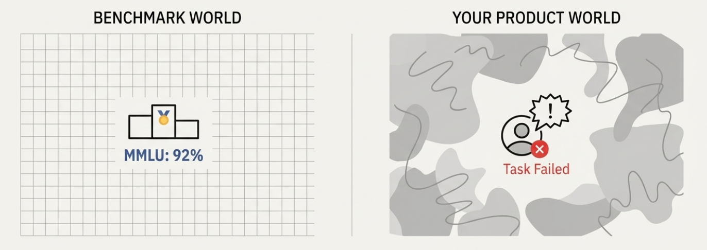

# Chapter 2: Model vs Product Evaluations

## From Model Creation to Product Implementation

In the previous chapter, we established that AI evaluation is unavoidable. Now we need to understand how evaluation works across the AI ecosystem.

When AI companies build models, they evaluate them to understand their general capabilities. But these same models get used in thousands of different applications, from customer support chatbots to legal document analysis to medical diagnosis tools. Each application has its own requirements, constraints, and success criteria.

This creates a natural progression: models are evaluated for their general abilities, then they need additional evaluation when you use them for specific purposes. The first tells you what a model can do in theory. The second tells you whether it actually works for your particular use case.

Model creators have their own perspective on evaluation worth understanding first.

## Model Evaluations: Measuring General Capability

When AI companies develop models, they need to understand and communicate what their models can do. **Model evaluations** serve this purpose, measuring general capability across broad domains. Their goal is straightforward: *How capable is this model compared to others?*

You see these evaluations in research papers, vendor marketing materials, and leaderboards.

These evaluations use standardized benchmarks that test different aspects of model capability:

- **MMLU (Massive Multitask Language Understanding)**: Tests knowledge across 57 academic subjects from elementary math to professional law
- **HumanEval**: Measures coding ability by testing whether models can write Python functions that pass unit tests  
- **GSM8K**: Tests grade-school level mathematical reasoning
- **GPQA**: Tests graduate-level reasoning in physics, chemistry, and biology

Model evaluations serve as a competitive landscape for AI providers. When companies release new models, they publish benchmark scores to demonstrate improvements and establish market positioning. A model that scores 85% on MMLU versus 78% on the previous version signals meaningful progress to potential customers and the research community.

The industry benefits from this standardization in several ways. Teams can track scientific progress over time, organizations can compare and choose between different models, and everyone gets objective measures that cut through marketing claims.

The benchmarks are carefully designed to be objective, repeatable, and comparable across different models. Model evaluations can test both general capabilities and domain-specific knowledge, but they're designed to assess what models can do in standardized conditions, not how they'll perform in your specific business context with your particular constraints and requirements.

## Why Model Evaluations Don't Predict Product Success

Here's a concrete example. Suppose you're building an AI system to help insurance agents process claims. You're choosing between two models:

- **Model A** scores 92% on MMLU and 85% on HumanEval
- **Model B** scores 87% on MMLU and 79% on HumanEval

Based on benchmark scores, Model A looks clearly superior. When you test them on actual insurance claims with your specific data, workflows, and business constraints, Model B might perform significantly better.

Why? Because your insurance use case has specific requirements that general benchmarks don't capture:

- **Domain knowledge**: Understanding insurance terminology, regulations, and claim types
- **Risk tolerance**: The cost of approving a fraudulent claim versus denying a legitimate one
- **Business constraints**: Processing time requirements, escalation policies, compliance needs
- **Real-world messiness**: Incomplete forms, ambiguous language, edge cases specific to insurance

Model B might have seen more insurance-related data during training, or its architecture might be better suited to the structured reasoning required for claims processing. The benchmark scores can't tell you this.

## Real-World Context Is Far More Complicated

The data that powers your business lives in industry-specific silos that benchmark creators never see. Healthcare data has different patterns than financial data. Legal documents follow different structures than customer support conversations. Manufacturing quality reports contain domain knowledge that doesn't exist in academic datasets.

This means benchmark performance often fails to predict real-world behavior. Consider a customer support AI that scores well on standard helpfulness benchmarks. When a frustrated customer types "this is the third time I'm contacting you about my broken order and nobody seems to care," the AI needs to:

- Recognize the emotional context and escalation history
- Know when to apologize versus when to escalate immediately  
- Understand your company's specific policies and capabilities
- Balance being helpful with managing expectations appropriately

These nuanced requirements emerge from your specific business context, customer base, and operational constraints. They don't appear in general benchmarks, but they're critical for your product's success.

## AI Product Evaluations: What Actually Matters for Your Business

**AI product evaluations** focus on a different question: *Does this system behave acceptably for our specific use case, with our users, in our domain?*

Product evaluations are context-dependent by design. They test whether the AI system:
- Handles your specific user inputs appropriately
- Follows your business rules and constraints
- Escalates correctly when uncertain
- Maintains appropriate tone and style for your brand
- Manages risk according to your tolerance levels

The metrics you track in product evaluation often look very different from model evaluation metrics. Instead of general correctness, you might measure:

- **Escalation accuracy**: Does the system correctly identify when it should hand off to a human?
- **Policy compliance**: Does it follow your company's specific guidelines and constraints?
- **Risk management**: How often does it make decisions you later have to reverse?
- **User experience**: Are users able to complete their tasks efficiently?

## A Practical Example: Legal Document Analysis

Imagine you're building an AI system to help lawyers review contracts. Two different evaluation approaches would look completely different:

### Model Evaluation Approach
- Test general reading comprehension on legal text
- Measure accuracy on standardized legal reasoning benchmarks
- Compare performance to other models on academic legal datasets

### Product Evaluation Approach  
- Test on your firm's actual contract types and templates
- Measure how often it catches the specific risk patterns your lawyers care about
- Evaluate whether it flags clauses that your legal team would want to review
- Test escalation behavior when it encounters unusual or high-risk terms
- Measure time savings for your lawyers while maintaining quality standards

The model evaluation tells you the AI can understand legal language in general. The product evaluation tells you whether it can actually help your lawyers do their job better.

## Focus on Product Evaluation for Builders

Now that we understand both approaches, it becomes clear that model evaluation alone isn't really useful for builders. While model evaluations help with initial model selection, the real work happens at the product evaluation level.

**Baseline capability assessment**: If a model performs poorly on relevant general benchmarks, it's unlikely to work well in your specific domain. Model evaluations can help you eliminate obviously unsuitable options.

**Comparative analysis**: When choosing between models with similar architectures, benchmark scores can provide useful signals about relative capability, especially when combined with product-specific testing.

**Progress tracking**: If you're fine-tuning or customizing a model, general benchmarks can help you verify that you're not degrading core capabilities while adding domain-specific knowledge.

But model evaluations should be just the starting point, not the endpoint, of your evaluation process.

## Building Your Product Evaluation Strategy

Given this distinction, how should you approach evaluation for your AI product?

**Start with model evaluations as a filter**. Use benchmark scores to eliminate models that lack the basic capabilities your application requires. If you need strong reasoning ability, look for models that perform well on reasoning benchmarks. If you need multilingual support, check language-specific evaluations.

**But invest your time in product evaluations**. This is where you'll discover whether the AI actually works for your use case. Design evaluations that test:
- Your specific user inputs and edge cases
- Your business constraints and requirements
- Your risk tolerance and escalation needs
- Your quality standards and success metrics

**Use real data whenever possible**. Synthetic test cases are useful for getting started, but nothing beats evaluating on actual examples from your domain with real user inputs and expected outputs.

**Make it an ongoing process**. Unlike model evaluations, which are typically done once during model selection, product evaluation should be continuous. User behavior evolves, business requirements change, and your AI system needs to adapt.

## The Evaluation Hierarchy

Think of evaluation as a hierarchy:

1. **Model capability**: Can this model handle the type of task I need? (Model evaluation)
2. **Domain fit**: Does it work well with my specific data and requirements? (Basic product evaluation)  
3. **Production readiness**: Does it behave safely and reliably with real users? (Comprehensive product evaluation)
4. **Continuous improvement**: How do I maintain and improve performance over time? (Ongoing product evaluation)

Most teams spend too much time on level 1 and not enough on levels 2-4. The companies that succeed with AI products flip this priority.

## Key Takeaways

Model evaluations and product evaluations serve fundamentally different purposes. Model evaluations help you understand general capability and compare different models. Product evaluations tell you whether an AI system will actually work for your business.

The benchmark illusion (assuming strong model evaluations guarantee product success) is one of the most common reasons AI projects fail to translate from demos to production.

Your evaluation strategy should use model evaluations as an initial filter but invest most of your effort in product-specific evaluation that tests real use cases, real data, and real business requirements.

In the next chapter, we'll dive into a systematic framework for thinking about AI system behavior that will help you design product evaluations that actually predict real-world performance.

