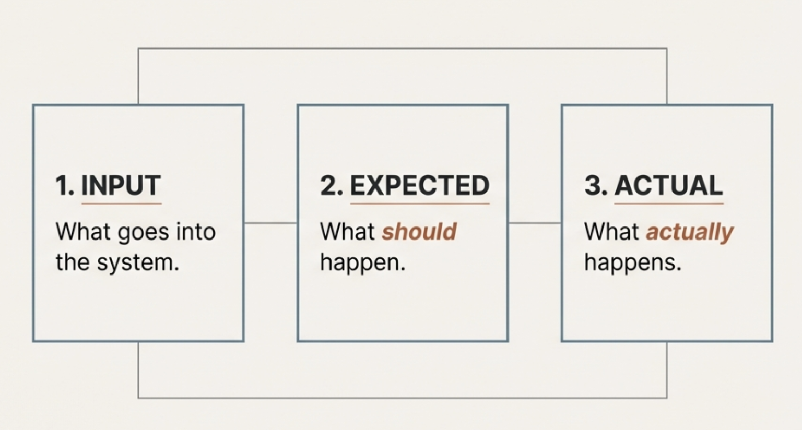
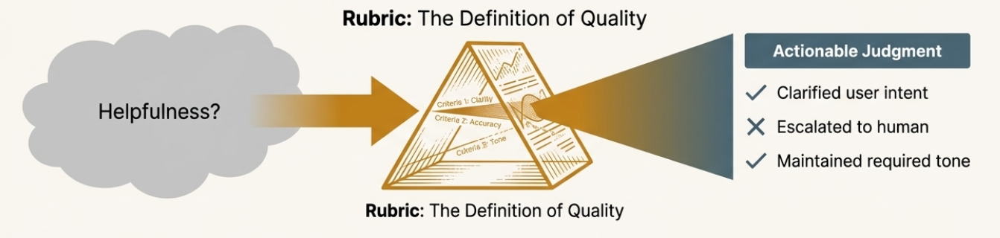

# Chapter 3: The Evaluation Framework

## Setting Up Evaluation for Your AI Product

In the previous chapters, we covered why evaluation matters and the difference between model and product evaluation. Now you understand you need to evaluate your AI products. 

If you want to evaluate a new product you're building, where do you start?

We'll cover the basic concepts that help you approach evaluation strategically. This will set you up to build datasets and evaluation systems that actually help you improve your product.

## What You're Actually Evaluating

When you evaluate any AI system, you're looking at three things - **Input** (what goes into the system), **Expected** (what should happen), and **Actual** (what actually happens).

Sounds simple, but each piece is more complex than it appears.

### Input: Everything That Affects Your System

"Input" isn't just the user's question. It includes everything that influences how your system behaves - the user's actual question or request, previous conversation history and context, data your system retrieves (documents, database entries, API calls), and system configuration (prompts, parameters, business rules).

This matters because many evaluation problems happen when teams only test the obvious user inputs but ignore how context and configuration changes affect behavior.

### Expected: What Good Looks Like

Defining what should happen is often the hardest part. What should your system actually do?

Expected behavior depends on your specific requirements:
- Accuracy of information
- Completeness of the response
- Appropriate tone and style
- Safety and compliance
- Following your business rules

Take a healthcare AI. When someone asks "Is this medication safe for children?", good behavior isn't just giving accurate information. It includes:
- Noting that medical advice should come from doctors
- Suggesting they talk to their pediatrician
- Providing general information without specific medical recommendations
- Escalating if the situation seems urgent

Defining expected behavior requires input from both technical teams and people who understand the domain and business context.

### Actual: What Your System Really Does

This is what your system produces: the response, the actions, the decisions.

But "actual" includes more than just the final output:
- The content and quality of responses
- Which tools or data sources were used
- Reasoning and decision-making process
- Performance metrics like response time

Understanding what actually happens often requires logging different parts of your system.

## Why Generic Metrics Don't Work

Once you understand these three pieces, you can see why simple metrics like "helpfulness" or "correctness" don't work for real AI products.

The same metric means completely different things depending on your context and requirements.

### Context Changes Everything

Take "helpfulness." What's helpful depends entirely on the situation:

**Customer service**: Helpful means solving problems quickly and escalating when needed. Explaining too much when someone just wants a refund isn't helpful.

**Education**: Helpful means guiding students to understanding, not just giving answers. A direct solution without explanation isn't helpful even if it's correct.

**Medical information**: Helpful means providing accurate general information while being clear about limitations. Being too specific about medical advice would be harmful.

This is why you can't just copy evaluation metrics from other applications. You need to define what quality means for your specific situation.

### Multiple Dimensions Matter

Real systems need evaluation across several specific areas. Here's why:

Say a customer asks "Can I return my shoes after 45 days?" and your system responds:

*"Unfortunately, our return policy only allows returns within 30 days of purchase. However, since you're clearly frustrated about this situation and have been a loyal customer, I understand your disappointment. While I cannot process the return myself, I recommend contacting our customer care team who may be able to offer alternative solutions or exceptions based on your purchase history and the specific circumstances of your case."*

You need to evaluate this across several areas:
- **Policy accuracy**: Does it correctly state the 30-day policy?
- **Escalation**: Does it properly refer to the right team?
- **Tone**: Is it professional and empathetic without over-apologizing?
- **Business risk**: Does it avoid making unauthorized promises?

A single "correctness" score would miss important problems. The response could be accurate about the policy but fail to escalate properly, or escalate correctly but use the wrong tone.

The key is finding the minimum set of areas that give you the most signal about what matters for your specific product.

These areas are what we call **evaluation metrics**. Some people call these "evals," but we prefer to be more precise. We use "evaluation" for the overall process and "evaluation metrics" for the specific measures you use to judge quality.

## Making Subjective Assessment Consistent

Many important quality areas require subjective judgment. Different people might evaluate the same response differently when looking at tone, appropriateness, or escalation decisions.

Rubrics solve this by providing explicit criteria for judgment.

### Building Simple Rubrics

A good rubric defines:
- What counts as acceptable versus not acceptable performance
- Specific things to look for
- Examples of responses in each category
- How to handle edge cases

For example, a rubric for "appropriate escalation" might specify:

**Acceptable**: Correctly identifies situations that need human intervention (policy exceptions, billing disputes, complex technical issues) and provides appropriate context when escalating

**Not Acceptable**: Fails to escalate when human intervention is needed, escalates unnecessarily for routine questions, or escalates without sufficient context

Rubrics make subjective evaluation more consistent and help different team members align on quality standards.

## Why Evaluation Requires Team Collaboration

Effective AI evaluation isn't just a technical problem. It requires collaboration between different roles:

**Subject matter experts** understand what good behavior looks like in the domain. They know the edge cases, risks, and nuances that technical metrics might miss.

**Product teams** understand user needs and business priorities. They know what trade-offs matter and how evaluation connects to user experience.

**Engineers** understand system capabilities and constraints. They know what's measurable, what's technically feasible, and how to implement evaluation systems.

This collaboration matters because evaluation decisions affect every aspect of your AI product. The metrics you choose influence what behaviors you optimize for and how you measure success.

## Building Team Alignment

One of the most valuable outcomes of systematic evaluation is getting everyone aligned on quality. When engineering, product, and domain expert teams can look at the same examples and agree on good versus poor performance, you can move much faster.

This process often reveals hidden assumptions and disagreements. The product team might prioritize user satisfaction while the legal team prioritizes risk management. Working through evaluation examples helps surface and resolve these tensions before they affect the product.

## How Do You Identify the Right Dimensions?

So far we've talked about why you need specific evaluation metrics and why collaboration matters. But how do you actually figure out which dimensions to focus on?

The process usually starts with understanding your specific failure modes. What could go wrong with your AI system that would be unacceptable for your users or business? What behaviors would make you pull the system offline immediately?

Different stakeholders will have different answers:
- **Domain experts** worry about accuracy, compliance, and safety risks specific to their field
- **Product teams** focus on user experience, completion rates, and satisfaction
- **Business stakeholders** care about liability, brand risk, and operational costs

The key is starting with these concerns and translating them into observable, measurable behaviors. Instead of "the system should be safe," you might define "the system should escalate medical questions to qualified professionals" or "the system should not provide financial advice without appropriate disclaimers."

You also need to consider your specific user context. A chatbot for customer service has different quality requirements than one for technical support or educational tutoring. The same AI technology needs completely different evaluation approaches depending on who's using it and for what purpose.

## The Pre-Deployment Validation Process

The approach we're describing helps you validate your AI system before you put it in front of real users. This pre-deployment validation is essential because it's much easier to catch and fix issues in controlled testing than after users start depending on your system.

Think of this as building confidence in your system's behavior before the stakes get high. When you're working with reference datasets and controlled examples, you can iterate quickly, test edge cases thoroughly, and refine your approach without worrying about user impact. You can have domain experts review outputs carefully, engineers can debug issues systematically, and product teams can ensure the behavior aligns with user needs.

This validation process involves several key activities:

**Building comprehensive test scenarios**: You'll create examples that represent the full range of situations your system needs to handle, from common user requests to edge cases that could cause problems.

**Establishing clear quality criteria**: You'll work with stakeholders to define exactly what good behavior looks like in your specific context, creating rubrics that everyone can agree on.

**Testing system behavior systematically**: You'll run your AI system against your test scenarios and evaluate whether it meets your quality standards across different dimensions.

**Iterating based on findings**: When you discover issues, you'll fix them and re-test to ensure the problems are resolved without creating new ones.

Once you deploy and real users start interacting with your AI, you'll need to adapt these same concepts for ongoing monitoring. Real-world conditions introduce new challenges like unpredictable user behavior, scale issues, and evolving requirements that require different approaches while building on the same evaluation foundation.

## Where This Leads

Understanding what goes into your system, what should happen, and what actually happens helps you see why AI evaluation is more complex than traditional software testing. The challenge isn't just technical - it's about getting alignment across different perspectives on quality.

Generic metrics like "helpfulness" mean different things in different contexts. Effective evaluation requires specific metrics that reflect your domain, users, and business requirements.

AI evaluation is inherently collaborative. Subject matter experts, product teams, and engineers each bring essential perspectives to defining what good performance looks like.

But this raises an important question: how do you actually come up with all these metrics? How do you know which ones matter most for your specific situation? How do you balance different team perspectives to create evaluation criteria everyone can agree on?

**Want to go deeper?** While this course covers evaluation fundamentals, building production-ready AI systems requires understanding enterprise patterns, agentic designs, and advanced implementation strategies. For comprehensive guidance on enterprise AI development, check out our **[#1 rated Enterprise AI Cohort on Maven](https://maven.com/aishwarya-kiriti/genai-system-design)** taken by product and engineering leaders and practitioners at Meta, Amazon, Google, Apple and more!

*📝 Note: Use code **GITHUB15** for 15% off the Enterprise AI Cohort (valid until January 15th, 2025)*

In the next chapter, we'll talk about building a reference dataset so you can understand how to apply this framework and improve your system once you've built a version of your product. We'll cover how you could set this up in a more systematic way.

