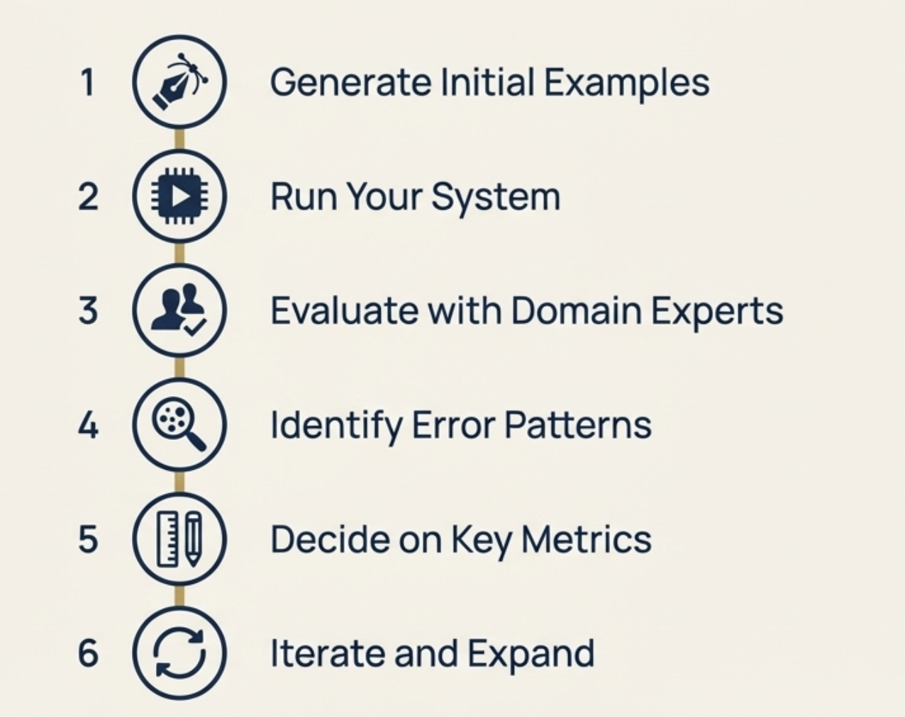

# Chapter 4: Building Reference Datasets

## Getting Started with Systematic Evaluation

In the previous chapter, we covered why you need specific evaluation metrics and how different stakeholders bring different perspectives to defining quality. Now let's talk about how to set this up systematically.

You've built a version of your AI product and you want to evaluate it properly before putting it in front of real users. Where do you start?

The most practical approach is building a reference dataset. Think of this as a small, carefully chosen set of examples that represent the scenarios you care most about. It's not meant to be comprehensive - it's meant to be useful for validating your system's behavior in a controlled environment before deployment.

**A note on system complexity**: In this guide, we'll focus on single-step AI interactions (where the user asks something and the system responds). Many complex AI systems involve multiple steps like calling tools, multi-turn conversations, or reasoning chains, but the core ideas we'll cover can be translated to those more complex scenarios as well.

## What Is a Reference Dataset?

A reference dataset is your first concrete representation of how the system should behave when deployed. It's a collection of realistic inputs paired with what you expect the system to do in those situations.

The key word here is "realistic." These aren't made-up test cases. They're examples that reflect how real users will actually interact with your system, including the messy, ambiguous, and edge-case scenarios that always happen in production.

Each example in your dataset typically includes:
- **Input**: A realistic user request or scenario
- **Expected output**: What the system should do (written in plain language)
- **Context**: Any additional information the system needs

The expected output doesn't have to be a perfect response. It can be a description of the right behavior, like "escalate to human agent" or "ask for clarification about the user's budget range."

## Why Start Small and Specific

Teams often make the mistake of trying to build comprehensive test coverage from day one. This doesn't work well for AI systems.

Instead, start with a small set of examples that represent scenarios you absolutely cannot get wrong. These are usually:
- High-risk situations where failure would be unacceptable
- Common user workflows that need to work smoothly
- Edge cases that reveal important system limitations
- Examples that expose different evaluation dimensions you care about

For a customer support AI, this might include:
- A billing dispute that requires human escalation
- A simple return request that should be handled automatically
- An angry customer message that needs careful tone handling
- A request that's outside your company's service scope

Starting small lets you focus on quality over quantity. It's better to have 20 well-chosen examples with clear expected behaviors than 200 generic test cases.

## Step 1: Generate Your Initial Examples

The best source for examples is usually existing data from your domain. If you have historical customer support tickets, user queries, or domain-specific scenarios, start there.

If you don't have existing data, this is where collaboration becomes essential:

**Subject matter experts** should contribute the majority of initial examples. They know the edge cases, the high-risk scenarios, and the subtle requirements that technical teams might miss. Don't rely on engineers to generate domain-specific examples because they'll miss important nuances.

**Product teams** can contribute examples based on user research, feature requirements, and common user journeys they've observed.

**Engineers** can help identify technical edge cases and system boundary conditions.

We recommend avoiding AI-generated synthetic examples at this stage. AI can help with formatting or expanding on human-written examples, but it tends to create shallow scenarios that miss real-world complexity.

### Example: Customer Support Dataset

Here's what an initial reference dataset might look like for a customer support system:

| Input | Expected Behavior |
|-------|-------------------|
| "I want to return my shoes but I lost the receipt" | Ask for order number or email, explain receipt alternatives, process if sufficient info available |
| "Your service is terrible and I'm switching to a competitor" | Acknowledge frustration, apologize professionally, escalate to retention team |
| "How do I track my order?" | Ask for order number, provide tracking information, explain delivery timeline |
| "I was charged twice for the same order" | Apologize, escalate immediately to billing team with all available details |

Notice these examples cover different scenarios (returns, complaints, tracking, billing) and different required behaviors (self-service, escalation, information gathering).

## Step 2: Run Your System on the Examples

Once you have your initial set of examples, run your AI system on these inputs. Keep the system simple at this stage. Don't add complexity before you understand baseline behavior.

This step often reveals immediate problems with your system design, prompts, or configuration. That's valuable information.

Document both what the system outputs and any intermediate steps (which tools it used, what data it retrieved, how confident it was). This helps you understand not just what went wrong, but why.

## Step 3: Evaluate Alignment with Domain Experts

Now you have three columns: input, expected behavior, and actual system output. The next step is getting domain experts to evaluate the alignment.

Keep this process simple. Ask domain experts to review each example and answer: "Was this response satisfactory? If not, why not?"

Avoid asking for numerical scores at this stage. Scores are harder to interpret and don't give you actionable feedback. Simple yes/no judgments with explanations are more useful.

**Make it easy for domain experts to participate**. Don't ask them to learn complex rubrics or scoring systems. Frame questions in their language and focus on their expertise.

### Example Evaluation Session

Continuing with our customer support example:

| Input | System Output | Expected | Satisfactory | If not, why? |
|-------|---------------|----------|--------------|--------------|
| "Lost receipt for shoe return" | "I can help you process a return. Please provide your order confirmation email." | Ask for order number or email, explain alternatives | Yes | Handled appropriately |
| "Service is terrible, switching" | "I understand you're frustrated. Let me see how I can help resolve your issue." | Acknowledge, apologize, escalate to retention | No | Didn't escalate to retention team |

This gives you specific, actionable feedback about where your system is failing.

## Step 4: Identify Error Patterns

Now bring the engineering perspective back in. Look at the annotations from domain experts and identify patterns in the failures.

Many issues that look different on the surface come from the same root cause. The goal is clustering errors into a small number of underlying problems that you can actually fix.

Add two more columns to your analysis:
- **Error category**: What type of failure is this?
- **Potential cause**: Why might this be happening?

Common error patterns include:
- **Missing context**: System doesn't have access to information it needs
- **Prompt issues**: Instructions aren't clear or specific enough
- **Business rule failures**: System doesn't follow domain-specific policies
- **Escalation problems**: Doesn't recognize when human intervention is needed

### Example Error Analysis

| Input | System Output | Satisfactory | Error Category | Potential Cause |
|-------|---------------|--------------|----------------|-----------------|
| "Service terrible, switching" | Generic help offer | No | Missing escalation | No escalation logic for retention cases |
| "Charged twice" | "Let me help with that" | No | Missing urgency | Billing issues not flagged as high-priority |

This helps you prioritize fixes and understand whether issues are implementation problems or deeper design issues.

## Step 5: Decide Which Metrics You Need

Here's a key insight: if an issue can be fixed once and is unlikely to return, fix it and move on. If an issue represents a behavior that can reappear in different forms, you need an ongoing metric to track it.

For example:
- A missing instruction in a prompt is usually a one-time fix
- Appropriate escalation behavior is an ongoing concern that needs monitoring

Create metrics for recurring risks, not one-off bugs.

**Be ruthless about what you measure**. You want the minimum number of metrics that give you the maximum amount of signal. If there are issues in your use case that you're not really worried about (small things that don't significantly impact your users or business), don't add a metric for them. 

Only create metrics for behaviors you actually care about and can take action on. If you wouldn't change your system based on a metric, don't track it.

Based on your error analysis, identify 2-4 key behaviors that need ongoing measurement. These become your evaluation metrics. More than that becomes difficult to manage and act upon effectively.

For our customer support example, you might end up with:
- **Escalation accuracy**: Does the system correctly identify when human intervention is needed?
- **Information gathering**: Does it ask for the right information to resolve requests?
- **Tone appropriateness**: Does it match the professional, helpful brand voice?

**Focus on what matters, not implementation**. At this stage, don't worry about how you'll measure these behaviors. Just identify which behaviors are most important for your use case. We'll cover implementation approaches in the next chapter.

For now, examples of metrics you might track include:
- Response time stays under acceptable limits
- Required legal disclaimers appear in financial advice responses
- Billing-related queries get properly flagged for escalation
- System outputs maintain valid structure for downstream processing
- Appropriate tone and empathy in customer interactions
- Accurate assessment of query complexity for escalation decisions
- Relevant information gathering without being repetitive

What matters most is identifying which failure modes are critical for your specific system and user needs.

## Step 6: Iterate and Expand

Your reference dataset isn't static. As you fix issues and learn more about system behavior, add new examples that represent:
- Edge cases discovered in production
- New failure modes that emerge
- Additional scenarios your system needs to handle

The dataset grows into a record of hard-won understanding about what good behavior looks like in your domain.

## Common Pitfalls to Avoid

**Don't make it too big too fast**: Start with 10-20 high-quality examples rather than 100 mediocre ones.

**Don't rely entirely on synthetic data**: AI-generated examples often miss real-world complexity and edge cases.

**Don't skip domain expert involvement**: Technical teams alone cannot define what good behavior looks like in specialized domains.

**Don't create metrics for every issue**: Focus on recurring risks that need ongoing monitoring.

**Don't make rubrics too complex**: Simple "acceptable/not acceptable" categories work better than elaborate scoring systems.

## What You End Up With

After following this process, you'll have:
- A reference dataset that represents scenarios you care about
- Clear definitions of what good behavior looks like
- Specific metrics that track the most important behavioral dimensions
- Rubrics that make subjective evaluation consistent
- A process for expanding and refining your evaluation over time

This becomes the foundation for ongoing evaluation and improvement. Every time you make changes to your system, you can run it against your reference dataset to check for regressions. Every time you discover new edge cases in production, you can add them to improve your evaluation coverage.

The goal isn't perfect evaluation - it's systematic improvement. Your reference dataset helps you move from vague concerns about system behavior to concrete, measurable criteria you can act on.

In this chapter, we've identified what metrics are important to track based on your specific failure modes and business requirements. In the next chapter, we'll talk about how to implement these metrics, from simple code-based checks to more sophisticated evaluation approaches.

