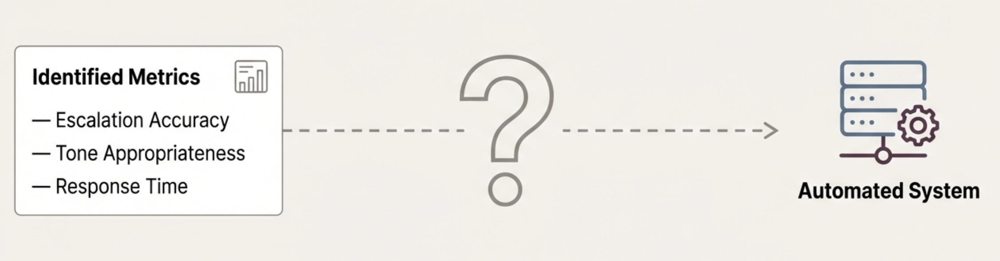

# Chapter 5: Implementing Evaluation Metrics



## From What to How

In the previous chapter, we walked through building reference datasets and identifying which metrics matter for your system. You now have a clear list of behaviors you want to track, such as escalation accuracy, response time, or tone appropriateness.

Now comes the practical question: how do you actually measure these behaviors?

This chapter covers the different approaches you can use to implement your metrics. We'll explore when each approach works well, their trade-offs, and how to choose the right mix for your specific situation.

## Three Ways to Measure AI Behavior


There are three main approaches to implementing evaluation metrics:

**Human evaluation**: Having people assess AI system behavior based on their expertise and judgment
**Code-based metrics**: Deterministic checks written in code that look for specific patterns or properties
**LLM judges**: Using one model to evaluate another model's behavior

Each approach has strengths and weaknesses. Most effective evaluation systems use a combination of multiple approaches.

## Human Evaluation: The Gold Standard

Human evaluation is exactly what we did when building the reference dataset in the previous chapter. You show examples to domain experts, product managers, or other stakeholders and ask them to judge whether the AI system's behavior was acceptable.

This approach has major advantages:
- **Nuanced judgment**: Humans can assess complex, subjective qualities like appropriateness, empathy, and contextual correctness
- **Domain expertise**: Subject matter experts understand subtleties that automated systems miss
- **Flexibility**: Humans can adapt their evaluation criteria on the fly when they encounter edge cases
- **Ground truth**: Human judgment often serves as the standard that other metrics try to approximate

### Why Human Evaluation Doesn't Scale

The problem with human evaluation is obvious: it's slow and expensive. If you had to have a human evaluate every single conversation your AI system has in production, you'd need an army of evaluators working around the clock.

Imagine a customer support AI that handles 10,000 interactions per day. Having domain experts review each one would be impractical and cost-prohibitive. Even sampling 1% would require evaluating 100 interactions daily.

This is why we need the other automated approaches. They're attempts to capture human-like judgment at scale. The goal is finding automated methods that correlate well with human evaluation while being fast and cost-effective enough to run in production.

### When to Use Human Evaluation

Human evaluation still has important roles:
- **Calibrating automated metrics**: Use human judgment to test whether your LLM judges or other metrics align with expert assessment
- **Edge case analysis**: When automated metrics flag something as problematic, humans can investigate whether it's a real issue
- **Periodic sampling**: Regularly evaluate a small sample of interactions to ensure your automated systems are working correctly
- **High-stakes decisions**: For critical interactions or when the cost of errors is very high

## Code-Based Metrics: When Rules Work

Code-based metrics are deterministic checks you can implement with regular programming. They're fast, reliable, and easy to understand.

These work well when you can define success clearly and objectively:

**Structure validation**: Check if the response contains required fields, follows JSON format, or includes mandatory disclaimers

**Performance metrics**: Measure response time, token count, or API call frequency

**Content detection**: Verify specific phrases appear (like "please consult your doctor" in medical responses) or don't appear (like specific banned words)

**Classification flags**: Check if the system correctly tagged a query as "billing," "technical support," or "escalation needed"

### Example: Structured Output Validation

Say you're building an AI system that helps sales teams qualify leads. The system needs to extract key information from customer conversations and output it in a structured format for the CRM system.

Your AI system should output JSON like this:
```json
{
  "customer_name": "John Smith",
  "company": "TechCorp",
  "budget_range": "50000-100000",
  "timeline": "Q2 2024",
  "decision_maker": true,
  "contact_email": "john@techcorp.com"
}
```

A code-based metric can easily verify:
- Is the output valid JSON?
- Are all required fields present (customer_name, company, budget_range)?
- Is the budget_range in the expected format?
- Is the decision_maker field a boolean?
- Is the contact_email field a valid email format?

This kind of check is perfect for code-based metrics because the requirements are objective and well-defined.

### When Code-Based Metrics Fall Short

Code-based metrics struggle with subjective qualities like tone, appropriateness, or nuanced decision-making. You can't easily write code to detect whether a customer service response shows appropriate empathy or whether an escalation decision was justified.

They also miss nuanced meaning and context. A response might pass all the structural checks but still be unhelpful, inappropriate, or incorrect in ways that matter to users.

## LLM Judges: Automating Human-Like Evaluation

LLM judges use one model to evaluate another model's behavior. The idea is to replace the manual human evaluation process we used when building reference datasets with an automated system that can make similar judgments at scale.

Instead of having domain experts review every response, you give an LLM the same criteria and ask it to assess whether the behavior was appropriate. This lets you evaluate thousands of interactions with the same standards a human expert would apply.

This approach works for subjective or complex evaluations:

**Tone assessment**: Is the response professional and empathetic?
**Escalation decisions**: Should this query have been escalated to a human?
**Reasoning quality**: Does the explanation make logical sense?
**Safety evaluation**: Does the response avoid harmful content?

### Example: Customer Service Tone

For evaluating whether a customer service response shows appropriate empathy, an LLM judge can assess nuanced qualities like tone, professionalism, and contextual appropriateness that would be difficult to capture with code-based metrics.

Whether you're using LLM judges or human evaluators, you need clear criteria for what constitutes good and poor performance. This is where rubrics become essential.

A good rubric defines:
- **Acceptable performance**: Specific characteristics of good behavior
- **Not acceptable performance**: Clear failure criteria
- **Examples**: Concrete instances of each category
- **Edge case guidance**: How to handle ambiguous situations

### Example: From Error Pattern to LLM Judge Rubric

Here's how you'd build an LLM judge based on the customer support example from Chapter 4. 

**The Problem**: In your reference dataset evaluation, you found that when customers expressed frustration and mentioned switching providers (like "Service is terrible, switching"), your system gave generic help offers instead of escalating to the retention team.

**The Pattern**: Analysis revealed this was part of a broader "escalation accuracy" issue. The system wasn't recognizing when situations required specialized human intervention.

**The Metric**: You decided to track "escalation accuracy" as an ongoing metric since this behavior could reappear in many different forms.

**The LLM Judge Rubric**:

**Acceptable**: 
- Correctly identifies customer retention situations (mentions switching, canceling, competitor comparisons, dissatisfaction with service)
- Escalates billing disputes over significant amounts ($100+)
- Recognizes technical issues beyond basic troubleshooting scope
- Provides relevant context when escalating (customer sentiment, issue details, urgency level)

**Not Acceptable**:
- Misses clear retention signals and attempts generic problem-solving
- Fails to escalate high-value billing disputes 
- Tries to handle complex technical issues that require specialized expertise
- Escalates routine questions that could be resolved automatically
- Escalates without sufficient context for the human agent

**Examples**:
- **Acceptable**: "Your service is terrible and I'm switching to CompetitorX" → Escalates to retention team noting customer dissatisfaction and competitor mention
- **Not Acceptable**: "I want to cancel my subscription to save money" → Provides generic retention offer instead of escalating to retention specialists
- **Acceptable**: "I was charged $500 for services I never ordered" → Escalates to billing team with charge amount and dispute details
- **Not Acceptable**: "How do I reset my password?" → Escalates to technical support instead of providing standard reset instructions

This rubric now gives you a measurable way to track the escalation behavior that was failing in your reference dataset, turning the discovered error pattern into an ongoing monitoring capability.

**LLM Judge Prompt Example**:

Here's how you might structure a prompt for an LLM judge using this rubric:

```
You are evaluating customer service responses for escalation accuracy. Your job is to determine if the AI system correctly identified when human intervention was needed.

EVALUATION CRITERIA:

Acceptable Performance:
- Correctly identifies customer retention situations (mentions switching, canceling, competitors)
- Escalates billing disputes over $100
- Recognizes complex technical issues beyond basic troubleshooting
- Provides relevant context when escalating (sentiment, details, urgency)

Not Acceptable Performance:
- Misses clear retention signals and tries generic problem-solving
- Fails to escalate high-value billing disputes
- Attempts to handle complex technical issues requiring specialized expertise
- Escalates routine questions that could be resolved automatically
- Escalates without sufficient context for human agents

EXAMPLES:
- Customer: "Your service is terrible and I'm switching to CompetitorX"
  Acceptable Response: Escalates to retention team noting dissatisfaction and competitor mention
  Not Acceptable: Offers generic troubleshooting help

- Customer: "I was charged $500 for services I never ordered"
  Acceptable Response: Escalates to billing team with charge details
  Not Acceptable: Asks customer to verify their account information

TASK:
Review the customer input and AI response below. Determine if the escalation decision was:
- Acceptable
- Not Acceptable

Provide a brief explanation for your judgment.

Customer Input: [INPUT]
AI Response: [RESPONSE]

Your Evaluation:
```

This prompt gives the LLM judge the same detailed criteria that human evaluators would use, allowing it to make consistent assessments at scale.

## A Note on LLM Judge Calibration

While we've shown you how to build an LLM judge with clear criteria and rubrics, remember that in practice, calibrating an LLM judge is a much longer and more data-driven process than what we've demonstrated here. LLM judges are powerful but challenging to implement well. They can be inconsistent, biased, or misaligned with human judgment. They're also more expensive and slower than other approaches.

Effective LLM judge calibration requires extensive testing against human judgment across hundreds of examples, not just a few. You need to systematically identify where the LLM judge disagrees with human evaluators, understand why those disagreements happen, and iteratively refine your prompts and criteria until alignment is acceptable for your specific use case.

**Calibration is Essential**

The biggest challenge with LLM judges is ensuring they actually align with human judgment. Just because you write detailed criteria doesn't mean the LLM will interpret them the same way a human expert would. In fact, if not calibrated properly they can add more problems to your system because they add another layer of non-determinism.

You need to test your LLM judge against human evaluations:
- Have humans evaluate a sample of examples using your rubric
- Run your LLM judge on the same examples
- Compare the results to see where they agree and disagree
- Refine your prompt and criteria based on the differences
- Repeat until alignment is acceptable

We leave you here since this is a 101 course, but building reliable LLM judges can be a course on its own. Remember to dig deeper on learning them well.

**Want to go deeper?** While this course covers evaluation fundamentals, building production-ready AI systems requires understanding enterprise patterns, agentic designs, and advanced implementation strategies. For comprehensive guidance on enterprise AI development, check out our **[#1 rated Enterprise AI Cohort on Maven](https://maven.com/aishwarya-kiriti/genai-system-design)** taken by product and engineering leaders and practitioners at Meta, Amazon, Google, Apple and more!

*📝 Note: Use code **GITHUB15** for 15% off the Enterprise AI Cohort (valid until January 15th, 2025)*


## What You End Up With

After implementing your metrics, you'll have a measurement system that can:
- Automatically track the behaviors you care about most
- Run consistently across different examples
- Provide actionable feedback for system improvement
- Scale with your evaluation needs

This system becomes the foundation for continuous improvement. You can run it on new examples, track performance over time, and identify areas where your AI system needs work. However, you probably have questions on how to deploy these metrics in a production setup. Should you be running them on all your production inputs and outputs or just samples? Are these metrics enough or should you keep reinventing? We'll talk about all this in the next chapter.


In the next chapter, we'll explore how to use these metrics in an improvement loop that helps your system get better over time.

