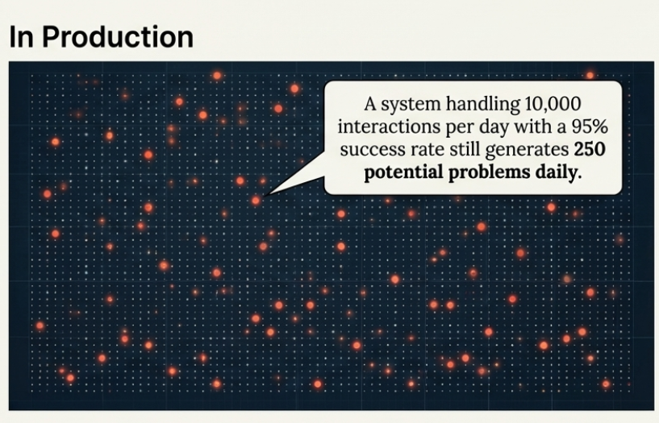
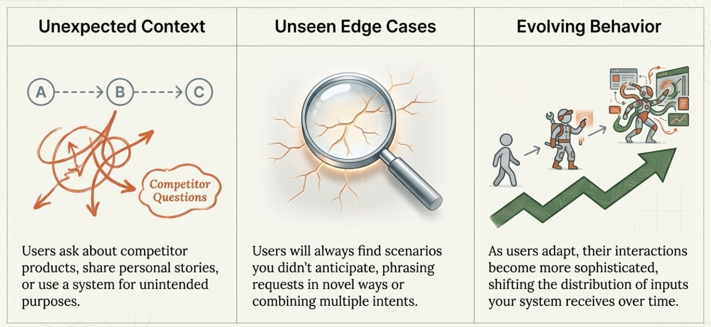
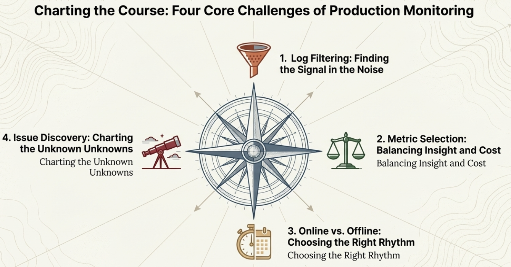

# Chapter 6: Production Deployment and Real User Behavior

## From Lab to Real World

So far in this course, we've covered the essential building blocks of AI evaluation. We started by understanding why evaluation matters for AI systems and distinguished between model evaluations and product evaluations. We explored the conceptual foundation of input, expected, and actual behavior. We walked through building reference datasets to systematically identify what matters for your specific use case. And we covered three approaches to implementing evaluation metrics: human evaluation, code-based metrics, and LLM judges.

At this point, you have a solid evaluation framework. You've built reference datasets that represent important scenarios for your system. You've identified the key metrics that track behaviors you actually care about. You've implemented ways to measure those behaviors, whether through human judgment, deterministic code checks, or calibrated LLM judges.

But here's where things get interesting and more complex.

Everything we've discussed so far happens in controlled conditions. You're testing with carefully chosen examples, evaluating against clear expected behaviors, and working with stakeholders who understand your system's goals. You're essentially working in a lab environment where you control the inputs and can predict most of the scenarios.

Production is different. When real users start interacting with your AI system, several things happen that change the evaluation game entirely.

## The Reality of Real Users

Real users don't behave like your reference datasets. They don't ask questions the way you expect, they don't provide complete information, and they often try to use your system for purposes you never intended.

**Users bring unexpected context**: Your customer service AI might be designed for product questions, but users will ask about competitor products, share personal stories, or try to use it for technical support issues outside your scope.

**Users test edge cases you missed**: No matter how thorough your reference dataset, real users will find scenarios you didn't anticipate. They'll phrase requests in ways that confuse your system, combine multiple intents in a single message, or operate under assumptions that don't match your business model.

**User evolution**: As users get comfortable with your system, their behavior evolves. They develop new ways to phrase requests, discover shortcuts, and use your system in increasingly sophisticated ways. Think about how people use ChatGPT today compared to when it first launched - the questions become more complex, the use cases expand, and the expectations change. This natural evolution means the distribution of inputs your system receives will shift over time.

**Volume changes everything**: When you test with 50 carefully chosen examples, you can review each interaction manually. When your system handles 10,000 interactions per day, you need fundamentally different approaches to understanding what's happening.

## The Scale Challenge

In controlled testing, you can review every example and understand every failure. In production, this becomes impossible.

Consider a customer support AI that handles 5,000 conversations daily. Even if 95% of interactions go perfectly, you still have 250 potentially problematic conversations every day. Manual review of each one would require dedicated staff just for evaluation.

The challenge isn't just volume - it's also about detection. In your reference dataset, you know which examples should pass or fail your evaluation metrics. In production, you don't know ahead of time which conversations will be problematic. 

This shifts the evaluation question from "How did we do on this specific set of examples?" to "How are we doing overall, and where should we focus our attention?"

## From Evaluation to Monitoring

Moving to production fundamentally changes your relationship with evaluation. During development, evaluation was about validation (testing whether your system works as intended). In production, evaluation becomes monitoring (continuously checking whether your system continues to work well as conditions change).

This affects how you think about measurement, response, and improvement:

**Evaluation builds confidence before deployment**: You test thoroughly to gain confidence that your system is ready for users.

**Monitoring maintains quality during deployment**: You track performance to catch problems early and guide improvements.

**The flywheel of improvement**: Good production monitoring feeds back into your evaluation process. Issues discovered in production become new test cases in your reference datasets. Patterns identified in monitoring inform better pre-deployment validation. The two work together in a continuous improvement cycle.

This creates a natural progression: strong evaluation gives you confidence to deploy, effective monitoring helps you improve, and improved systems perform better in evaluation.

## Four Core Challenges in Production

When you move from controlled evaluation to production monitoring, four key challenges emerge that require careful planning:

### 1. Log Filtering

With thousands of events happening daily, you can't manually review everything. You need systematic approaches to identify which logs deserve attention. This means developing filtering and sampling strategies that help you focus on the data most likely to reveal problems or insights.

### 2. Metric Selection

Remember that evaluation metrics aren't free. LLM judges cost money to run, human evaluation requires time and expertise, and even code-based metrics might not always be as trivial or cheap as running unit tests in traditional software setups. At scale, these costs add up quickly. You need to be strategic about which metrics provide the most valuable insights relative to their cost.

### 3. Online vs. Offline Evaluation

This is where we introduce an important distinction that will shape your production monitoring strategy:

**Online evaluation** happens in real-time as users interact with your system. These metrics run immediately and can trigger alerts or interventions. For example, you might have an online safety filter that flags inappropriate content before it reaches users.

**Offline evaluation** happens after the fact, often in batch processes. These metrics analyze interactions that already occurred to identify trends, assess quality over time, or conduct detailed investigations. For example, you might run expensive LLM judges overnight to assess the previous day's customer service interactions.

The choice between online and offline evaluation affects cost, complexity, and responsiveness. Online evaluation gives you immediate feedback but needs to be fast and lightweight. Offline evaluation can be more thorough and sophisticated but only helps you improve future interactions.

### 4. Emerging Issue Discovery

Despite doing all of this systematically, it's possible that we have not anticipated some issues at all. What do we do about that?

Even the most thorough offline evaluation process can't predict every problem that will emerge in production. Users will find new ways to confuse your system, edge cases you never considered will surface, and changing business requirements will create new failure modes.

This means you need strategies for discovering issues that your existing evaluation framework doesn't catch. How do you identify problems you weren't looking for? How do you evolve your evaluation approach as new patterns emerge?

These four challenges form the foundation of production monitoring strategy. Getting them right determines whether your monitoring system provides actionable insights or becomes an expensive distraction.

## What Comes Next

The transition from controlled evaluation to production monitoring requires addressing these four core challenges systematically. The goal isn't to replicate your reference dataset evaluation at production scale (that would be impractical and expensive). Instead, you need smart strategies for each challenge.

In the next chapter, we'll cover practical approaches to:
- **Log filtering**: Strategies for identifying which data needs attention without drowning in information
- **Metric selection**: Frameworks for choosing the right mix of evaluation approaches based on value and cost
- **Online vs offline evaluation**: Designing systems that balance immediate responsiveness with thorough analysis
- **Emerging issue discovery**: Methods for identifying problems that your existing evaluation framework doesn't catch

These approaches will help you build a monitoring system that provides actionable insights while remaining sustainable and cost-effective as your AI system scales.

