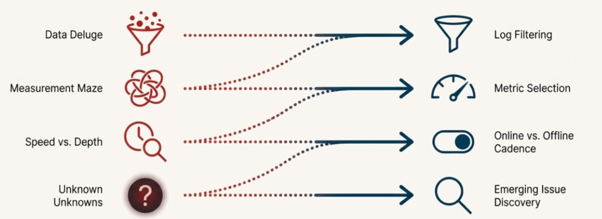
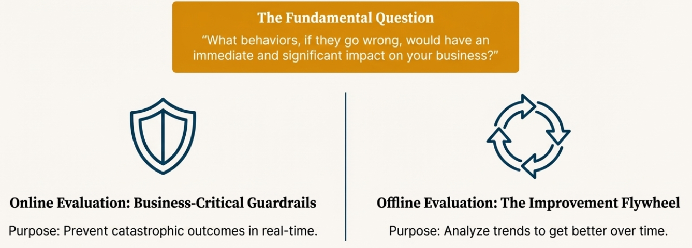
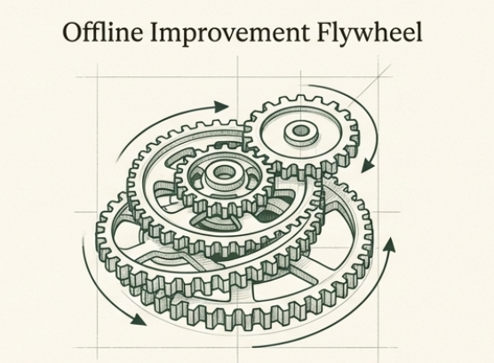
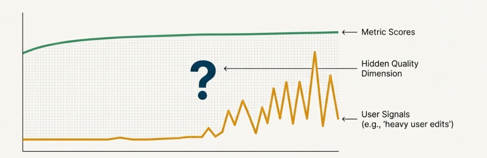
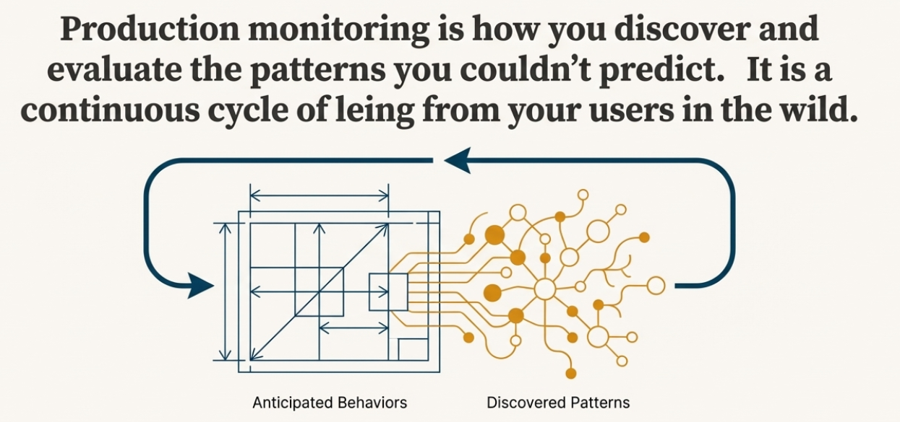

# Chapter 7: Production Monitoring Strategies

## From Challenges to Solutions

In the previous chapter, we identified four core challenges that emerge when you move from controlled evaluation to production monitoring:

1. **Log filtering**: How to identify which data deserves attention
2. **Metric selection**: How to choose the right evaluation approaches  
3. **Online vs offline evaluation**: How to balance real-time needs with thorough analysis
4. **Emerging issue discovery**: How to find problems you weren't looking for

Now we'll address each challenge with practical strategies you can implement. The goal is building a sustainable monitoring system that provides actionable insights without overwhelming your team or budget.

## Log Filtering: Finding Signal in the Noise

When your AI system handles thousands of events daily, you need systematic approaches to identify what requires attention. Random sampling might miss critical issues, while trying to review everything is impossible.

### Priority-Based Filtering

Start by defining what matters most for your specific business context. Not all events are equally important, and what deserves attention varies significantly based on your use case and risk tolerance.

For example, you might consider categorizing events like this:

**Potential high-priority signals** could include safety violations, system errors, or high-value interactions - but you need to define what "high-value" means for your business.

**Potential medium-priority signals** might be routine interactions that show unusual patterns - though you'll need to determine what constitutes "unusual" in your domain.

**Potential low-priority signals** could be simple, standard interactions - but again, "simple" and "standard" depend entirely on your system's purpose and user base.

### Signal-Based Sampling

Beyond basic priority filtering, you can look for implicit and explicit signals that users give you about interaction quality. You need to identify which signals matter most for your specific system and users.

Some examples of signals you might consider:

**Conversation patterns** like unusual length (much shorter or longer than typical), repetition (users rephrasing questions), explicit escalation requests, or confusion indicators. But what counts as "unusual" length depends entirely on your domain - a financial advisory conversation naturally runs longer than a weather query.

**User behavior patterns** such as extensive editing of generated content, retry behavior, frustration indicators, or abandonment patterns. For a content generation system, whether users copy-paste or heavily modify outputs tells you something about quality - but you need to decide what level of modification indicates a problem versus normal customization.

**Content quality indicators** including response completeness, format consistency, or context matching. The thresholds that matter depend on your system's purpose and user expectations.

The critical decision is determining which of these signals are most indicative of problems in your specific context.

### Example: Customer Support Filtering Considerations

A customer support AI team might consider various approaches, but the specific choices depend on their business priorities and risk tolerance:

They might choose to always examine interactions with explicit escalation requests or safety concerns, but the definition of "safety concern" varies by industry. They could focus on conversations mentioning competitors or billing disputes, but whether a $50 or $500 dispute deserves attention depends on their business model.

They might sample more heavily from unusually long conversations, but "unusual" for a simple password reset differs from "unusual" for a complex technical issue. They could prioritize first-time users or interactions that show signs of confusion, but the thresholds that matter depend on their user base and system design.

### Signal Considerations for Different AI Systems

**Content Generation AI** teams might care about extensive user editing of outputs, but they need to decide whether 50% editing indicates a problem or normal creative refinement.

**Financial Advisory AI** teams might monitor for repeated clarification requests, but they must determine whether two follow-ups indicate confusion or appropriate due diligence.

**E-commerce Recommendation AI** teams might track ignored recommendations, but they need to consider whether this indicates poor recommendations or users with specific preferences.

In each case, the team must define their own thresholds and priorities based on their specific context, users, and business goals.

### Dynamic Filtering Based on Production Signals

Your filtering strategy should adapt based on observable changes in your production environment, but you need to decide which signals matter most for your business.

**Consider increasing sampling when you observe** production changes like error rate spikes, new product launches that might confuse users, increases in human support tickets, shifts in user behavior patterns, seasonal events that change user needs, or marketing campaigns that influence how users phrase requests.

**Consider decreasing sampling when you see** stable performance metrics, mature interaction patterns, or stable behavior in specific system components - though you must balance this against resource constraints and the risk of missing emerging issues.

**Examples of production signals you might track** include support ticket volume and categories, user session abandonment rates, conversation length trends, system performance metrics, business metrics like conversion rates, and external events like product launches or competitor actions.

The key decisions are which signals to monitor, what changes are significant enough to trigger sampling adjustments, and how quickly to respond to different types of changes. These choices depend entirely on your business context, user base, and risk tolerance.

## Metric Selection: Choosing Your Evaluation Mix

Not all metrics are equally valuable, and running everything is expensive. You need frameworks for choosing the right mix of evaluation approaches.

### The Metric Value Framework

Evaluate each potential metric across three dimensions:

**Impact**: How much does this metric help you improve your system?
- High impact: Metrics that reveal actionable problems
- Medium impact: Metrics that provide useful trends
- Low impact: Metrics that are interesting but don't drive decisions

**Reliability**: How consistent and accurate is this metric?
- High reliability: Human expert evaluation, well-validated code checks
- Medium reliability: Calibrated LLM judges, statistical measures
- Low reliability: Uncalibrated automated assessments, proxy metrics

**Cost**: What does it cost to run this metric at scale?
- Low cost: Simple code-based checks, existing system metrics
- Medium cost: Fast LLM judge calls, periodic human spot-checks
- High cost: Detailed human evaluation, expensive model calls, complex analysis

### Prioritization Matrix

Plot your potential metrics on a simple matrix:

**High Impact + Low Cost = Must Have**
- Simple safety filters
- Basic structure validation
- Performance metrics (response time, success rate)
- Clear policy violation detection

**High Impact + High Cost = Strategic Investment**  
- Calibrated LLM judges for subjective quality
- Expert human evaluation for critical interactions
- Detailed escalation accuracy assessment

**Low Impact + Low Cost = Nice to Have**
- Basic statistical trends
- Simple response length tracking
- Automated sentiment detection

**Low Impact + High Cost = Avoid**
- Elaborate scoring systems that don't drive decisions
- Expensive metrics that duplicate existing insights
- Over-detailed measurement of stable system behaviors

## Online vs Offline Evaluation: Guardrails vs Improvement Flywheel

The choice between real-time and batch evaluation comes down to a fundamental question: What behaviors, if they go wrong, would be huge for your business?

### Online Evaluation: Business-Critical Guardrails

Online evaluation serves as guardrails - metrics that must run in real-time because the behaviors they monitor are so critical that failure would significantly impact your business.

These are metrics where you need immediate intervention, not just later analysis. When these guardrails trigger, your system should take immediate action like handing off to a human agent, blocking harmful content, or escalating to specialists.

**Think of guardrails for behaviors like**:
- Safety violations that could harm users or your business
- Compliance failures that could create legal liability
- High-value customer situations that require immediate attention
- System failures that impact user experience
- Critical business rule violations

**Guardrail characteristics**:
- Must be fast and reliable (failures cascade quickly)
- Should trigger immediate actions (handoffs, blocks, escalations)
- Focus on preventing catastrophic outcomes, not optimization
- Need to work even when other systems are stressed

**Examples of potential guardrail metrics**:
- Safety filters blocking harmful content before it reaches users
- Compliance checks ensuring required disclaimers in financial advice
- Uncertainty detection triggering immediate human handoff
- High-value customer detection routing to premium support
- System error detection triggering failover procedures

### Offline Evaluation: Improvement Flywheel

Offline evaluation powers your improvement flywheel - analyzing data after the fact to understand trends, assess quality, and guide system improvements.

These metrics help you get better over time rather than preventing immediate disasters. They're often more sophisticated, expensive, or time-consuming than guardrails, but they provide the insights needed to evolve your system.

**Offline evaluation focuses on**:
- Understanding quality trends over time
- Identifying patterns that inform system improvements
- Conducting detailed analysis of complex behaviors
- Assessing the effectiveness of your guardrails and other systems
- Discovering opportunities for optimization

**Examples of potential offline metrics**:
- LLM judge assessment of conversation quality trends
- Human expert review of escalated cases to improve escalation logic
- Analysis of user satisfaction patterns to guide product development
- Evaluation of edge cases to expand training data
- Assessment of guardrail effectiveness and calibration

### Making the Guardrail Decision

The key decision is identifying which behaviors are guardrail-worthy - meaning failure would have immediate, significant business impact.

For a healthcare AI, incorrect medication information might be a guardrail issue requiring immediate intervention. For an e-commerce chatbot, product recommendation accuracy might be important for improvement but not guardrail-critical.

For a financial advisory AI, compliance violations are clearly guardrail territory, while response tone optimization belongs in the improvement flywheel.

The cost and complexity of guardrails mean you should be selective about what requires real-time intervention versus what can wait for batch analysis and gradual improvement.

## Emerging Issue Discovery: When Your Signals Don't Match Your Metrics

Remember the log filtering approach we discussed earlier - you're already sampling based on implicit and explicit user signals like conversation length anomalies, retry behavior, editing patterns, and frustration indicators. But what happens when these signals are telling you something your current metrics aren't capturing?

This is where emerging issue discovery becomes critical. You might find that your existing evaluation metrics show everything is working well, but the user behavior signals you're sampling suggest otherwise.

### When Signals and Metrics Diverge

Consider this scenario: You're monitoring a content generation AI, and you've been sampling interactions where users heavily edit the generated outputs (one of your implicit signals). Your current metrics - like content relevance and grammar correctness - show these interactions are scoring well. But the signal persists: users keep making extensive edits.

This divergence suggests there might be a quality dimension you're not measuring. Perhaps users are editing for tone, brand voice, or subtle contextual appropriateness that your current metrics don't capture. The user behavior signal is revealing a hidden issue that your evaluation framework missed.

### Systematic Investigation of Signal-Metric Gaps

When you notice this pattern - where your sampling signals flag interactions but your metrics show no actionable improvements - it's time for manual investigation, which means you'll need to look at these traces manually, just like we did initially when building reference datasets:

**Analyze the filtered logs differently**: Instead of applying your existing metrics, look at the interactions your signals flagged with fresh eyes. What patterns do you see that your metrics might be missing?

**Qualitative review**: Have domain experts or users review the flagged interactions without knowing the metric scores. What do they notice that your metrics don't capture?

**Signal correlation analysis**: Look at which combinations of signals tend to appear together. Multiple signals pointing to the same interactions might indicate a systematic issue.

### Example: E-commerce Recommendation Discovery

An e-commerce AI notices high rates of users ignoring recommendations (a signal they're sampling). But their existing metrics show the recommendations are relevant and properly formatted. Investigation reveals users are ignoring recommendations during certain seasonal periods or for specific product categories - suggesting the system lacks awareness of temporal context or category-specific preferences that existing relevance metrics don't measure.

### Building New Metrics from Signal Patterns

When signal-metric divergence reveals hidden issues, you need to develop new evaluation approaches:

**Pattern documentation**: Systematically document what the expert review reveals about the flagged interactions.

**New metric development**: Create evaluation approaches that can capture the quality dimensions you discovered.

**Validation against signals**: Test whether your new metrics correlate with the user behavior signals that originally flagged the issue.

**Integration into your framework**: Add the new metrics to your offline evaluation for trend monitoring, and consider whether any need to become online guardrails.

### The Discovery Loop

This creates a continuous discovery loop:

1. **User signals** indicate potential issues through behavior patterns
2. **Log filtering** samples these concerning interactions  
3. **Metric analysis** may show existing metrics aren't capturing the problem
4. **Investigation** reveals hidden quality dimensions or failure modes
5. **New metrics** are developed to monitor these newly discovered issues
6. **Updated sampling** incorporates lessons learned to catch similar issues earlier

This loop ensures your evaluation framework evolves as you discover new ways your system can fail or as user expectations change over time.

The key insight is that user behavior signals often reveal problems before your metrics do - they're an early warning system that helps you discover evaluation gaps before they become major issues.

## Building Your Production Monitoring Strategy

Combining these four strategies creates a comprehensive production monitoring approach:

### Start Simple and Evolve

Begin with basic filtering, essential metrics, simple online checks, and manual discovery processes. Add complexity as you understand your system's behavior patterns and your team's capacity.

### Balance Cost and Value

Continuously evaluate whether your monitoring provides enough insight to justify its cost. Expensive evaluation that doesn't drive improvements should be reconsidered.

### Plan for Scale

Design your monitoring to grow with your system. Approaches that work for thousands of daily interactions need to adapt when you reach hundreds of thousands.

### Close the Feedback Loop

The goal of monitoring is improvement. Ensure that insights from your monitoring system feed back into better evaluation, system refinements, and updated business processes.

## The Complete Evaluation Journey: From Concepts to Production

We've now covered the full spectrum of AI evaluation - from understanding why evaluation matters (Chapter 1) to building systematic evaluation frameworks (Chapters 2-3), creating reference datasets and implementing metrics (Chapters 4-5), and finally deploying robust production monitoring (Chapters 6-7). 

The key insight is that evaluation is never complete: you start by building evaluation for anticipated behaviors and failure modes, but real users will always find new ways to interact with your system that you haven't seen before. This is why production monitoring becomes a continuous cycle of discovering new patterns through user signals, manually investigating when your current metrics don't capture emerging issues, developing new evaluation approaches, and feeding these insights back into your evaluation framework.

Think of it as building evaluation for the patterns you can anticipate, then using monitoring to discover and evaluate the patterns you couldn't predict.

**Want to go deeper?** While this course covers evaluation fundamentals, building production-ready AI systems requires understanding enterprise patterns, agentic designs, and advanced implementation strategies. For comprehensive guidance on enterprise AI development, check out our **[#1 rated Enterprise AI Cohort on Maven](https://maven.com/aishwarya-kiriti/genai-system-design)** taken by product and engineering leaders and practitioners at Meta, Amazon, Google, Apple and more!

*📝 Note: Use code **GITHUB15** for 15% off the Enterprise AI Cohort (valid until January 15th, 2025)*

In the next chapter, we'll explore how to use these monitoring insights to create continuous improvement cycles that help your AI system get better over time.

