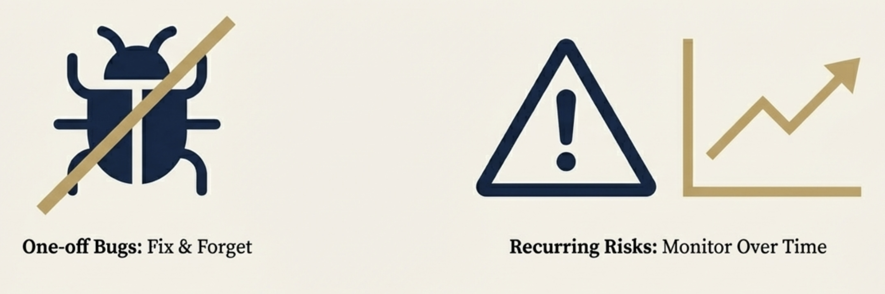
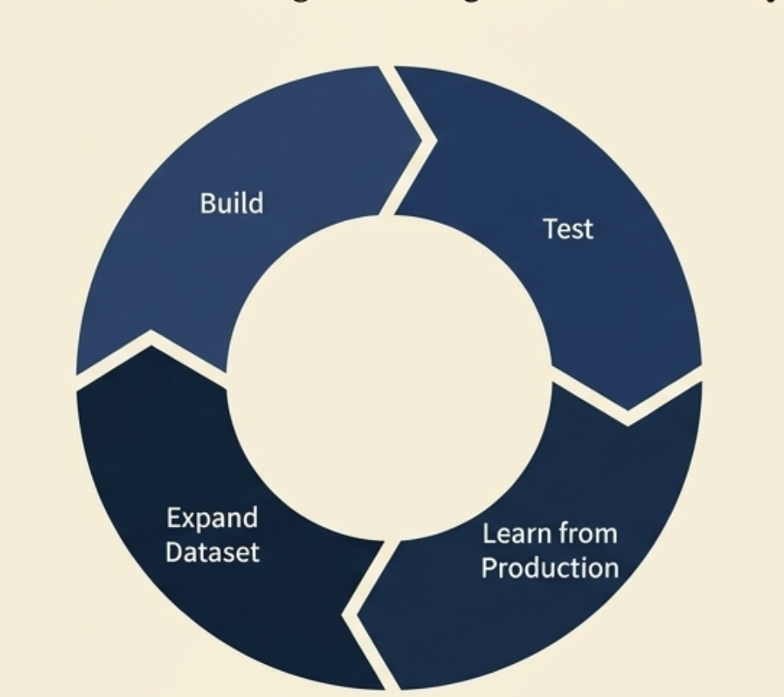

# Chapter 8: The Complete Evaluation Process

## From Concept to Production: Your Step-by-Step Guide

In the previous seven chapters, we've covered the complete landscape of AI evaluation - from understanding why it matters to deploying production monitoring systems. Now let's consolidate everything into a clear, step-by-step process you can follow to build robust evaluation for your AI system.

This chapter serves as your practical roadmap, connecting all the concepts we've discussed into actionable steps you can implement.

## The Two-Phase Approach

AI evaluation follows two distinct phases:

**Phase 1: Pre-Deployment Validation** (Chapters 1-5)
- Build confidence that your system works as intended before users interact with it
- Create systematic evaluation frameworks and metrics
- Test thoroughly in controlled conditions

**Phase 2: Production Monitoring** (Chapters 6-7)  
- Monitor system performance with real users at scale
- Discover new issues and evolving user behaviors
- Continuously improve your system and evaluation approach

Here's how to work through each phase.

---

## Phase 1: Pre-Deployment Validation

### Step 1: Understand Your Evaluation Context
*Based on Chapters 1-3*

**What you're doing**: Establish the foundation for your evaluation approach by understanding what makes AI evaluation unique and what you need to measure.

**Key decisions**: Recognize that your AI system is non-deterministic, focus on product evaluation (how your system behaves in your specific use case) rather than model evaluation, and identify the three components you're evaluating - Input, Expected, and Actual.

**What to do**: Start by mapping out your specific use case and domain requirements. Identify stakeholders who need to be involved - domain experts, product teams, and engineers. Remember that generic metrics like "helpfulness" mean different things in different contexts, so prepare for collaborative evaluation design across different team perspectives.

**Output**: Clear understanding that you're building evaluation for your specific context, not just testing general AI capabilities.

### Step 2: Build Your Reference Dataset
*Based on Chapter 4*

**What you're doing**: Create a systematic collection of examples that represent the scenarios you care about most, with clear expectations for how your system should behave.

**Key decisions**:
- Start small and specific (10-20 high-quality examples) rather than trying to be comprehensive
- Focus on scenarios you absolutely cannot get wrong
- Include realistic inputs that represent actual user behavior

**Action items**:
1. **Generate initial examples**: Work with domain experts to create realistic scenarios based on historical data or domain knowledge
2. **Run your system**: Test your AI system on these examples and document both outputs and any intermediate steps
3. **Evaluate with experts**: Have domain experts review each example and answer "Was this response satisfactory? If not, why not?"
4. **Identify error patterns**: Analyze failures to cluster them into underlying problems you can actually fix
5. **Decide on ongoing metrics**: Determine which behaviors need continuous monitoring (recurring risks) versus one-time fixes

**Output**: A reference dataset with examples, system outputs, expert evaluations, and identified metrics for ongoing measurement.

### Step 3: Implement Your Evaluation Metrics
*Based on Chapter 5*

**What you're doing**: Build the actual measurement systems that can assess your identified metrics using three possible approaches.

**Key decisions**:
- Choose the right mix of human evaluation, code-based metrics, and LLM judges
- Start simple and add complexity only when needed
- Remember that LLM judges require careful calibration against human judgment

**Action items**:
1. **For objective, measurable properties**: Implement code-based metrics (structure validation, performance checks, required content)
2. **For subjective qualities**: Consider LLM judges with detailed rubrics and examples
3. **For critical quality assessment**: Plan for human evaluation, at least for calibration and spot-checking
4. **Build rubrics**: Create clear criteria defining acceptable vs. not acceptable performance with specific examples
5. **Test your metrics**: Validate that your evaluation approaches actually catch the issues you care about
6. **Calibrate LLM judges**: If using them, extensively test against human judgment and iteratively refine

**Output**: Implemented evaluation metrics that can reliably assess the behaviors you identified in Step 2.

---

## Phase 2: Production Monitoring

### Step 4: Deploy Smart Log Filtering  
*Based on Chapter 7 - Log Filtering*

**What you're doing**: Create systematic approaches to identify which production data deserves attention, since you can't manually review everything at scale.

**Key decisions**:
- Define what matters most for your business context (high/medium/low priority events)
- Choose which implicit and explicit user signals to monitor
- Set up dynamic filtering that adapts to production changes

**Action items**:
1. **Establish priority categories**: Define which events always need attention vs. which can be sampled
2. **Identify user signals**: Look for patterns like unusual conversation length, retry behavior, editing patterns, frustration indicators
3. **Set up signal-based sampling**: Sample more heavily from interactions showing concerning signals
4. **Monitor production changes**: Increase sampling during new product launches, error rate spikes, or business requirement changes
5. **Adapt over time**: Adjust your filtering strategy based on what you learn

**Output**: A filtering system that efficiently identifies the most important production data to examine.

### Step 5: Select and Deploy Your Production Metrics
*Based on Chapter 7 - Metric Selection*

**What you're doing**: Choose which evaluation metrics to run in production based on their impact, reliability, and cost.

**Key decisions**:
- Prioritize high-impact metrics that drive actionable improvements
- Balance metric value against computational and financial costs
- Focus resources on metrics that actually help you make better decisions

**Action items**:
1. **Evaluate each metric**: Assess impact (how much it helps improve your system), reliability (how consistent it is), and cost (computational/financial expense)
2. **Prioritize systematically**: Focus on high-impact, low-cost metrics first; carefully consider high-impact, high-cost metrics; avoid low-impact approaches regardless of cost
3. **Start essential**: Implement must-have metrics that provide basic system health and safety monitoring
4. **Add strategically**: Gradually incorporate more sophisticated metrics based on demonstrated value

**Output**: A cost-effective mix of evaluation metrics running in production.

### Step 6: Implement Guardrails and Improvement Loops
*Based on Chapter 7 - Online vs Offline Evaluation*

**What you're doing**: Distinguish between metrics that need immediate intervention (guardrails) versus those that guide longer-term improvement.

**Key decisions**:
- Identify which behaviors, if they go wrong, would be huge for your business (guardrails)
- Design offline evaluation for trend analysis and system improvement
- Balance real-time intervention needs with batch analysis efficiency

**Action items**:
1. **Design guardrails**: Implement fast, reliable online metrics for business-critical behaviors that trigger immediate actions (handoffs, escalations, blocks)
2. **Set up improvement loops**: Create offline evaluation processes that analyze trends, assess quality over time, and guide system improvements
3. **Define trigger actions**: Establish clear procedures for what happens when guardrails activate
4. **Plan feedback cycles**: Ensure offline analysis insights feed back into system improvements and evaluation refinements

**Output**: A two-tier system with real-time guardrails for critical issues and batch analysis for continuous improvement.

### Step 7: Build Emerging Issue Discovery
*Based on Chapter 7 - Emerging Issue Discovery*

**What you're doing**: Create processes to discover problems your existing evaluation framework doesn't capture, using the same manual investigation techniques from reference dataset building.

**Key decisions**:
- Recognize that user signals often reveal problems before metrics do
- Plan for manual investigation when signals and metrics diverge
- Build systematic processes to evolve your evaluation framework over time

**Action items**:
1. **Monitor signal-metric divergence**: Watch for cases where user behavior signals flag issues but your metrics show no problems
2. **Conduct manual investigation**: When divergence occurs, manually review the flagged interactions just like you did when building reference datasets
3. **Identify hidden issues**: Look for quality dimensions or failure modes your current metrics don't capture
4. **Develop new metrics**: Create evaluation approaches for newly discovered issues
5. **Update your framework**: Add new metrics to your evaluation system and refine your filtering approach
6. **Close the discovery loop**: Ensure insights from investigation feed back into better evaluation and system improvements

**Output**: A continuously evolving evaluation framework that adapts as you discover new issues and user behaviors.

---

## The Complete Process Flow

Here's how all these steps connect:

1. **Foundation** → Understand your specific evaluation needs and context
2. **Reference Dataset** → Build systematic examples with clear quality expectations  
3. **Metrics Implementation** → Create reliable measurement systems for your quality criteria
4. **Production Filtering** → Efficiently identify important production data to examine
5. **Metric Deployment** → Run cost-effective evaluation at scale
6. **Guardrails + Improvement** → Handle critical issues immediately while building long-term improvement
7. **Discovery Loop** → Continuously evolve your evaluation as you learn new failure modes

## Key Principles Throughout

**Start Simple**: Begin with basic approaches and add complexity only when justified by clear value.

**Focus on Context**: Generic evaluation approaches don't work - everything must be tailored to your specific use case, users, and business requirements.

**Collaborate Across Teams**: Effective evaluation requires input from domain experts, product teams, and engineers working together.

**Embrace Evolution**: Your evaluation framework should continuously improve as you discover new ways your system can fail or as user expectations change.

**Connect Evaluation to Improvement**: The goal is better AI systems, not perfect measurement. Focus on evaluation that drives actionable improvements.

## What You End Up With

Following this complete process gives you:

- **Confidence before deployment**: Systematic validation that your system works as intended
- **Effective production monitoring**: Smart filtering and evaluation that scales with your system
- **Proactive issue detection**: Early warning systems that catch problems before they become major issues  
- **Continuous improvement**: Feedback loops that help your system get better over time
- **Sustainable evaluation**: Cost-effective approaches that provide value without overwhelming your team

## The Ongoing Journey

Remember that evaluation is never complete. You start by building evaluation for patterns you can anticipate, then use production monitoring to discover and evaluate patterns you couldn't predict. User behavior evolves, business requirements change, and new failure modes emerge.

The framework we've built gives you the tools to adapt your evaluation approach as your understanding deepens and your system grows. The key is maintaining the discipline of systematic evaluation while staying flexible enough to learn and evolve.

This complete process transforms evaluation from an afterthought into a core capability that helps you build more reliable, useful, and trustworthy AI systems.

