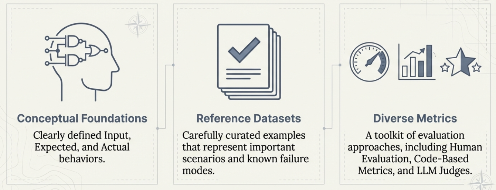
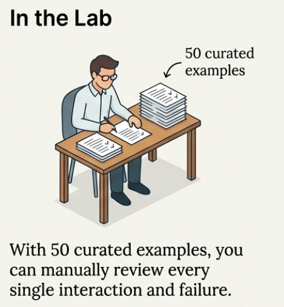
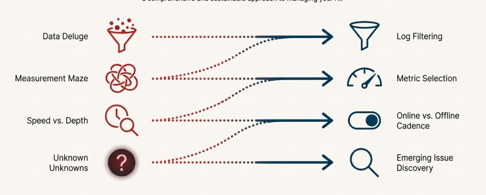

# Chapter 9: Common Misconceptions About AI Evaluation

## Clearing Up the Confusion

Now that you've worked through this complete evaluation course, you're equipped to recognize common misconceptions that trip up many teams building AI systems. This chapter addresses the most frequent misunderstandings we encounter, explaining why they're problematic and pointing you to the right approaches.

Each misconception below includes a reference to the chapters where we covered the correct approach in detail.

---

## Foundation Misconceptions

### 1. "Model evaluations (benchmarks) predict my product success"

**Why this is wrong**: Model evaluations test general capabilities on standardized tasks, but your product operates in a specific domain with unique requirements, constraints, and user behaviors. A model that scores 92% on general benchmarks might perform poorly for your insurance claims processing system if it hasn't seen domain-specific patterns.

**The reality**: Product evaluation in your specific context is what matters. You need to test how the model behaves with your data, your users, your business rules, and your risk tolerance.

**Where we covered this**: Chapter 2 explains the crucial distinction between model and product evaluations, showing why benchmark performance often fails to predict real-world success in your specific use case.

### 2. "Engineers can design evaluation metrics alone"

**Why this is wrong**: Engineers understand technical implementation but may miss domain-specific quality requirements, business risks, and subtle user expectations. What looks technically correct might be completely inappropriate for the domain.

**The reality**: Effective evaluation requires collaboration between domain experts (who understand quality), product teams (who understand user needs), and engineers (who understand technical constraints). Each brings essential perspectives.

**Where we covered this**: Chapter 3 emphasizes that evaluation is inherently collaborative and explains how different stakeholders contribute to defining quality standards and building rubrics.

### 3. "Evaluation is a one-time setup before launch"

**Why this is wrong**: This treats evaluation like traditional software testing, where you can validate everything upfront and expect it to stay valid. AI systems are non-deterministic, user behavior evolves, and business requirements change.

**The reality**: Evaluation is a continuous process that evolves with your system. You start with pre-deployment validation, then monitor in production, discover new issues, and continuously refine your evaluation approach.

**Where we covered this**: Chapter 1 explains why AI systems require ongoing evaluation, and Chapter 6 details how production monitoring differs from pre-deployment testing.

---

## Pre-Deployment Misconceptions

### 4. "I need comprehensive evaluation coverage from day one"

**Why this is wrong**: Trying to build comprehensive evaluation upfront leads to analysis paralysis and often misses the most important issues. You can't predict every failure mode, and attempting comprehensive coverage dilutes effort from high-impact scenarios.

**The reality**: Start small with 10-20 high-quality examples representing scenarios you absolutely cannot get wrong. Focus on quality over quantity and expand as you learn more about your system's behavior patterns.

**Where we covered this**: Chapter 4 walks through building reference datasets, emphasizing starting small and specific rather than trying to be comprehensive from the beginning.

### 5. "Code-based metrics aren't sophisticated enough for AI systems"

**Why this is wrong**: This assumes you need complex evaluation for complex systems. In practice, simple code-based checks often provide the most reliable signal for many important behaviors like structure validation, compliance requirements, and performance monitoring.

**The reality**: Simple code checks are fast, reliable, and easy to understand. Use them for objective, measurable properties before adding complexity with LLM judges or human evaluation.

**Where we covered this**: Chapter 5 details the three evaluation approaches, showing when code-based metrics are most effective and why they should often be your first choice.

### 6. "LLM judges are the best way to evaluate AI systems"

**Why this is wrong**: LLM judges seem appealing because they can assess subjective qualities at scale, but they're expensive, slow, and can be inconsistent or misaligned with human judgment. Uncalibrated LLM judges often create more problems than they solve.

**The reality**: LLM judges are powerful tools when properly calibrated, but they require extensive validation against human judgment. Start with simpler approaches and add LLM judges only when justified by clear value.

**Where we covered this**: Chapter 5 explains the challenges with LLM judges and emphasizes that calibration is essential for reliable results.

### 7. "If I write detailed criteria, LLM judges will work correctly"

**Why this is wrong**: Detailed criteria help, but don't guarantee that an LLM will interpret them the same way human experts would. LLMs can be overly strict, overly lenient, or miss subtle contextual cues that humans notice.

**The reality**: LLM judge calibration requires extensive testing against human evaluations across hundreds of examples, statistical analysis of agreement rates, and iterative prompt refinement. This process often takes weeks or months.

**Where we covered this**: Chapter 5 includes detailed guidance on LLM judge calibration and why detailed criteria alone are insufficient for reliable evaluation.

---

## Production Misconceptions

### 8. "I need to evaluate every production interaction"

**Why this is wrong**: At scale, evaluating every interaction is impossible and unnecessary. It would require enormous computational resources and human effort while providing diminishing returns from analyzing routine, successful interactions.

**The reality**: Smart sampling based on user signals is more effective. Focus evaluation on interactions showing concerning patterns like unusual length, retry behavior, or frustration indicators.

**Where we covered this**: Chapter 7's log filtering section explains how to identify which production data deserves attention through priority-based filtering and signal-based sampling.

### 9. "I need a sophisticated dashboard with dozens of metrics"

**Why this is wrong**: More metrics don't automatically mean better insights. Too many metrics create noise, make it hard to focus on what matters, and often lead to analysis paralysis rather than actionable improvements.

**The reality**: Focus on a minimum set of actionable metrics that drive real improvements. It's better to have 3-5 metrics that consistently guide decisions than 20 metrics that no one acts on.

**Where we covered this**: Chapter 7's metric selection section provides frameworks for choosing metrics based on impact, reliability, and cost rather than trying to measure everything.

### 10. "Online evaluation is always better than offline"

**Why this is wrong**: Online evaluation seems superior because it provides immediate feedback, but it must be fast and simple to avoid adding latency. Complex analysis that requires expensive computation or sophisticated reasoning belongs in offline evaluation.

**The reality**: Use online evaluation for business-critical guardrails that need immediate intervention. Use offline evaluation for detailed analysis, trend identification, and system improvement insights.

**Where we covered this**: Chapter 7 distinguishes between online guardrails (preventing immediate problems) and offline improvement loops (driving long-term system enhancement).

### 11. "Evals vs A/B testing - I need to pick one approach"

**Why this is wrong**: This creates a false dichotomy between two complementary approaches. Each serves different purposes and they work better together than in isolation.

**The reality**: Use evaluation metrics to monitor known patterns and behaviors you understand. Use A/B testing to discover new patterns through explicit user signals (ratings, conversions) and implicit signals (behavior changes, engagement).

**Where we covered this**: Chapter 7's emerging issue discovery section explains how user signals can reveal problems your evaluation metrics don't capture, leading to new evaluation approaches.

### 12. "Evaluation metrics are fixed once implemented"

**Why this is wrong**: This assumes your system, users, and business requirements remain static. In reality, user behavior evolves, business priorities change, and you discover new failure modes that require different evaluation approaches.

**The reality**: Metrics retire and update over time as you learn. A metric that was critical during early deployment might become less useful as your system matures. Meanwhile, new user behaviors might require entirely new metrics.

**Where we covered this**: Chapter 7's emerging issue discovery explains the continuous loop of discovering new patterns, developing new metrics, and retiring outdated approaches.

**Examples of metric evolution**:
- **Retiring**: A "response format validation" metric becomes less important as your system matures and format errors become rare
- **Adding**: A "seasonal context awareness" metric becomes important after discovering users ask different questions during holidays
- **Updating**: An "escalation accuracy" metric needs refinement after business policy changes affect when human handoffs are appropriate

---

## Why These Misconceptions Persist

Understanding why these misconceptions are common helps you avoid them:

**AI evaluation is relatively new**: Unlike traditional software testing, systematic AI evaluation is still emerging, leading to borrowed assumptions from other domains.

**Complexity creates uncertainty**: AI systems are complex, making simple approaches seem inadequate even when they're often the most effective.

**Tool marketing influences thinking**: Vendors promote sophisticated solutions that may be overkill for many practical needs.

**Success stories lack context**: Case studies often don't include the failures and iterations that led to successful evaluation approaches.

## The Right Mindset

Instead of falling into these misconceptions, approach AI evaluation with these principles:

**Start simple and evolve**: Begin with basic approaches that provide clear value, then add complexity only when justified.

**Focus on your context**: Generic solutions rarely work - everything must be tailored to your specific use case, users, and business requirements.

**Embrace collaboration**: Combine technical, domain, and business perspectives rather than trying to solve evaluation in isolation.

**Expect continuous evolution**: Build evaluation systems that can adapt as you learn more about your system and users.

**Prioritize actionable insights**: Measure things that drive real improvements rather than pursuing measurement for its own sake.

## Moving Forward

Now that you understand these common misconceptions and have worked through the complete evaluation methodology, you're equipped to build effective evaluation systems that avoid these pitfalls.

Remember: the goal isn't perfect measurement - it's building better AI systems through systematic, thoughtful evaluation that evolves with your understanding and needs.

