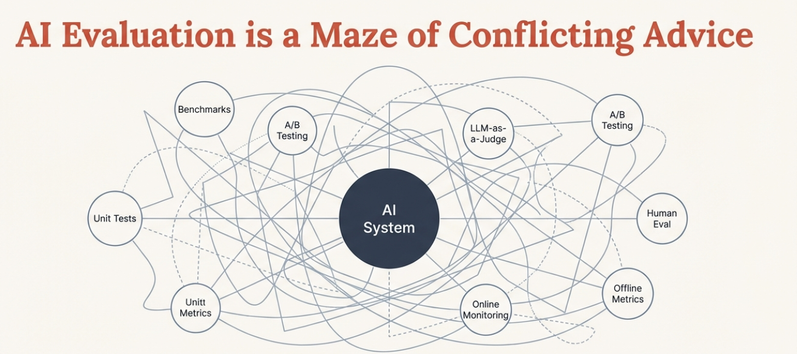
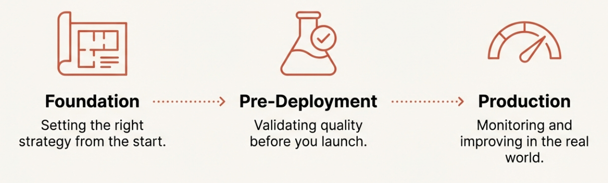
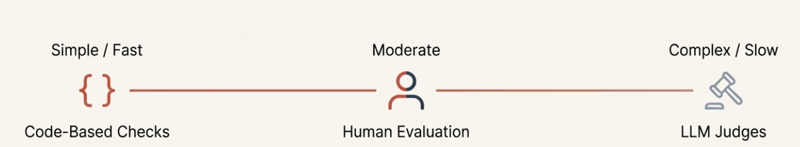
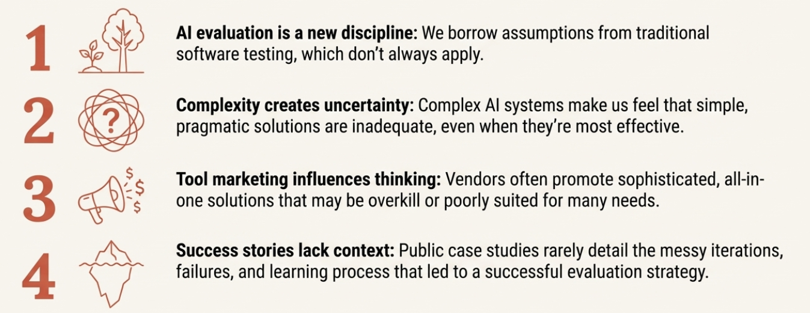
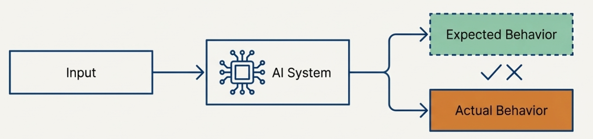

# Chapter 10: Glossary of Terms

## Making Sense of the Evaluation Vocabulary

Throughout this course, we've used specific terms to describe different aspects of AI evaluation. This glossary clarifies what we mean by each term, helping you navigate the sometimes confusing world of evaluation terminology.

---

### Evals
The catch-all term that everyone uses for everything evaluation-related, which is exactly why it causes so much confusion. Someone might say "we need better evals" and mean anything from benchmark scores to production monitoring dashboards. We intentionally avoid this term in favor of more precise language.

### Evaluation
The overall process of assessing how an AI system behaves. This includes everything from designing metrics to running tests to analyzing results. Evaluation answers the question: "Is this system behaving the way we want it to?"

### Evaluation Metrics
The specific dimensions along which system behavior is judged. These answer "what does good mean in this context?" Examples include escalation accuracy, response time, or compliance adherence. Always context-dependent and require clear rubrics.

### Expected Behavior
What your system should do in a given situation. Part of the Input-Expected-Actual framework. Often requires collaboration between domain experts and product teams to define clearly.

### Explicit Signals
Direct indicators users give about their experience, such as ratings, explicit escalation requests ("let me talk to a human"), or direct complaints. Easier to interpret than implicit signals but less common.

### Actual Behavior
What your system actually does when given specific inputs. This includes not just the final output, but intermediate steps and any actions taken.

### Benchmark
A standardized test used to measure model capabilities across different systems. Examples include MMLU, HumanEval, or GSM8K. Useful for comparing models but don't predict performance in your specific use case.

### Code-Based Metrics
Deterministic checks written in programming code that look for specific patterns or properties. Fast, reliable, and perfect for objective measurements like structure validation, required content presence, or performance monitoring.

### Guardrails
Real-time evaluation metrics that monitor business-critical behaviors and trigger immediate interventions when problems occur. These are online metrics for situations where failure would have immediate, significant business impact. Examples include safety filters or compliance checks.

### Implicit Signals
Indirect indicators of user satisfaction or system problems, revealed through user behavior rather than explicit feedback. Examples include conversation length anomalies, retry behavior, extensive editing of generated content, or abandonment patterns.

### Improvement Flywheel
The offline evaluation process that powers long-term system enhancement through trend analysis, quality assessment, and systematic investigation of issues discovered in production.

### Input
Everything that influences how your AI system behaves, including the user's request, conversation history, retrieved data, and system configuration. Part of the Input-Expected-Actual evaluation framework.

### LLM Judge
Using one language model to evaluate another model's behavior. Powerful for assessing subjective qualities like tone or appropriateness, but requires extensive calibration against human judgment to be reliable.

### Log Filtering
Systematic approaches to identify which production data deserves evaluation attention. Uses priority-based filtering and signal-based sampling since you can't review everything at scale.

### Model Evaluation
Assessment of general AI model capabilities, typically using standardized benchmarks. Helps with model selection but doesn't predict performance in your specific product context.

### Metric Selection
The process of choosing which evaluation approaches to implement based on their impact, reliability, and cost. Requires balancing value against computational and financial expenses.

### Non-Deterministic
A key characteristic of AI systems where the same input can produce different outputs across runs. This breaks traditional software testing assumptions and makes evaluation more complex but essential.

### Offline Evaluation
Evaluation that happens after interactions occur, often in batch processes. Used for trend analysis, detailed quality assessment, and system improvement insights. Allows for sophisticated, expensive analysis that would be impractical in real-time.

### Online Evaluation
Real-time evaluation that runs as interactions happen and can trigger immediate responses. Must be fast and lightweight. Used for guardrails and situations requiring immediate intervention.

### Product Evaluation
Assessment of how an AI system behaves in your specific use case, with your users, data, and business context. This is what actually matters for building successful AI products, as opposed to general model capabilities.

### Production Monitoring
Continuous evaluation of AI system performance with real users at scale. Includes log filtering, metric deployment, guardrails, and emerging issue discovery.

### Reference Dataset
A carefully chosen collection of realistic examples that represent scenarios you care most about. Includes inputs, expected behaviors, and serves as the foundation for systematic evaluation. Start small (10-20 examples) and expand based on learning.

### Rubric
Explicit criteria that define what constitutes acceptable versus unacceptable performance. Essential for making subjective evaluation consistent. Should include specific examples and edge case guidance.

### Signal-Based Sampling
Sampling production data based on implicit and explicit user signals rather than random selection. More effective for catching problems than uniform sampling across all interactions.

### Signal-Metric Divergence
When user behavior signals indicate problems but your current evaluation metrics show no issues. This pattern suggests hidden quality dimensions that your existing evaluation framework doesn't capture.

### User Evolution
The natural progression of how users interact with AI systems over time. As users become comfortable, they develop new interaction patterns, push boundaries, and use systems in increasingly sophisticated ways. This changes the distribution of inputs your system receives.

---

## Framework Concepts

### Input-Expected-Actual Framework
The conceptual foundation for thinking about AI system behavior:
- **Input**: Everything that goes into your system
- **Expected**: What should happen given your requirements
- **Actual**: What your system really does

This framework helps structure evaluation by making explicit what you're comparing.

### Guardrails vs. Improvement Flywheel
The two-tier approach to production evaluation:
- **Guardrails**: Online metrics for immediate intervention on business-critical issues
- **Improvement Flywheel**: Offline analysis for long-term system enhancement

### Discovery Loop
The continuous cycle of emerging issue discovery:
1. User signals indicate potential problems
2. Log filtering samples concerning interactions
3. Existing metrics may not capture the issues
4. Manual investigation reveals hidden problems
5. New metrics are developed
6. Updated framework catches similar issues earlier

---

## Process Terms

### Pre-Deployment Validation
The systematic evaluation work done before real users interact with your system. Includes building reference datasets, implementing metrics, and testing in controlled conditions to build confidence.

### Calibration
The process of ensuring LLM judges align with human judgment through extensive testing, comparison analysis, and iterative refinement. Often takes weeks or months and is essential for reliable automated evaluation.

### Emerging Issue Discovery
Systematic approaches to find problems your existing evaluation framework doesn't capture. Uses signal-metric divergence analysis and manual investigation to evolve evaluation as new failure modes emerge.

---

## Common Anti-Patterns (What NOT to Do)

### Evaluation Drift
When your evaluation metrics become disconnected from actual user needs or business goals. Happens when you measure things because they're easy to measure rather than because they matter.

### Metric Overload
Having too many evaluation metrics, making it impossible to focus on what actually drives improvements. More metrics don't automatically mean better insights.

### Calibration Neglect
Deploying LLM judges without proper validation against human judgment, leading to evaluation that's worse than having no evaluation at all.

### Coverage Obsession
Trying to evaluate everything comprehensively rather than focusing on high-impact scenarios. Leads to analysis paralysis and diluted effort.

---

## Key Principles

Throughout this course, we've emphasized these core principles:

**Context is King**: Everything must be tailored to your specific use case, users, and business requirements. Generic approaches rarely work.

**Start Simple, Evolve**: Begin with basic approaches and add complexity only when justified by clear value.

**Collaboration is Essential**: Combine technical, domain, and business perspectives rather than trying to solve evaluation in isolation.

**Continuous Learning**: Evaluation systems must adapt as you discover new failure modes and as user behavior evolves.

**Action Over Measurement**: The goal is better AI systems, not perfect measurement. Focus on evaluation that drives real improvements.

---

## Using This Glossary

This glossary reflects the specific way we use these terms in this course. You might encounter different definitions elsewhere - the AI evaluation field is still developing standard terminology. When working with others, it's always worth clarifying what specific terms mean in your context.

Remember: the vocabulary matters less than the underlying concepts. Focus on building systematic, thoughtful evaluation that helps you create better AI systems for your users.

**Ready to get certified?** You've completed all 10 chapters of this AI evaluation course! **[Take the certification assessment now](https://ai-evals-course-website-2025.vercel.app/quiz-google.html)** to earn your AI Evals for Everyone certificate and test your knowledge.

---

**Want to go deeper?** While this course covers evaluation fundamentals, building production-ready AI systems requires understanding enterprise patterns, agentic designs, and advanced implementation strategies. For comprehensive guidance on enterprise AI development, check out our **[#1 rated Enterprise AI Cohort on Maven](https://maven.com/aishwarya-kiriti/genai-system-design)** taken by product and engineering leaders and practitioners at Meta, Amazon, Google, Apple and more!

*📝 Note: Use code **GITHUB15** for 15% off the Enterprise AI Cohort (valid until January 15th, 2025)*

