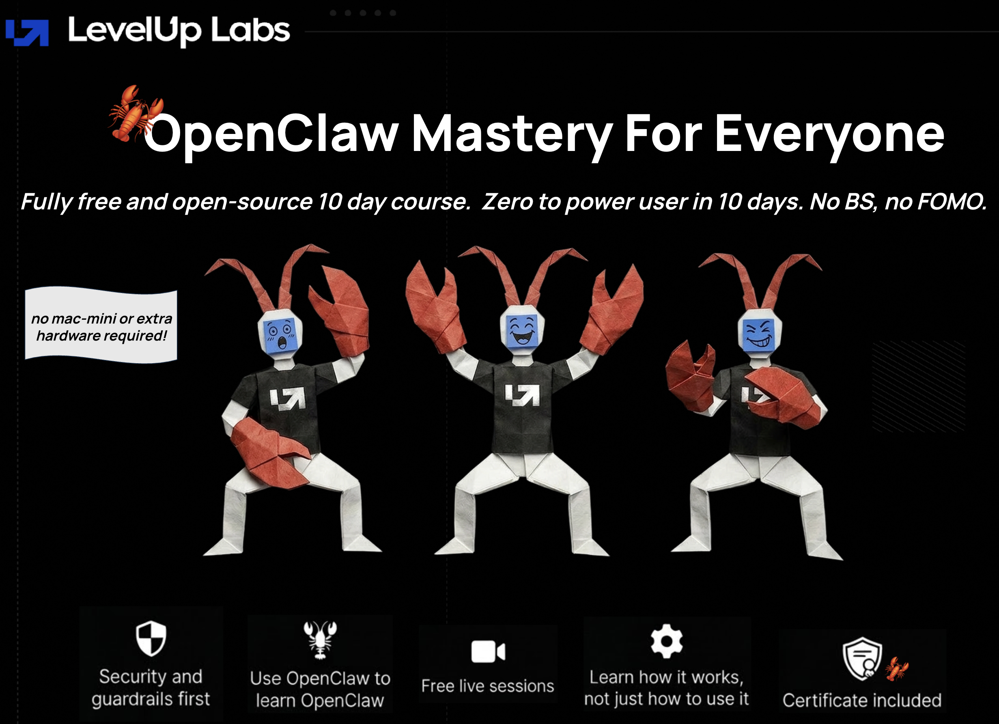
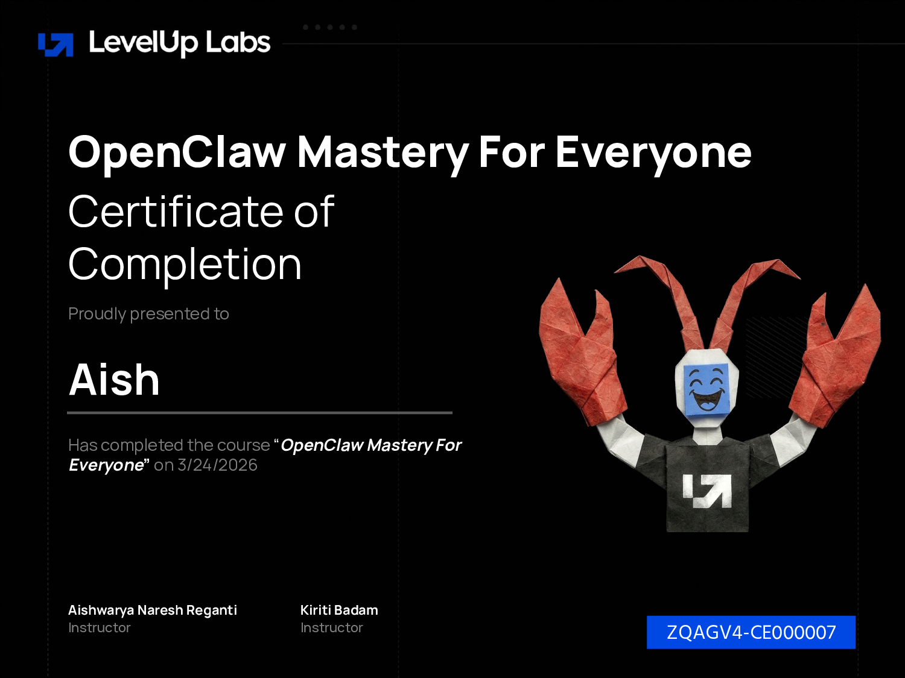

# 🦞 OpenClaw Mastery for Everyone

*Created by [Aishwarya Reganti](https://www.linkedin.com/in/areganti/) & [Kiriti Badam](https://www.linkedin.com/in/sai-kiriti-badam/)*

---

You've probably seen OpenClaw all over the internet: on social media, YouTube, Reddit, tech blogs. Someone has it connected to their email, their calendar, their WhatsApp, with sub-agents running in parallel and automated workflows firing throughout the day. You follow along, set it all up in an afternoon, and hit your first bug. That bug leads to another. Three hours in, you are debugging a system you do not understand.

This course fixes that.

- **10 days, one capability at a time.** No information overload. You add one thing each day and understand it before moving on.
- **20 minutes per day.** Short enough to fit into a morning coffee or a lunch break.
- **A fully working setup, no hardware required.** By the end, you'll have a personal AI assistant running 24/7 on a $20/month VPS and your favorite model provider like OpenAI, Anthropic, or Google. No separate laptop, no Mac mini, no dedicated hardware.
- **Use OpenClaw to learn OpenClaw.** We've set up the course so that your Claw reads the course files and builds itself in the same order you learn the concepts. You'll understand as you navigate through the course.

&nbsp;

## 🎓 Get Certified

Everyone who completes the course can earn a certificate. The assessment has a few questions to check your understanding of OpenClaw, plus an optional question where your Claw verifies your hands-on setup and generates a unique code to certify you.

Take the assessment here: [OpenClaw Mastery Assessment](https://docs.google.com/forms/d/e/1FAIpQLSeoR5wfheIkD0hCaf3eYmJ6s8aNMbylfJ00hi6djlkpIuF1FA/viewform)

🎁 Score 10/10 and attend one of our live sessions? You could walk away with a Mac mini.

---

## 💡 How It Works

- **Two files per day.** `learn.md` is the theory: what you're building, why it matters, and how it works under the hood. `build.md` is the hands-on guide you follow to actually set it up. Read the learn, then do the build.
- **Your Claw builds itself.** Each build includes prompts you paste into the web chat. Those prompts point your Claw to `claw-instructions` files in this repo, and it takes over from there: reading the steps, running the commands, configuring itself, and reporting back to you. You do not need to open those files yourself (though you can if you're curious). Your job is to answer a few questions, confirm a few decisions, and watch your Claw do the rest.
- **Transferable knowledge.** Identity files, tool permissions, approval gates, agent delegation, scheduled automation: these concepts apply across personal AI assistants, with OpenClaw as the concrete example.

---

## 📚 Course Days

| Day | What You Build |
|-----|----------------|
| [Day 1: Install and Secure Your Lobster](days/day-01-install-secure/learn.md) | A running, hardened OpenClaw instance with its own name |
| [Day 2: Make It Personal](days/day-02-give-it-a-soul/learn.md) | Four identity files that define your Claw's personality, context, rules, and memory |
| [Day 3: Connect a Channel](days/day-03-connect-a-channel/learn.md) | Telegram connected so you can text your Claw from your phone |
| [Day 4: Make It Proactive](days/day-04-make-it-proactive/learn.md) | An evening reflection delivered to your phone on a schedule, without you asking |
| [Day 5: Give It Skills](days/day-05-give-it-skills/learn.md) | Your first skill installed from ClawHub, plus a custom one you write yourself |
| [Day 6: Tame Your Inbox](days/day-06-tame-your-inbox/learn.md) | Gmail connected, email triage with injection protection |
| [Day 7: Make It Research](days/day-07-make-it-research/learn.md) | Web search and browser automation for deep research on your behalf |
| [Day 8: Let It Write](days/day-08-let-it-write/learn.md) | Email sending with approval gates and a follow-up email skill |
| [Day 9: Give It a Team](days/day-09-give-it-a-team/learn.md) | A specialist writer agent, agent-to-agent communication, and delegation |
| [Day 10: What Comes Next](days/day-10-what-comes-next/learn.md) | Full verification, assessment, and where to go from here |

---

## 🏆 What You Walk Away With

- **Morning summary on your phone every day** with email highlights and anything else you configure
- **Inbox triaged automatically**: urgent items flagged, everything else categorized and summarized
- **Research on demand**: your Claw searches the web, reads full pages, and gives you a synthesized brief
- **Email sending with approval gates**: your Claw composes, you confirm, it sends
- **A specialist writer agent** that drafts long-form content in a voice you define
- **Everything running 24/7** on a VPS you control, with your data staying yours

---

## 🚀 Who This Course Is For

- **Anyone curious about OpenClaw** who wants a structured path instead of scattered YouTube tutorials
- **Non-technical users** who want a personal AI assistant running on their own server
- **Developers and power users** who want to understand the architecture before building on top of it
- **Teams evaluating OpenClaw** who need one person to go deep and report back

Zero prior experience with servers, Docker, or AI agents required.

---

## 🛠️ What You Need to Start

- An API key from your preferred AI provider ([here's how to get one](getting-your-api-key.md))
- A Hostinger VPS: deploy the one-click OpenClaw template and Day 1 walks you through it

---

## 🗓️ Live Sessions

We're running two live sessions for this course. We'll go over the same workflows, answer common questions, and build on top of what the course covers.

- **Session 1:** [April 10, 2026, 9:30 AM Pacific](https://maven.com/p/ddf4e5/open-claw-mastery-for-everyone-open-house)
- **Session 2:** [April 19, 2026, 9:00 AM Pacific](https://maven.com/p/da9448/open-claw-mastery-for-everyone-open-house)

🎁 One lucky participant who scores 10/10 on the [certification assessment](https://docs.google.com/forms/d/e/1FAIpQLSeoR5wfheIkD0hCaf3eYmJ6s8aNMbylfJ00hi6djlkpIuF1FA/viewform) will be called out during the live session. If they're attending live, they'll walk away with a Mac mini.

---

## ❓ FAQ

Have questions about hardware requirements, certification, security, costs, or how the AI-first approach works? Check the [Frequently Asked Questions](FAQ.md).

---

## 🔗 Resources

Check out our [Best OpenClaw Resources by Category](best-openclaw-resources.md) for use cases, community content, and the best guides we found on getting more out of OpenClaw.

---

## 🎯 Our Other Courses

### Free

- **[AI Evals for Everyone](https://github.com/aishwaryanr/awesome-generative-ai-guide/tree/main/free_courses/ai_evals_for_everyone)**: a 10-chapter course on building AI evaluation systems. Includes certification.
- **[Agentic AI Crash Course](https://github.com/aishwaryanr/awesome-generative-ai-guide/tree/main/free_courses/agentic_ai_crash_course)**: foundational and advanced concepts in agentic AI, from basic principles to enterprise implementations.

### On Maven

- **[#1 Rated Enterprise AI Course](https://maven.com/aishwarya-kiriti/genai-system-design)**: new to AI? Start here. A comprehensive program for building enterprise AI systems from scratch.
- **[Advanced Evals Course](https://maven.com/aishwarya-kiriti/evals-problem-first)**: already building AI? Systematically improve your AI products through advanced evaluation techniques.

---

## 💬 Share the Love

If you loved the course, please share it! Tag [Aishwarya](https://www.linkedin.com/in/areganti/), [Kiriti](https://www.linkedin.com/in/sai-kiriti-badam/), and [LevelUp Labs](https://www.linkedin.com/company/levelup-labs-ai/) on LinkedIn and let us know how much you scored. It truly makes our day.

---

## 📄 License

All content, images, and diagrams in this course are owned by [LevelUp Labs](https://levelup-labs.ai). This course is free and open source. You are welcome to use, share, and build on it, but please credit LevelUp Labs and link back to this repository if you do.

---

Happy Learning! 🦞
