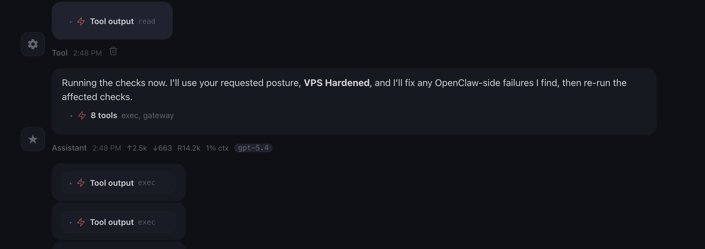

# Day 1 Build: Install and Secure OpenClaw

This is the build guide for Day 1. The first half walks you through deploying OpenClaw on Hostinger. The second half is a conversation with your Claw through the web chat, where you ask it to verify and harden its own security.

---

## Phase 1: Deploy on Hostinger

### Create a Hostinger Account and Start OpenClaw on a VPS

If you don't already have an API key for one of the LLMs, follow [this guide](../../getting-your-api-key.md) to get one.

Click [here](https://levelup-labs.ai/HOSTINGER-OPENCLAW) and follow along the video below to create a Hostinger account, create a VPS, and run OpenClaw.

Once you see a response on the chat window, your Claw is live. The rest of Day 1 happens through this web chat.

---

## Phase 2: Security Verification

Everything from here forward is a conversation with your Claw. You paste one message into the web chat, and the Claw walks through the entire security verification on its own.

### Step 4: Run the Security Verification

Copy and paste the following message into the web chat:

> Read `https://raw.githubusercontent.com/aishwaryanr/awesome-generative-ai-guide/main/free_courses/openclaw_mastery_for_everyone/days/day-01-install-secure/claw-instructions-security.md` and follow every step. Report the result of each check and fix anything that fails.

[`claw-instructions-security.md`](./claw-instructions-security.md) contains 10 checks covering the OS, open ports, firewall, OpenClaw's security audit, gateway configuration, file permissions, channels, web search, the heartbeat, and a final restart. Each check includes the expected result and an explanation of why it matters, so you can follow along as the Claw works through it.

While it runs, you will see progress blocks like this in the chat. That is your Claw executing tools, fixing what it can, and then checking the result again.

When it finishes, you should see a summary with each item marked as PASS, FAIL, or EXPECTED. If anything is marked FAIL, ask the Claw to fix it and re-run that check.

You can also open [`claw-instructions-security.md`](./claw-instructions-security.md) yourself to read through the checks and expected results at your own pace.

---

### Step 5: Name Your Claw

Your Claw will ask for your name, and it will ask you to name it. You can call it Claw, or call it whatever you want. The name persists across all future sessions.

It may also ask a few more setup questions. You can answer them now if you like, or you can skip them and wait for tomorrow. On Day 2, we go through the identity files explicitly: `SOUL.md`, `USER.md`, `AGENTS.md`, and `MEMORY.md`. Everything it is asking about gets covered there.

### One Quick Win

Once the audit is done, try this:

> Explain my setup in plain English, briefly: what machine are you running on, what is locked down, what is exposed, and what is intentionally disabled right now?

This makes the setup legible. You see, in plain English, what is running, what has been secured, and what features are still intentionally off (for now).

---

## What Should Be True After Day 1

- [ ] Claw responds in the web chat
- [ ] `openclaw security audit` shows no critical failures
- [ ] Gateway bound to `127.0.0.1` with token auth enabled
- [ ] DM and group policies are restrictive (either explicitly set or using safe defaults)
- [ ] `~/.openclaw/credentials` has permissions `700`
- [ ] Heartbeat set to `0m`
- [ ] No channels have stored credentials yet
- [ ] Web search is disabled
- [ ] Claw has a name

If all of these are true, Day 1 is complete.

---

## Troubleshooting

**Claw does not respond in the web chat**
The gateway may need a restart. Go to your Hostinger dashboard and restart the VPS, or wait a minute and try again.

**Security audit shows failures after the Claw tried to fix them**
Some fixes require a gateway restart before they take effect. Ask the Claw to restart with `openclaw gateway restart` and re-run the audit.

**Claw gives generic responses and does not run the checks**
It may not have access to [`claw-instructions-security.md`](./claw-instructions-security.md). Try pasting the contents of the file directly into the web chat instead.

**Firewall shows as FAIL**
This is expected inside a Docker container. Hostinger manages the firewall at the host level. The Claw cannot install or configure firewall tools inside the container, and it does not need to.

**Port on 0.0.0.0 in the 60000+ range**
This is the Control UI port that Hostinger's proxy uses to reach your Claw. It is expected and safe. The only port to worry about is `18789` (the gateway), which should be on `127.0.0.1`.

**Claw asks about risk posture**
Choose **VPS Hardened**. This gives you deny-by-default settings and the tightest configuration. We loosen specific settings intentionally on later days as we add capabilities.

---

[← Back to Course Overview](../../README.md) | [Day 2: Make It Personal →](../day-02-give-it-a-soul/learn.md)
