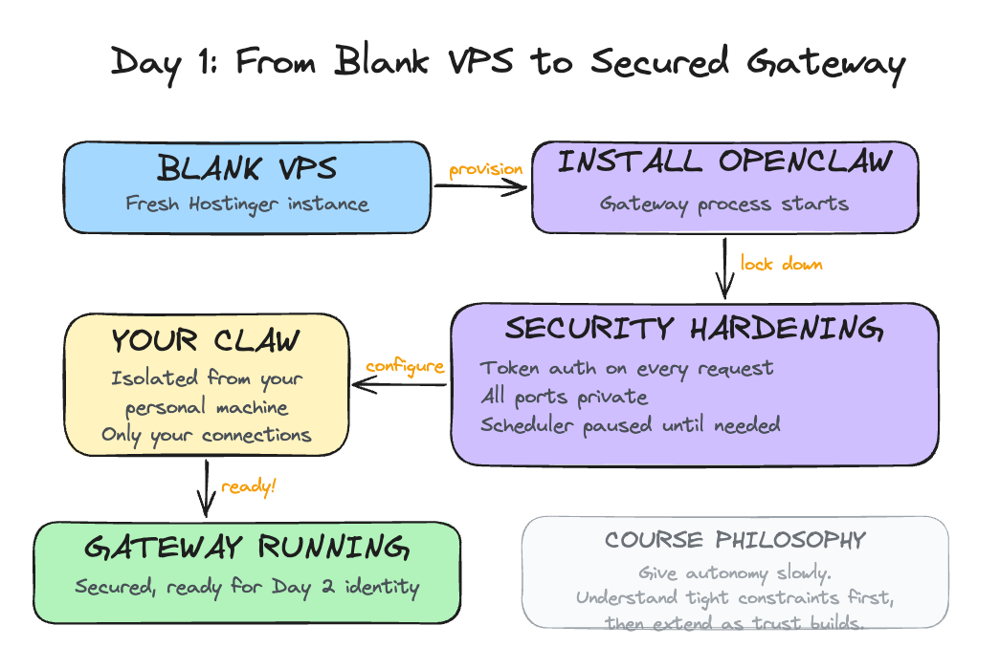

# Day 1: Install and Secure Your Lobster

---

**What you'll learn today:**
- The three eras of AI tools and where OpenClaw sits
- Why texting an agent from your phone changed how people actually use it
- What the community learned the hard way about security, and the approach this course takes to keep you safe

**What you'll build today:** By the end of today, your Claw is running on a dedicated server with its own name, security verified and locked down so only you can access it, and ready to receive an identity on Day 2.

---

## The Wave That Held

The pace of AI tools is fast. A new project gets shared for a week, and the next thing arrives. The AI community has gotten used to this rhythm.

[OpenClaw](https://openclaw.ai/) broke that pattern. It launched in late 2025 and the attention never dropped off. GitHub stars kept climbing for months. The community kept growing. People who normally move on to the next thing were still building with it a year later.

You've probably seen it on your LinkedIn, X, or Instagram feed: someone's morning brief landing in their Telegram before they get out of bed, an inbox cleared while they were asleep, a research digest ready before a meeting they forgot to prepare for. These are real workflows people are running today.

What made it stick was two things working together: the agent kept running while you were away, and you could reach it from wherever you were. That combination unlocked use cases that no previous tool had supported, and people found those use cases quickly. For the first time, the AI was doing useful work while you were asleep, commuting, or just not thinking about it.

---

## Three Eras

To understand where OpenClaw sits, it helps to see the arc of where things came from.

**Era 1: Chat (2023)**

ChatGPT was the defining moment. You could have a real conversation with an AI for the first time, and the results were immediately useful.

The underlying constraint was statelessness: every conversation started from zero. You brought your context with you each time, pasting in the email thread, re-explaining who the client was, reminding the model what you decided last week. The AI was capable, and you were doing all the work to make it useful across sessions.

**Era 2: Agent harnesses (2024-2025)**

The next leap was the ability to take actions. Models could now decide to use external tools as part of answering a request: run a search, execute code, call an API, write a file. This enabled multi-step tasks. You describe a goal, the agent reasons about what steps to take, executes them in sequence, and reports back.

Tools like Claude Code, Cursor, and Codex belong to this generation. They can write code, run it, catch the error, fix it, and iterate. Genuinely powerful, responsible for real productivity shifts.

The session model stayed the same. You open the tool, the session starts, you get output, the session ends. The agent only exists while the tab is open.

It checks something at 3pm Thursday only if you're there to invoke it. It sends you something while you're asleep only if you left it running. The moment you close the tab, it stops.

**Era 3: Proactive assistants (2025-present)**

OpenClaw introduced a third pattern: an agent that runs continuously on its own, and one you can reach from your phone.

The gateway (OpenClaw's always-running background process) starts when the machine starts and keeps running. It runs a task at 2am and holds the output for you. It notices something worth your attention and sends it to you before you ask. And because it connects to messaging apps like Telegram and WhatsApp, you can talk to it from anywhere: walking between meetings, lying in bed at 11pm when a thought surfaces, waiting for coffee. A phone is all you need.

That last part matters more than it sounds. The number of steps between having a thought and acting on it determines whether a tool actually gets used. Texting an agent from your phone is categorically different from opening a browser, navigating to a chat interface, and typing. You invoke the agent while walking, while half-asleep, while waiting in line. Over time, that changes what the tool becomes to you.

Throughout this course, we call your OpenClaw instance your **Claw**. By the end of Day 1, your Claw is running. By Day 10, it's something you rely on without thinking about it. The name helps: it makes the agent feel like yours, something personal you built and shaped.

---

## What Made It Click

The always-on nature and the messaging integration together produced something new: an agent you interact with without thinking about it.

The open source model added momentum. Because anyone could build on it and publish what they built, a community of extensions grew around OpenClaw. These extensions are called **skills**: small packages that give your agent a new capability, like reading your email, searching the web, or syncing with your calendar.

Skills are installed through a marketplace called **ClawHub**. By early 2026, tens of thousands of skills existed covering everything from Google Workspace to home automation to financial monitoring.

OpenClaw also supported multiple AI providers from the start: Anthropic (Claude), OpenAI (GPT), Google (Gemini), DeepSeek, and local models. You pick the model you want and swap it later.

NVIDIA released their own take on this architecture in March 2026: **NemoClaw**, an open-source layer that installs on top of OpenClaw and adds enterprise-grade security through a sandboxed runtime called OpenShell. It ships with NVIDIA's Nemotron models and is hardware-agnostic. It's in early alpha and still maturing. We'll revisit it when it's further along.

---

## Why Security Comes First

Here's the tension at the center of all of this: the features that make OpenClaw genuinely useful are the same features that create real risk.

An agent that runs continuously and can take actions on your behalf, read your email, update your calendar, send messages, and modify files, has a much larger attack surface than a tool you open and close. And the community's experience over the past year has been a clear illustration of what happens when capability runs ahead of guardrails.

The incidents that showed up across the community fell into a few patterns.

**Uncontrolled actions with good intentions.** Agents configured to help with email would occasionally take actions beyond what the user had approved, because an approval instruction had been dropped from the context.

OpenClaw compresses older parts of long conversations to manage memory. When a standing instruction like "ask before deleting" gets compressed away, the agent continues operating as if the instruction were gone. The resulting errors (emails sent, files deleted, calendar events modified) were the expected behavior of a system that had lost its constraints.

**Supply chain attacks through the skill marketplace.** Because anyone can publish a skill to ClawHub, attackers published malicious skills designed to look like legitimate popular ones. A skill that appears to sync your calendar can also exfiltrate your API keys, because it runs inside the same environment as everything else. Thousands of these were found in the marketplace, using professional-looking documentation to appear credible.

**Prompt injection through connected systems.** Once your agent reads email, anyone who sends you an email can potentially include instructions that the agent will follow. This has already happened in practice: agents have been observed summarizing emails and then executing instructions embedded inside those emails, all before the user ever opened the message. We will cover this in depth when we connect email on a later day.

**The course approach**

This course is designed around a specific response to each of these patterns.

You start on a **VPS** (Virtual Private Server): a remote computer you rent that stays on 24/7. Think of it as a dedicated machine in the cloud that runs your Claw while your laptop is closed. It is completely isolated from your personal machine and work credentials. If something goes wrong, it stays contained there.

Hostinger offers a one-click OpenClaw template that handles everything: the server, the installation, the gateway, and the API key configuration. You pick your plan, click deploy, and within minutes your Claw is running and reachable through a web chat right in your browser. No Mac mini or external hardware required. No SSH. No terminal commands.

We have used Mac minis for our own setups. They are useful, but they are not required, especially when you are starting out. There is a lot of hype around dedicated hardware for OpenClaw, and most of it jumps ahead of what actually matters. For about $25 a month on Hostinger, you get a fully working setup that lets you learn how OpenClaw operates without buying anything. Once you are comfortable and feel like you want something running locally, you can always set up a Mac mini later. It is straightforward at that point. Start here first.

Once it is running, your first job is to verify the security. That is what the build covers.

Capabilities get added one at a time, with a clear understanding of what each one does before it is turned on. Email comes as read-only access before write access ever exists. Calendar reads before calendar writes.

Every action that modifies something external goes through an explicit confirmation step. You see what the agent plans to do and approve it before it runs. Skills get inspected before they get installed.

The operating philosophy throughout this course: give autonomy slowly. Understand how the agent operates under tight constraints first, then extend those constraints as trust builds.

By Day 10, you'll have a capable system and a clear mental model of exactly what it does on its own and where it asks for your approval. That combination is what makes it something you can actually rely on.

---

## Ready to Build?

Now that you have a picture of what OpenClaw is, why it took off, and why the security setup comes first, it's time to get your hands on it.

The build walks you through deploying on Hostinger and then verifying the security of your setup. You will ask your Claw to audit itself: check the OS, the open ports, the firewall, and the OpenClaw security settings. By the end, you will have a verified, hardened gateway and a Claw with a name.

Open [`build.md`](build.md) and follow the steps. The first half walks you through the Hostinger interface. The second half is a conversation with your Claw, where you ask it to verify its own security.

Tomorrow you give it an identity: four files that turn a running process into something that actually knows you.

---

## Go Deeper

- Oasis Security's ClawJacked disclosure and Giskard's prompt injection research are worth reading before Day 6 if you want to understand the email security risk in technical detail. Search for "ClawJacked Oasis Security" and "Giskard prompt injection LLM agents" to find the latest versions of both.
- For deeper machine-level isolation: a dedicated OS user account for OpenClaw with restricted permissions (read/write only to its own directory), combined with a reverse proxy (nginx or Caddy) handling TLS termination before requests reach the gateway.
- [Tailscale](https://tailscale.com) offers a different security model entirely: run the VPS inside a private Tailscale network that only your devices can reach. All ports stay private, fully shielded from outside scans.

---

[← Back to Course Overview](../../README.md) | [Day 2: Make It Personal →](../day-02-give-it-a-soul/learn.md)
