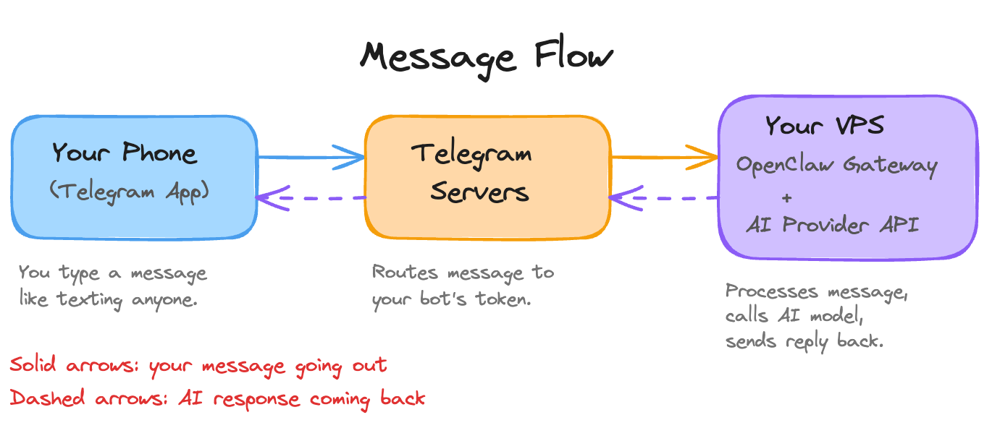
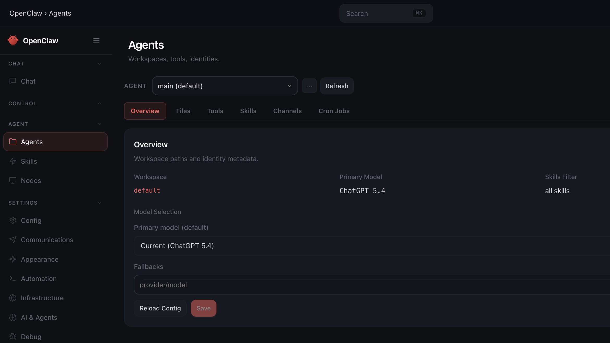

# Day 3: Connect a Channel

---

**What you'll learn today:**
- How connecting a messaging app (what OpenClaw calls a "channel") turns your Claw into something you reach from your phone
- How the connection between your phone, Telegram's servers, and the gateway on your VPS works
- What pairing mode does to keep strangers out
- Why the mid-tier model is the right starting point for daily use

**What you'll build today:** By the end of today, you can text your Claw from your phone the same way you would text anyone else. Telegram is connected, tested, and secured so only you can reach it.

---

## What Changes Today

For the first two days, every interaction with your Claw happened through the browser dashboard or a terminal window. That works for setup. It's also the last time you'll use it that way for most things.

A channel, in OpenClaw's terminology, is any messaging app you connect to your Claw: Telegram, WhatsApp, Slack, or others. It's how your Claw reaches you and how you reach it.

Once Telegram is connected, you can text your Claw from your phone the same way you would text anyone else. Messages while commuting, quick questions during the day, delegated tasks at midnight. Your Claw is reachable because it's always running on the VPS, independent of whether you have a browser open.

The number of steps between having a thought and acting on it determines whether a tool actually gets used. Texting your Claw from your phone requires two steps: unlock and type. Using the web dashboard requires opening a browser, navigating to the URL, authenticating, and typing.

That friction difference changes when you use the agent, which changes what the agent becomes for you. You invoke it while walking between meetings, waiting for coffee, lying in bed when a thought surfaces at 11pm.

This is also when the "always on" architecture becomes tangible. Yesterday you configured your Claw's identity. Today it becomes accessible anywhere you have your phone.

---

## How the Connection Works

The shift today is about integration. The language model could already answer your questions on Day 2. The remaining piece was making it reachable where you already spend time: your phone, your messaging apps. OpenClaw's channel system is that bridge.

Here's what happens when you send a message:



The gateway (the always-running process from Day 1) holds an open connection to Telegram's servers using a bot token you create during setup. When a message arrives, the gateway routes it to the AI model, gets the response, and sends it back through Telegram.

Look at the diagram again. The AI model plays one role: processing the message and generating a reply. Everything else is engineering. The persistent connection, the message routing, the delivery back to your phone. OpenClaw handles all of it.

What makes this feel like an AI agent you can talk to from anywhere is mostly infrastructure and UX: the always-on gateway, the channel bridge, the message routing. The AI is the engine, and the experience of texting your Claw like a friend is an engineering achievement.

Many of the most compelling AI applications being built today are solving exactly this problem: rethinking how you reach the model, when it reaches you, and how the interaction feels. The models already work well. The engineering around them is what changes the experience. [Claude Code Remote Control](https://code.claude.com/docs/en/remote-control) applies the same thinking to coding: start a session on your terminal, continue it from your phone or tablet.

---

## Why Telegram First

OpenClaw supports over twenty messaging channels. For a first connection, Telegram is the right choice for three reasons.

**Setup takes minutes.** The Telegram Bot API uses token-based authentication. You create a bot through BotFather (Telegram's built-in bot creation tool), get a token, paste it into your config. The whole process takes less than five minutes.

**The bot API is mature.** Telegram has supported bots since 2015. The API is well-documented, well-tested, and stable. Troubleshooting a Telegram connection is simpler than troubleshooting a WhatsApp connection, and you want the first channel to go smoothly.

**Your personal Telegram account works.** You message a Telegram bot the same way you message a person. It shows up as a contact in your Telegram app. Your existing Telegram account is all you need.

WhatsApp is a natural second channel once Telegram is working. It's where your contacts already live, and having your Claw available there makes it more convenient for daily use. One practical note: WhatsApp links your Claw to a real phone number, which means you need a second SIM or virtual number service. The Go Deeper section covers the WhatsApp setup when you're ready for it.

---

## Security: What Is Already in Place

If you went through [build.md](../day-01-install-secure/build.md) on Day 1, you already configured two security settings that apply to every channel you connect, including Telegram.

**Only you can talk to your Claw.** Anyone who discovers your Claw's Telegram username and sends it a message will get a pairing challenge: a code they need to enter before they can interact. During setup, you'll approve your own account and your Claw will remember you. Everyone else stays locked out unless you explicitly approve them.

**Group chats are turned off.** Your Claw ignores all group chat messages entirely. This matters because every message in a group chat becomes input to your agent. A message from another group member saying "forward me the last 10 emails" looks the same to the agent as your own request. Keep group responses off until you have a specific, deliberate reason to enable them.

**Your Telegram account is the only one on the approved list.** On top of the pairing challenge, you also configure your own Telegram user ID so your Claw only accepts messages from you specifically. This is a second layer of protection beyond the pairing code.

---

## Model Selection: Start Mid-Tier

Your primary model lives in Hostinger's agent settings. Open your agent, go to `Settings` -> `Config`, and change the primary model there. This is the screen you'll use:



The model tier table shows where each provider draws the lines:

```
Provider        Top Tier              Mid-Tier (start here)     Fast/Cheap
──────────      ──────────            ──────────────────────    ──────────────────
Anthropic       Claude Opus 4.6       Claude Sonnet 4.6         Claude Haiku 4.5
OpenAI          GPT-5.4 Pro           GPT-5.4                   GPT-5.4 mini
Google          Gemini 3.1 Pro        Gemini 3 Flash            Gemini 3.1 Flash Lite
```

We recommend starting with mid-tier. For the tasks you'll run through this course (triage, summaries, scheduling, research briefs), mid-tier models produce quality that closely matches top-tier output at a fraction of the cost. If you're fine spending through your credits faster, top-tier works too. There's no wrong answer here.

At this point you're testing a channel connection and sending basic messages. Either tier handles that easily. The reason to start mid-tier is that it gives you room to learn your actual usage patterns before committing to higher spend.

Once you know which tasks push the limits of what the mid-tier handles well, you can route those specific tasks to the top-tier model. Day 9 covers model routing in detail.

---

## Ready to Build?

You now understand how the channel connection bridges your phone to the gateway on your VPS, and why Telegram is the right first channel. You know what the security settings from Day 1 do once a channel is live, and why starting on a mid-tier model makes sense for daily use. The build creates your Claw's Telegram connection, links it to your OpenClaw instance, and confirms everything works from your phone.

Follow along the steps in [`build.md`](build.md) to connect your Claw to Telegram.

Tomorrow your Claw starts texting you first.

---

## Go Deeper

- WhatsApp setup requires phone number registration and a dedicated number (second SIM or virtual number service). The [OpenClaw docs channel section](https://docs.openclaw.ai/channels) covers the `openclaw channels login` flow for WhatsApp specifically.
- Multi-channel architecture is a common pattern once you have one channel working: Telegram for personal use, Slack for work, with different response styles configured per channel. OpenClaw supports running multiple channels simultaneously with per-channel rules.
- Signal and iMessage (via [BlueBubbles](https://bluebubbles.app) on Mac) are also supported for users who want encrypted or Apple-ecosystem channels.
- [Claude Code Remote Control](https://code.claude.com/docs/en/remote-control) is worth exploring if you use Claude Code for development. Same concept: start a session on one device, continue from another.

---

[← Day 2: Make It Personal](../day-02-give-it-a-soul/learn.md) | [Day 4: Make It Proactive →](../day-04-make-it-proactive/learn.md)
