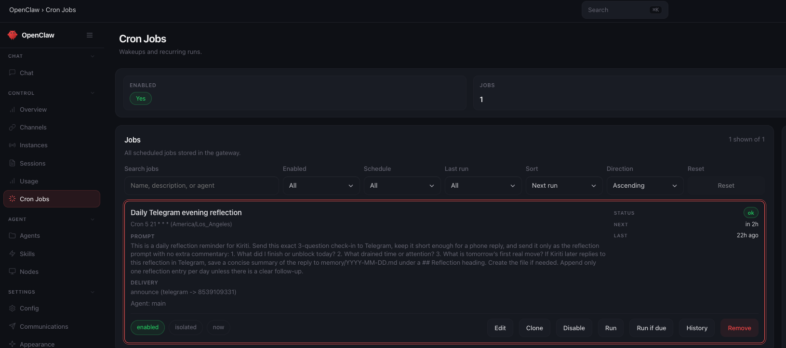

# Day 4 Build: Make It Proactive

This is the user-facing guide for Day 4. Today you schedule a daily reflection so your Claw messages you first, at the exact time you choose.

The operational steps live in [`claw-instructions-create-daily-reflection-cron.md`](./claw-instructions-create-daily-reflection-cron.md). This file is for you. The instruction file is for your Claw.

---

## What You Need Before Starting

- Day 1 complete: OpenClaw installed and secured
- Day 2 complete: identity files created and loading correctly
- Day 3 complete: Telegram connected and working
- Access to your Claw through the web chat
- Telegram on your phone

---

## Step 1: Start the Setup in Web Chat

Copy and paste the following message into the web chat:

> Read `https://raw.githubusercontent.com/aishwaryanr/awesome-generative-ai-guide/main/free_courses/openclaw_mastery_for_everyone/days/day-04-make-it-proactive/claw-instructions-create-daily-reflection-cron.md` and follow every step. Ask me only for the decisions you still need, create the cron job, and stop when you're done.

[`claw-instructions-create-daily-reflection-cron.md`](./claw-instructions-create-daily-reflection-cron.md) tells the Claw to:

- reuse the context it already knows about you
- propose a few reflection-question options instead of making you start from scratch
- create a recurring cron job at your chosen time
- bind that job to the current session
- deliver the reflection explicitly to Telegram

At a high level, here is what you are doing:

- choose when you want the reflection to arrive
- pick the version of the reflection that feels most useful
- let the Claw schedule it as a recurring cron job
- see exactly how it is configured

This is the first day your Claw reaches out on its own, on a real schedule.

---

## What the Claw Should Ask You For

Keep this simple. The Claw should mainly need two decisions from you:

- what time you want the reflection
- which reflection option you want

It should reuse the timezone and other context if it already has them, then create the cron job for you.

---

## What You Should See

Once the cron job is created, the Claw should clearly tell you what it set up: the schedule, timezone, session target, and Telegram destination.

If you want to inspect or run it manually, you can also use the `Cron Jobs` tab in Hostinger:



If anything feels unclear while this is happening, ask your Claw in the web chat and let it keep guiding the setup.

---

## Validate It

This should be simpler than the quick wins. Ask your Claw in the web chat:

```text
Tell me the cron job you just created: the schedule, timezone, session target, and where it delivers.
```

The answer should clearly name the daily time, your timezone, the session binding, and the Telegram destination.

---

## Quick Win

Now that your Claw can reach out first, shape that behavior into something you will actually want to receive.

```text
Based on what you know about me so far, suggest one other exact-time cron job worth adding next. Keep it lightweight and useful.
```

This is where your Claw stops feeling like a chat window and starts feeling scheduled into your day.

---

## What Should Be True After Day 4

- [ ] A recurring cron job exists for the daily reflection
- [ ] The schedule matches your chosen daily time
- [ ] The job timezone matches your timezone
- [ ] The job is bound to the current session
- [ ] `delivery.channel` is set to `telegram`
- [ ] `delivery.to` is set to your Telegram recipient/chat ID

---

## Troubleshooting

**No message arrives when you try a manual run**
Ask the Claw to check the cron job's delivery target and confirm it used the job itself for the test, not a separate one-off message.

**The reflection arrives, but your reply is not saved**
Ask the Claw to confirm the job is bound to the current session and that the reflection prompt told it to save your next reply to today's journal file.

**The job runs at the wrong time**
Ask the Claw to inspect the cron expression and timezone together. Most timing mistakes come from one of those two being wrong.

**You start getting duplicate reflections**
Ask the Claw to list the active cron jobs and look for an older reflection job that should be disabled or removed.

---

[← Day 4 Learn](./learn.md) | [Day 5: Give It Skills →](../day-05-give-it-skills/build.md)
