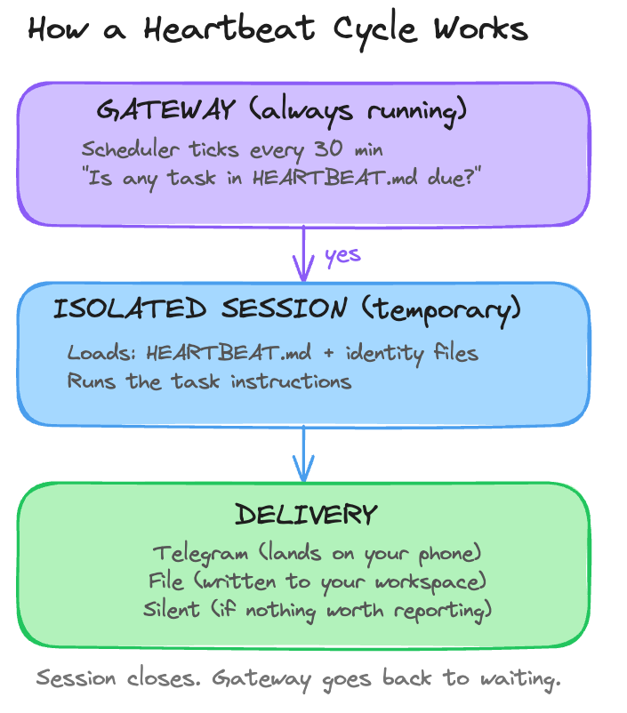

# Day 4: Make It Proactive

---

**What you'll learn today:**
- How your server runs tasks while you sleep, and what daemons and schedulers are
- What `HEARTBEAT.md` is and how it turns plain English instructions into scheduled behavior
- What an isolated session is and why it matters for cost and reliability

**What you'll build today:** By the end of today, your Claw reaches out to you for the first time. An evening reflection arrives on your Telegram, unprompted, on a schedule you set. This is your Claw's first proactive behavior.

---

## What Changes Today

If you've used Claude Code, Cursor, Codex, or ChatGPT, you may have noticed that the pattern is always the same. You open the tool, you type something, it responds. You close the window, it stops. Every interaction starts because you decided to start it. These are what the AI community calls **reactive agents**: they only act when prompted.

OpenClaw introduced a **proactive agent**: one that can also message you first. Your Claw can check in at a time you set, ask you questions, save your answers, and surface things it thinks you should know. You could be making dinner or lying on the couch. Your phone buzzes. It's your Claw, starting a conversation you did not initiate.

That ability to be proactive, to reach out instead of only responding, is a big part of what made OpenClaw take off. Today you're enabling it.

---

## How Your Server Runs Things While You Sleep

Your VPS is a computer that never stops. Even when you're asleep, even when you forget it exists for a week, it's still running. To understand how your Claw will message you at 7pm without you being anywhere near a keyboard, it helps to know how that works.

Your computer (and your server) runs dozens of programs in the background right now that you never see. One checks for software updates. Another manages your Wi-Fi connection. Another indexes your files for search. These are called **daemons**: programs designed to run continuously without any human interaction. The name comes from Greek mythology, where daemons were helpful spirits that worked behind the scenes. In computing, same idea.

The concept is older than you might expect. **Cron**, the original Unix scheduler, has been running background tasks since the 1970s. Every time a server backs up its database at 3am, or cleans up old log files on a Sunday, or checks whether a website is still responding, cron is doing the work. It wakes up once per minute, checks a schedule file, and runs whatever is due. Over fifty years later, it's still the backbone of automated computing.

The OpenClaw gateway you set up on Day 1 is one of these daemons. It starts when your VPS starts, restarts automatically if it crashes, and runs 24/7 regardless of whether you're connected. On Day 3, it held a persistent connection to Telegram's servers, waiting for your messages. That connection is still open right now, as you read this.

The gateway also has its own built-in scheduler. Think of it like cron, but living inside the gateway itself. Every 30 minutes (or whatever interval you configure), this internal scheduler wakes up and checks whether any tasks are due. The tasks live in a file called HEARTBEAT.md.

OpenClaw also supports [`cron`](https://docs.openclaw.ai/automation/cron-jobs) for jobs that need exact timing. Heartbeat is the repeating background loop. Cron is the exact scheduler. You'll use cron in the build, but it helps to understand heartbeat first because the same proactive model starts here.

---

## What HEARTBEAT.md Is

[`HEARTBEAT.md`](https://docs.openclaw.ai/gateway/heartbeat) is a plain markdown file that lives in your workspace. It contains a list of tasks written in natural language, each with a schedule. The gateway's internal scheduler reads this file on every tick and processes whatever is due.

The name fits. A heartbeat is rhythmic, automatic, and constant. It runs whether you're paying attention or not. That's exactly what this file does: it gives your Claw a pulse.

Here's the full loop:



The gateway's scheduler ticks, reads HEARTBEAT.md, runs any due tasks, delivers the output, and goes back to waiting. If nothing is due, it skips the cycle entirely. You also configure active hours, so the scheduler only ticks during your waking hours. Outside that window, silence.

The tasks themselves are written in plain English. "Send reflection prompts to Telegram. Wait for replies. Save answers to today's journal file." The AI model reads those instructions and follows them, using whatever tools are available. It's a flexible instruction to an agent that can reason, adapt, and make judgment calls about how to carry it out.

Heartbeat is best when you want periodic awareness. "Check this every so often and decide whether anything matters" is a heartbeat job. If you need something to happen at an exact time, OpenClaw recommends [`cron`](https://docs.openclaw.ai/automation/cron-vs-heartbeat) instead.

---

## The Clean Room

There's a design decision in the diagram above that's easy to miss: the words "isolated session."

When you're having a conversation with your Claw through Telegram, that conversation accumulates context. Everything you've discussed, the files you've referenced, the decisions you've made. That context is what makes the conversation feel coherent. Your Claw remembers what you said ten messages ago because it's all still loaded in the same session.

Now imagine a heartbeat task runs inside that same session. It would inherit your entire conversation history. Every message, every file, every tangent. The heartbeat would need to process all of that context just to check whether it's time to send you a reflection prompt. That's expensive: a single heartbeat run that loads weeks of conversation could cost $0.50 in tokens. At 48 runs per day, that adds up fast.

It also creates a quality problem. The heartbeat's output gets mixed into your conversation. Your chat history fills up with automated check-in logs. Context from your personal conversation leaks into a scheduled task that has nothing to do with it.

Isolated sessions solve both problems. Each heartbeat task gets its own clean room: a fresh session with no prior history. It loads only what it needs (HEARTBEAT.md and your identity files) and has no awareness of what you were discussing in your main conversation. When it finishes, the session closes. Your conversation stays untouched.

The cost difference is dramatic. An isolated heartbeat that finds nothing to report costs fractions of a cent. The same task running inside your main session costs orders of magnitude more. OpenClaw's documentation estimates that isolated sessions reduce heartbeat token usage by roughly 90%.

This also connects to something you set up on Day 2. The four identity files (SOUL.md, USER.md, AGENTS.md, MEMORY.md) reload from disk on every message turn. That same mechanism keeps isolated heartbeat sessions grounded. Even though the session starts fresh with no conversation history, it still loads your identity files. Your Claw's personality, your preferences, and its operating rules are all present. It's a clean room that still knows who it is and who you are.

---

## The Daily Reflection

Here's one example of what a heartbeat task can do. Every evening, your Claw sends you a few reflection prompts:

```
Time to reflect on your day.

1. What went well today?
2. What felt harder than it should have?
3. What's one thing you want to carry into tomorrow?

Reply whenever you're ready. I'll save your answers to today's journal.
```

You reply via Telegram. Your Claw saves the entry to a daily journal file. Over time, those entries accumulate into something useful: a record of what you were thinking, what was hard, and what you wanted to change, all without ever opening a journaling app.

For today's build, you'll use [`cron`](https://docs.openclaw.ai/automation/cron-jobs) instead of heartbeat because the reflection should arrive at the exact time you choose.

---

## Ready to Build?

You now understand how your server keeps the gateway running while you sleep, what HEARTBEAT.md is and how the gateway's internal scheduler drives it, and why isolated sessions keep scheduled tasks cheap and reliable. The build creates a daily reflection cron job, connects it to Telegram, and runs it once so you can see the full loop.

Follow along the steps in [`build.md`](build.md) to make your Claw proactive.

Tomorrow you give it skills: extending what it can do beyond the capabilities it shipped with.

---

## Go Deeper

- The heartbeat interval is configurable. Community guidance: 30 minutes is a good default for personal use. Five-minute intervals make sense for monitoring critical systems but cost more in API calls. Keep HEARTBEAT.md under 5-8 tasks; beyond 20, processing slows down and costs inflate.
- The daemon architecture means your Claw survives reboots and weeks of inattention. If the gateway process crashes, the operating system restarts it automatically within seconds. Your laptop sleeps when you close it; your server does not.
- OpenClaw also supports precise cron-style scheduling for advanced use cases (exact times like "9am sharp every Monday" with per-task model selection). The official docs cover this at [docs.openclaw.ai/automation](https://docs.openclaw.ai/automation). For most users, HEARTBEAT.md handles everything you need.

---

[← Day 3: Connect a Channel](../day-03-connect-a-channel/learn.md) | [Day 5: Give It Skills →](../day-05-give-it-skills/learn.md)
