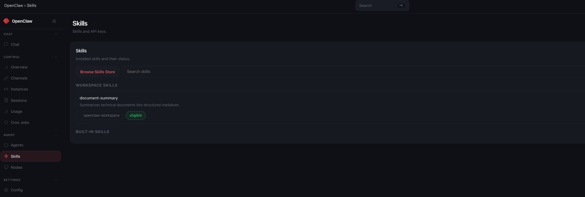
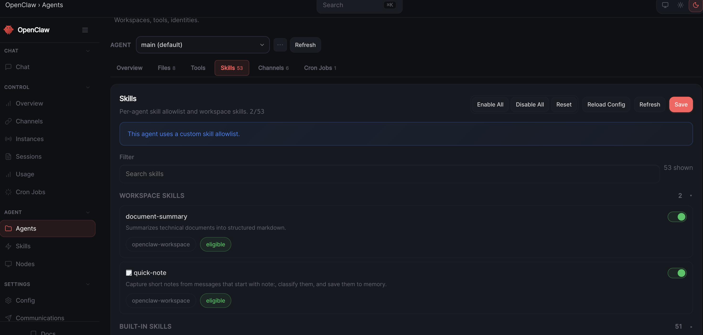

# Day 5 Build: Give It Skills

This is the user-facing guide for Day 5. Today you do the skill flow in stages. First you inspect a public skill. Then you install it. Then you create one small skill of your own.

The operational steps are split between this file and a few small instruction files. This file is for you. The instruction files are for your Claw.

---

## What You Need Before Starting

- Day 1 complete: OpenClaw installed and secured
- Day 2 complete: identity files created and loading correctly
- Day 3 complete: Telegram connected and working
- Day 4 complete: a proactive workflow already exists
- Access to your Claw through the web chat
- Telegram on your phone

---

## How To Run Day 5

Work through the files in this order:

1. inspect `document-summary` in chat
2. [`claw-instructions-install-document-summary.md`](./claw-instructions-install-document-summary.md)
3. [`claw-instructions-create-quick-note-skill.md`](./claw-instructions-create-quick-note-skill.md)
4. [`claw-instructions-finalize-skills.md`](./claw-instructions-finalize-skills.md)

This order gives you the full picture: how to inspect a public skill, how to install one safely, and how to teach your Claw one behavior of your own.

---

## Step 1: Inspect a ClawHub Skill

Copy and paste the following message into the web chat:

> Inspect `document-summary` from ClawHub, explain in plain English what it does, what kinds of requests should trigger it, whether it needs any credentials or extra binaries, and anything that looks risky or out of scope. Do not install anything yet.

Today's ClawHub skill example is `document-summary`. It is a good Day 5 starting point because it adds a reusable workflow without asking you to set up another account, secret, or API key first.

---

## Step 2: Install `document-summary`

After you are happy with the inspection, copy and paste this into the web chat:

> Read `https://raw.githubusercontent.com/aishwaryanr/awesome-generative-ai-guide/main/free_courses/openclaw_mastery_for_everyone/days/day-05-give-it-skills/claw-instructions-install-document-summary.md` and follow every step. Install `document-summary` into this workspace, tell me how to trigger it, and stop when you're done.

[`claw-instructions-install-document-summary.md`](./claw-instructions-install-document-summary.md) tells the Claw to:

- install `document-summary` into this workspace after confirmation
- verify where it landed and whether it is ready
- tell you the exact request patterns to use from Telegram or web chat
- tell you to type `/new` in OpenClaw before trying to use the new skill

This is the first half of Day 5. You borrow one good workflow instead of rebuilding it from scratch.

If you want a visual check, open `Skills` in OpenClaw. Installed workspace skills show up there once they have been added:



After this step, type `/new` in OpenClaw to start a fresh session before you continue.

---

## Step 3: Create `quick-note`

After `document-summary` is installed, copy and paste this into the web chat:

> Read `https://raw.githubusercontent.com/aishwaryanr/awesome-generative-ai-guide/main/free_courses/openclaw_mastery_for_everyone/days/day-05-give-it-skills/claw-instructions-create-quick-note-skill.md` and follow every step. Create `quick-note` in this workspace, tell me how to trigger it, and stop when you're done.

[`claw-instructions-create-quick-note-skill.md`](./claw-instructions-create-quick-note-skill.md) tells the Claw to create one small custom skill that:

- triggers on `note:`
- classifies the note before saving it
- stores a clean timestamped entry in `memory/YYYY-MM-DD.md`
- adds an open-loop item when the note implies future action
- replies with a short confirmation

This is the second half of Day 5. You teach your Claw one behavior that is specific to how you work.

After this step, type `/new` in OpenClaw to start a fresh session before you continue.

> [!WARNING]
> Do an additional check on the OpenClaw Web interface, go to `Agents --> Skills` and make sure that the skills are enabled.



---

## Step 4: Finalize and Verify

After `quick-note` is created, copy and paste this into the web chat:

> Read `https://raw.githubusercontent.com/aishwaryanr/awesome-generative-ai-guide/main/free_courses/openclaw_mastery_for_everyone/days/day-05-give-it-skills/claw-instructions-finalize-skills.md` and follow every step. Verify both skills, tell me the exact test message for each one, and report PASS or FAIL.

That [instruction file](./claw-instructions-finalize-skills.md) tells it to:

- confirm both skills are present
- remind you that Day 5 skills are used from a fresh session after `/new`
- give you the exact message to test each skill
- report PASS or FAIL for the Day 5 setup

At that point, your Claw has one reusable workflow from the community and one you created together.

---

## Validate It

Ask your Claw in the web chat:

```text
Tell me the two skills we set up today, where each one lives, the exact message I should send to test each one, and whether I need a fresh session before they are active.
```

The answer should clearly name `document-summary`, `quick-note`, their locations, the trigger phrases, and remind you to use `/new` before testing newly added skills.

---

## Quick Win

From Telegram, send one real `note:` message that implies future action. Then paste a link or a short block of text and ask for a summary. This is the Day 5 shift: your Claw now carries one reusable workflow from the community and one you taught it yourself, and your custom skill is doing more than dumping raw text into a file.

---

## What Should Be True After Day 5

- [ ] `document-summary` was inspected before install
- [ ] `document-summary` was installed for this workspace
- [ ] `quick-note` exists as a custom workspace skill with its own `SKILL.md`
- [ ] `quick-note` can classify notes and track open loops when needed
- [ ] You know the exact trigger or request to use for both skills
- [ ] You started a fresh OpenClaw session with `/new` before testing the new skills
- [ ] Both skills are scoped to this agent unless you chose otherwise

---

## Troubleshooting

**The Claw starts doing everything in one shot**
Tell it to stop and stay inside the current Day 5 step. The point is to inspect, install, create, and verify in sequence.

**The inspection feels vague**
Ask it to explain `document-summary` in plain English: what it does, what should trigger it, and what it depends on.

**The custom skill description feels fuzzy**
Ask the Claw to rewrite it around the exact `note:` trigger you plan to send from Telegram.

**The skill does not seem available yet**
Type `/new` in OpenClaw to start a fresh session, then test again.

---

[← Day 5 Learn](./learn.md) | [Day 6: Tame Your Inbox →](../day-06-tame-your-inbox/build.md)
