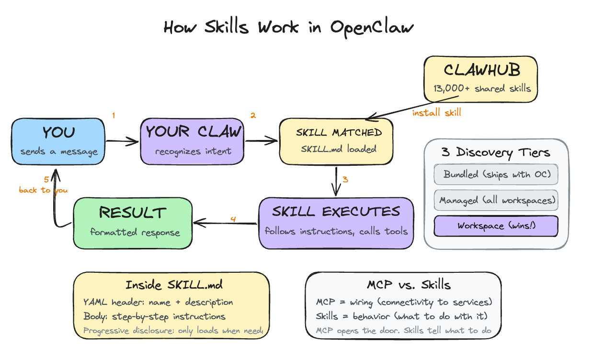

# Day 5: Give It Skills

---

**What you'll learn today:**
- What skills are and how they compare to MCP
- Why enterprises like Stripe publish skills, and how progressive disclosure keeps agents accurate
- How the three tiers of skill discovery work and where your workspace fits in
- Why inspecting a skill before installing it is essential right now
- How to write a custom skill (or have your Claw write one for you)

**What you'll build today:** By the end of today, your Claw has a new capability you installed from the community and a custom one you taught it yourself. Both are accessible from Telegram by name.

---

## Skills: the Concept That Took Off

One of the most popular ideas in the AI agent world right now is something called a skill. Anthropic introduced the concept with Claude Code, and it spread quickly across agent frameworks. OpenClaw adopted the same pattern. The reason it resonated is simple: it solves a problem every agent user runs into by Day 5.

By now your Claw responds on-demand and sends you a daily reflection on a schedule. Both are useful. Both also reveal the same friction: you keep giving your Claw the same multi-step instructions.

"Check my email, find anything urgent, summarize it, send me the subjects on Telegram." You typed that on Monday. It worked perfectly. You typed the same thing on Tuesday, and again on Wednesday.

Your Claw follows the instructions every time, but it has no way to remember the workflow itself. Each conversation starts fresh. A skill solves this: you write the instructions once, give them a name, and your Claw recognizes the pattern from then on.

---

## What a Skill Actually Is

A skill is a folder containing one file called SKILL.md. The file has two parts: a short header written in YAML (a simple key-value format) that gives the skill a name and describes when it should activate, and a body written in plain English that tells the agent exactly what to do, step by step. When OpenClaw starts, it scans all skill directories, loads the descriptions, and makes them available to the agent. The agent then decides when a skill is relevant and follows its instructions.

That email triage routine from the example above, packaged as a skill, would live in a folder called `email-triage/` with a SKILL.md inside. The header says "triggered when the user asks to check email" and the body spells out the steps: scan inbox, filter urgent, summarize, send to Telegram. You write it once. Your Claw follows it every time.

If you've been reading about AI tools, you may have come across MCP (Model Context Protocol). MCP is about connectivity: it gives the AI model a way to plug into external services like Gmail, Slack, or a database. Think of it as wiring.

Skills are about behavior: once the model is connected to Gmail via MCP, a skill tells it what to do with that connection. MCP opens the door. Skills tell the agent what to do once it's inside. The email triage skill you'll see on Day 6 uses the IMAP connection (the wiring) and adds workflow instructions (the behavior) on top.

---

## Why Skills Took Off

The key insight: skills are shareable. Someone packages their email triage routine, publishes it to ClawHub (OpenClaw's skill registry, accessible via the `clawhub` command-line tool), and anyone else can install it in one command. You get someone else's workflow, tested and refined, without building it yourself.

ClawHub crossed 13,000 published skills in early 2026. The pattern mirrors what npm did for JavaScript libraries or what app stores did for phone apps: a marketplace where people share solutions to problems they have already solved. The difference is that these solutions are plain-English instructions, so you can read exactly what a skill does before you install it.

This ecosystem is a big part of why OpenClaw grew as fast as it did. Your Claw is useful on Day 1 with bundled skills. By Day 5, you can tap into thousands of workflows the community has already built.

---

## Why Enterprises Publish Skills

The skill pattern works at personal scale, but it also solves a problem that large companies have been struggling with for years.

Consider Stripe. Their API has hundreds of endpoints, each with its own parameters, edge cases, and best practices. When Stripe connected to AI agents via MCP, those agents could technically call any endpoint. But "technically can" and "reliably does the right thing" are very different.

Anthropic's research found that when an AI model has access to more than 50 tools simultaneously, its accuracy drops to around 49%. Half the time, it picks the wrong tool or uses the right tool incorrectly.

Skills solve this through a concept called progressive disclosure: showing only what's relevant right now, and revealing more on demand. Instead of exposing all of Stripe's endpoints at once, a skill loads just its description into the agent's context. That's one line. The full instructions only load when the skill activates. A typical skill file is around 40 lines. The equivalent raw API documentation for the same workflow can run to thousands of lines.

Stripe already does this. They publish an Agent Toolkit that gives AI agents access to Stripe's API via MCP (the wiring), and on top of that they offer official agent skills like "integration best practices" (guidance on which Stripe products and features to use for a given setup) and "API upgrade" (step-by-step instructions for migrating to a newer API version). These skills encode institutional knowledge that raw API documentation cannot convey: the recommended approach, the common mistakes to avoid, the decisions that turn a generic API call into a reliable workflow.

---

## Three Tiers, One Precedence Rule



OpenClaw discovers skills from three locations, and when two skills share the same name, workspace wins.

**Skill Discovery (workspace always wins)**

| Tier | Location | Scope |
| --- | --- | --- |
| Bundled | Ships with OpenClaw | Always available |
| Managed | `~/.openclaw/skills/` | All workspaces |
| Workspace | `~/.openclaw/workspace/skills/` | This agent only; takes precedence |

**Bundled skills** ship with OpenClaw and are always available without installation. These cover common integrations like web search, basic calendar read, and file access. They are a useful baseline that works out of the box.

**Managed skills** live in `~/.openclaw/skills/` and are installed via ClawHub. They are available across all your workspaces on the same machine. Good for general-purpose skills you want everywhere.

**Workspace skills** live inside your specific workspace at `~/.openclaw/workspace/skills/`. Your workspace is the directory at `~/.openclaw/workspace/` that holds everything specific to your agent: the identity files from Day 2, the proactive step from Day 4, and now the skills directory. It's your agent's home.

In the Hostinger setup used in this course, you are not opening a shell and running these commands yourself. The paths and registry terms matter because they explain how OpenClaw works under the hood. Your Claw is the thing performing the inspection, install, and file-writing steps for you.

You can run multiple workspaces on the same OpenClaw installation, each one a separate agent with its own personality, rules, and skills. Workspace skills are scoped to this agent only, which makes them the right place for anything specific to your context: a skill that knows about your particular project structure, your internal tools, or your workflow.

When two skills share the same name, the workspace version takes precedence. This means you can modify how a bundled skill behaves by creating a workspace skill with the same name. It shadows the bundled version. The core installation stays untouched.

---

## Inspecting Before Installing

Because anyone can publish a skill to ClawHub, malicious skills do show up. A coordinated attack campaign called ClawHavoc distributed skills under lookalike names (e.g., "gmail-reader" vs. "gmai1-reader"), close enough to legitimate ones that you could install one by accident. The techniques ranged from prompt injection in skill files to hidden scripts that steal credentials. The impact was real: users on always-on machines had API keys and tokens exfiltrated before they noticed anything was wrong.

One way to catch this, which works well in practice, is to run `clawhub inspect <slug>` before every install. This shows you the full SKILL.md without installing it. Read through it. If the instructions reference unknown endpoints, ask for data they should not need, or take actions outside the declared scope, skip it. This takes thirty seconds and catches a lot of issues, though it is not a complete guarantee. The `clawvet` tool (covered in Go Deeper) adds automated scanning on top of manual inspection.

---

## Writing Your Own Skill

**When to write one:** When you catch yourself giving your Claw the same multi-step instruction for the third time. The first time, you're figuring out what you want. The second time, you're confirming the pattern. The third time, you're ready to write a skill.

**How to think about it:** Write the instructions the way you would explain the task to a capable person who has done it before in general, but has never done this specific version. What inputs do they need? What steps do they follow? What should they do if something goes wrong?

Here's a complete working skill that captures quick notes to your memory:

```
Example: quick-note/SKILL.md
---
name: quick-note
description: >
  Captures a quick note from messages starting with "note:".
  Classifies it, saves it to today's memory file, and tracks open loops
  when the note implies future action.

---

When the user sends a message starting with "note:", "remember:", or
"jot down:", extract the content after the trigger word.

1. Get today's date in YYYY-MM-DD format.
2. Open or create the file: memory/YYYY-MM-DD.md
3. Append the note with a timestamp:
   ## HH:MM
   [note content]
4. Confirm to the user: "Noted: [first 50 chars]..."

If the memory directory is missing, create it first.
```

The YAML header (the part between the `---` markers) has a name and a description. The description is what the agent uses to decide when to invoke the skill. A vague description like "helps with tasks" triggers unpredictably, if at all. A specific description like "captures a quick note to today's memory file with a timestamp" triggers exactly when you want it.

The instruction body below the header is plain markdown. Write it the way you would explain the task to someone who needs to do it precisely: what inputs to expect, what to do with them, what output to produce, and what to do if something goes wrong. Plain English is all you need.

The quick-note skill above is a simple example, but the pattern scales. Skills for interacting with APIs, processing files, or running multi-step workflows follow the same structure: a clear description in the header and step-by-step instructions in the body.

One thing worth knowing: you rarely have to write skills entirely by hand. If you find yourself repeating a workflow, you can ask your Claw to draft the skill for you. Describe what you want ("every time I say 'standup', summarize my open tasks and send them to Telegram"), and your Claw generates the SKILL.md with the header, description, and step-by-step instructions. You review it, adjust anything that feels off, and save it to your workspace. Skills can also include shell scripts or other executable files alongside the markdown, so more complex workflows that need actual code are covered too.

---

## Ready to Build?

You now understand what skills are, how they compare to MCP (wiring vs. behavior), why enterprises publish curated skills instead of exposing raw APIs, what a workspace is, how the three tiers of discovery work, why inspecting before installing matters, and how to write a custom skill or have your Claw draft one for you. The build walks you through what skills are already available, installs one from ClawHub, and helps you write your first custom skill.

Open [`build.md`](build.md). It walks you through Day 5 in stages: inspect one fixed community skill from ClawHub, install it, then create a richer `quick-note` skill inside this workspace.

Tomorrow is the first real integration: email. The skills you've added today will start becoming useful as your Claw gains access to more of your world.

---

## Go Deeper

- The SKILL.md format supports metadata gates: you can require specific CLI tools to be installed, environment variables to be set, or restrict a skill to specific operating systems. The [SKILL.md specification](https://docs.openclaw.ai/skills/skill-md) covers the full list of supported gates.
- The [`clawvet` tool](https://docs.openclaw.ai/security/clawvet) automates security scanning for skills. Run `clawvet scan <skill-dir>` on any skill directory to check for known malicious patterns, suspicious outbound calls, and scope violations before you install.
- If you've built an MCP server, you're 90% of the way to building an OpenClaw skill. The MCP server handles the connectivity; wrapping it in a SKILL.md with workflow instructions turns it into a full skill. The [ClawHub documentation on MCP conversion](https://docs.openclaw.ai/skills/mcp-to-skill) covers the pattern.

---

[← Day 4: Make It Proactive](../day-04-make-it-proactive/learn.md) | [Day 6: Tame Your Inbox →](../day-06-tame-your-inbox/learn.md)
