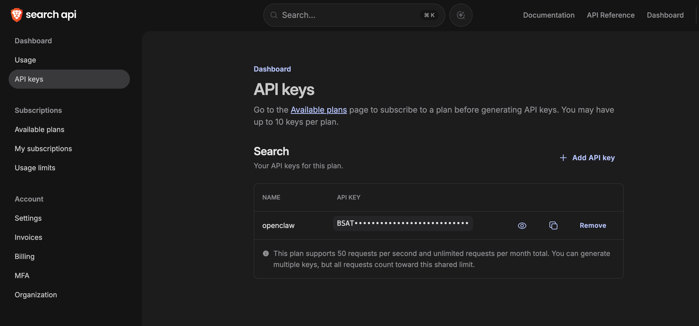

# Day 7 Build: Make It Research

This is the user-facing guide for Day 7. Today you turn on live web search for your Claw. The flow is split into a few small steps so you can see what is being configured, then use it right away.

The browser tool is built into OpenClaw on Hostinger too. We are skipping it here because it is unreliable in the current hosted version. Day 7 uses `web_search`.

---

## What You Need Before Starting

- Day 1 complete: OpenClaw installed and secured
- Day 2 complete: identity files created and loading correctly
- Day 3 complete: Telegram connected and working
- Day 4 complete: a proactive workflow already exists
- Day 5 complete: skills are working
- Day 6 complete: email triage is working
- Access to your Claw through the Hostinger web chat
- A Brave Search account

---

## How To Run Day 7

Work through the steps in this order:

1. get your Brave Search API key
2. inspect `web_search` in chat
3. [`claw-instructions-configure-web-search.md`](./claw-instructions-configure-web-search.md)
4. [`claw-instructions-create-research-brief.md`](./claw-instructions-create-research-brief.md)
5. validate the skill
6. run one real research prompt

This order makes the setup legible. You see what the tool does, you let the Claw configure it, you turn that into one reusable workflow, and then you use it on a real question.

---

## Step 1: Get Your Brave Search API Key

If you do not have a Brave Search account yet, start at [https://brave.com/search/api](https://brave.com/search/api/). Once the account is ready, go straight to the keys page:

[https://api-dashboard.search.brave.com/app/keys](https://api-dashboard.search.brave.com/app/keys)

You want a Search API key. If Brave asks you to choose a plan first, pick the Search plan, then come back here. Copy the key somewhere you can paste from in a moment.

If the dashboard looks unfamiliar, this is the page you are aiming for:



---

## Step 2: Inspect `web_search`

Copy and paste this into the Hostinger web chat:

> Explain what the built-in `web_search` tool does, how Brave Search fits into it, and what kind of research questions it is best for. Keep it short. Do not configure anything yet.

This is the first useful shift in Day 7. Your Claw stops guessing on current topics and starts pulling live results.

---

## Step 3: Configure `web_search`

After you have the Brave API key, copy and paste this into the web chat:

> Read `https://raw.githubusercontent.com/aishwaryanr/awesome-generative-ai-guide/main/free_courses/openclaw_mastery_for_everyone/days/day-07-make-it-research/claw-instructions-configure-web-search.md` and follow every step. Configure the built-in `web_search` tool to use Brave Search for this agent. I already have the Brave API key and will paste it when you ask. Stop when the setup is complete and tell me the exact validation prompt to run next.

[`claw-instructions-configure-web-search.md`](./claw-instructions-configure-web-search.md) tells the Claw to:

- configure `web_search` with provider `brave`
- ask you for the Brave Search API key
- add a short Day 7 web research guardrail to your workspace `AGENTS.md`
- tell you exactly what changed and how to test it

---

## Step 4: Create `research-brief`

After `web_search` is working, copy and paste this into the web chat:

> Read `https://raw.githubusercontent.com/aishwaryanr/awesome-generative-ai-guide/main/free_courses/openclaw_mastery_for_everyone/days/day-07-make-it-research/claw-instructions-create-research-brief.md` and follow every step. Create a `research-brief` skill for this workspace that uses `web_search` only, tell me how to trigger it, and stop when you're done.

[`claw-instructions-create-research-brief.md`](./claw-instructions-create-research-brief.md) tells the Claw to create one custom skill that:

- triggers when you ask for a research brief on a topic
- uses `web_search` for live sources
- returns a short, structured answer with citations
- stays inside the search-only path for Day 7

After this step, type `/new` in OpenClaw to start a fresh session before you test the new skill.

---

## Validate It

Ask your Claw in the web chat:

```text
Research brief on the three most important AI agent developments from the past 7 days. Give me one sentence for each item and link the primary source for each one.
```

The answer should feel current and include real source links. If the skill does not trigger, start a fresh session with `/new` and try again.

---

## Quick Win

Ask one real question you would normally search from your phone:

```text
Research brief on what happened this week in [my industry, company, or topic]. Give me three bullets, link the sources, and end with one practical takeaway for me.
```

This is the Day 7 shift: your Claw can now do live lookups for you in a reusable format instead of replying from stale memory alone.

---

## What Should Be True After Day 7

- [ ] You created a Brave Search API key
- [ ] The built-in `web_search` tool is configured to use provider `brave`
- [ ] `research-brief` exists as a workspace skill
- [ ] Your Claw can answer a current question with live sources through that skill
- [ ] Your workspace `AGENTS.md` includes a short rule for treating web content as data
- [ ] You started a fresh OpenClaw session with `/new` before testing the new skill
- [ ] You know the browser tool exists on Hostinger and that this lesson intentionally skips it

---

## Troubleshooting

**The Claw starts talking about Playwright or the browser**
Tell it that Day 7 is `web_search` only.

**The Brave dashboard is confusing**
Use the exact keys page above: [http://api-dashboard.search.brave.com/app/keys](https://api-dashboard.search.brave.com/app/keys)

**The answer still feels like training data**
Make the prompt time-bound. Ask for "the past 7 days", "this week", or "published after [date]".

**The skill does not seem to trigger**
Type `/new` in OpenClaw, then test again.

**The Claw asks you to run shell commands**
Tell it to configure the tool itself and keep the setup inside chat.

---

[← Day 7 Learn](./learn.md) | [Day 8: Let It Write →](../day-08-let-it-write/build.md)
