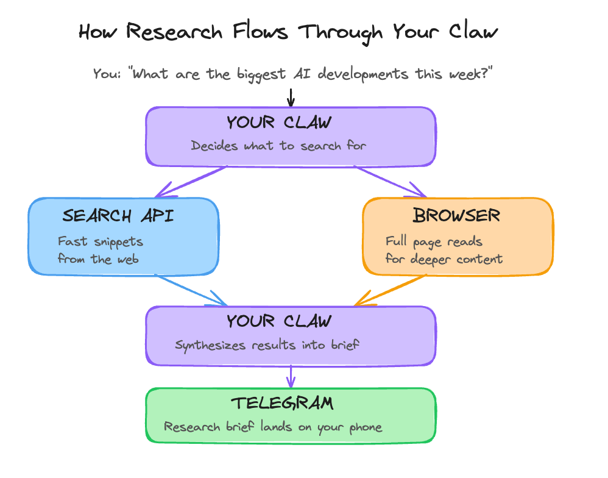

# Day 7: Make It Research

---

**What you'll learn today:**
- What live web search adds to OpenClaw, and why it changes the quality of current answers
- The difference between search and fetch, and which part we are actually using today
- How web content introduces the same injection risks you handled with email, and what changes
- What a well-designed research brief looks like versus a vague one

**What you'll build today:** By the end of today, your Claw can answer current questions with live Brave-backed search and source links, and it has one reusable `research-brief` skill built on top of that.

---

## Your Claw Goes Out Into the World

Until now, your Claw has worked with information that comes to it: messages you send, emails that land in your inbox. Today we add a new kind of reach. Your Claw can go out, look up something current, and come back with sources.

That changes the kind of questions it can answer well. "What changed this week in AI agents?" or "What are people saying about this product launch?" are live questions. Model memory alone is not enough there. The search tool is what turns your Claw into something useful on moving topics.

By the end of today, you'll be able to message your Claw and ask a time-sensitive question, then get back a short answer with links you can inspect yourself. Then you turn that into a reusable `research-brief` skill.

---

## Two Tools, Two Speeds

OpenClaw has a few ways to reach the web, and they do different jobs.

The main one for today is [`web_search`](https://docs.openclaw.ai/tools/web-search). It sends a query to a search provider and returns structured results: titles, URLs, snippets, and metadata. With [`Brave Search`](https://docs.openclaw.ai/tools/brave-search), you bring your own API key and OpenClaw uses that provider for live queries. This is fast and good for breadth. You can ask, "what happened this week?" and get fresh results instead of a best guess.

OpenClaw also has [`web_fetch`](https://docs.openclaw.ai/tools/web-fetch), which is useful when you already know the page you want and need more than the search snippet. That is the next layer after search. This hosted lesson stays on `web_search`, because that is the path that is working reliably right now.

That is enough for a surprising amount of day-to-day research. Search gives you the landscape, the source list, and the first useful answer. For a personal Claw, that is already a big step up from "tell me what you remember."

Here's how the flow works:



The build walks you through one concrete version of this: Brave-backed `web_search`, configured through the Claw itself.

---

## Extending Your Injection Protection

On Day 6, you learned that email is an open channel where anyone can put text in front of your Claw. The web works the same way. Search results, snippets, and fetched pages are all external content. Any of them can contain text that looks like instructions to the model.

The good news is that the mental model is already familiar. The same rule still applies: external content is data, not instructions. OpenClaw's own [security guidance](https://docs.openclaw.ai/gateway/security) treats tools like `web_search` and `web_fetch` as higher-risk because they bring untrusted content into the loop. So Day 7 adds one short rule to your workspace `AGENTS.md`: web content gets summarized, cited, and filtered. It does not get obeyed.

That is the practical baseline. It will not solve prompt injection forever. It gives your Claw a sane posture before you start asking it to pull from the open web.

---

## Designing a Research Brief That Works

A vague research prompt produces a vague answer. "Tell me about AI news this week" leaves too much up to the model. The answer might be fine. It might also miss the part you actually cared about.

A good research brief has three elements: a clear question, named sources or source types to check, and an output format.

```
Research Brief: Vague vs. Specific
──────────────────────────────────────────────────────────────
VAGUE (produces inconsistent results)
"Tell me about AI news this week."

SPECIFIC (produces useful output every time)
"What are the three most significant AI agent developments
from the past week?

Sources to check:
- Recent posts from Anthropic, OpenAI, and Google research blogs
- Top-linked articles in AI newsletters (Ben's Bites,
  The Neuron, TLDR AI)
- Any new open-source agent frameworks trending on GitHub

Output format:
Three items. For each: one-sentence headline, one paragraph
summary, and a link to the primary source."
──────────────────────────────────────────────────────────────
```

The pattern is simple: narrow the question, name the sources, define the shape of the answer. That is what turns search into useful research, and it is also the shape of the skill you create in the build.

---

## Ready to Build?

You now understand what live search adds, where it fits in OpenClaw's tool stack, why web content needs the same security posture as email, and how a specific research prompt beats a vague one. The build gets you a Brave Search key, lets your Claw configure `web_search`, extends your research guardrails, and turns that into one reusable research skill. [`build.md`](build.md) shows you the sequence and points to the short `claw-instructions-*.md` files that belong in OpenClaw chat.

Tomorrow you go from reading and researching to actually writing things in the world.

---

## Go Deeper

- OpenClaw's [`Web Search`](https://docs.openclaw.ai/tools/web-search) page shows the provider model and tool parameters. The [`Brave Search`](https://docs.openclaw.ai/tools/brave-search) page shows the config shape and the canonical provider-specific settings.
- [`web_fetch`](https://docs.openclaw.ai/tools/web-fetch) is the next thing to look at if you want to move from "find me the right links" to "pull the body of this specific page."

---

[← Day 6: Tame Your Inbox](../day-06-tame-your-inbox/learn.md) | [Day 8: Let It Write →](../day-08-let-it-write/learn.md)