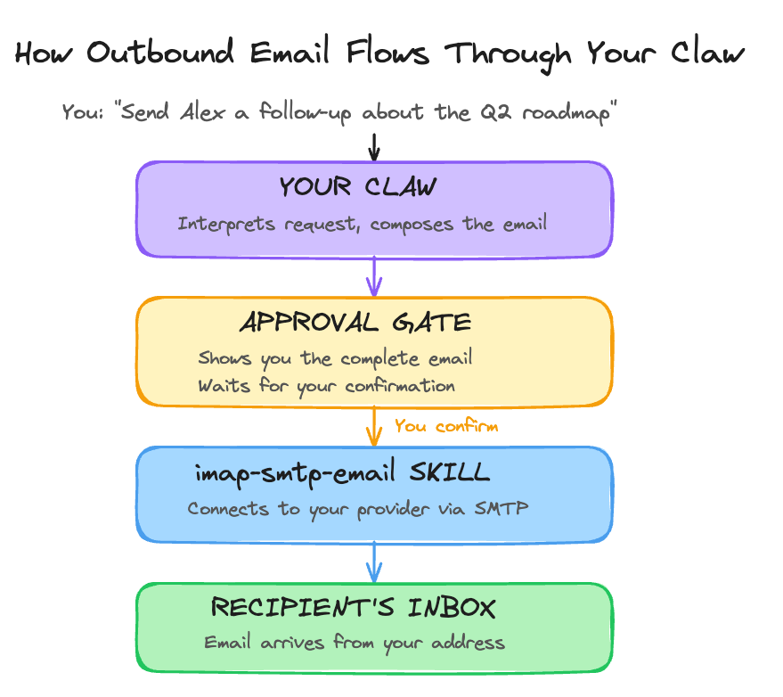

# Day 8: Let It Write

---

**What you'll learn today:**
- How your Claw moves from internal workspace writes to external writes that affect other people
- What an approval gate is and why every external write needs one
- Why sending email is the natural first external write (builds on Day 6's read-only connection)
- Why composing new messages is safer than replying or forwarding

**What you'll build today:** By the end of today, your Claw can compose and send emails on your behalf. Every outbound message pauses for your review before it goes out. You will also have a follow-up email workflow that handles a common pattern in one step.

---

## Your Claw Starts Doing Things in the World

Today your Claw learns to send email on your behalf. You will be able to message it on Telegram and say "send a follow-up to Alex about the project update" and have the email composed, shown to you for review, and sent after you confirm. Instead of switching to your email client, finding the right contact, writing the message yourself, and hitting send, you describe what you want and your Claw handles the rest.

This is one of the moments where your Claw starts to feel like a true extension of how you work. Once this is working, you will wonder how you ever wrote routine emails manually.

Your Claw has been building toward this. The identity files from Day 2 shape how it communicates. The heartbeat from Day 4 gives it a schedule. The skills from Day 5 give it structure. The email connection from Day 6 gives it context about your conversations. The research capability from Day 7 lets it pull in facts and details. With all of that in place, your Claw understands enough about you and your work to write messages on your behalf.

But as with email reading on Day 6, new capability comes with new risk. Since Day 4, your Claw has been writing to its own workspace: journal entries in the evening, updates to MEMORY.md as it learns. Those are internal writes. They live in your workspace directory, only you see them, and undoing one is as simple as editing or deleting a file.

External writes are different. An email, once sent, stays sent. It lands in someone else's inbox. It becomes part of a conversation. It represents you. These actions cross the boundary from your private workspace into shared spaces where other people are affected.

So we will set this up the same way we approached email reading: with guardrails that keep you in control. Every outbound email your Claw composes will pause and show you exactly what it plans to send. You review it, confirm it, and only then does it go out. Internal writes like your evening reflection keep running automatically on the heartbeat schedule. External writes always wait for your go-ahead.

---

## The Approval Gate

Here is what that confirmation step looks like in practice:

```
You: "Send Alex a follow-up about the Q2 roadmap discussion."

Claw: I will send this email:
     To: Alex Chen (alex@company.com)
     Subject: Follow-up: Q2 Roadmap Discussion
     Body: Hey Alex, wanted to follow up on our Q2 roadmap
     conversation from yesterday. I'll have the updated
     timeline ready by Thursday. Let me know if you need
     anything before then.

     Send this email? [Yes / Edit / Cancel]
```

The gate exists because your Claw's interpretation of your request might differ from what you had in mind. Maybe you meant a different Alex. Maybe you wanted to include more detail. Maybe the tone is too casual for this particular recipient. The confirmation step takes a few seconds. Undoing an email after it has landed in someone else's inbox is not possible.

Once you have run a particular workflow ten or twenty times and it consistently does exactly what you expect, you can configure that specific action type to skip confirmation. The principle: gates default on, you remove them for workflows you have proven.

---

## How the Connection Works

On Day 6, you installed the `imap-smtp-email` skill and set up IMAP credentials so your Claw could read your inbox. Today you extend that connection in the opposite direction with SMTP, the protocol for sending email.

IMAP pulls messages in. SMTP pushes messages out. They are two sides of the same email system, and they use the same credentials. If you set up a Gmail App Password on Day 6, that same password works for SMTP. If you use Outlook, the same account credentials work for both directions.

Here is how the pieces connect:



The approval gate sits between your Claw's composition and the actual send. Nothing leaves your outbox without your confirmation.

---

## Start With Composing

When you first give your Claw the ability to send email, the safest starting point is composing new messages.

Composing a new email is purely additive. You are starting a fresh conversation with a specific person about a specific topic. If the email is wrong, the worst case is an awkward message you can follow up on.

Replying to existing threads is riskier. You are adding to a conversation that other people are already part of. A misunderstood context or wrong tone can derail an ongoing discussion.

Forwarding is the riskiest. You are sharing content that may not have been meant for the recipient. A forwarded message carries the original sender's words into a context they did not choose.

Today's build focuses on composing new messages only. Replying and forwarding come later, once the compose workflow is proven and you trust how your Claw handles tone and context.

---

## Ready to Build?

You now understand the difference between internal writes (workspace files, automatic, easy to undo) and external writes (email, need confirmation, affect other people). You know how SMTP extends the IMAP connection you set up on Day 6, and why approval gates are the safety mechanism that makes outbound email practical. The build adds SMTP credentials alongside your existing IMAP setup, installs the send-capable skill, configures approval gates, and tests a complete compose-and-send workflow end-to-end. [`build.md`](build.md) walks you through the sequence and points to the short `claw-instructions-*.md` files that belong in OpenClaw chat.

Tomorrow you give your Claw a team.

---

## Go Deeper

- Once compose is working reliably, the natural next step is reply capability. The pattern: add a rule in AGENTS.md that allows replies only to threads you explicitly started or where you are already a participant. This keeps your Claw from jumping into conversations it was only CC'd on.
- Google Calendar integration via the `gog` skill and OAuth is worth adding after email sending is stable. It follows the same creation-first approach: start with creating events, then add attendee management, then modification and deletion. The [`gog` skill readme](https://docs.openclaw.ai/skills/gog) covers the full setup.
- Auto-send rules for specific message types are the next level of trust. For example, a rule that sends weekly status updates without confirmation after you have manually approved the same format ten times. The principle stays the same: prove the workflow first, then remove the gate.

---

[← Day 7: Make It Research](../day-07-make-it-research/learn.md) | [Day 9: Give It a Team →](../day-09-give-it-a-team/learn.md)
