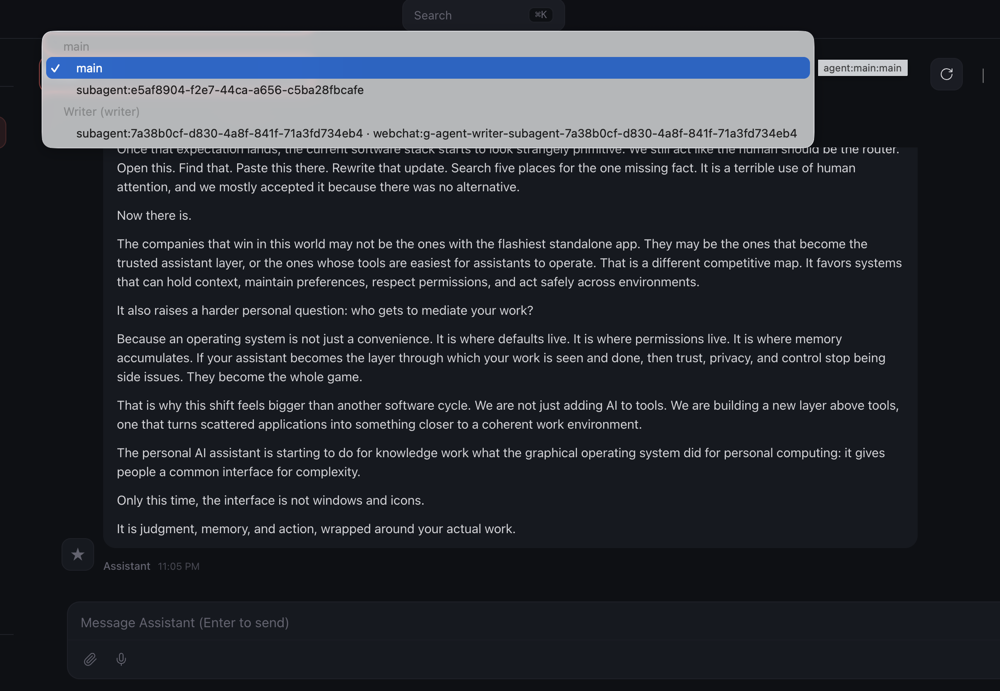

# Day 9 Build: Give It a Team

This is the user-facing guide for Day 9. Stay inside OpenClaw chat for this entire lesson. Your main Claw will create a specialist writer agent and wire up delegation. The detailed work lives in two short instruction files. This file is for you. The instruction files are for your Claw.

---

## What You Need Before Starting

- Day 1 complete: OpenClaw installed and secured
- Day 2 complete: identity files created and loading correctly
- Day 3 complete: Telegram connected and working
- Day 4 complete: a proactive workflow already exists
- Day 5 complete: skills are working
- Day 6 complete: email triage is working
- Day 7 complete: web research is working
- Day 8 complete: outbound email with approval is working
- Access to OpenClaw through the web chat

---

## How To Run Day 9

Work through the steps in this order:

1. confirm the writer model in chat
2. [`claw-instructions-create-writer-agent.md`](./claw-instructions-create-writer-agent.md)
3. [`claw-instructions-enable-teamwork.md`](./claw-instructions-enable-teamwork.md)
4. run the writer and delegation checks

This order keeps the setup clear. First you confirm which capable model family you are already using for the writer. Then the Claw creates a persistent writer with a detailed identity. Then it connects the main agent and the writer safely. Then you test the direct writer path and the delegated path.

---

## Step 1: Confirm the Writer Model

Copy and paste this into the web chat:

> Before we change anything, inspect my current setup and tell me which primary model family my main Claw is using and whether the writer should use `gpt-5.4` or `claude-sonnet-4.6`. Do not make changes yet.

This makes the model decision explicit before the new agent exists. The Day 9 writer should stay on the same high-capability provider family you already configured.

---

## Step 2: Create `writer`

After you are happy with the plan, copy and paste this into the web chat:

> Read `https://raw.githubusercontent.com/aishwaryanr/awesome-generative-ai-guide/main/free_courses/openclaw_mastery_for_everyone/days/day-09-give-it-a-team/claw-instructions-create-writer-agent.md` and follow every step. Ask the setup questions in order, create the `writer` agent, keep the writer identity files detailed, choose its model from my existing provider setup, and stop when you're done.

[`claw-instructions-create-writer-agent.md`](./claw-instructions-create-writer-agent.md) tells the Claw to:

- inspect your current config and main identity files first
- ask a few short questions about topics, audience, and voice
- create a named `writer` agent with its own workspace
- write a detailed `SOUL.md` plus scoped `USER.md`, `AGENTS.md`, and starter `MEMORY.md`
- choose `gpt-5.4` or `claude-sonnet-4.6` based on the model family already running on your main setup

The detail in the writer `SOUL.md` is the point. This agent is supposed to sound different from your generalist Claw.

---

## Step 3: Connect the Team

After `writer` is created, copy and paste this into the web chat:

> Read `https://raw.githubusercontent.com/aishwaryanr/awesome-generative-ai-guide/main/free_courses/openclaw_mastery_for_everyone/days/day-09-give-it-a-team/claw-instructions-enable-teamwork.md` and follow every step. Enable delegation between `main` and `writer`, add a short rule so long-form writing goes to the writer, and stop when you're done.

[`claw-instructions-enable-teamwork.md`](./claw-instructions-enable-teamwork.md) tells the Claw to:

- enable agent-to-agent communication only between `main` and `writer`
- add one short delegation rule to your main workspace `AGENTS.md`
- report exactly what changed and whether it had to reload anything

This keeps responsibility clear. The main Claw coordinates. The writer drafts.

---

## Important: Read This Before You Run the Writer

Pause here before you run the checks below. Hostinger's current web chat has a sub-agent interface bug. After the `writer` finishes a draft, the chat can stop accepting follow-up messages. Your Day 9 setup usually completed correctly. The interface just needs a quick session switch.

Use the session switcher at the top of the chat window to recover the conversation:



If the chat gets stuck after a writer or delegation run:

- open the session switcher at the top of the chat window
- click a different agent or sub-agent
- click `main` again
- continue the conversation from there

Keep this in mind before you start the checks below. A quick toggle usually clears the interface immediately.

---

## What Should Be True After Day 9

### Named Agents
- [ ] A `writer` named agent exists
- [ ] The writer uses `gpt-5.4` or `claude-sonnet-4.6`, chosen from the same provider family as the main setup
- [ ] The writer workspace has a detailed `SOUL.md` tuned for long-form writing
- [ ] The writer workspace has `USER.md`, `AGENTS.md`, and `MEMORY.md`
- [ ] Agent-to-agent communication is enabled between `main` and `writer`
- [ ] The main workspace has a short delegation rule for long-form writing
- [ ] A writer-only test produced a convincing draft
- [ ] A delegated draft came back through the main Claw
- [ ] A revision request made a round trip through the writer

---

## Troubleshooting

**The main Claw writes the draft itself**
Ask more directly: `Use the writer agent for this draft.` If it still writes the piece itself, ask it to show you the long-form delegation rule it added to the main workspace `AGENTS.md`.

**The writer sounds generic**
Ask the Claw to show you the writer `SOUL.md` and tighten the voice section. Small changes there have a large effect on output.

**The writer agent does not appear in the interface yet**
Ask your main Claw whether the Day 9 setup finished reloading cleanly and where it created the writer workspace.

**Delegation fails**
Ask the Claw to inspect the current agent-to-agent allow list and fix only the `main` to `writer` connection.

**The chat stops accepting follow-up messages after a writer run**
Use the session switcher at the top of the chat window. Click any other agent or sub-agent, then click `main` again and continue in the same conversation.

**Costs feel high**
A named writer uses a capable model every time it drafts. Keep the writer for work that actually benefits from voice and structure.

---

## Validation

Keep the session-switcher workaround above in mind while you run these checks.

### Direct Writer Check

Open the `writer` agent in OpenClaw. If you are not sure how to switch agents in your interface, ask your main Claw:

```text
Tell me how to open the writer agent directly in this interface.
```

Then send:

```text
Write a short Substack post, about 500 to 700 words, on why most productivity advice is backwards. The audience is skeptical knowledge workers.
```

You are looking for:

- a real hook instead of a generic setup
- short paragraphs
- a suggested title and subtitle
- no em-dashes
- a complete draft instead of an outline

### Delegation Check

Switch back to your main Claw and send:

```text
I need a Substack draft about how personal AI assistants are becoming the new operating system for knowledge work. Delegate this to the writer agent and bring me back the draft.
```

You are looking for:

- delegation instead of the main Claw drafting it itself
- the returned draft keeping the writer's voice
- the main Claw presenting the draft without flattening it into its own tone

### Revision Check

In the same main chat, send:

```text
Ask the writer agent to revise that draft. The hook is too generic. Open with a specific example of someone using their AI assistant to do something that would have taken hours manually.
```

You should get a revised draft back through the main Claw.

---

## Quick Wins

Ask the writer for three title options and a sharper opening on a real topic you care about.

Then ask your main Claw to turn rough notes into a delegated writing brief:

```text
I want to publish something on [your topic]. Pull together the angle, audience, and key points, then delegate the draft to the writer agent.
```

This is the Day 9 shift. Your Claw no longer has to do every kind of work in one voice.

---

[← Day 9 Learn](./learn.md) | [Day 10: What Comes Next →](../day-10-what-comes-next/build.md)
