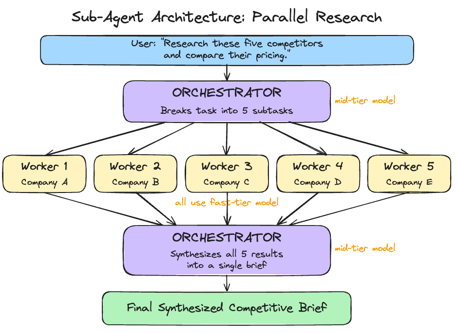
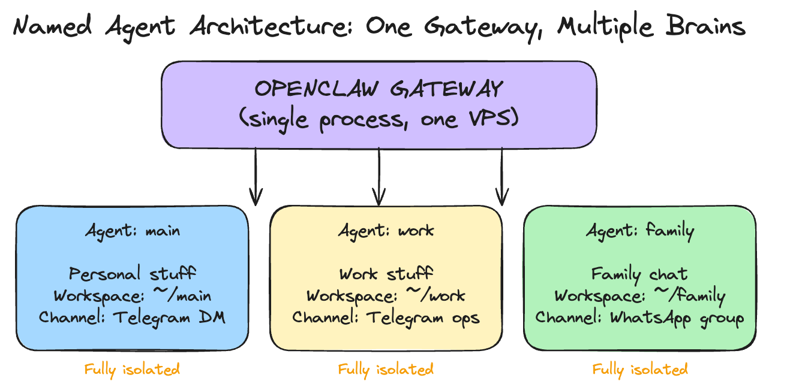
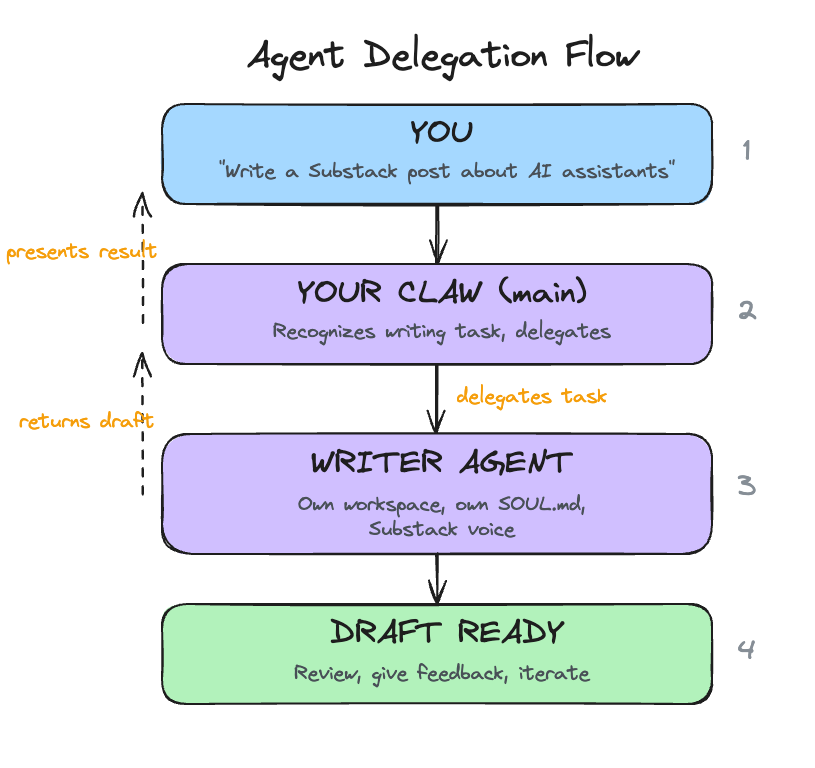

# Day 9: Give It a Team

---

**What you'll learn today:**
- How sub-agents work: both automatic (OpenClaw spawns them) and manual (you spawn them yourself, choosing the model and thinking level)
- How you can interact with running sub-agents in real time: watching their progress, sending follow-up messages, steering them mid-task
- How named agents let you run multiple specialized "brains" on one gateway, each with its own workspace, identity, and personality
- How agents communicate with each other through opt-in messaging

**What you'll build today:** By the end of today, your Claw has a teammate: a specialist writer with its own personality and voice. Your main Claw can hand off writing tasks to the specialist, get the draft back, and present it to you. You will also have parallel workers configured so your Claw can split independent tasks across multiple agents automatically.

**A note before you start:** Today's article is the longest in the course. Multi-agent systems have a lot of moving pieces, and we wanted to explain them properly. Bear with us. By the end, you will have a solid understanding of how multi-agent architectures work in applications like OpenClaw.

---

## From One Claw to Many

For the past eight days, you have been building one Claw. One agent, one workspace, one conversation. You taught it who you are, gave it a schedule, connected it to your email, let it research the web, let it send messages on your behalf. Everything has been a single agent getting progressively more capable.

If you have watched any of the YouTube videos about multi-agent setups, you have seen something different: multiple agents working together, each handling a piece of a larger task, or each owning a separate domain. That is what today is about.

Now that you understand everything a single Claw can do, you are ready to give it a team. OpenClaw supports two distinct mechanisms for this: sub-agents for parallel work, and named agents for persistent role separation.

---

## Two Ways to Give Your Claw a Team

**Sub-agents** are ephemeral workers. They spin up, handle a task, and disappear. OpenClaw can spawn them automatically when it detects parallel work, or you can spawn them yourself with explicit control over what they do and which model they use. Either way, they are temporary.

**Named agents** are persistent brains. Each one has its own workspace, identity, configuration files, and conversation history. They run on the same gateway but operate independently. You create them, configure them, and route specific channels or conversations to them. They stay running.

Think of it this way: sub-agents are temporary contractors hired for a specific job. Named agents are full-time team members with their own desks.

---

## Sub-Agents: Automatic Mode

The most common way sub-agents work is automatic. You give your Claw a task with independent parts, and the orchestrator (your main agent) detects the opportunity, spawns workers, and synthesizes their outputs. You just describe what you need, and it figures out the parallelization.

One orchestrator agent receives the task, breaks it into independent subtasks, spawns worker agents with clear instructions, collects their outputs, and synthesizes a final result.

Each worker is an isolated agent instance. It gets its own context: the task description and whatever the orchestrator passes it. It sees only its specific task, completely walled off from what other workers are doing or from the main conversation history. When it finishes, it returns its output to the orchestrator.

This isolation is intentional, and it improves quality. Workers that see only their own task produce genuinely independent results, which is what you want for synthesis. Research on multi-agent systems has found that context contamination between agents is one of the primary failure modes: when workers share too much state, their implicit decisions conflict and the final output suffers.

---

## Sub-Agents: Manual Mode

Automatic spawning is convenient, but sometimes you want explicit control. OpenClaw lets you manually spawn sub-agents from the TUI, choosing exactly which model to use and what task to assign.

When you spawn a sub-agent manually, it starts working in the background immediately. You pick the model at spawn time: Haiku for a quick lookup, Opus for deep analysis, or whatever suits the task. If you leave the model unspecified, the sub-agent falls back to your configured default. The override chain is explicit flag first, then agent-level config, then global defaults. This means you can set a cheap model as the default for most sub-agents and selectively upgrade specific ones when the task demands it.

Manual spawning is useful when you want to run something alongside your main conversation without interrupting it. You keep talking to your Claw while a sub-agent researches in the background, and the result appears when it is ready.

---

## Interacting with Running Sub-Agents

Sub-agents are fully interactive while they run. OpenClaw gives you a full set of commands for managing them in real time.

You can list all active sub-agents, view detailed info on any one of them, or read their activity logs to see exactly what tools they called and what results they got. If a sub-agent is heading in the wrong direction, you can send it a follow-up message with additional context or constraints. If it is completely off track, you can steer it, which redirects its approach entirely without killing and restarting.

The most useful command is focus. It lets you watch a specific sub-agent's progress in real time instead of waiting for the final result. You see exactly what the worker is doing: the web searches, the page reads, the reasoning. When you are done watching, you unfocus and return to the main agent view.

This level of control makes sub-agents feel like supervising a team. You can intervene at any point, redirect a worker, or watch it think through a problem in real time.

---

## Cost Routing: Cheap Workers, Capable Orchestrator

Sub-agents make cost routing practical.

A worker whose job is "read this 500-word article and extract the main claim" handles that well on a fast, inexpensive model. Every provider has a tier for this: Anthropic's Haiku 4.5, OpenAI's GPT-5.4 mini, Google's Gemini 3.1 Flash Lite. The capable model is only needed where it earns its cost.

The orchestrator, which designs the subtask breakdown, evaluates worker outputs for quality, and synthesizes a final result, benefits from the more capable model. That is where your mid-tier model (Sonnet 4.6, GPT-5.4, or Gemini 3 Flash) earns its cost.

You set a default model for all sub-agents in your config, and override it per-spawn when needed. A manual spawn on Opus for one critical subtask while the rest run on Haiku is a perfectly valid pattern.

---

## Sub-Agent Guardrails

Sub-agents are powerful, which means they need guardrails. OpenClaw lets you configure limits on how deep sub-agents can nest (preventing workers from spawning their own workers endlessly), how many children any single agent can spawn, and how many sub-agents can run simultaneously across the entire gateway.

There is a timeout for how long any sub-agent can run before it is automatically killed. The default is 15 minutes, which is generous for most tasks. Completed sessions are archived and cleaned up after a configurable window.

You can also restrict which tools sub-agents have access to. If you want workers to search the web but not write files, you deny the write tool at the sub-agent level. If you want to keep sub-agents out of gateway management entirely, you deny those tools too. Each named agent can also have its own sub-agent settings, so your personal agent's sub-agents might have different limits than your work agent's.

---

## When to Use Sub-Agents

The right cases for sub-agents are tasks that are:

**Genuinely parallel.** Five independent research questions. Summarizing five separate documents. Translating content into three languages simultaneously. Any task where the subtasks do not depend on each other.

**Context-isolated.** Sometimes one task's output should stay separate from another's context. A worker that has seen only its specific task is less likely to produce contaminated output.

**Time-sensitive.** If you are scheduling a morning summary that includes research across multiple topics, parallel workers can complete it significantly faster than sequential processing.

Sub-agents add overhead. For tasks where each step depends on the previous one, tasks that require shared state across workers, or simple single-question tasks, a single agent running sequentially is still the better choice.

**Automatic vs. manual:** Let your Claw auto-spawn when the task is straightforward ("research these five companies"). Spawn manually when you want specific control: a particular model for a particular subtask, or when you want to steer the work as it happens.

---

## Named Agents: Multiple Brains, One Gateway

Sub-agents handle parallel work within a single conversation. Named agents handle something different: separation of concerns across your life.

A named agent is a fully isolated brain. It has its own workspace directory with its own SOUL.md, USER.md, AGENTS.md, and MEMORY.md. It has its own conversation history, its own authentication profiles, and its own session storage. Two named agents running on the same gateway share nothing unless you explicitly connect them.

This lets you run one gateway on your VPS and host multiple specialized agents. A personal agent that handles your daily routine. A work agent that knows your company context and connects to work channels. A family agent that responds in a group chat with restricted tools. Each one tailored to its role, each one walled off from the others.

The real power of named agents shows up when you pair a generalist with a specialist. Your main Claw is good at everything: email triage, scheduling, research, quick answers. But for tasks that need deep domain expertise, like writing long-form content in a specific voice, a specialist agent with a detailed SOUL.md tuned to that domain will outperform the generalist every time. The generalist coordinates and delegates. The specialist executes.

For this course, the setup stays inside OpenClaw chat. You tell your main Claw to create the writer agent, write the detailed workspace files, and wire up the connection. The important part is the boundary it creates: one agent coordinates, one agent writes.

---

## Agent-to-Agent Communication

Named agents start fully isolated from each other. Each one operates in its own boundary. This is a safety default: your family agent stays out of your work context, and your work agent stays away from personal information in a group chat.

When you have a reason to connect them, you enable agent-to-agent messaging and specify which agents are allowed to communicate. Once enabled, an agent can send a message to another agent and receive a response. This is how delegation works: your main Claw receives a writing task from you, delegates it to your specialist writer agent, gets the draft back, and presents it to you for review. The writer does what it does best, and your main Claw handles the coordination.

The pattern is opt-in, per-agent, and explicit. Every connection between agents is one you specifically configured. You choose exactly which pairs of agents can talk to each other, and in which direction.

---

## When to Use Which

**Use sub-agents when:**
- You need parallel execution of independent tasks
- Workers are temporary and disposable
- Cost routing matters (cheap workers, capable coordinator)
- You want to manually spawn a one-off task on a specific model

**Use named agents when:**
- You want persistent separation between domains (work, personal, family)
- A task needs deep domain expertise that benefits from a specialized personality and SOUL.md
- Different channels should reach different agents
- You want to restrict what tools are available in certain contexts

**Use both together.** Your work agent can spawn sub-agents for a parallel research task. Your personal agent can use sub-agents for a multi-topic morning summary. Named agents define who handles what. Sub-agents define how parallel work gets done within each agent's scope.

**Take your time with this.** We are covering multi-agent setups on Day 9 because you now have enough context to understand them. The understanding matters more than immediately spinning up five specialist agents. Multi-agent systems work best when each agent sits on top of a well-tuned foundation. If your main Claw's SOUL.md is still half-template content, if your triage rules need calibration, if you have only spent a day or two actually using it, adding more agents will multiply the rough edges.

Get comfortable with one Claw first. Use it daily. Tune its personality, its memory, its rules. Once you have a clear sense of what it handles well and where it could use help, that is when a specialist agent earns its place. The specialist should solve a specific gap you have actually observed.

Today's build creates one specialist as a concrete example of the pattern. After the course, add more only when your experience with a single agent tells you where the gaps are.

---

## Ready to Build?

You now understand two distinct ways to give your Claw a team. Sub-agents handle parallel work, either automatically or under your manual control. Named agents handle persistent role separation, with their own workspaces, identities, and channel routing. When you connect them through agent-to-agent messaging, your main Claw becomes a coordinator that delegates to specialists. The build stays inside chat: your main Claw creates a specialist writer agent, gives it a detailed SOUL.md, chooses the writer model from the provider family you already configured, enables communication between the two, and tests the full delegation workflow. [`build.md`](build.md) shows you the sequence and the specific `claw-instructions-*.md` files to hand to OpenClaw.

Open [`build.md`](build.md) and give it to your Claw.

Tomorrow is the final day: a full review of everything you have built, a verification across all ten days, and the course assessment.

---

## Go Deeper

- Channel routing lets you bind named agents to specific channels or conversations. Your personal agent handles Telegram DMs while your work agent handles a Telegram ops group, all on one gateway. Bindings use a most-specific-match system, so a rule for a specific group wins over a catch-all channel rule. Worth setting up once you have multiple agents with distinct domains.
- The orchestrator/worker pattern has a more complex variant: a three-tier hierarchy where a planning agent breaks the task, specialist workers execute in parallel, and a synthesis agent combines the results. Useful for very large research tasks.
- Sub-agent error handling is worth understanding before you rely on it. If one worker fails, the orchestrator receives an error result for that subtask. You can configure whether to retry, skip, or halt the entire task.
- The OpenClaw community has developed patterns for a "council" setup: named specialist agents (one for financial analysis, one for technical review, one for legal considerations) that can be invoked together on complex decisions. This is an advanced extension of what you are building today.
- Per-agent sandboxing is worth exploring for shared devices. A family agent that runs with full sandbox mode executes all tools inside a Docker container, preventing accidental file system changes. The full sandbox options are documented at [docs.openclaw.ai](https://docs.openclaw.ai).
- ["Why Do Multi-Agent LLM Systems Fail?"](https://arxiv.org/abs/2503.13657) is the most comprehensive study on multi-agent failure modes. It identifies 14 failure categories across 1,600+ traces, including the context contamination pattern discussed in this chapter. Worth reading once your sub-agents are running.

---

[← Day 8: Let It Write](../day-08-let-it-write/learn.md) | [Day 10: What Comes Next →](../day-10-what-comes-next/learn.md)
