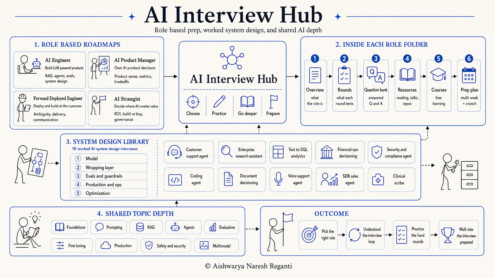

# AI Interview Hub



The most complete, role-specific map of how AI interviews actually work in 2026, and everything you need to walk in ready.

This hub is reverse-engineered from **500+ real job descriptions** and **direct conversations with people who hire at FAANG+, Bay Area startups and frontier model companies**. It is not generic advice scraped off the internet. Every role, every round, and every question bank here reflects what these loops are really testing, and how they have shifted as the job changed.

Generative-AI interviews stopped testing one generic skill set. What an AI Engineer is grilled on looks nothing like what a Product Manager, a Forward-Deployed Engineer, or a Strategist faces. So this hub is organized by the job you are actually interviewing for: pick your role, work its folder end to end, and pull from a shared library of worked system-design cases, concept deep-dives, and free courses.

Built by **[Aishwarya Naresh Reganti](https://www.linkedin.com/in/areganti/)**, CEO of LevelUp Labs, and **[Kiriti Badam](https://www.linkedin.com/in/sai-kiriti-badam/)**, Applied AI at OpenAI Codex.

**What is inside**

| | |
|---|---|
| **4 role tracks** | AI Engineer · AI Product Manager · Forward-Deployed Engineer · AI Strategist |
| **24 role guides** | each role has an overview, a rounds breakdown, a question bank, resources, courses, and a prep plan |
| **10 system-design case studies** | worked interviews on one 5-layer spine, each with an engineer writeup, a PM writeup, and runnable code |
| **9 topic deep-dives** | foundations, prompting, RAG, agents, evaluation, fine-tuning, production, safety, multimodal |
| **1,000+ question bank** | the role-agnostic warm-up covering what comes up in nearly every AI interview |
| **Free courses** | the full catalog, grouped by topic, starting with LevelUp's own material |

---

## How to use this hub

1. **Pick your role** below and open its folder.
2. **Study its interview loop.** Every role has a different set of rounds. Know exactly what each one tests before you prep for it.
3. **Work the folder end to end:** overview, then rounds, then drill the question bank, then go deep with resources and courses, then follow the prep plan to interview day.
4. **Pull from the shared library.** The system-design case studies, topic deep-dives, and courses below serve every role. Use them where you are thin.

```text
Pick your role  ->  Learn its rounds  ->  Drill the question bank  ->  Go deep (resources + courses + system design)  ->  Prep plan  ->  Interview day
```

---

## Which role are you?

- **[AI Engineer](roles/ai-engineer/README.md)** builds LLM-powered product features that ship and hold up in production. Prompting, context engineering, RAG, agents, evals, and reliability. Hired by product and platform teams that put models in front of users.
- **[AI Product Manager](roles/ai-product-manager/README.md)** owns products whose core behavior comes from a model. Capability judgment, probabilistic UX, evaluation strategy, and cost, latency, and risk tradeoffs.
- **[Forward-Deployed Engineer](roles/forward-deployed-engineer/README.md)** is a customer-facing engineer who embeds with a client, learns their domain, and ships working AI systems fast, from a vague business problem to a running product people trust. The OpenAI, Anthropic, and Palantir-style role.
- **[AI Strategist](roles/ai-strategist/README.md)** advises an organization on where AI creates value, how to sequence adoption, whether to build or buy, and how to manage cost, return, risk, and governance.

A quick comparison:

| Role | You mainly | Signature round | Heaviest topics |
|---|---|---|---|
| [AI Engineer](roles/ai-engineer/README.md) | build LLM features that ship | take-home + system design | RAG, agents, evaluation, system design |
| [AI Product Manager](roles/ai-product-manager/README.md) | decide what to build and why | product sense (design a feature) | capability judgment, metrics, tradeoffs |
| [Forward-Deployed Engineer](roles/forward-deployed-engineer/README.md) | build and deploy at the customer | ambiguous-case decomposition | full-stack build, communication, ambiguity |
| [AI Strategist](roles/ai-strategist/README.md) | advise on where AI creates value | the strategy case | landscape fluency, ROI, governance |

Every role folder has the same six parts, so once you know one you know them all: **Overview · Rounds · Question bank · Resources · Courses · Prep plan.**

---

## The roles, and the exact rounds each one faces

### ⚙️ AI Engineer

Builds LLM features that ship and survive production. The loop leans on a take-home and a live system-design round.

| Round | What it tests |
|---|---|
| 1. Recruiter screen | Fit, level, motivation, and whether you can tell your project story in plain language. A buzzword answer here can end the loop. |
| 2. Technical / coding | Practical Python plus hands-on LLM coding: call a model API, validate structured output, wire a small retrieval or tool-use loop, reason about correctness, cost, and latency. Not LeetCode. |
| 3. Take-home | A realistic build that mirrors the actual job. The single most predictive round for this role. |
| 4. LLM / ML system design | Architect an LLM system out loud and defend the tradeoffs: retrieval versus fine-tuning, agency versus control, evals as release infrastructure, the cost-latency-quality triangle. |
| 5. Behavioral | Ownership, ambiguity, handling a production incident, working with PMs and researchers, and the messiness unique to LLM products (a model that regresses after a provider update, a hallucination that reached a user). |
| 6. Hiring manager | Judgment, ownership, team fit, a first-90-days probe, and your questions, which are scored. |

**Go deeper:** [Overview](roles/ai-engineer/README.md) · [Rounds](roles/ai-engineer/rounds.md) · [Question bank](roles/ai-engineer/questions.md) · [Resources](roles/ai-engineer/resources.md) · [Courses](roles/ai-engineer/courses.md) · [Prep plan](roles/ai-engineer/prep-plan.md)

### 📋 AI Product Manager

Owns products whose core behavior comes from a model. The analytical and metrics round is the one that most predicts the hire.

| Round | What it tests |
|---|---|
| 1. Recruiter screen | Whether you are genuinely an AI PM (not a PM who read a few blog posts), your motivation, and one AI product you truly owned. |
| 2. AI product sense | The instinct to ask whether AI belongs in the problem at all, then product design under probabilistic behavior: users, the model's role, the UX around wrongness, and metrics. |
| 3. Analytical / metrics | Define and defend an evaluation strategy: offline eval sets and regression suites versus online signals, north-star versus guardrails, unit economics, and the discipline to catch a model silently getting worse. |
| 4. AI technical literacy | Whether technical people can trust you: RAG versus fine-tuning versus prompting, when an agent is warranted, context engineering, MCP, model selection, explained simply. |
| 5. Behavioral / leadership | Judgment under ambiguity and influence without authority, with an AI twist: have you killed an AI feature, or handled a model that degraded in production. |
| 6. Cross-functional / execution | Build versus buy, roadmap prioritization under a scarce data-science budget, PRDs for probabilistic features, and launch-readiness gates. |
| 7. Live prototype (rising in 2026) | Guide an AI builder tool and critically evaluate its output. Less about the code than the judgment. Meta hands candidates an internal tool; others use Cursor or v0. |

**Go deeper:** [Overview](roles/ai-product-manager/README.md) · [Rounds](roles/ai-product-manager/rounds.md) · [Question bank](roles/ai-product-manager/questions.md) · [Resources](roles/ai-product-manager/resources.md) · [Courses](roles/ai-product-manager/courses.md) · [Prep plan](roles/ai-product-manager/prep-plan.md)

### 🚀 Forward-Deployed Engineer

Embeds with a customer and ships working AI fast under ambiguity. The ambiguous-case decomposition round is the signature filter.

| Round | What it tests |
|---|---|
| 1. Recruiter screen | Motivation, role fit, communication, and whether you understand what an FDE actually does. |
| 2. Hiring-manager screen | Depth of your past work, ownership, and whether you led or followed. |
| 3. Coding | Parsing and transforming messy real-world data, integrating flaky external systems, clean tested code, narrated. Deliberately not algorithm trivia. |
| 4. System design / architecture | Real-world deployment: data flow and trust boundaries, identity and access, observability, failure modes and rollback, and where RAG, agents, and evaluation fit. |
| 5. Ambiguous case / decomposition (signature) | Take a vague business problem, clarify the real goal, surface assumptions, decompose it, sequence by risk and value, and propose a thin end-to-end first slice. Highest-weight round (about 30%), lowest pass rate (about 40%). Palantir made it famous. |
| 6. Customer simulation | Deliver bad news, push back on a bad request without losing the customer, and explain technical limits to non-technical people. |
| 7. Behavioral / values | Ownership, ambiguity tolerance, cross-functional collaboration, and, at the labs, mission alignment. |

**Go deeper:** [Overview](roles/forward-deployed-engineer/README.md) · [Rounds](roles/forward-deployed-engineer/rounds.md) · [Question bank](roles/forward-deployed-engineer/questions.md) · [Resources](roles/forward-deployed-engineer/resources.md) · [Courses](roles/forward-deployed-engineer/courses.md) · [Prep plan](roles/forward-deployed-engineer/prep-plan.md)

### 🧭 AI Strategist

Advises where AI creates value and how to sequence adoption. The case round is the heart of the loop.

| Round | What it tests |
|---|---|
| 1. Recruiter / hiring-manager screen | Whether you can talk about AI in business terms without hand-waving or drowning the room in jargon, plus your track record with AI initiatives. |
| 2. AI landscape and tech fluency | Whether your fluency is real and current: build-vs-buy-vs-fine-tune-vs-RAG calls, why evals matter, agents and their failure surface, cost, latency, reasoning models, MCP. This round protects the firm from strategists who sign off on bad technical plans. |
| 3. Case round (the heart) | The whole job in 60 minutes: structured thinking, ROI, prioritization, build versus buy, risk, and adoption. An AI-implementation case now shows up in roughly 1 in 3 first-round MBB interviews. |
| 4. Technical decomposition / light system design | Lay out a thin, buildable, governed path to production for one real workflow. The biggest filter in forward-deployed loops. |
| 5. Stakeholder communication / customer simulation | Carry a recommendation into a room that pushes back: executive presence, translating tradeoffs, delivering bad news, holding a line. Communication signals can carry close to half the decision for this role. |
| 6. Behavioral | Leadership, influence without authority, resilience through a stalled initiative, and ethics. |
| 7. Take-home variant | A mini AI strategy or opportunity assessment for a described company, delivered as a short deck or memo. |
| 8. Your questions and debrief | Strong candidates use their own questions to demonstrate the role. |

**Go deeper:** [Overview](roles/ai-strategist/README.md) · [Rounds](roles/ai-strategist/rounds.md) · [Question bank](roles/ai-strategist/questions.md) · [Resources](roles/ai-strategist/resources.md) · [Courses](roles/ai-strategist/courses.md) · [Prep plan](roles/ai-strategist/prep-plan.md)

---

## System design case studies

The signature round for AI Engineers and Forward-Deployed Engineers, and a strong asset for PMs and Strategists. These are **10 worked AI system-design interviews**, each written as a real question, a full answer, then the follow-ups. Every case ships **runnable, provider-agnostic code** and comes in **two versions**: an **engineer** writeup (the harness, tools, evals, code) and a **PM** writeup (capability judgment, metrics, rollout) of the same scenario.

Start at the **[system-design overview](system-design/README.md)**.

**The spine every case shares.** Rather than a new framework per problem, all 10 cases compose the same 5 layers, so once you internalize it you can design anything:

1. **The model** (the one non-deterministic component).
2. **The wrapping layer** (the architecture: knowledge, tools, and memory).
3. **Evals and guardrails** (evaluation moved from a final gate to the center of the design).
4. **Production and ops** (serving, observability, cost, latency, rollback).
5. **Optimization** (routing, caching, and where multi-agent belongs).

### The 10 cases, by type

**Retrieval and knowledge assistants**
- **[Customer-support agent](system-design/customer-support-agent/README.md)** answers from a help center and takes safe actions, escalating refunds and high-impact steps to a human. [[PM version](system-design/customer-support-agent/pm.md)] [[code](system-design/customer-support-agent/code/)]
- **[Enterprise research assistant](system-design/enterprise-research-assistant/README.md)** answers employee questions with citations across wiki, docs, tickets, code, and chat, scoped to what each user is allowed to see. [[PM version](system-design/enterprise-research-assistant/pm.md)] [[code](system-design/enterprise-research-assistant/code/)]

**Structured data and analytics**
- **[Text-to-SQL analytics](system-design/text-to-sql-analytics/README.md)** turns a business question into correct, verified SQL over a warehouse, and abstains when it cannot validate the result. [[PM version](system-design/text-to-sql-analytics/pm.md)] [[code](system-design/text-to-sql-analytics/code/)]

**Decisioning and document extraction**
- **[Financial-ops decisioning](system-design/financial-ops-decisioning/README.md)** extracts facts from invoices and expenses, applies policy in deterministic code, and decides approve, deny, or route, with an immutable audit trail. [[PM version](system-design/financial-ops-decisioning/pm.md)] [[code](system-design/financial-ops-decisioning/code/)]
- **[Document decisioning](system-design/document-decisioning/README.md)** reads underwriting-style documents, extracts fields with confidence, and decides approve, decline, or refer. [[PM version](system-design/document-decisioning/pm.md)] [[code](system-design/document-decisioning/code/)]

**Detection and compliance**
- **[Security and compliance agent](system-design/security-compliance-agent/README.md)** screens every event as allow, flag, or block against written policy, sending the uncertain middle to an analyst. [[PM version](system-design/security-compliance-agent/pm.md)] [[code](system-design/security-compliance-agent/code/)]

**Autonomous and real-time agents**
- **[Coding agent](system-design/coding-agent/README.md)** turns a task plus a repo plus tests into a reviewed pull request, working in a sandbox with a human on the merge. [[PM version](system-design/coding-agent/pm.md)] [[code](system-design/coding-agent/code/)]
- **[Voice-support agent](system-design/voice-support-agent/README.md)** contains routine calls in spoken conversation with low latency and barge-in, handing off cleanly to a person. [[PM version](system-design/voice-support-agent/pm.md)] [[code](system-design/voice-support-agent/code/)]
- **[SDR sales agent](system-design/sdr-sales-agent/README.md)** enriches and qualifies inbound leads and drafts a compliant first-touch email for a human to approve and send. [[PM version](system-design/sdr-sales-agent/pm.md)] [[code](system-design/sdr-sales-agent/code/)]

**Regulated and high-stakes domains**
- **[Clinical scribe](system-design/clinical-scribe/README.md)** turns a visit transcript into a structured SOAP-note draft that a clinician reviews and signs. Nothing auto-files. [[PM version](system-design/clinical-scribe/pm.md)] [[code](system-design/clinical-scribe/code/)]

### The design topics these cases teach

Across the 10 cases, the collection covers the topics a system-design interviewer actually probes:

- **Retrieval and grounding:** hybrid search, reranking, a relevance floor, and grounding every claim (customer-support, enterprise research, voice, text-to-SQL).
- **Permission-scoped retrieval and the lethal trifecta:** keeping untrusted content, private data, and the ability to act from meeting in one path (enterprise research, security).
- **Tool use and bounded agent loops:** typed tools, least privilege, and a step-capped ReAct loop (every agentic case).
- **Structured extraction with confidence:** typed fields, a confidence signal, and routing shaky reads to a human (financial-ops, document decisioning, clinical, text-to-SQL).
- **Evals as release infrastructure, guardrails, and the discovery loop:** offline gates, online signals, and naming the failure your metrics missed (every case).
- **Deterministic policy versus model judgment:** encoding the knowable rules in code and reserving the model for the fuzzy calls (financial-ops, document decisioning, security).
- **Human-in-the-loop and escalation gates:** refunds, sign-offs, and merges that never happen without a person (every case).
- **Real-time and latency:** streaming ASR and TTS, endpointing, and barge-in under a one-second budget (voice).
- **Audit trails and compliance:** immutable, defensible records on every decision (financial-ops, document decisioning, security, clinical).
- **Multi-agent as an optimization, not a default:** an orchestrator with specialists only where parallelism and task value justify the cost (enterprise research, coding, and others).

---

## Shared library for every role

### Topic deep-dives

Concept-by-concept reference pages. Every loop expects fluency in these. Read them to fill gaps or refresh before a technical screen.

- **[Foundations](../topics/foundations.md):** how LLMs work: tokens, embeddings, transformers, and the vocabulary the rest depends on.
- **[Prompting](../topics/prompting.md):** prompt and context engineering, the primary lever in modern LLM products.
- **[RAG](../topics/rag.md):** retrieval-augmented generation, chunking, indexing, and grounding answers in your own data.
- **[Agents](../topics/agents.md):** tool use, planning, memory, and multi-step autonomous systems.
- **[Evaluation](../topics/evaluation.md):** building eval sets, LLM-as-judge, regression suites, and catching silent degradation.
- **[Fine-tuning](../topics/fine-tuning.md):** when to fine-tune versus prompt, and the methods for adapting a base model.
- **[Production](../topics/production.md):** serving, latency, cost, monitoring, and everything between a demo and a live system.
- **[Safety and security](../topics/safety-security.md):** prompt injection, guardrails, privacy, and responsible AI.
- **[Multimodal](../topics/multimodal.md):** models that work across text, images, audio, and video.

### Courses

- **[All free courses, by topic](../courses.md):** the full catalog in this guide, grouped by topic, starting with LevelUp's own material. Each role folder also points to the best courses for that specific loop.
- **Learn live with us.** Beyond the free material, we teach cohort-based courses on Maven, and more than 3,000 builders have learned with us so far. The two most relevant to this hub: **[AI System Design](https://maven.com/aishwarya-kiriti/genai-system-design)** and **[Advanced AI Evals](https://maven.com/aishwarya-kiriti/evals-problem-first)**. See [all our live courses](https://maven.com/aishwarya-kiriti).

### 60 GenAI questions (fundamentals warm-up)

- **[60 GenAI Interview Questions](60_gen_ai_questions.md):** a broad, role-agnostic bank (1,000+ lines) covering the concepts that surface in almost any AI interview. A good gut-check before a screen. It is a warm-up, not the main event: the depth lives in your role folder and the system-design cases.

---

## Full index

Everything in this section, one click away.

- **Roles:** [AI Engineer](roles/ai-engineer/README.md) · [AI Product Manager](roles/ai-product-manager/README.md) · [Forward-Deployed Engineer](roles/forward-deployed-engineer/README.md) · [AI Strategist](roles/ai-strategist/README.md)
  - Each with: Overview (README) · Rounds · Question bank (questions) · Resources · Courses · Prep plan
- **System design:** [overview](system-design/README.md) · [customer-support](system-design/customer-support-agent/README.md) · [enterprise research](system-design/enterprise-research-assistant/README.md) · [text-to-SQL](system-design/text-to-sql-analytics/README.md) · [financial-ops](system-design/financial-ops-decisioning/README.md) · [security and compliance](system-design/security-compliance-agent/README.md) · [coding agent](system-design/coding-agent/README.md) · [document decisioning](system-design/document-decisioning/README.md) · [voice support](system-design/voice-support-agent/README.md) · [SDR sales](system-design/sdr-sales-agent/README.md) · [clinical scribe](system-design/clinical-scribe/README.md) (each has a PM version and a code folder)
- **Topics:** [foundations](../topics/foundations.md) · [prompting](../topics/prompting.md) · [RAG](../topics/rag.md) · [agents](../topics/agents.md) · [evaluation](../topics/evaluation.md) · [fine-tuning](../topics/fine-tuning.md) · [production](../topics/production.md) · [safety and security](../topics/safety-security.md) · [multimodal](../topics/multimodal.md)
- **More:** [60 GenAI questions](60_gen_ai_questions.md) · [all free courses](../courses.md)
