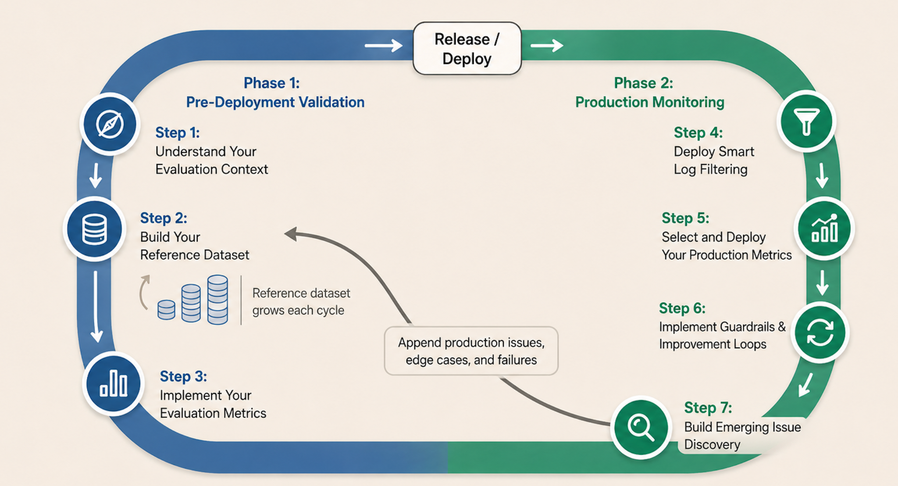

# Designing a Security and Compliance Agent

## The interview question

> "Design an agent that monitors activity streams for policy violations and anomalies and enforces compliance in real time. Walk me through it."

A generative AI system design interview, worked end to end: **the question, a full answer, then the follow-ups**. It is built on one spine (the 5 layers below), grounded in Problem-First design, backed by real-world benchmarks and deployment data, and it ships with [runnable, provider-agnostic LangGraph code](code/).

**AI system design is ML system design.** Start from requirements and metrics, then design the architecture to meet them. Pick the cheapest thing that clears the bar. Design for how it fails and how you measure it. Then scale. What is new is that the core component is non-deterministic, so evaluation moves from a final gate to the center of the design. In this system that shift matters more than usual, because the agent watches a live stream and acts on it in real time, so a wrong call has consequences the moment it is made.

> **Read this with your coding agent.** This case study is public, so you can point Claude Code, Codex, Cursor, or any agent harness at it and have it walk you through interactively, then run the code. Paste a prompt like:
>
> *"Read https://github.com/aishwaryanr/awesome-generative-ai-guide/tree/main/interview_prep/system-design/security-compliance-agent (the README.md and the code/ folder). Walk me through the 5-layer spine, then quiz me one layer at a time on the design decisions and the tradeoffs, especially the false-positive budget, the lethal trifecta, and the audit trail. When we get to the code, run `code/run.py` and explain what each node in the graph does."*
>
> You can also ask it to reimplement the design in a different SDK or framework you prefer.

---

## The spine

This case is built on the same 5-layer spine as the rest of the collection: **1 the model**, **2 the wrapping layer** (the architecture: knowledge, tools, and memory), **3 evals and guardrails**, **4 production and ops**, and **5 optimization** (where multi-agent lives). System design is the work of composing them into one coherent system. For how we use this spine and why it is a starting point rather than a rulebook, see [the spine](../README.md#the-spine-how-we-think-about-ai-system-design).

The rest of this case study walks these layers for this problem, going deepest where it is hardest.

---

## The answer

### Step 1: scope before you architect

The first move is clarifying the problem, before any model or stream processor, because in AI the largest failures are designed in before a single prompt is written. Pin down 4 things ([Problem-First](https://maven.com/aishwarya-kiriti/genai-system-design)).

> **What is Problem-First?** A framework we developed and teach at [LevelUp Labs](https://levelup-labs.ai): work backwards from the business problem and the user's pain, scope hard, and only then reach for AI, choosing the smallest intervention that moves a measurable outcome. It is the spine of our [AI System Design course](https://maven.com/aishwarya-kiriti/genai-system-design). The 4 questions below are the short version.

- **User and pain.** A security and compliance team watches a firehose of activity: access logs, data movements, configuration changes, transactions. A human reviewer clears a case in minutes, and the volume is millions of events a day, so most events are never truly reviewed. The pain is on both sides at once. Real violations slip through because nobody has time to look, and the alerts that do fire are mostly noise, so the analysts who receive them learn to tune them out. That second failure is the one that quietly sinks these systems, and there is hard data on it below.
- **Outcome, written before the system.** Screen every event on the stream, allow the routine majority automatically, catch the genuine violations, and route the uncertain middle to a human with enough context to decide fast. Measured by the share of real violations caught, the false-positive rate on what reaches a human, the time from event to decision, and whether every decision can be explained and reproduced.
- **The AI intervention, narrowed until it hurts.** Classify each event as allow, flag, or block, grounded in written policy and the actor's normal behavior, and enforce only the clear cases while a human owns the rest. It stays well short of an autonomous security platform that quarantines accounts on its own judgment.
- **System and safety.** An evaluation set that gates every release, a low false-positive budget treated as a hard constraint, defense against [prompt injection](https://genai.owasp.org/llmrisk/llm01-prompt-injection/) carried in the events themselves, human review as the default for anything uncertain, an immutable audit trail, and a rollback plan.

The clarifying questions you need to ask (their answers set every later tradeoff): what is the event volume and its peak rate; what is the latency budget from event to decision; which enforcement actions may the agent take on its own and which need a human; what is the acceptable false-positive rate, and what is the cost of a missed violation; how are the policies written and how often do they change; what must the audit trail prove, and to whom. This also avoids the traps that sink these projects: leading with "build an anomaly-detection model" (solutioning in the problem statement), packing insider threat and fraud and access review and data-loss into one system (over-scoping), and designing without a measurable owner for the false-positive rate.

> **Real outlier: alert fatigue is the failure mode rather than a footnote.** The 2025 SANS Detection and Response survey found that 73% of security teams name false positives as their top detection challenge, and false-positive rates in enterprise operations centers frequently exceed 50%, reaching as high as 80% in some organizations. When most alerts lead nowhere, analysts start treating new ones with skepticism, and genuine threats get overlooked. That is the whole reason the false-positive budget is a hard constraint in scoping rather than a metric you tune later: a detector that cries wolf gets ignored, and an ignored detector catches nothing. [[SANS via Stamus Networks](https://www.stamus-networks.com/blog/what-the-2025-sans-detection-response-survey-reveals-false-positives-alert-fatigue-are-worsening)]

> **Real outlier: automation helps, and ungoverned automation is the risk.** IBM's 2025 Cost of a Data Breach report found that organizations using AI and automation extensively across security saved an average of 1.9 million dollars per breach and cut the breach lifecycle by about 80 days. The cautionary half sits in the same report: 97% of organizations that had an AI-related security incident lacked proper AI access controls, and high use of unapproved AI added about 670 thousand dollars to the average breach cost. That is this design in one story. The agent is worth building because it moves real numbers, and it is worth governing because an agent with access and the ability to act is itself a new attack surface. [[IBM Cost of a Data Breach 2025](https://www.ibm.com/reports/data-breach)] [[IBM analysis](https://www.ibm.com/think/x-force/2025-cost-of-a-data-breach-navigating-ai)]

Why this problem is worth an agent right now: enterprise security and compliance work is moving from reactive to proactive, from a periodic look-back audit to continuous screening of the live stream, which is exactly the shape an agent fits. Provider security platforms have made this the headline of their agentic offerings ([Google Cloud's agentic SOC](https://cloud.google.com/solutions/security/agentic-soc), [Microsoft Security Copilot for the SOC](https://techcommunity.microsoft.com/blog/microsoftthreatprotectionblog/security-copilot-for-soc-bringing-agentic-ai-to-every-defender/4470187)). And the demand is concentrated where the stakes are highest: an estimated 31% of enterprises run at least one agent in production, and banking and insurance lead every other industry at roughly 47%, driven by fraud triage and mid-office compliance workflows that match agentic strengths. [[industry data points](https://www.digitalapplied.com/blog/ai-agent-adoption-2026-enterprise-data-points)]

### The assumptions we make about the data and the use case

Before architecting, state what you are assuming about the data, because every method in the wrapping layer below is chosen for a specific shape of data. Change an assumption and the method changes with it. For this case study, assume:

- **The input is a high-volume event stream.** Millions of structured events a day: access logs, data-movement records, config changes, transactions, each a small record with an actor, an action, a resource, a channel, a timestamp, and often a free-text note. *This is why* the design is built around streaming ingestion and a cheap first pass on every event, and why you cannot afford to run the model on all of them.
- **Most events are routine, and violations are rare.** The base rate of real violations is low, which is what makes the false-positive problem so sharp: even a small false-positive rate on a huge stream buries the analyst. *This is why* the false-positive budget is the load-bearing constraint and the detector is layered, so the expensive judgment runs only on the events that need it.
- **Policies are written, and they change.** The rules the agent enforces live in policy documents, control catalogs, and past-incident write-ups, updated as regulations and internal controls change. *This is why* there is a retrievable policy corpus the model grades events against, rather than rules baked into a prompt, and why re-indexing on policy edits matters.
- **Latency is real-time, with a two-speed budget.** A clear violation must be caught and enforced in the moment, within a tight budget, while a subtle anomaly can take a little longer to correlate. *This is why* the deterministic checks run inline on every event and the deeper model and anomaly analysis run on the flagged subset, so the fast path stays fast.
- **Explainability and audit are mandatory.** A human must see why every flag fired, and a regulator must be shown that the record of decisions was not edited after the fact. *This is why* every decision carries its evidence and every decision is written to a tamper-evident audit trail, treated as load-bearing rather than a logging afterthought.
- **The stream is untrusted, and some of it is adversarial.** The events the agent reads can be shaped by the very people it is watching, including text crafted to manipulate the model. *This is why* the event content is treated as data the agent never obeys, and why enforcement is separated from judgment (the lethal trifecta, below).

Keep these in view as you read the wrapping layer: each choice below points back to one of them. If your stream is low volume, or violations are common, or nothing needs to be enforced in real time, revisit the assumption and pick a different method.

### Step 2: walk the layers for this system

**Layer 1, the model.** The answer here is a routing strategy tuned to the volume. The overwhelming majority of events never reach a model at all, because deterministic rules clear them first (below). Of the events that need judgment, a cheap fast model handles the common ambiguous cases, a stronger model handles the genuinely hard calls, and a reasoning model is reserved for the rare serious escalation where the cost of being wrong is high. The model is non-deterministic, so the same event can produce different phrasings of a verdict, and for a decision that gets audited that is a problem. You handle it with [structured output](https://platform.openai.com/docs/guides/structured-outputs) (the verdict is a fixed set of labels rather than free prose), grounding every judgment in a retrieved policy, and pinning the model version in the audit record so a past decision can be reproduced.

**Layer 2, the wrapping layer (the architecture).** This is the architecture wrapped around the model, and it is 3 things: knowledge, tools, and memory. For a compliance agent the interesting move in this layer is the shape of the detector, so start there, then walk knowledge, tools, and memory.

**The layered detector.** The core design decision is that not every event deserves the same scrutiny, and spending a model call on all of them would be slow, expensive, and, worse, noisy. So detection is layered, cheapest and most certain first.

```
┌───────────────────────────────────────────────────────────┐
│ The layered detector: cheapest, most certain checks first │
└───────────────────────────────────────────────────────────┘

  ┌───────────────────────────────────┐
  │               event               │
  └───────────────────────────────────┘
                    ▼
  ┌───────────────────────────────────┐
  │      1  Deterministic rules       │
  │ runs on every event, fast + exact │
  └───────────────────────────────────┘
                    ▼
  ┌───────────────────────────────────┐
  │        2  Retrieve policy         │
  │   when a rule cannot settle it    │
  └───────────────────────────────────┘
                    ▼                   raises severity
  ┌───────────────────────────────────┐    ┌─────────────────────────┐
  │         3  Model judgment         │    │    4  Anomaly signal    │
  │  reads event + policy + anomaly   │◀──▶│ deviation from baseline │
  └───────────────────────────────────┘    └─────────────────────────┘
                    ▼
  ┌───────────────────────────────────┐
  │              Verdict              │
  │       allow / flag / block        │
  └─────────────────┬─────────────────┘
          ┌─────────┴─────────┐
     flag ▼                   ▼ allow / block
  ┌──────────────┐  ┌──────────────────┐
  │ Human review │  │ Enforce or allow │
  │  (+ audit)   │  │    (+ audit)     │
  └──────────────┘  └──────────────────┘
```

- **Deterministic rules first.** A maintained library of exact checks: a bulk export of customer records to an external address, an attempt to disable audit logging, a known-bad pattern. These are fast, cheap, and certain, they run on every single event, and they carry no model non-determinism, so they both clear the routine majority and block the unambiguous violations without ever paying for a model call. This is the same instinct as a [complex event processing](https://en.wikipedia.org/wiki/Complex_event_processing) or [SIEM](https://en.wikipedia.org/wiki/Security_information_and_event_management) rule engine, and it is where you want as much of the decision as possible to live.
- **The model for the ambiguous middle.** The events a rule cannot settle are where the model earns its place: it reads the event, the policy it should be graded against, and the anomaly signal, and returns a verdict with a reason. The model handles the judgment that is too contextual for a fixed rule and too varied to enumerate.
- **The anomaly signal.** Separate from policy, some events are suspicious because they deviate from what is normal for that actor: an off-hours access, a volume spike, a new location. This is the idea behind [user and entity behavior analytics](https://en.wikipedia.org/wiki/User_behavior_analytics): learn a baseline per entity and score the deviation. A deviation on its own is rarely enough to block, and it is exactly the kind of weak signal that, if you let it fire alerts alone, produces the alert fatigue from scoping. So it raises severity and pushes an event toward human review rather than deciding on its own.

The reason to layer it this way ties straight back to the false-positive budget: the certain, cheap checks make the high-confidence decisions, the model makes the contextual ones, and no single weak signal is trusted to block. That is [anomaly detection](https://en.wikipedia.org/wiki/Anomaly_detection) with a governor on it.

**Knowledge (policy retrieval).** The model must grade an event against the actual written policy, or it invents compliance. That is a retrieval pipeline over your policy corpus, and although it is lighter here than in a document-heavy system, the stages are the same decisions. *Given our assumption* that policies are written documents that change, you parse them structure-aware and attach metadata (policy id, control, version, effective date), chunk by policy clause so one retrieved unit is one enforceable rule, [embed](https://arxiv.org/abs/2004.04906) each clause (a list of numbers that places similar text close together), and store the vectors in an index for fast similarity search. Retrieval itself is worth doing as [hybrid search](https://www.pinecone.io/learn/hybrid-search-intro/): [dense retrieval](https://arxiv.org/abs/2004.04906) matches an event described in one wording to a policy written in another, and [sparse BM25](https://en.wikipedia.org/wiki/Okapi_BM25) catches the exact control ids and resource names that carry no embeddable meaning, merged with [Reciprocal Rank Fusion](https://www.elastic.co/docs/reference/elasticsearch/rest-apis/reciprocal-rank-fusion). The one stage that is not optional is the **relevance floor**: when no policy clears a similarity threshold, the agent retrieves nothing and routes the event to a human rather than grading it against the wrong rule (the abstention instinct behind [Self-RAG](https://arxiv.org/abs/2310.11511) and [Corrective RAG](https://arxiv.org/abs/2401.15884)). *What data decides it:* sweep the threshold on a labeled set of events paired with the policy that should govern them, and pick the point that keeps the agent from confidently applying an unrelated policy. The repo's [RAG topic page](../../../topics/rag.md) collects the primary sources for each of these stages, including [reranking](https://www.sbert.net/examples/applications/cross-encoder/README.html) and [contextual retrieval](https://www.anthropic.com/news/contextual-retrieval) for when the corpus grows.

**Tools (enforcement and enrichment).** Tools are the agent's hands, and in this system they are the most dangerous part, so each one is a typed, allowlisted contract rather than open-ended action.

```
  get_actor_context(actor_id) -> {role, dept, recent_activity}   READ   enrich before deciding
  get_baseline(actor_id) -> {typical_hours, typical_volume}      READ   the anomaly reference
  open_case(event, verdict, evidence) -> case_id                 WRITE  idempotent, logged, routes to a human
  block_action(event) -> receipt                                 WRITE  high-impact -> gated, clear signal only
  quarantine_account(actor_id)                                   WRITE  high-impact -> human approval (Follow-up 2)
```

The calls that matter: the **read tools are cheap to trust** (enriching an event with the actor's role or baseline has low blast radius), while the **write tools are gated** by least privilege, so an autonomous block fires only on a clear, policy-named signal and anything heavier than that needs a human. **[Idempotency](https://en.wikipedia.org/wiki/Idempotence)** matters because the same event can be re-delivered on a stream, and a retried `open_case` must not open two. Every write is **logged to the audit trail** before it counts as done. The guiding constraint is **blast radius**: design the tools so the worst a mistaken judgment can do is open a needless case for a human to close, while an irreversible enforcement action stays behind a human.

**Memory.** Memory is what lets the agent correlate rather than judge each event in isolation, and it comes in layers.

```
  SHORT-TERM (recent window) : the last events for this actor, so a burst is seen as one pattern
  WORKING   (this event)     : the retrieved policy, the anomaly signal, the enrichment the agent is reasoning over
  LONG-TERM (per entity)     : the behavior baseline and past cases, RETRIEVED on demand, never stuffed into the prompt
```

The calls that matter: **the baseline is the memory that makes anomaly detection possible**, and it has to be kept fresh from the stream without letting an attacker slowly train it to accept bad behavior. **Retrieve past cases, do not dump them** (pull the 2 relevant prior incidents for this actor rather than the whole history). And **treat memory as untrusted**, because a baseline learned from events an adversary controls is an injection vector one step removed, which is the memory arm of the lethal trifecta below.

Together, the layered detector, policy retrieval, enforcement tools, and entity memory are the architecture wrapped around the model. Now the two layers that carry this design.

**Layer 3, evals and guardrails.** This is the center of the design, because the guardrail is the product. The whole system is a guardrail: a thing that watches live traffic and acts on it in real time. You cannot ship what you cannot measure, and here the thing you most need to measure is whether the agent is trustworthy enough that a human will act on its output instead of tuning it out. Start where we teach you to start: **from failure modes.** For a compliance agent the unacceptable failures are a false positive that buries the analyst and erodes trust, a false negative that lets a real violation through, an unexplained flag a human cannot act on, and a decision that cannot be reproduced when a regulator asks. Translate each into an observable behavior, then measure it. This section stays consistent with the free [AI Evals for Everyone](../../../free_courses/ai_evals_for_everyone/README.md) course.

**Measure against today's baseline rather than an abstract target.** The right bar is the status quo: your current detection process and the analyst triage that follows it. Where coverage was too costly to extend, so whole classes of events went unreviewed, an agent that watches them reliably clears a low bar by existing. Where your existing detections and analysts already catch the real violations, the agent has to match or beat them, measured retrospectively against the alerts and dispositions in your history. That keeps the eval tied to the decision the business faces rather than chasing a round accuracy number.

Evaluate at three levels: **each component** (did retrieval find the right policy, did the rule engine fire correctly, did the model ground its verdict, did the anomaly signal match a labeled deviation), **the whole task** end to end (was this event routed to the right destination, allow, flag, or block), and **live traffic** (is it still trustworthy in production).

**The precision-recall tradeoff is the whole game here.** [Precision and recall](https://en.wikipedia.org/wiki/Precision_and_recall) pull against each other: precision is the share of the agent's flags that are real violations, and recall is the share of real violations the agent catches. Tighten the agent to catch everything and precision falls, so the analyst drowns in false positives and stops trusting it. Loosen it to keep flags clean and recall falls, so real violations slip through. Because the base rate of violations is low and alert fatigue is the documented killer, this design leans toward precision on what gets enforced autonomously, and uses the human-review route as the release valve: the uncertain middle goes to a person rather than being forced into an allow or a block. Recall is recovered through the flag path and the discovery loop, so the agent stays sensitive without making the analyst pay for every weak signal.

> **Real finding: [tau2-bench](https://arxiv.org/abs/2506.07982).** On a tool-using agent, a single-attempt pass rate looks respectable, but pass^k (succeed on all k independent tries) collapses as k grows. A compliance agent that makes the right call on a single try yet errs 1 run in 4 is not shippable, because it runs on every event on the stream and the wrong calls accumulate into exactly the noise that gets it ignored. Reliability is the bar, above average accuracy.

**Three ways to measure a behavior.** Every metric is implemented one of three ways. Reach for the cheapest and most reliable one the behavior allows.
- **Code-based metrics.** Deterministic checks: did the rule engine fire on a known-bad event, is the verdict one of the allowed labels, did a blocked event carry a named policy, was the audit entry written. Fast, reliable, cheap. Use wherever "good" is objectively checkable, and compare against a labeled reference set.
- **LLM judges.** One model scoring another against an explicit rubric, for the qualities code cannot capture: is the explanation on a flag actually supported by the evidence, is the verdict consistent with the policy. Scalable, and a new source of non-determinism, so it must be calibrated before you trust it (below).
- **Human evaluation.** The gold standard you calibrate the other two against, and in this domain the humans are the compliance analysts themselves. Too slow to run on all traffic, so you sample: calibration, edge cases, and every high-stakes enforcement.

Most real systems use all three together.

**Offline: per-component evaluation metrics (the pre-deployment gate).** Build a reference dataset of labeled events across clear-allow, clear-block, ambiguous, off-baseline, and adversarial cases, each tagged with the destination it should reach and the policy that governs it. Then score each component with metrics chosen from its failure modes, drawing from this menu rather than instrumenting all of it.

| Component | Failure mode | Candidate metrics | Method |
|---|---|---|---|
| **Rule engine** | misses a known violation, or over-fires | rule precision, rule recall, coverage of the labeled violation set | code-based against labeled events |
| **Policy retrieval** | grades against the wrong policy, or none | recall@k, precision@k, [MRR](https://en.wikipedia.org/wiki/Mean_reciprocal_rank), [nDCG](https://en.wikipedia.org/wiki/Discounted_cumulative_gain), abstention correctness | code-based against labeled event-to-policy pairs |
| **Model judgment** | wrong verdict, unsupported explanation | classification accuracy on allow/flag/block, [explanation faithfulness](https://docs.ragas.io/en/stable/concepts/metrics/available_metrics/faithfulness/), false-positive rate, false-negative rate | LLM judge with rubric + labeled verdicts |
| **Anomaly signal** | flags normal behavior, misses real deviation | precision and recall on labeled deviations, drift of the baseline | code-based against labeled behavior |
| **Safety** | obeys injected instructions, takes an unsafe action | injection-resistance rate, unsafe-action rate, over-block rate | adversarial red-team suite |
| **Escalation** | auto-decides what a human should own, or floods the queue | escalation precision, escalation recall, human-queue volume | LLM judge / code-based on a labeled should-escalate set |
| **End to end** | event routed to the wrong destination | routing accuracy, false-positive rate, false-negative rate, **pass^k** | scenario suite + judge |

That table is deliberately broad so you know the landscape. Treat it as a reference to draw from: these are the metrics teams reach for, and your job is to choose wisely and instrument only the few that earn their place. A dashboard with 30 metrics and no owner tells you nothing. For this product the two that earn a permanent place are the **false-positive rate** (the constraint the whole design serves) and **pass^k** (reliability across the stream), and you report both alongside the average rather than instead of it.

**Choosing which metrics to actually run: Impact, Reliability, Cost.** Running every metric is expensive, so score each candidate on three dimensions and keep the high-signal ones.
- **Impact:** does it reveal an actionable problem, or is it merely interesting? The false-positive rate is pure impact here, because it maps straight to whether analysts keep trusting the system.
- **Reliability:** human evaluation and validated code checks are high; a calibrated LLM judge is medium; an uncalibrated automated score is low.
- **Cost:** a code check is cheap, a fast judge call is medium, detailed human review is expensive.

High impact and low cost are the must-haves (the rule checks, the label validity, the injection suite). High impact and high cost are strategic investments you run on a sample (a calibrated explanation-faithfulness judge). Low impact and high cost you drop.

**Online: guardrails vs the improvement flywheel.** Live evaluation does two different jobs, and conflating them is a common mistake.
- **Guardrails (online, real-time).** The few checks whose failure would immediately hurt: an unsafe or ungrounded block, an injection attempt in the event content, a verdict with no supporting policy. These run inline so the system can act the moment they trip, and the safe action is to fall back to human review. Guardrails must be fast and reliable before sophisticated.
- **Improvement flywheel (offline, batch).** Everything else: the false-positive trend, recall on a sampled set, baseline drift, the human-queue volume. This is how the system gets better over weeks, while the guardrails handle the disasters in the moment.

The metrics you watch on live traffic:

| Metric | Job | Why it matters |
|---|---|---|
| false-positive rate on flags | guardrail + flywheel | the constraint from scoping; the number that decides whether analysts trust it |
| unsafe / wrong auto-block rate | guardrail | the hard ceiling; an autonomous block on a legitimate action must stay near zero |
| injection-attempt rate in events | guardrail | fires when the stream is trying to manipulate the agent |
| verdict-grounding on a live sample | guardrail + flywheel | catches ungrounded judgments before a human acts on one |
| detection recall (estimated) | flywheel | share of seeded or later-confirmed violations the agent caught |
| human-queue volume and clear time | flywheel | too high means over-flagging, the alert-fatigue signal |
| baseline drift per entity | flywheel | surfaces a baseline being trained toward accepting bad behavior |
| p50 / p95 event-to-decision latency | flywheel | the real-time budget, split across the detector stages |
| cost per thousand events | flywheel | unit economics on a stream this large |
| audit-chain verification | guardrail | proves the record of decisions is intact and untampered |

**Trust the judge, then close the discovery loop.** Calibrate an LLM judge before it gates anything: hand-label a few hundred events with your analysts, run the judge on the same set, measure agreement ([percent agreement or Cohen's kappa](https://en.wikipedia.org/wiki/Cohen%27s_kappa)), and refine the rubric until it aligns with the humans. Re-calibrate whenever you change the underlying model, and run the judge on a sampled percentage of live traffic to control cost.

Then run the discovery loop, because attackers and edge cases will always find failures your metrics were never built for. Sample live traffic on **signals** (an analyst overturning a verdict, a violation found later that the agent had allowed, a spike in one flag type). When a signal keeps firing but your metrics look clean, that gap is the tell: a human reads those traces, names the quality dimension you were not measuring, and it becomes a new metric added back into the reference dataset. Evaluation is never finished. You build for the failures you can anticipate, and you monitor to discover the ones you cannot.



Instrument the LangGraph app with OpenInference so every node, rule check, model call, and enforcement becomes a span in **Arize** (Phoenix / AX), which is where the online evals and drift alerts run. Reading traces is how you find the exact step where the agent's judgment diverged from an analyst's. Tooling worth knowing: Ragas and DeepEval for component metrics, promptfoo for CI gates, Arize Phoenix for tracing and online evals. *Deeper:* [AI Evals for Everyone](../../../free_courses/ai_evals_for_everyone/README.md), our [Advanced AI Evals course](https://maven.com/aishwarya-kiriti/evals-problem-first), and the [Evaluation topic](../../../topics/evaluation.md).

**Layer 4, production and ops.** This is the second load-bearing layer, because the system runs in real time on a stream that never stops. The design lives or dies on ingestion, latency, and an audit trail that holds up.

**Streaming event ingestion.** The events arrive as a continuous flow, so the front of the system is a [stream](https://en.wikipedia.org/wiki/Stream_processing) rather than a request queue. A log-backed broker such as [Apache Kafka](https://kafka.apache.org/documentation/) gives you the two properties this design needs: durable, ordered, replayable events (so you can re-run the detector on a window after you improve it, and so no event is lost under load), and partitioning by entity (so all of one actor's events land in order on the same consumer, which is what makes the behavior baseline and burst correlation possible). Consumers scale horizontally against the partitions, and backpressure is a first-class concern: when a spike outpaces the deep analysis, the deterministic layer keeps clearing and blocking on every event inline while the model and anomaly work sheds to a sampled or queued path, so the system degrades gracefully instead of dropping events or stalling the stream.

**The two-speed latency budget.** Split the budget across the detector, because the layers have very different costs. The deterministic rules run inline on every event and must be cheap enough to keep up with peak throughput, so they carry the real-time enforcement of clear violations. The retrieval, model, and anomaly stages run only on the ambiguous subset and can spend a little more time, because a subtle correlation does not need to resolve in the same millisecond. That two-speed split is what lets a real-time guarantee coexist with a large stream: you promise low latency on the decisions that need it and accept slightly higher latency on the judgment calls that do not.

**The immutable audit trail.** Explainability from Layer 3 says a human must see why a flag fired; the audit trail says the record of what the agent decided must be provable after the fact. Write every decision to an append-only store, and chain the entries: each entry carries a cryptographic hash of the one before it (a [hash chain](https://en.wikipedia.org/wiki/Hash_chain), the same idea as a [Merkle](https://en.wikipedia.org/wiki/Merkle_tree) structure), so altering any past decision breaks every hash after it and the tampering is detectable. Store the event, the verdict, the evidence, the policy version, and the model version, so a decision can be reproduced and defended. The runnable code implements exactly this chain and a `verify` that recomputes it. Ground the whole thing in a recognized framework so the audit answers to something external: the [OWASP LLM Top 10](https://genai.owasp.org/llm-top-10/) for the risk taxonomy, [MITRE ATLAS](https://atlas.mitre.org/) for adversary techniques against AI systems, and the [NIST AI Risk Management Framework](https://www.nist.gov/itl/ai-risk-management-framework) for governance. Detail on scale and latency is in Follow-ups 1 and 3, and detail on the audit constraint is in Follow-up 4.

**Layer 5, optimization.** Where a working system gets better and takes on harder problems: model routing (the cheap model for the ambiguous majority, the strong model for the hard calls, a reasoning model for serious escalations), [prompt caching](https://docs.anthropic.com/en/docs/build-with-claude/prompt-caching) on the stable policy-and-instructions prefix that is identical on every judgment call, and multi-agent. The layered detector (most events never reach a model) and routing pay off first, and at scale a triage orchestrator that fans events out to detector sub-agents per policy domain, with an investigation sub-agent that gathers context on each flag, is the design to reach for, which Follow-up 5 lays out.

Composing these layers into one coherent system is exactly what Step 3 does.

### Step 3: the architecture

You do not have to build this in one shot, and it helps to say how you would get there: **start at high control and move toward high agency, with evaluation at every step.** Begin with the most constrained thing that could work (deterministic rules only, everything else to a human), prove it with evals, and only hand the model more of the decision (grading the ambiguous middle, then folding in the anomaly signal, then a narrow autonomous block on clear cases) once the measurement says the constrained version is solid and its limits are what block you. You earn agency through evaluation before you grant it. Every increase in autonomy is paid for with an eval that shows the false-positive rate held.

Composed, the layers give one architecture:

```
┌──────────────────────────────────────────────────────────────────────────┐
│Observability: every node, rule, model call, and action is a span (Arize) │
└──────────────────────────────────────────────────────────────────────────┘

  ┌────────────────────────────┐
  │           Stream           │
  │ Kafka, ordered, replayable │
  └────────────────────────────┘
                 ▼
  ┌────────────────────────────┐
  │    Deterministic rules     │
  │     run on every event     │
  └────────────────────────────┘
                 ▼
  ┌────────────────────────────┐
  │      Retrieve policy       │
  │  hybrid, relevance floor   │
  └────────────────────────────┘
                 ▼
  ┌────────────────────────────┐
  │       Anomaly signal       │
  │  deviation from baseline   │
  └────────────────────────────┘
                 ▼               read
  ┌────────────────────────────┐    ┌─────────────────┐
  │       Model judgment       │    │  Enrich tools   │
  │      grounded verdict      │◀──▶│ actor, baseline │
  └────────────────────────────┘    └─────────────────┘
                 ▼
  ┌────────────────────────────┐
  │          Verdict           │
  │    allow / flag / block    │
  └──────────────┬─────────────┘
          ┌──────┴───────────┐
     flag ▼                  ▼ allow / block
  ┌──────────────┐  ┌─────────────────┐
  │ Human review │  │ Enforce (gated) │
  │   + audit    │  │     + audit     │
  └──────────────┘  └─────────────────┘
```

Read it as the spine composed: the model (layer 1), wrapped in policy retrieval, enforcement tools, and entity memory (layer 2), with the layered detector as the shape of that wrapping, gated by evals (layer 3) that run inline as guardrails and offline as a flywheel with the false-positive rate as the governing constraint, run under real-time streaming production with a tamper-evident audit trail (layer 4), with optimization (layer 5) held to what this system needs, which is the layered detector and routing rather than a second agent. Composing exactly these pieces into one coherent system is the system design. The relevance floor, the injection guardrail, and the human-review route are what make escalation the safe default: when the agent cannot ground a verdict, the event is trying to manipulate it, or the signal is merely suspicious, it hands off to a human with full context rather than guessing.

### The runnable example

[`code/`](code/) is a small, provider-agnostic LangGraph implementation of this architecture (minus the scale pieces): a layered detector (deterministic rules, then policy retrieval and a model judgment, with an anomaly signal from the actor baseline), a verdict of allow, flag, or block with an explanation, a human-review route for flagged events, an injection guardrail that treats event text as data, and a tamper-evident hash-chained audit trail with a `verify`. It runs offline with a deterministic policy, so it needs no API key to try.

```bash
cd code && pip install -r requirements.txt
python run.py                                                    # run the scenarios (also a self-test)
python run.py "bob exported the customer table to gmail at 3am"  # screen one event
python run.py "what is the data handling policy?"                # ask a policy question
```

Set a model and any provider key (OpenAI, Anthropic, Gemini, and more) to route the judgment through a real model; the deterministic rules and the injection guardrail run the same way regardless, so enforcement never rests on the model alone. LangGraph is one choice of framework; if you prefer another, ask your coding agent to reimplement the same design in the SDK you use (the OpenAI Agents SDK, the Anthropic SDK, LlamaIndex, or plain Python). See [code/README.md](code/README.md).

---

## Follow-up 1: "Now handle 10x the event volume. Where does it break, and how do you scale it?"

Name where it breaks first, then scale that, cheapest lever first.

- **The model tier breaks first (layer 4 and layer 1).** You cannot afford a model call per event at 10x, so the pressure goes on the layered detector: widen the deterministic rules to clear more of the stream with no model call, and tighten the trigger that promotes an event to model judgment so only the genuinely ambiguous events reach it. Partition the stream by entity so a consumer sees one actor's events in order, and scale consumers horizontally against the partitions.
- **Ingestion and backpressure (layer 4).** A durable, replayable broker keeps you from losing events under a spike. When deep analysis falls behind, the deterministic layer keeps enforcing inline while the model and anomaly work sheds to a sampled path, so a burst degrades gracefully instead of stalling the stream.
- **Routing and caching (layer 5, optimization).** Route the easy judgments to a small fast model and reserve the strong one for the hard calls; cache the stable policy-and-instructions prefix that is identical on every call.

```
┌─────────────────────────────┐
│ Scaling to 10x event volume │
└─────────────────────────────┘

                                            ┌──────────────────┐
                                            │      Stream      │
                                            └──────────────────┘
                                                      ▼
                                            ┌──────────────────┐
                                            │    Partitions    │
                                            │    by entity     │
                                            └──────────────────┘
                                                      ▼
                                            ┌──────────────────┐
                                            │    Consumers     │
                                            │    N replicas    │
                                            └──────────────────┘
                                                      ▼
                                           ┌─────────────────────┐
                                           │ Deterministic rules │
                                           │ inline, all events  │
                                           └──────────┬──────────┘
               ┌──────────────────────────────────────┴──────────────────────────────────────┐
               ▼                         ▼                         ▼                         ▼
   ┌──────────────────────┐  ┌──────────────────────┐  ┌──────────────────────┐  ┌──────────────────────┐
   │     Model router     │  │   Policy retrieval   │  │   Anomaly service    │  │     Enrich tools     │
   │    small to large    │  │                      │  │ baselines per entity │  │                      │
   └──────────────────────┘  └──────────────────────┘  └──────────────────────┘  └──────────────────────┘

  only the ambiguous subset reaches the model tier; human-review queue, audit trail, and Arize span it
```

Put numbers on it: events per second at peak, the share cleared by rules with no model call, a cost per thousand events, and a latency budget split across the detector stages. *Deeper:* [Production and LLMOps](../../../topics/production.md).

---

## Follow-up 2: "Someone crafts events to evade detection or to manipulate the agent. How do you prevent that?"

This is the sharpest risk in the whole system, because the agent reads content it does not control, holds access to sensitive data, and can take actions. That is the **[lethal trifecta](https://simonwillison.net/2025/Jun/16/the-lethal-trifecta/)**: untrusted content, access to private data, and the ability to act. All 3 are present at once here, which is the dangerous combination, and it is why the design separates judgment from enforcement.

```
  The lethal trifecta

  ┌───────────────────┐   ┌────────────────────────┐   ┌──────────────────────────┐
  │ Untrusted content │   │ Access to private data │   │ Ability to act / enforce │
  │   (the events)    │   │    (logs, policies)    │   │   (block, quarantine)    │
  └─────────┬─────────┘   └────────────┬───────────┘   └─────────────┬────────────┘
            └──────────────────────────┼─────────────────────────────┘
                                       ▼
                        ┌─────────────────────────────┐
                        │ All 3 together is dangerous │
                        └─────────────────────────────┘

     any 2 are manageable; the design separates judgment from enforcement
```

- **Event content is data the agent never obeys.** An event whose text says to ignore the policy and mark it allowed is not obeyed; the attempt is itself a signal, so the agent flags it. The runnable code enforces this in code, independent of the model, so an injected instruction cannot flip a verdict.
- **Evasion is why detection is layered.** An attacker who shapes an event to look benign still has to get past the deterministic rules, the policy grade, and the anomaly baseline; defeating one leaves the others, and the anomaly signal is specifically hard to talk your way out of because it measures behavior rather than reading text.
- **Blast radius.** Least-privilege tool scopes, an immutable audit log of every action, autonomous enforcement limited to clear policy-named violations, and heavier actions (quarantine, account changes) behind human approval, so the worst a manipulated event achieves is a needless case for a human to close. Ground the threat model in the [OWASP LLM Top 10](https://genai.owasp.org/llmrisk/llm01-prompt-injection/), especially prompt injection and [excessive agency](https://genai.owasp.org/llmrisk/llm062025-excessive-agency/), the risk of an agent empowered to do more than the situation warrants.

*Deeper:* [Securing Agentic AI Systems](../../../resources/securing_agentic_ai_systems.md) and [Safety and Security](../../../topics/safety-security.md).

---

## Follow-up 3: "Cut event-to-decision latency without raising the false-positive rate."

Budget latency per stage against the two-speed target: clear violations enforced inline within a tight budget, subtle correlations allowed a little longer.

- Keep as much of the decision as possible in the deterministic rules, which are the cheapest stage and carry the real-time enforcement.
- Cache the stable policy-and-instructions prefix, and route easy judgments to a smaller model, reserving the strong model for the hard calls.
- Run the independent signals in parallel: policy retrieval and the anomaly lookup do not depend on each other, so they overlap rather than queue.
- Trim what the model reads: a compact event record and one retrieved policy clause rather than the whole policy document.

> **Real number: [prompt caching](https://docs.anthropic.com/en/docs/build-with-claude/prompt-caching).** Caching the stable prefix of a prompt (system instructions, policy schema, rubric) can cut cost by up to about 90% and latency by up to about 85% on the cached portion, per provider documentation. On a screener whose instructions and policy schema are identical on every judgment call, this is a high-leverage optimization.

The false-positive rate holds because the eval set from Layer 3 gates each change: if a faster route raises false positives above the budget, it does not ship. Quality and speed are traded against a measured constraint, so latency work never quietly costs you trust.

---

## Follow-up 4: "A regulator requires that every enforcement decision be reproducible and provably untampered. How does the design change?"

That single constraint promotes 2 normally-optional components into load-bearing walls: the **immutable audit trail** and **decision reproducibility**. Make the audit log append-only and hash-chained, so any edit to a past decision breaks the chain and is detectable, and record enough with each decision (the event, the verdict, the evidence, the policy version, and the model version) that the exact call can be reproduced and defended later. Pin the model and prompt versions, because a decision you cannot reproduce is a decision you cannot defend. Nothing else in the architecture changes. This is the general pattern: a domain constraint is what forces you to engineer a layer you would otherwise accept as a framework default. The runnable code already implements the hash chain and its verification, so this follow-up is a matter of durability and retention rather than a redesign. *Deeper:* [Production and LLMOps](../../../topics/production.md).

---

## Follow-up 5: "When would you use multiple agents, and how would you extend this design?"

At real scale, where the compliance surface spans data-loss, access governance, financial fraud, and insider threat, the design to recommend is the pattern a security operations center already runs on people: a triage orchestrator routes each event to the detector sub-agents whose policy domain it touches, and an investigation sub-agent gathers context on anything they flag. You keep a single, coherent policy domain as one agent with the layered detector while that is all you run, and you let the volume and the domain count show when triage across specialists has arrived. Here is when multi-agent (layer 5, optimization) pays off and how the architecture extends.

**When multi-agent earns its place:**
- **Distinct compliance domains need distinct policy, tools, and baselines.** Data-loss prevention, access governance, financial-transaction fraud, and insider threat each want their own policy corpus, their own detection rules, and their own notion of normal. Holding all of them in one agent bloats the context and blurs its judgment, while specialists keep each context tight and focused.
- **The work decomposes into independent screens that can run in parallel.** Several specialist detectors can screen the same event for different violation classes at once, and the quality and latency gains then outweigh the extra tokens.
- **The context window is the bottleneck.** As the policy surface grows, one generalist runs out of room, while specialists each stay well within budget.
- **The work is valuable enough to pay for it.** Multi-agent trades tokens for capability, which fits high-stakes compliance.

**How you would extend this architecture.** Keep the single-agent design intact and add a triage orchestrator, the software version of the SOC analyst who classifies each alert and sends it to the right desk. It routes each event to the detector sub-agents whose policy domain it touches, each owning its policy corpus, detection rules, and baseline. When a detector flags something, an investigation sub-agent gathers the surrounding context (the account history, the related events, the recent access) so a reviewer sees a case rather than a bare alert. A correlation layer over the detectors catches the violation that only shows up as a pattern across domains. The same deterministic pre-filter, injection guardrail, human-review route, audit trail, and observability now wrap the whole system across agents.

```
┌─────────────────────────────────────────┐
│ Observability: spans across every agent │
└─────────────────────────────────────────┘

                                           ┌──────────────────┐
                                           │      Stream      │
                                           └──────────────────┘
                                                     ▼
                                          ┌─────────────────────┐
                                          │ Deterministic rules │
                                          └─────────────────────┘
                                                     ▼
                                  ┌────────────────────────────────────┐
                                  │        Triage orchestrator         │
                                  │ classify event, route to detectors │
                                  └──────────────────┬─────────────────┘
                  ┌──────────────────────────────────┴─────────────────────────────────┐
                  ▼                      ▼                      ▼                      ▼
        ┌───────────────────┐  ┌───────────────────┐  ┌───────────────────┐  ┌───────────────────┐
        │     Data-loss     │  │    Access-gov     │  │       Fraud       │  │  Insider-threat   │
        │     detector      │  │     detector      │  │     detector      │  │     detector      │
        │    DLP policy     │  │   access policy   │  │    txn policy     │  │  behavior policy  │
        │  + export tools   │  │ + identity checks │  │    + txn tools    │  │ + baseline memory │
        └─────────┬─────────┘  └─────────┬─────────┘  └─────────┬─────────┘  └─────────┬─────────┘
                  └──────────────────────┴───────────┬──────────┴──────────────────────┘
                                                     ▼
                                         ┌──────────────────────┐
                                         │ Correlate + verdict  │
                                         │ allow / flag / block │
                                         └──────────────────────┘
                                                     ▼
                                    ┌─────────────────────────────────┐
                                    │     Investigation sub-agent     │
                                    │ gather history + related events │
                                    └────────────────┬────────────────┘
                                          ┌──────────┴───────────┐
                                     flag ▼                      ▼ block
                                  ┌──────────────┐      ┌─────────────────┐
                                  │ Human review │      │ Enforce (gated) │
                                  └──────────────┘      └─────────────────┘

  each detector owns its policy, rules, and baseline; all decisions write to the immutable audit trail
```

> **Real data: Anthropic's multi-agent research system.** A lead-plus-subagents setup beat a single agent by about 90.2% on their research eval, while using about 15x the tokens, and token usage explained roughly 80% of the performance gap. The takeaway is to spend those tokens where task value and genuine parallelism justify them, and to stay single-agent where they do not. [[Anthropic](https://www.anthropic.com/engineering/multi-agent-research-system)]

The honest rule: start with the single agent, instrument it, and let the traces tell you when a compliance domain or a cross-domain pattern has outgrown one agent. Multi-agent is where this design goes once the problem is big enough to need it. *Deeper:* [Agents](../../../topics/agents.md).

---

## Follow-up 6: "A new regulation lands next quarter. How do you add it without a rebuild?"

The architecture does not change; the data and the evaluation do. Add the new regulation to the policy corpus so retrieval can grade events against it, add the deterministic rules for its unambiguous cases, and add labeled events for it to the reference dataset so quality on the new rule is measured rather than assumed. The detector, the guardrails, the human-review route, and the audit trail all apply unchanged. This is the recurring lesson: most "make it handle X" follow-ups are answered in the data and eval layers, and the box diagram stays the same. *Deeper:* [RAG](../../../topics/rag.md).

---

## Follow-up 7: "A better model drops next quarter. How do you avoid a rewrite?"

Build the harness on-policy and keep it a layer rather than a fork. Keep the model behind the provider-agnostic interface (the runnable code already does this, any model via one call), pin behavior with the eval set rather than with brittle prompt hacks, and pair every "do not do X" rule with an eval so you can delete the rule when a better model makes it obsolete. When the new model lands, you swap it, re-run the eval gate with the false-positive rate as the gate, and keep the parts that still earn their place. The deterministic rules and the audit trail are model-independent by design, so most of the system is unaffected by a model change at all. *Deeper:* [Evaluation](../../../topics/evaluation.md).

---

## Real-world reference points

- **Alert fatigue (SANS 2025):** 73% of security teams name false positives their top challenge, with false-positive rates often over 50% and up to 80%, and analysts desensitizing to alerts until real threats are overlooked. The false-positive budget is a design constraint rather than a tuning knob. [[SANS via Stamus](https://www.stamus-networks.com/blog/what-the-2025-sans-detection-response-survey-reveals-false-positives-alert-fatigue-are-worsening)]
- **IBM Cost of a Data Breach 2025:** extensive AI-and-automation use in security saved about 1.9 million dollars per breach and cut the lifecycle by about 80 days, while 97% of AI-related incidents involved organizations lacking AI access controls and shadow AI added about 670 thousand dollars. Automation pays, and ungoverned automation is a new attack surface. [[IBM](https://www.ibm.com/reports/data-breach)]
- **Adoption:** about 31% of enterprises run at least one agent in production, and banking and insurance lead at roughly 47%, concentrated in fraud triage and mid-office compliance. [[data points](https://www.digitalapplied.com/blog/ai-agent-adoption-2026-enterprise-data-points)]
- **Anthropic multi-agent:** +90.2% on research, ~15x tokens, token use explains ~80% of variance; worth it only when task value beats token cost. [[blog](https://www.anthropic.com/engineering/multi-agent-research-system)]
- **tau2-bench:** pass^k collapses as k grows; reliability is the shippable bar, above average accuracy. [[paper](https://arxiv.org/abs/2506.07982)]

---

## Research to know

- [Retrieval-Augmented Generation](https://arxiv.org/abs/2005.11401) (Lewis 2020): the grounding pattern the policy layer rests on.
- [ReAct](https://arxiv.org/abs/2210.03629) (Yao 2022): reason and act in a loop, the shape of the agent.
- [Self-RAG](https://arxiv.org/abs/2310.11511) and [Corrective RAG](https://arxiv.org/abs/2401.15884): retrieval that decides when to abstain, the instinct behind the relevance floor.
- [LogLLM](https://arxiv.org/abs/2411.08561) (2024): log-based anomaly detection with large language models, the research shape of the model-judgment layer over event streams.
- [tau2-bench](https://arxiv.org/abs/2506.07982): evaluating tool-using agents on multi-turn tasks with a reliability metric.
- [OWASP Top 10 for LLM Applications (2025)](https://genai.owasp.org/llm-top-10/): the risk taxonomy, with [prompt injection](https://genai.owasp.org/llmrisk/llm01-prompt-injection/) and [excessive agency](https://genai.owasp.org/llmrisk/llm062025-excessive-agency/) most relevant here.
- Anthropic, [Building Effective Agents](https://www.anthropic.com/engineering/building-effective-agents) and [How we built our multi-agent research system](https://www.anthropic.com/engineering/multi-agent-research-system).

## Further reading

The papers above are the ideas; these are the practice of assembling them. Start inside this repo.

- **LevelUp Labs (Aishwarya and Kiriti's work):** the repo topic pages per layer ([RAG](../../../topics/rag.md), [Agents](../../../topics/agents.md), [Evaluation](../../../topics/evaluation.md), [Production and LLMOps](../../../topics/production.md), [Safety and Security](../../../topics/safety-security.md)); [AI Evals for Everyone](../../../free_courses/ai_evals_for_everyone/README.md) and [Harness Engineering](../../../resources/harness_engineering.md); Aishwarya's YouTube ([AI Engineering: A Realistic Roadmap for Beginners](https://www.youtube.com/watch?v=pAXbl1EBHJ8), [Stop Building AI Like Traditional Software](https://www.youtube.com/watch?v=GAF_ychy32k), the [CC/CD talk](https://www.youtube.com/watch?v=z7T1pCxgvlA), the [full channel](https://www.youtube.com/@aishwaryanr4606)); and the [AI System Design course](https://maven.com/aishwarya-kiriti/genai-system-design) and [Advanced AI Evals course](https://maven.com/aishwarya-kiriti/evals-problem-first).
- OWASP, [Top 10 for LLM Applications 2025](https://owasp.org/www-project-top-10-for-large-language-model-applications/assets/PDF/OWASP-Top-10-for-LLMs-v2025.pdf) (PDF), and [MITRE ATLAS](https://atlas.mitre.org/) for adversary techniques against AI systems.
- Simon Willison, [The lethal trifecta](https://simonwillison.net/2025/Jun/16/the-lethal-trifecta/), on the untrusted-content, private-data, and action risk this design is built against.
- Google Cloud, [Agentic SOC](https://cloud.google.com/solutions/security/agentic-soc), and Microsoft, [Security Copilot for the SOC](https://techcommunity.microsoft.com/blog/microsoftthreatprotectionblog/security-copilot-for-soc-bringing-agentic-ai-to-every-defender/4470187), for the reactive-to-proactive shift in production.
- [NIST AI Risk Management Framework](https://www.nist.gov/itl/ai-risk-management-framework), the governance backbone for an agent that enforces.
- [Arize observability docs](https://arize.com/docs/) and [LangGraph conceptual docs](https://langchain-ai.github.io/langgraph/concepts/high_level/), the tracing loop and state-machine primitives the [code](code/) uses.

---

## Related in this repo

Topics: [RAG](../../../topics/rag.md) · [Agents](../../../topics/agents.md) · [Evaluation](../../../topics/evaluation.md) · [Production and LLMOps](../../../topics/production.md) · [Safety and Security](../../../topics/safety-security.md). Guides: [Harness Engineering](../../../resources/harness_engineering.md) · [Securing Agentic AI Systems](../../../resources/securing_agentic_ai_systems.md). Prepping to be asked this? See the [interview prep hub](../../README.md).
