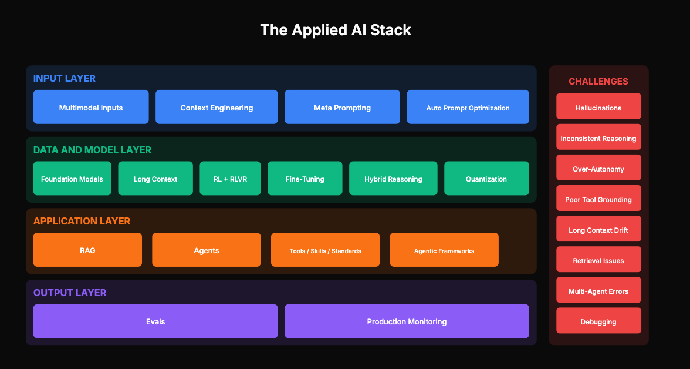

# State of Applied AI 2025 Report

2025 was a transformative year for applied AI. While the headlines focused on model releases and benchmark scores, the real story happened in the trenches—where practitioners figured out how to build reliable AI systems that actually work in production.

This report distills the key developments across the entire AI application stack, from the inputs that feed these systems to the outputs they produce, and the challenges encountered along the way.

## Resources

| Resource | Link |
|----------|------|
| Video | [Watch the presentation](https://maven.com/p/ad857c) |
| PDF Report | [Download the full report](./State_of_AI_2025_Report.pdf) |
| Interactive Slides | [View the slides](https://levelup-labs.ai/resources/state-of-ai-2025/index.html) |

## What's Covered

### Part 1: The Input Layer
- **From Prompt Engineering to Context Engineering**: Models became less brittle, shifting focus from crafting individual prompts to engineering entire context systems
- **Meta-Prompting**: Using AI models to generate optimized prompts
- **Automatic Prompt Optimization**: Frameworks like DSPy for data-driven prompt improvement
- **The Multimodal Default**: Text-only AI systems are now legacy

### Part 2: The Model Layer
- **Reasoning Models**: Trading speed for reliability with models like o1 and DeepSeek R1
- **Long Context Windows**: From 4K to 1M+ tokens, changing how we build applications
- **Efficient Inference**: Quantization and optimization techniques for production deployment

### Part 3: The Application Layer
- **RAG Evolution**: From basic retrieval to GraphRAG, agentic retrieval, and multimodal parsing
- **Agents in Production**: T-shaped success—broad automation of simple tasks, deep impact in specific verticals
- **Coding Agents**: The most successful agent category with tools like Cursor, Windsurf, and Claude Code
- **Human-in-the-Loop**: Balancing automation with appropriate human oversight

### Part 4: The Output Layer
- **Model vs. Product Evaluation**: Understanding what to measure and why
- **Three Evaluation Approaches**: Assertions, LLM-as-judge, and human evaluation
- **The Continuous Improvement Flywheel**: Building systems that get better over time

### Part 5: Challenges
- **Hallucinations**: More subtle and harder to detect than before
- **Inconsistent Reasoning**: Models that sometimes fail on problems they've solved before
- **Over-Autonomy**: Agents that take actions without appropriate confirmation
- **Tool Call Issues**: Integration challenges in agentic systems

### Part 6: The Road Ahead
- **Boring Infrastructure Wins**: The most effective AI work focuses on data and architecture fundamentals
- **Integration Quality Beats Model Selection**: How you integrate matters more than which model you choose
- **Evaluation is Non-Negotiable**: Teams that can measure value will keep investing

## Key Takeaways

1. **Context engineering > prompt tricks** — Design the entire information environment, not just the initial prompt
2. **Reasoning models trade speed for reliability** — Use them for complex tasks where correctness matters
3. **RAG evolved, it didn't die** — Structure, agency, and multimodal parsing made retrieval more powerful
4. **Agents achieved T-shaped success** — Broad automation of simple tasks, deep impact in specific verticals
5. **New capabilities brought new failure modes** — Subtle hallucinations, inconsistent reasoning, over-autonomy
6. **Evaluation is the bottleneck** — You can't improve what you can't measure
7. **Infrastructure beats heroics** — Boring, reliable systems outperform clever, fragile ones

## About the Authors

**[Aishwarya Naresh Reganti](https://www.linkedin.com/in/areganti/)** — Founder of [LevelUp Labs](https://levelup-labs.ai), building practitioner-focused AI education. Previously at AWS.

**[Kiriti Badam](https://www.linkedin.com/in/sai-kiriti-badam/)** — Applied AI at OpenAI. Previously at Google, Databricks, and Samsung.

This report was generated based on a live presentation to 2000+ practitioners.

## Other Resources

| Resource | Description | Link |
|----------|-------------|------|
| Free Courses | Taken by 20,000+ learners | [Browse courses](https://github.com/aishwaryanr/awesome-generative-ai-guide/tree/main/free_courses) |
| Enterprise AI Course | #1 rated course taken by engineering and product leaders at Google, Meta, Anthropic, Microsoft, and 90+ companies | [GenAI System Design](https://maven.com/aishwarya-kiriti/genai-system-design) |
| Advanced AI Evals Course | Deep dive into evaluation with a problem-first approach | [AI Evals Course](https://maven.com/aishwarya-kiriti/evals-problem-first) |
| Free Sessions | Upcoming and previous free sessions | [View sessions](https://maven.com/aishwarya-kiriti) |

---

*Copyright 2026 Aishwarya Naresh Reganti & Kiriti Badam. All rights reserved.*
