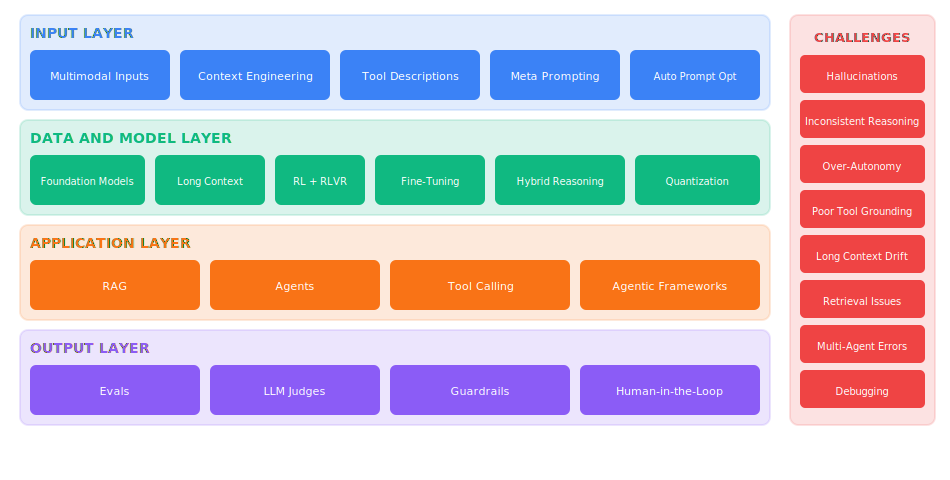

# State of Applied AI in 2025: A Comprehensive Report

## Executive Summary

In 2025, 47% of AI-native companies reached critical market scale, marking a fundamental shift from experimentation to production deployment. This report examines how each layer of the AI stack—from inputs to outputs—evolved to enable this transformation. Based on analysis of industry reports, technical breakthroughs, and real-world implementations, we present a comprehensive view of where applied AI stands today and what challenges remain.

Key findings:
- 44% of US businesses now pay for AI tools, with average contract values reaching $530,000
- Nearly 80% of companies are investing in agentic workflows
- China emerged as a credible #2 in AI capabilities, with Qwen powering 40% of new fine-tunes
- Despite progress, fundamental reliability challenges persist: 95% accuracy per step yields only 36% success over 20-step workflows

## Section 1: The 2025 AI Landscape

### The Year Integration Beat Innovation

If you've been building with AI this year, you've probably noticed something: the wins didn't come from better models. They came from better plumbing.

47% of AI-native companies reached critical market scale in 2025[^1]. Not because GPT-5 dropped or some research lab cracked AGI—but because we finally figured out how to connect the pieces we already had. Standards emerged. Integration got easier. The unsexy work of making things talk to each other started paying off.

### The Four Layers That Matter

Here's how I think about the AI stack in 2025. Four layers, each solving a different problem:

**Input: Context over Prompts**

Remember when everyone was selling prompt templates? That market is dying. The shift to context engineering changed the game—instead of crafting clever prompts, teams now focus on feeding models the right information in structured ways.

MCP (Model Context Protocol) is the reason. Donated to the Linux Foundation in December, it standardized how AI systems connect to data sources. Before MCP, every integration was custom work. Now it's closer to plug-and-play. If you're still building bespoke connectors, you're wasting engineering time.

**Models: Reasoning Gets Democratized**

DeepSeek's R1 in January was the technical story of the year. Not for benchmark scores—for the training approach. RLVR (Reinforcement Learning with Verifiable Rewards) lets models learn reasoning from outcomes alone. You tell the model if the answer was right or wrong. It figures out the reasoning steps itself.

The geographic shift matters too. Qwen now powers 40% of new fine-tunes on Hugging Face[^2], passing Meta's Llama. Chinese models run on cheaper hardware, support more languages, and come with permissive licenses. If you're defaulting to closed APIs without evaluating open alternatives, you're probably overpaying.

**Applications: Agents Find Their Lane**

80% of companies invested in agentic workflows this year[^3]. Most of those investments went to three use cases: coding assistance (77% adoption), content generation (65%), and documentation search (57%)[^4]. These aren't flashy applications. They're the ones with clear success metrics and measurable productivity gains—15-30% improvements that actually show up in the numbers[^5].

The standardization work mattered here too. Agent Skills gave us a common way to describe tool capabilities. A2A protocol (50+ partners at launch) let agents from different vendors coordinate. Context graphs made agent decisions debuggable. Without this infrastructure, agents were demo-ware. With it, they're production tools.

**Output: Trust as Engineering**

Security frameworks can now intervene in under 5 minutes with less than 2% false positives[^6]. That's real progress. But here's the math that keeps me up at night: 95% accuracy per step means 36% success over a 20-step workflow[^7]. That's not a tuning problem—it's an architecture problem.

### What the Numbers Actually Say

Some uncomfortable realities from 2025:

70% of employees have AI tool access. Only 50% use them regularly[^8]. Access isn't adoption. Adoption requires workflow redesign.

Hiring an AI engineer takes 70 days on average[^9]. 54% of companies say they're falling behind on AI talent[^10]. High-growth companies are putting 37% of engineering resources into AI[^11]. That talent has to come from somewhere.

100-turn agent conversations cost $50-100 in compute[^12]. Average enterprise AI contracts hit $530,000[^13]. These aren't pilot budgets anymore.

### The Actual Takeaway

2025 wasn't about breakthroughs. It was about maturation. Standards emerged, integration got easier, and real companies shipped real products. The question shifted from "can we build this?" to "can we make it reliable and affordable enough for daily use?"

The following sections dig into each layer—what's working, what's still broken, and what you should be thinking about for 2026.

> **Key Takeaways:**
> - Integration and standardization drove production success more than model improvements.
> - Multi-step workflows fail fast: plan for compound error rates in your architecture.
> - Giving employees AI access isn't enough—adoption requires workflow redesign.

[^1]: ICONIQ Venture & Growth 2025 State of AI Report
[^2]: State of AI Report 2025
[^3]: ICONIQ Venture & Growth 2025 State of AI Report
[^4]: ICONIQ Venture & Growth 2025 State of AI Report
[^5]: ICONIQ Venture & Growth 2025 State of AI Report
[^6]: AI Security and Guardrails Research 2025
[^7]: Utkarsh Kanwat, "Betting Against Agents"
[^8]: ICONIQ Venture & Growth 2025 State of AI Report
[^9]: ICONIQ Venture & Growth 2025 State of AI Report
[^10]: ICONIQ Venture & Growth 2025 State of AI Report
[^11]: ICONIQ Venture & Growth 2025 State of AI Report
[^12]: Utkarsh Kanwat, "Betting Against Agents"
[^13]: State of AI Report 2025

---

## Section 2: The AI Stack Evolution

Let's dig into each layer. What changed, what it means for your work, and what to actually do about it.

### 2.1 Input Layer: From Prompt Craft to Context Engineering

If you spent 2024 perfecting prompts, I have bad news: that skill is depreciating fast.

#### The Prompt Engineering Bubble

By early 2025, the prompt engineering market had gotten absurd. Companies hired dedicated prompt engineers. Marketplaces sold "proven" templates for hundreds of dollars. Every AI implementation started with weeks of prompt tuning.

The results rarely justified the investment. Prompts that worked perfectly on GPT-4 failed on Claude. Model updates broke carefully tuned prompts overnight. And user phrasing varied so much that even the best prompts only worked some of the time.

Context engineering emerged as the practical alternative. Instead of encoding everything in a single clever request, teams started focusing on structured information delivery. The question changed from "how do I phrase this?" to "what information does the model actually need?"

The benefits were immediate:
- Context can be reused across queries
- It can be programmatically generated from existing data
- Information architecture separates from natural language interaction—you can optimize each independently

#### MCP: Finally, Standard Plumbing

Every AI integration used to be a custom engineering project. Want to connect your AI to Slack? Build a connector. GitHub? Another connector. Your database? Yet another.

*Figure 1: MCP Architecture showing how AI clients connect to multiple data sources through a standardized protocol. Source: Shakudo Blog, 2025*

MCP (Model Context Protocol) fixed this. When it was donated to the Linux Foundation in December, it became the standard way to connect AI systems to data sources. Any AI client can now access any MCP-compatible source. The custom integration tax is over.

If you're still building bespoke connectors, stop. Adopt MCP. The engineering time you'll save is significant.

#### Multimodal: No Longer Optional

In 2024, processing images alongside text was a differentiator. In 2025, it's table stakes. Systems that only handle text are legacy.

This isn't just about capability—it's about use cases. Customer service agents can now process screenshots with complaint tickets. Code review tools can read architecture diagrams. Medical systems can analyze labs, imaging, and notes together. If your system can't do this, you're leaving value on the table.

> **Key Takeaways:**
> - Stop optimizing prompts. Start optimizing what information you feed the model.
> - MCP eliminates custom integration work—adopt it before building another bespoke connector.
> - If your AI system only handles text, you're already behind.

### 2.2 Model & Data Layer: Picking and Running Models

The model landscape shifted significantly in 2025. Not because of size wars—those are slowing down. The changes that mattered were in how models learn, where they come from, and what it actually takes to run them.

#### RLVR: Models That Learn to Reason

DeepSeek's R1 in January changed the conversation. Not because of benchmarks—R1 actually underperformed some existing models on standard tests. What mattered was the training approach: Reinforcement Learning with Verifiable Rewards (RLVR).

The idea is simple. Give the model problems with verifiable answers—math proofs, code that compiles, logic puzzles. Tell it only whether the answer was right or wrong. No step-by-step guidance. Through thousands of iterations, the model develops its own reasoning strategies.

What this means for you:
- RLVR models excel at tasks with clear success criteria (code, math, structured analysis)
- They struggle with subjective tasks (marketing copy, creative writing)
- They hallucinate 40-60% less in their trained domains[^14]
- They degrade gracefully—expressing uncertainty instead of fabricating confident answers
- They're slower (3-5x inference time) but more reliable

If your use case has verifiable success metrics, RLVR-trained models are worth the performance tradeoff.

#### The China Factor

Qwen hit 40% of new fine-tunes on Hugging Face by Q4[^2]. That's not nationalism—it's practical engineering.

Chinese teams optimized for deployment, not benchmarks:
- Models run on consumer GPUs (RTX 4090)
- Built-in quantization for edge deployment
- 50+ languages supported natively
- Permissive licenses for commercial use
- MoE architectures that activate only 20-30% of parameters per inference

If you're outside the US/Europe and can't afford H100 clusters, these models might be your best option. If you're anywhere and paying too much for closed APIs, they're worth evaluating.

#### Why Everyone's Running Multiple Models

The economics forced specialization. General-purpose 70B models cost $0.50-1.00 per 1,000 tokens[^15]. A customer service interaction at 10,000 tokens means $5-10 in compute. That doesn't scale.

A fine-tuned 7B model can match general model performance on specific tasks while costing 90% less. ICONIQ found companies deploying an average of 2.8 specialized models per product[^3]:
- One for query understanding
- One for core task execution
- One for response generation
- One for error handling

More complexity, but better reliability and lower costs. When one model fails, others compensate.

#### The Infrastructure Nobody Talks About

Vendors sell you models. They don't mention what it takes to run them:
- GPU pooling systems to share expensive hardware
- Model registries tracking versions and performance
- Inference servers optimized for throughput
- Caching layers (60-80% redundancy reduction)
- Monitoring for response quality, not just uptime

Cost optimization became a discipline:
- Route simple queries to smaller models
- Batch non-real-time workloads
- Cache common patterns aggressively
- Quantize for 4x speedup with minimal accuracy loss

Teams that did this well reduced costs 70-80%. Teams that didn't burned budget fast.

#### Models That Know What They Don't Know

The practical breakthrough wasn't capability—it was self-awareness. Models in 2025 can assess their own confidence, identify knowledge gaps, and explain reasoning steps.

This matters for production:
- Support tickets dropped 30-40% when models expressed appropriate uncertainty[^17]
- Debugging time cut in half with reasoning traces
- User trust increased when models admitted limitations

Implementation requires architectural work—ensemble methods, attention analysis, separate calibration models. But the payoff in reliability is significant.

#### Model Selection Cheat Sheet

**Reasoning-heavy tasks** (code, math, analysis): Use RLVR models. Slower but fewer errors.

**High-volume, cost-sensitive**: Fine-tune 7B models. Multiple specialized models beat one general model.

**Global/multilingual**: Evaluate Chinese models. Better language support, lower hardware requirements.

**Mission-critical**: Require metacognitive capabilities. Build ensembles. Invest in validation.

> **Key Takeaways:**
> - RLVR models learn reasoning from outcomes, not instructions—useful for tasks with verifiable success criteria.
> - Open-source models from China now match proprietary options. Evaluate Qwen before defaulting to closed APIs.
> - Deploy multiple specialized models per product, not one general-purpose model.
> - Budget more engineering time for infrastructure than for model work.

### 2.3 Application Layer: Building Agents That Ship

Here's what actually works when building AI agents. Not the conference demos—the production systems.

*Figure 2: Top AI use cases in enterprises, showing coding assistance leading at 77% adoption. Source: ICONIQ Venture & Growth, 2025*

#### What "Agent" Actually Means Now

After years of confusion, 2025 settled on a working definition: an agent is an AI system that uses tools in a loop to achieve goals. Simple, but it took hundreds of failed "autonomous AI" projects to get there.

The agents that worked shared four characteristics:
- **Specific goals**: "Resolve password reset tickets in under 3 interactions" worked. "Improve customer satisfaction" didn't.
- **Constrained tools**: Unlimited tool access created chaos. Curated toolsets delivered value.
- **Verification at every step**: Not just "did the API call succeed?" but "did it move us toward the goal?"
- **Explicit failure handling**: Assume every step can fail. Have fallbacks ready.

The adoption numbers reflect this pragmatism. Coding assistance hit 77%[^4] because success is measurable—code compiles or it doesn't. Content generation reached 65% where templates provided structure. Documentation search got to 57% but required extensive preprocessing work.

#### Tool Calling: Where the Time Goes

Theory: describe an API, let the model figure it out. Reality: every integration becomes a multi-week project.

Common failures:
- Models invent parameters that don't exist
- Type confusion (strings where integers expected)
- Semantic misunderstanding ("delete" meaning "remove from view" vs "permanently destroy")
- Ignoring error responses and continuing anyway

What works:
- **Wrap your APIs**: Validate inputs, provide clear error messages, log everything
- **Start read-only**: Add write capabilities only after proving reliability
- **Version your tools**: When behavior changes, create a new version
- **Include examples**: 10-20 per function, covering edge cases

Teams report 60-70% of development time goes to integration and error handling[^18]. Plan for it.

#### Standards That Matter

Agent Skills specification standardized tool descriptions. A2A protocol (50+ vendors by April[^6]) enabled agent collaboration. Both succeeded by being minimal—solving the immediate problem without overreaching.

Context graphs solved the debugging problem. They capture not just what an agent did but why—every decision point, evaluated option, rejected path. When something breaks, you can trace the reasoning instead of guessing.

#### Patterns That Ship

**The Task Decomposition Pattern**: Break complex goals into atomic tasks that can be independently verified. A "process invoice" workflow becomes:
1. Extract invoice data (verifiable: structured data extracted)
2. Validate against PO (verifiable: match/no-match)
3. Route for approval (verifiable: correct approver identified)
4. Update systems (verifiable: database updated)

Each step can fail independently without corrupting the entire process.

**The Human-in-the-Loop Pattern**: Identify high-stakes decisions and require human approval:
- Financial transactions over thresholds
- Data deletions or modifications
- External communications
- Policy exceptions

But implement approval efficiently:
- Batch similar decisions for bulk approval
- Provide clear context and recommendations
- Track approval patterns to identify automation opportunities
- Allow post-hoc review for low-risk decisions

**The Progressive Autonomy Pattern**: Start with high human oversight and gradually increase autonomy based on demonstrated reliability:
- Week 1-2: Human reviews every action before execution
- Week 3-4: Human reviews samples and exceptions
- Week 5-8: Human reviews only flagged edge cases
- Week 9+: Fully autonomous with periodic audits

This pattern required sophisticated monitoring to track reliability metrics and automatically adjust autonomy levels.

**The Fallback Chain Pattern**: Build multiple levels of fallback for critical operations:
1. Primary agent attempts task
2. If uncertain, consult specialized model
3. If still uncertain, escalate to human
4. If human unavailable, safe default action
5. Log for later review and training

Successful implementations made fallbacks transparent to users while maintaining service levels.

#### The Real Productivity Numbers

The 15-30% productivity gains[^5] hid significant variations. Coding assistants showed:
- 40-50% speedup on boilerplate generation
- 20-30% on test writing
- 10-15% on complex logic implementation
- 0-5% on architectural decisions

Content generation revealed similar patterns:
- 60-70% speedup on first drafts
- 30-40% on variations and A/B tests
- 15-20% on final polished content
- Near 0% on strategic messaging

The lesson: AI excelled at well-defined tasks with clear patterns but struggled with creative or strategic work. Smart organizations restructured workflows to leverage these strengths rather than fighting them.

#### Infrastructure Requirements Nobody Mentions

Deplying production agents required infrastructure investments vendors glossed over:

**Observability stacks** purpose-built for AI:
- Token-level usage tracking
- Prompt/response logging with PII scrubbing  
- Cost attribution by user/department/use case
- Quality metrics beyond basic latency

**Testing frameworks** that handled non-deterministic outputs:
- Semantic similarity testing rather than exact matches
- Statistical validation over multiple runs
- Adversarial testing for prompt injection
- Regression testing for behavioral drift

**Development environments** supporting agent development:
- Local model serving for testing
- Tool simulation frameworks
- Prompt version control
- A/B testing infrastructure

Teams reported spending $50-100k on infrastructure before writing their first production agent. This didn't include ongoing operational costs or personnel.

#### What 2025 Taught Us About Applications

The application layer's evolution in 2025 demonstrated that successful AI deployment requires:
- Pragmatism over ambition
- Infrastructure over algorithms
- Human-AI collaboration over automation
- Continuous refinement over big bang launches

The agents that succeeded weren't the most sophisticated—they were the most reliable, debuggable, and aligned with actual business workflows. As we move into 2026, these lessons will shape how organizations approach AI application development, favoring incremental improvement over revolutionary transformation.

> **Key Takeaways:**
> - Start with coding, content, or docs—these have clear success metrics and proven ROI.
> - Expect to spend most of your time on integration and error handling, not the agent logic.
> - Prioritize reliability and debuggability over sophistication.
> - Keep scope narrow, add human checkpoints, log everything, handle failures gracefully.

### 2.4 Output Layer: How We Trust AI

The output layer in 2025 became the battlefield where AI's promises met enterprise requirements. Trust evolved from an abstract concern to an engineering discipline with specific metrics, methodologies, and substantial costs. Understanding how organizations learned to verify, secure, and rely on AI outputs reveals both the progress made and the challenges that remain.

#### Runtime Security: Beyond Simple Guardrails

The security landscape of 2025 bore little resemblance to the simple content filters of earlier years. Modern runtime security operated more like an immune system than a wall—constantly adapting, learning from threats, and intervening with precision rather than brute force.

The numbers that mattered:
- **Detection latency**: 5 minutes from output generation to intervention[^7]
- **False positive rate**: <2% for critical violations
- **Coverage**: 95% of known attack vectors
- **Adaptation speed**: 24-48 hours for new threat patterns

But these metrics hid tremendous complexity. A typical security stack included:

**Layer 1: Real-time filtering**
- Token-level analysis during generation
- Immediate blocking of obvious violations
- <100ms added latency
- 99.9% precision for clear-cut cases

**Layer 2: Post-processing analysis**
- Semantic understanding of complete outputs
- Context-aware evaluation
- 1-5 second processing time
- 95% recall for subtle violations

**Layer 3: Behavioral monitoring**
- Pattern analysis across multiple interactions
- User behavior anomaly detection
- Hourly aggregation and analysis
- 90% detection of coordinated attacks

**Layer 4: Human review**
- Edge cases flagged for manual inspection
- Policy refinement based on decisions
- 24-hour SLA for critical reviews
- Feedback loop to improve automation

Implementing this stack required specialized expertise. Security engineers who understood both traditional application security and AI-specific risks commanded premium salaries. The average enterprise spent $2-5M annually on AI security infrastructure and personnel[^20].

The evolution of attack vectors drove constant adaptation:
- **Prompt injection**: From simple attempts to sophisticated multi-turn manipulations
- **Data poisoning**: Adversarial inputs designed to corrupt model behavior over time  
- **Model extraction**: Attempts to reverse-engineer proprietary models through queries
- **Compliance violations**: Subtle attempts to generate regulated content
- **Resource exhaustion**: Crafted inputs causing excessive computation

Each attack type required different detection strategies. Prompt injection detection used pattern matching and anomaly detection. Data poisoning required statistical monitoring of model outputs over time. Model extraction detection analyzed query patterns and information leakage. The arms race between attackers and defenders showed no signs of slowing.

#### Evaluation: The Offline/Online Divide

The great awakening of 2025: offline benchmarks predicted online success about as well as SAT scores predicted job performance. This realization forced a complete rethinking of how organizations evaluated AI systems.

**Offline evaluation** remained necessary but insufficient:
- Standard benchmarks (MMLU, HumanEval, etc.) for capability baselines
- Domain-specific test sets for specialized tasks
- Adversarial testing for robustness
- Regression testing for behavioral stability

Typical results showed massive disconnects:
- Models scoring 95% on coding benchmarks achieved 60% user satisfaction
- Systems with mediocre benchmark performance delighted users with helpful responses
- High-scoring models often produced technically correct but practically useless outputs

The missing link was **online evaluation**:
- User satisfaction metrics (CSAT, NPS)
- Task completion rates
- Time-to-resolution for support cases
- Escalation rates to human agents
- Revenue impact for commercial applications

But online evaluation brought its own challenges:
- **Selection bias**: Early adopters weren't representative users
- **Novelty effects**: Initial satisfaction didn't predict long-term usage
- **Context dependency**: Performance varied dramatically across use cases
- **Feedback latency**: Meaningful metrics took weeks to accumulate

Successful organizations developed hybrid approaches:

1. **Canary deployments**: 1-5% of traffic to new models
2. **A/B testing**: Head-to-head comparisons with statistical rigor
3. **Cohort analysis**: Tracking user segments over time
4. **Qualitative feedback**: Regular user interviews and session reviews
5. **Economic metrics**: Actual business impact measurement

The tooling ecosystem struggled to keep pace. Traditional A/B testing frameworks assumed deterministic systems. AI's probabilistic nature required:
- Larger sample sizes for statistical significance
- Longer test periods to account for variability
- More sophisticated analysis accounting for confounding factors
- New metrics beyond simple conversion rates

#### The Reliability Math Nobody Wants to Discuss

The compound probability problem became 2025's most sobering reality check. Every practitioner memorized the brutal math: 0.95^20 = 0.358. A 95% reliable system over 20 steps yields 36% end-to-end success[^8]. This wasn't a implementation detail—it was a fundamental constraint shaping every architectural decision.

Real-world implications were stark:
- **Customer service workflows** averaging 15 steps: 46% success rate
- **Document processing pipelines** with 25 steps: 28% success rate
- **Complex analysis tasks** requiring 30 steps: 21% success rate

Traditional software engineering assumed 99.99%+ reliability per component. AI's 95% felt like building on quicksand. Successful architectures adapted:

**Parallel processing** replaced sequential chains:
- Instead of A→B→C→D, execute A,B,C,D simultaneously
- Combine results with voting or synthesis
- Trade compute cost for reliability
- 3x cost for 2x reliability improvement

**Checkpoint and retry** patterns:
- Save state after each successful step
- Detect failures quickly (don't cascade)
- Retry with different approaches
- Human fallback after N attempts

**Verification loops** at every step:
- Don't assume success—verify it
- Build verification into the workflow
- Use different models/approaches for verification
- Accept 2x latency for 10x reliability

**Ensemble methods** for critical decisions:
- Multiple models voting on outputs
- Confidence-weighted aggregation
- Outlier detection and handling
- 5x cost for 3x reliability

The economics forced hard choices. At $50-100 per 100-turn conversation[^9], adding reliability through redundancy quickly became prohibitive. Organizations learned to:
- Reserve high-reliability architectures for high-value use cases
- Accept lower reliability for exploratory/creative tasks
- Design user experiences acknowledging potential failures
- Build business models accounting for AI's error rates

#### Engineering Rigor: The Hidden Foundation

*Figure 4: High-growth companies allocate up to 37% of engineering resources to AI initiatives. Source: ICONIQ Venture & Growth, 2025*

The 37% engineering allocation at high-growth companies[^10] tells only part of the story. The nature of that engineering work differed fundamentally from traditional software development:

**50% Infrastructure and tooling**:
- Observability stacks for non-deterministic systems
- Cost tracking and optimization platforms
- Prompt management and versioning systems  
- Evaluation frameworks and benchmarks
- Security and compliance tooling

**30% Integration and deployment**:
- API wrappers and error handling
- Deployment pipelines with gradual rollout
- Monitoring and alerting systems
- Incident response procedures
- Performance optimization

**20% Core AI development**:
- Model selection and fine-tuning
- Prompt engineering and optimization
- Agent architecture design
- Workflow development

This allocation surprised organizations expecting to focus on AI/ML work. The reality: production AI was 80% engineering, 20% data science. Teams that understood this succeeded. Those that didn't struggled with brittle systems that worked in demos but failed in production.

Key engineering practices that emerged:

**Observability-first design**:
- Every decision logged and traceable
- Cost attribution for every token
- Quality metrics beyond accuracy
- User journey tracking across sessions
- Anomaly detection for drift

**Defensive programming**:
- Assume every external call will fail
- Validate every model output
- Implement circuit breakers
- Design for graceful degradation
- Build with rollback in mind

**Economic awareness**:
- Cost budgets per interaction
- Dynamic routing based on query complexity
- Caching strategies for common patterns
- Batch processing for non-real-time needs
- Continuous cost optimization

The talent required for this work was scarce and expensive. An AI infrastructure engineer with production experience commanded $400-600k total compensation[^21]. But the alternative—systems that leaked money, failed unpredictably, or exposed companies to risk—cost far more.

#### The Trust Equation

By year's end, a formula emerged for building trustworthy AI systems:

**Trust = (Reliability × Transparency × Control) / Risk**

Where:
- **Reliability**: Consistent performance within defined parameters
- **Transparency**: Understanding how and why decisions are made
- **Control**: Ability to intervene, modify, and rollback
- **Risk**: Potential negative impact of failures

Organizations that mastered all four variables succeeded. Those that focused on only one or two built impressive demos that never reached production scale.

The output layer's evolution in 2025 showed that trust isn't given—it's engineered. Through rigorous security practices, comprehensive evaluation, architectural adaptations for reliability, and engineering discipline, organizations learned to build AI systems worthy of trust. Not perfect systems—that remained impossible—but systems whose limitations were understood, managed, and acceptable for their use cases.

As we entered 2026, the question was no longer "Can we trust AI?" but "How much should we invest to reach the trust level our use case requires?" The answer varied, but the framework for finding it had finally emerged.

> **Key Takeaways:**
> - Build trust through engineering: monitoring, evaluation, rollback capabilities.
> - AI reliability doesn't compound like traditional software—design architectures that minimize sequential dependencies.
> - Hiring AI engineers takes months. Start recruiting now or train internally.
> - Match your reliability investment to your use case risk. Not every application needs five-nines.

[^2]: State of AI Report 2025
[^3]: ICONIQ Venture & Growth 2025 State of AI Report
[^4]: ICONIQ Venture & Growth 2025 State of AI Report
[^5]: ICONIQ Venture & Growth 2025 State of AI Report
[^6]: 2025 Research on A2A Protocol
[^7]: AI Security and Guardrails Research 2025
[^8]: Utkarsh Kanwat, "Betting Against Agents"
[^9]: Utkarsh Kanwat, "Betting Against Agents"
[^10]: ICONIQ Venture & Growth 2025 State of AI Report

---

## Section 3: What's Still Broken

The progress in 2025 brought clarity about what AI can do—and equal clarity about what it can't. These limitations aren't temporary inconveniences waiting for the next model update. They're fundamental challenges documented across industry research that shaped every production deployment and forced practitioners to design around, rather than through, them.

### Hallucinations: Better But Not Solved

Hallucination rates have dropped, but let's be specific about what that means.

Top models now hit sub-1% hallucination rates on simple factual queries[^h2]. Gemini 2.0 Flash leads at 0.7%. Four models have crossed this threshold—real progress.

But that's the easy case. For complex reasoning, the numbers look different:
- Thinking models (Claude Sonnet 4, GPT-5, Deepseek-R1): 10%+
- Legal information: 6.4% even with top models
- General knowledge: 0.8%[^h2]

The gap matters. If you're building a legal research tool, expect six times more hallucinations than a general Q&A bot using the same model.

Why this persists:
- Models learn statistical patterns, not actual understanding
- Training data has gaps and errors
- Mathematical research confirms: complete elimination is impossible with current architectures[^h3]

What works in practice:
- RAG reduces hallucinations but doesn't eliminate them
- Multi-model validation catches some errors
- Human oversight remains necessary—and less than 1 in 3 teams are satisfied with their current observability tools[^h1]

Design your systems assuming hallucinations will happen. The question isn't "how do we prevent them?" but "how do we catch them before they cause damage?"

### RAG: Hitting the Wall

*Figure 5: RAG hype peaked in early-mid 2023. Long-context alternatives are emerging. Source: RAGFlow/LightOn, 2025*

RAGFlow's researchers describe RAG as in "a phase of stagnation"[^r1]. Academic papers keep appearing. Breakthroughs don't.

The core problems:

**Chunk size tradeoffs**: Small chunks give precise matching but fragment context. Large chunks preserve context but reduce precision. There's no right answer—just tradeoffs based on your use case.

*Figure 6: Hybrid tree-graph retrieval attempts to bridge the semantic gap. Source: RAGFlow, 2025*

**Storage costs for multimodal**: A single page image requires ~512KB in tensor storage. A million-page corpus hits terabytes. That's before you consider retrieval latency[^r1].

**Similarity isn't relevance**: Query "customer churn Q4" and you'll get documents about customer satisfaction, Q4 financials, and historical churn data—all semantically related, none actually answering your question.

Newer approaches (TreeRAG, GraphRAG, tensor quantization) show promise but add complexity. For many use cases, long-context models may be simpler than sophisticated RAG pipelines. Evaluate before defaulting to RAG because it's familiar.

### The Production Gap

*Figure 7: Multi-agent debugging is fundamentally different from traditional software. Source: Maxim AI, 2025*

MIT research found 95% of generative AI pilots fail to reach production[^a1]. That's not hyperbole—it's data.

Why so many fail:

**The reliability math doesn't work**: 5% error rate is fine for chatbots. It's catastrophic for agents that update databases or place orders. And 95% reliability per step means 36% success over 20 steps. Production systems need 99.9%+.

**The platform keeps moving**: 70% of regulated enterprises rebuild their AI stack every 3 months[^h1]. You can't stabilize what keeps changing underneath you.

How teams adapted:
- 68% of production agents run fewer than 10 steps before human intervention[^a2]
- 92.5% of agents deliver output to humans, not other systems[^a2]
- Autonomy got deliberately constrained

Tool calling improved—error rates dropped from ~40% to ~10%. But the gap between 90% reliability and 99.9% reliability is still the difference between demo and deployment.

### Debugging: The Unsolved Problem

Traditional debugging: set a breakpoint, examine state, step through code.

Agent debugging: hope your logs are comprehensive enough to guess what happened.

The challenges are different[^d1]:
- **Non-deterministic execution**: Same input, different paths
- **Long conversations**: Bugs emerge 50+ exchanges in
- **Emergent behaviors**: Fixing one agent breaks another
- **No good tooling**: Decades of debugging infrastructure don't apply

Agent tracing platforms are emerging, but the field is primitive compared to traditional software development. Budget time for debugging that you can't easily do.

Solutions emerging in late 2025:
- **Agent tracing platforms**: Capturing every decision, message, and state transition
- **Visual replay**: Stepping through agent interactions like a debugger
- **Automated evaluation**: Running regression tests across non-deterministic outputs
- **Session management**: Checkpointing to enable failure recovery

### The Compound Reality

These challenges interact and amplify each other. Poor retrieval degrades response quality, which makes debugging harder. Silent integration failures corrupt multi-step workflows. Hallucinations in one step cascade through subsequent reasoning.

The result: technology that works brilliantly in demos but struggles in production. Not because it fails completely—that would be easier to handle. It fails subtly, intermittently, and in ways difficult to predict or prevent.

The honest assessment from practitioners: AI is transformative for specific, well-constrained use cases where occasional failure is acceptable. For anything requiring consistent reliability, it remains a powerful tool that requires constant supervision.

> **Key Takeaways:**
> - Most pilots fail before production. Plan for the integration and reliability work upfront.
> - Hallucinations are manageable for simple queries, but expect higher rates in legal, medical, and complex reasoning.
> - Production agents need human oversight. Design for it rather than fighting it.
> - RAG works for basic retrieval but struggles with nuance. Evaluate whether long-context models fit your use case better.
> - Invest in observability early—debugging agents without tracing is guesswork.

[^h1]: Cleanlab, "AI Agents in Production 2025: Enterprise Trends and Best Practices," 2025
[^h2]: Vectara Hallucination Leaderboard / All About AI, "AI Hallucination Rates Across Models," 2025
[^h3]: Voronoi App, "Leading AI Models Show Persistent Hallucinations Despite Accuracy Gains," 2025
[^r1]: RAGFlow, "From RAG to Context: A 2025 Year-End Review," December 2025
[^a1]: MIT / Fortune, "95% of Generative AI Pilots at Companies Are Failing," August 2025
[^a2]: Drew Breunig, "Enterprise Agents Have a Reliability Problem," December 2025
[^d1]: Maxim AI, "Agent Tracing for Debugging Multi-Agent AI Systems," 2025

---

## Section 4: The Road Ahead

As we look toward 2026, the trajectory isn't just "more of the same but better." The foundations laid in 2025—standards, protocols, and architectural patterns—enable qualitatively different possibilities.

### RLVR Goes Mainstream

Reinforcement Learning with Verifiable Rewards, pioneered by DeepSeek R1, remains confined to domains with clear success metrics—code that compiles, math problems with correct answers. 2026 will see RLVR expand to fuzzier domains through synthetic feedback generation.

Imagine customer service agents learning from satisfaction scores, content generators optimizing for engagement metrics, or research assistants improving through citation accuracy. The key insight: we don't need perfect feedback signals, just consistent ones that models can optimize against.

This expansion won't be without controversy. Optimizing for metrics risks Goodhart's Law—when a measure becomes a target, it ceases to be a good measure. But the alternative, manual supervision of every model improvement, simply doesn't scale.

### The Inference Speed Revolution

Current reasoning models think in geological time—minutes for complex problems. This works for coding assistants and research tools but fails for real-time applications. 2026's breakthrough will be reasoning at conversation speed.

The path is already visible. Specialized inference chips designed for transformer architectures. Mixture-of-experts models that activate only relevant parameters. Speculative execution that explores multiple reasoning paths in parallel. The goal: complex reasoning in under a second.

This changes everything. Customer service agents that can handle nuanced complaints in real-time. Trading systems that reason about market dynamics at microsecond speed. Medical diagnosis tools that work at emergency room pace. Speed unlocks use cases we've written off as impossible.

### Standards Proliferation and Consolidation

MCP and A2A proved that standards can succeed in AI. 2026 will see an explosion of standardization efforts—some necessary, many redundant. Every layer of the stack will spawn competing protocols.

The inevitable consolidation will be messy but necessary. Winners will be determined not by technical elegance but by adoption momentum. Open governance models, like MCP's Linux Foundation stewardship, will have advantages over corporate-controlled alternatives.

Watch for standards in model evaluation, safety guarantees, and cost accounting. These unsexy infrastructure pieces will determine which AI systems enterprises actually trust with critical operations.

### The Rise of AI-Native Architectures

Companies building on 2025's AI stack still fundamentally organize around human workflows. Documents, meetings, approval chains—all designed for human cognitive limits. 2026 will see the first truly AI-native organizational architectures.

These won't look like science fiction. Instead of replacing humans, they'll augment human decision-making with continuous AI analysis. Every decision will have an AI-generated brief. Every meeting will have an AI participant tracking commitments. Every document will be a living entity, updated by both humans and agents.

The companies that figure this out first will have crushing advantages. Not because they'll have better AI, but because they'll use AI better. The reorganization will be cultural as much as technical.

### Regional AI Blocs

China's AI ecosystem emergence in 2025 was just the beginning. 2026 will see explicit regional AI blocs forming—not just around models but entire stacks. European AI emphasizing privacy. Chinese AI optimizing for efficiency. American AI pushing capabilities.

These won't be hermetically sealed—standards like MCP enable interoperability. But they'll optimize for different values, creating genuine alternatives. A European company might choose a slower but more explainable AI stack. An Asian startup might prioritize cost efficiency over cutting-edge features.

This diversity is healthy. Monocultures create systemic risks. Multiple approaches increase the odds that someone solves the hard problems. Competition drives innovation faster than any single entity could achieve.

### The Investment Realignment

The funding landscape will shift dramatically. Pure model plays become commoditized. Infrastructure and tooling command premiums. Vertical applications with deep domain expertise attract strategic capital.

Watch for consolidation among the hundreds of AI startups funded in 2023-2024. Many will discover that a thin wrapper around GPT-4 isn't a defensible business. The survivors will have genuine technical moats—proprietary data, specialized architectures, or deep workflow integration.

Enterprise procurement will mature. Instead of pilot projects and innovation labs, companies will demand production guarantees. SLAs for AI services. Indemnification for AI errors. Predictable pricing models. The age of experimentation gives way to operational discipline.

### What Success Looks Like

By the end of 2026, AI won't be artificial general intelligence or sentient machines. It will be boring infrastructure that works. Like databases in the 1990s or cloud computing in the 2010s, AI will transition from competitive advantage to table stakes.

Success metrics will shift from "look what AI can do" to "look what we do with AI." The most impressive deployments won't be the most technically sophisticated—they'll be the ones solving real problems for real users at sustainable costs.

The companies that win won't be the ones with the best models. They'll be the ones that best integrate AI into their operations. That build the most reliable systems. That create the most value for users. That turn 2025's breakthroughs into 2026's business as usual.

### The Unanswered Questions

Critical uncertainties remain. Will reasoning models escape their current cost constraints? Can we solve hallucination without fundamental architectural changes? Will talent shortages ease or intensify? How will regulation shape development?

The honest answer: we don't know. But we do know that the foundations laid in 2025—the standards, protocols, and patterns—create options. Whatever challenges emerge, we have better tools to address them. Whatever opportunities arise, we have infrastructure to capture them.

The story of 2025 was integration beating isolation, standards trumping silos, and practical deployment overtaking research demonstrations. The story of 2026 will be what we build on those foundations. The pieces are in place. The question is what we choose to construct.

> **Key Takeaways:**
> - AI will become standard infrastructure. Competitive advantage comes from how you use it, not whether you have it.
> - Focus on integration quality over model selection—the best model poorly integrated loses to a good model well integrated.
> - Build evaluation, cost tracking, and safety into your stack now. Enterprises will require it.
> - Measure business outcomes, not AI capabilities.

[^11]: Utkarsh Kanwat, "Betting Against Agents"
[^12]: ICONIQ Venture & Growth 2025 State of AI Report
[^13]: Utkarsh Kanwat, "Betting Against Agents"

---

## Conclusion

The State of Applied AI in 2025 reveals an industry in transition. We've moved beyond asking "what can AI do?" to tackling "how do we make AI work?" The answers aren't always elegant—standards help but integration remains painful, reasoning works but costs too much, agents deliver value but break too often.

Yet the progress is undeniable. Nearly half of AI-native companies reached production scale. 80% of enterprises invested in agentic workflows. Productivity gains of 15-30% became routine rather than exceptional. These aren't research metrics—they're business results.

The challenges that remain—reliability mathematics, hallucination persistence, debugging complexity—aren't reasons for pessimism. They're the next set of problems to solve. Every mature technology faces similar transitions from promise to production, from potential to practical.

As we enter 2026, the foundations are solid. Standards exist. Protocols connect systems. Patterns guide implementation. The wild experimentation of earlier years gives way to disciplined engineering. That's not a loss of innovation—it's innovation growing up.

The most important lesson from 2025: AI's value doesn't come from any single breakthrough but from making all the pieces work together. The future belongs not to those with the best models, but to those who best integrate AI into the messy reality of human work.

The state of applied AI in 2025? It works, mostly. It's expensive, sometimes. It's transformative, occasionally. And that's exactly where a technology should be on its path from laboratory to life.

---

## Acknowledgments

This report synthesized insights from numerous sources, including the State of AI Report 2025, ICONIQ Venture & Growth's research, Simon Willison's year-end review, and the work of many researchers and practitioners advancing the field. Special thanks to the teams building the standards and infrastructure that make applied AI possible.