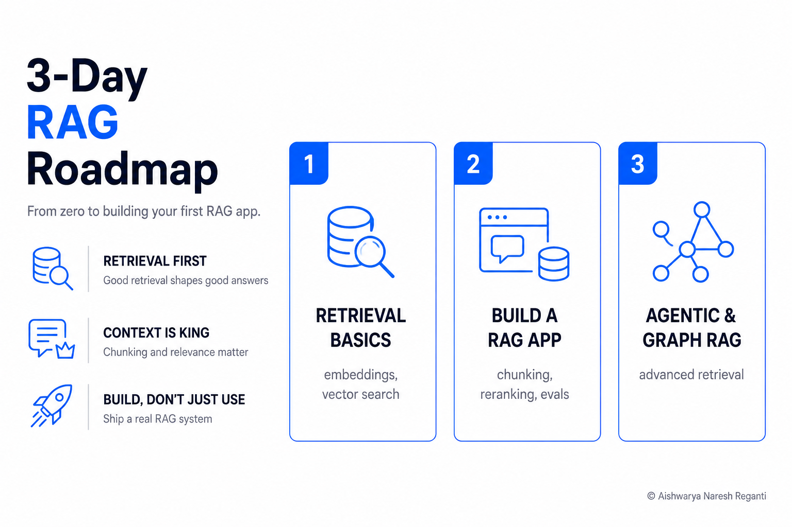

# 3-Day RAG Roadmap

Retrieval Augmented Generation (RAG) is still one of the most common ways to put an LLM to work on your own data, and it has grown well beyond "stuff some chunks into the prompt." This 3-day plan takes you from retrieval basics, to building a real RAG app, to the agentic and advanced techniques that matter in 2026. Plan for about 2 to 3 hours a day.



> Updated for 2026. RAG is now often agentic: the model decides what to retrieve, iterates, and sometimes skips the vector store entirely. Day 3 takes you there.

```text
The RAG pipeline:

  question --> RETRIEVE --> relevant chunks --> AUGMENT the prompt --> LLM --> grounded answer
                  |
          vector search / keyword / hybrid
```

## Day 1: Retrieval Foundations

Start with the retrieval half of RAG: embeddings, vector search, and chunking. Get this right and the rest follows.

**Watch (about 1 hour):**

1. Retrieval Augmented Generation (RAG) by DeepLearning.AI ([link](https://www.deeplearning.ai/courses/retrieval-augmented-generation))

**Read (about 1 hour):**

1. Agentic RAG 101: how retrieval fits with agentic control ([link](../resources/agentic_rag_101.md))
2. **(Foundational anchor)** The original RAG paper ([link](https://arxiv.org/abs/2005.11401))

---

## Day 2: Build a RAG App

Move from concept to a working pipeline: chunking strategy, reranking, hybrid search, and how to evaluate what you build.

**Watch (about 1 hour):**

1. Advanced Retrieval for AI with Chroma by DeepLearning.AI ([link](https://www.deeplearning.ai/short-courses/advanced-retrieval-for-ai/))

**Read (about 1 hour):**

1. Agentic AI Crash Course, part 4: RAG and agentic RAG ([link](../free_courses/agentic_ai_crash_course/part4_what_is_rag_and_agentic.md))
2. **(Optional, current research)** Most impactful RAG papers, updated regularly ([link](../research_updates/rag_research_table.md))

---

## Day 3: Agentic and Advanced RAG

The frontier: agentic retrieval, GraphRAG, reranking, and the long-context tradeoffs that decide when RAG is even the right tool.

**Read (about 1.5 hours):**

1. Most impactful RAG papers, the living research table ([link](../research_updates/rag_research_table.md))
2. Agentic Search and Retrieval research table ([link](../research_updates/agentic_search_retrieval_table.md))
3. **(Foundational anchor)** Retrieval-Augmented Generation for Large Language Models: A Survey ([link](https://arxiv.org/abs/2312.10997))

---

**Where to next:** the full [RAG topic page](../topics/rag.md), [all free courses by topic](../courses.md), or the [Agent Builder path](../paths/agent-builder.md).
