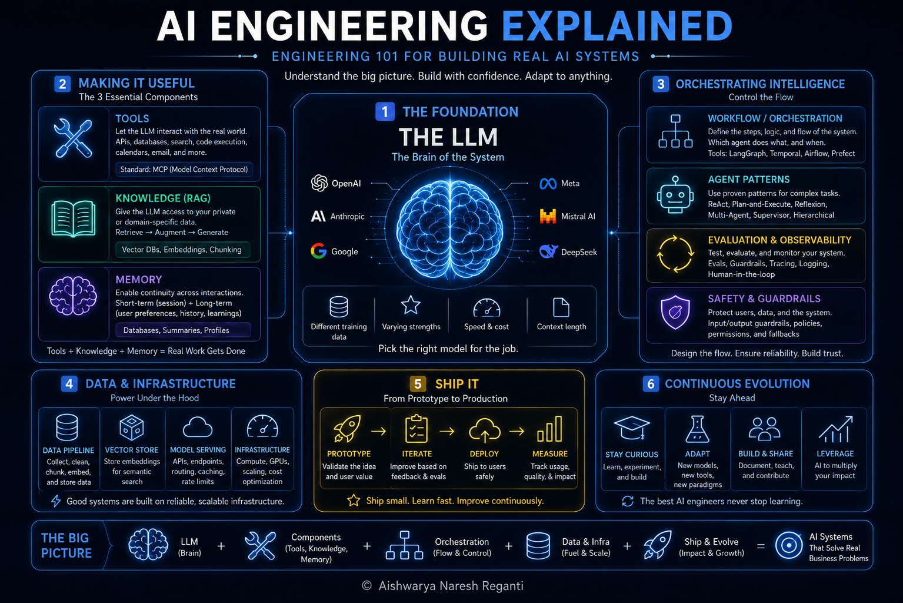

# AI Engineering Explained in 17 mins | The Ultimate Beginner’s Guide

[Watch on YouTube](https://www.youtube.com/watch?v=L6TSmylZT2g) · 2026-07-01

<!-- agenda slide -->

## In this video

- **00:00** How Do You Design an AI System? (The Mind Map)
- **00:41** Start With the LLM: The Brain of Every AI System
- **02:28** The 3 Core Components: Tools, Knowledge (RAG) & Memory
- **07:06** AI Evals: How to Know Your AI Actually Works
- **10:50** Multi-Agent Systems, AI Ops & System Design

## Resources

- [AI Engineering course cohort](https://maven.com/aishwarya-kiriti/o/d4b008)
- [LevelUp Labs](https://levelup-labs.ai/)
- [The Nuanced Perspective (newsletter)](https://thenuancedperspective.substack.com/)
- [LevelUp Labs education](https://levelup-labs.ai/education)
- [Awesome Generative AI Guide](https://github.com/aishwaryanr/awesome-generative-ai-guide)
- [My courses on Maven](https://maven.com/aishwarya-kiriti)

## Sources

- Air Canada's chatbot gave a passenger incorrect bereavement fare information, and Air Canada was held liable (2024) — [Moffatt v. Air Canada, BC Civil Resolution Tribunal, February 2024](https://www.americanbar.org/groups/business_law/resources/business-law-today/2024-february/bc-tribunal-confirms-companies-remain-liable-information-provided-ai-chatbot/)
- McDonald's ended its AI drive-thru ordering test after errors in US locations (2024) — [CNBC, June 2024](https://www.cnbc.com/2024/06/17/mcdonalds-to-end-ibm-ai-drive-thru-test.html)

## Transcript

_Auto-generated captions from YouTube, lightly cleaned._

I have stumped hundreds of top-tier, extensively trained AI engineers with just one question. Now, these engineers have watched every roadmap video on YouTube, checked off Python, deep learning, and all that jazz, but in their interviews, when I ask them, "How do you design an AI system for a real business problem, like, say, customer support or financial research?" Most of them can't answer. I spent a decade as an AI researcher and a tech lead at AWS previously, and if I were starting from scratch today, this is how I would learn it, with this exact mind map that will change the way you think about AI. So, that no matter which new tool or concept drops next, you always know how to build with it.

Now, let's start with the first and central node on the map. Everything that you're going to build in AI sits on top of this one thing, which is the large language model, which is the brain of the system. And if I were starting from scratch, this is exactly where I'd start, before picking any tool, any framework, or anything else. You don't need a PhD in machine learning to build with AI. You need a working sense of how language models actually generate text and what changes when you build on top of them. Think about how a regular function or an API works in code. Let's say you write code to perform simple addition, right?

It takes 2 + 3 and gives you 5. In traditional software, the set of inputs a function or an API accepts is small and deterministic, and so are the outputs, meaning the same input always gives you the same output every single time. Now, unlike traditional code, LLMs are unpredictable or non-deterministic in nature, which means the phrasing of your question, the context you provide, and the instructions you give, all of it shapes what comes back to you, and that single fact reshapes everything you build on top of it. And here's what most people starting out miss. Not all models are the same. Every model is trained on a different mix of data and optimized for a different kind of output.

Some of them are tuned for code, some of them for handling images or videos, some are very good at reasoning, some handle long documents better than the others. Some of them are tiny, fast, and cheap. Some of them are large, slow, and expensive, but also perform much better on complex tasks. Now, the single most important decision you make before you build anything is which model fits the particular task because that shapes what your system can do, what it costs, and how fast it runs. Now, once you have a feel for what's in the middle of the map, the next node are the components that wrap around it.

Now, these components are what turn a smart conversation into a system that can actually do work for you. And that brings us to our very next node, number two, making it useful. Now, a language model can only ingest your queries and generate responses for those queries, but it can't really understand your ecosystem, your data, tools, and can't take action in the real world. Now, what turns it into something that can actually do real work and something worth building are the three components that you wrap around the model. Every AI product you'll ever build or ever use is some version of the same combination. Think of AI systems that book meetings, answer emails, write code for you.

They're all built on the same three components, which are tools, knowledge, and memory. And let's learn what each one of them does and how to think of them whenever you're building. Now, think of the difference between a chat application like ChatGPT and an agent like say Claude Code or Codex. Underneath, every one of these products is built on top of an LLM. Now, the reason they feel completely different is because of what's wrapped around that model. An agent like Codex can read your code base, run commands in your terminal, edit your files, and remember what worked in the last session. A chat application itself cannot do a lot of that.

Now, that difference comes from the wrapping. So, what are those three things? The first one is tools. Now, by default, an LLM knows only information that it was trained on whenever the model was created. Tools let the LLM reach into your email, your calendar, your database, the web, and any external system. This usually works by the LLM calling a function and getting back data. Now, the field is also converged on a standard for this called the MCP or model context protocol, which lets any LLM connect to any tool in a consistent way, much like the HTTP or REST standards. Now, the next component is external knowledge.

Remember how we said that an LLM can only answer questions based on the knowledge or information that it was trained on when it was created. Anything new or anything specific to your work is pretty much invisible to it. And retrieval augmented generation or RAG fixes that for you. Now, the idea of RAG is pretty simple, pretty much like open-book question answering. You essentially build a knowledge base, which is just a collection of documents, data, or information that's specific to what you're building. Your company's internal docs, your product's data, whatever that is. Essentially, it's whatever the LLM needs in order to get to know you that it couldn't have learned during its creation process.

Now, when a question comes in, the most relevant information gets pulled from that knowledge base and handed to the LLM along with that question, and the LLM uses both to answer. Now, while that is the base, RAG has grown into a whole field of its own, and the easiest way for you to navigate it is to remember the two halves of that name. Retrieval is where you pull relevant information from your knowledge base, and augmented generation is where the LLM uses that information to generate responses. And almost every variant of rag you'll hear about is an improvement to one of those two halves. Now, the last component is memory.

An LLM by default has no memory across conversations. If you start a new chat, it starts from scratch, and memory is pretty much how you fix that. There are few kinds of memory that you generally need to know. Short-term memory is within a single session. Basically, it's the conversation history. And long-term memory is what persists across different sessions. For instance, your preferences, facts, ongoing context, projects, etc. Some AI systems split long-term memory further into semantic memory, which is generally facts about a user, and episodic memory, which is related to specific episodes or events. Now, underneath, all of these different forms of memory work pretty much the same way, which is they store these preferences in some persistent storage, usually a database, and they get pulled back on demand.

Now, put these three pieces together with the LLM at the center, and you have what people call an AI agent. Now, whenever you sit down to build something, these are the first three questions you want to ask yourself. What tools does it need? What does it need to know? And what does it need to remember? Once you wrap the LLM with these three components, the next question is the one that most people don't care to answer, which is how do you know any of it is actually working. Which brings us to node number three, which is proving it works. Now, here's the part most people skip when they're building, and it's also the part that will cost them the most later.

Now, most people building with AI have no idea if what they built is actually working. They ship it, it seems fine, and then suddenly something breaks. Evals is how you catch that even before it happens. And it's the one skill that separates people who ship AI products that hold up from people who are always wondering why theirs don't. Take what happened with Air Canada in 2024, for example. A passenger asked the airline's chatbot how bereavement fares worked right before flying out for his grandmother's funeral. Now, the chatbot confidently told him that he could book it full price now and apply the bereavement discount within 90 days of travel.

But Air Canada's actual policy was different and the system had hallucinated. These kind of claims had to be made before the trip. He booked based on the chatbot's answer, got denied the discount, and took the airline to court and also won. Air Canada had to pay damages and also remove the chatbot from the site soon after. Now, this is the kind of failure that happens often when AI products go live. In hindsight, what would have caught it is a check that every chatbot response match the actual policy on the site before it got sent to a user. Now, those kind of checks that you do to AI products are called as evals.

First, let's understand what evals are. Remember we said that LLMs are unpredictable by nature and the same inputs or slightly similar inputs can give rise to widely different outputs. In normal software, testing as a process is pretty straightforward. You give it an input, you know exactly what the output should be, and either it passes or it doesn't every time without fail. Now, none of that works for LLMs. An LLM might give a great answer in one phrasing and a subtly wrong one in the other. And really think of it, right? There's not really one single right answer when you ask it to say summarize a document, draft an email, or write a recommendation.

There are multiple ways of doing the right thing. There are also multiple ways of going wrong. Now, that's the whole point of why evals exist because the old testing playbook doesn't really apply for AI products and you need a new one. And evals is the discipline of defining what good looks like for your system and systematically measuring whether the system delivers it. Now, the second part, which is how do you actually implement evals? One of the most popular ways of implementing evals is called LLM as a judge or AI judges. You take an AI model and use it to grade the output of another AI system.

You give the judge a rubric for what good looks like, plus the response you want created. And the judge scores how well that response meets the rubric. Often, the judge also compares against a small reference data set, which is basically a curated sample of example inputs and outputs that you already know are good. AI judges are faster than human review, and they're more nuanced than simple integration tests or unit tests, and setting one up is pretty simple once you understand the foundations. And that brings us to the third part, which is how do you actually write rubrics for these judges? A rubric is essentially a list of criteria that define a good answer.

The hard part is figuring out what belongs on the rubric for your specific use case. What does good mean for the product you're building? What should the system never do? What should it always do? Now, once you can build a system and actually know whether it's working, the next question is whether you need more than one agent for the job. That's our next note, which is why number four is scaling up. At some point, whatever you're building is going to hit a limit. Maybe the task is too big, too complex, or needs too many different kinds of thinking for one single agent to handle well. That's when you need more than one agent.

Most people building AI make the same mistake. The moment something gets complicated, they just add an agent and make it a multi-agent system. But more agents always means more complexity, more failure points, and more things to debug. Here's how to know when you actually need multiple agents and when you're just making your life harder. Think about the Claude code or Codex example again. Under the hood, it spawns sub-agents to do part of the work as required. Say when it needs to search the code base for five different things, it sends five smaller sub-agents to do those searches in parallel instead of one agent doing them one at a time.

Now, the benefit of this is that the whole system finishes faster and produces better answers than one agent juggling everything. Now, there are two main reasons why a multi-agent system might be required. The first one is specialization. One agent can only juggle so many kinds of thinking before it gets sloppy. And when the work needs distinct skills, breaking it across agents lets each one of them tune for its part. For instance, one agent handles research, the other handles drafting, another handles checking, all of this, right? And each does its job better than one agent trying to master them all. The second and the most common reason as to why a multi-agent system is warranted is parallelization.

Some work just doesn't have to happen one step at a time. If done right, multi-agent systems can take on problems that no single agent can handle alone. Now, here's the big problem. If you start learning multi-agent systems without solid grounding in everything we talked about so far, you're pretty much building on sand. You'll reach out for a multi-agent every time a single agent isn't quite working. When often the right move is just a better prompt, better retrieval, better memory, or just a better eval. Multi-agent is the move when a single agent has genuinely hit its limit. If you haven't mastered the basics of the rest of the map, you'll reach for it too early and call complexity progress.

Once you can build, evaluate, and decide on an architecture, the next part of the map is what happens after all of this goes live in production, which brings me to number five, life after launch. So, how do you keep an AI system good once real users are interacting with it? And how do you improve it over time? Now, that's the whole AI ops cycle, and it's what every real AI product runs on. An AI product gets built once, but it gets improved almost every day in production. And that's where the real work lives in AI products. Take McDonald's for example. In 2024, they ran an AI drive-thru system that worked pretty well in their testing.

And when they put it in front of real drive-thrus, they ran into things that they hadn't really planned for. Different accents, background noise from traffic, multiple people in the car ordering at the same time. McDonald's had to pull it down. They recently came up with a better version of it. But all of this is to say that the lab is one environment, but production is a completely different beast when it comes to AI products. And the AI ops cycle is the loop that keeps the system improving over time. And the cycle is pretty much design, build, evaluate, ship to production, monitor what's actually happening, feed those signals back into the design, and repeat again.

Now, once you know how to build a system, evaluate it, treat it in production, and also monitor it, the last part of the map is the one that pulls all of them together. The last node is thinking. Everything we've covered so far is what to build with. Now, the last part is how you actually think with it. It's kind of funny that thinking is a node on the map, but stick with me. It's super important in today's AI-pilled world that's pretty much forgotten how to think. Now, most people end up learning all of these fancy AI concepts, but what almost nobody learns is how you take a real problem and work through it from scratch.

What models to use, what tools, what architecture, what trade-offs do you really need to think about? That is a skill that actually matters when you're building something real. System design is just a fancy word of thinking on a real-world problem and thinking how to solve it, but it's pretty much how you take any problem and work through it using everything in the framework that we just discussed. You walk through the map, you pick the parts that fit the problem in front of you, and you make trade-offs at each step. That pretty much is system design. Now, in this AI era where anyone can spin up an agent in 30 minutes, the thinking part is really what makes the difference.

Walking the map, weighing trade-offs, making the right call at each node, that's the skill that compounds. Now, this whole map is drawn from a 150-page handbook we usually share with our Level Up Labs Enterprise Cohorts. It's called the AI Builder's Handbook. It goes deeper across each of these nodes with free and curated resources for every concept so that you can go much deeper and understand them. It's downloaded by more than 30,000 people and one of our most loved resources. And in this video, I'm releasing it for free to anyone watching. You can find the link in the description. All right, so what's our biggest lesson from today's video?

It's to stop memorizing road maps and build the right fundamental frameworks so that you'll never need another one. All the very best. And if you found the video useful, subscribe on YouTube so that you can catch the next one.
