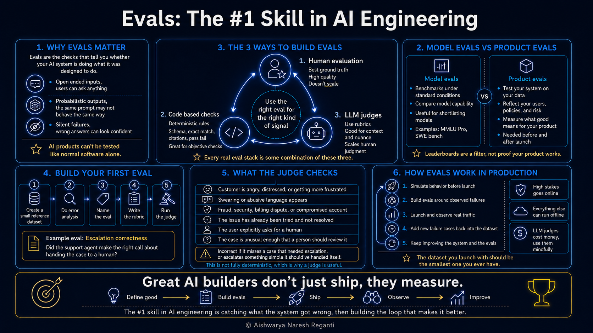

# The Most Important Skill for AI Engineers: Evals Explained

[Watch on YouTube](https://www.youtube.com/watch?v=MltkRz94SWA) · 2026-09-17



<!-- agenda slide -->

## In this video

- **Why AI products can't be tested like normal software**: inputs are unbounded, the model in the middle is probabilistic, and a wrong answer arrives confident and well written instead of as a stack trace
- **Model evals vs product evals**: what benchmarks like MMLU-Pro and SWE-bench actually measure, and why a leaderboard is a filter for shortlisting models rather than proof your product works
- **The 3 ways to build evals**: human evaluation, code based checks, and LLM judges, and the point where each one runs out of road
- **Your first eval, end to end**: build a small reference dataset, run error analysis, name the eval, write the rubric, run the judge
- **A real rubric**: the escalation check for QuickCart, a fictional customer support agent, and why the judge never sees the reference answer
- **How evals work in production**: simulate behavior before launch, then keep calibrating against real traffic, because evals are a loop and not a build-once system

## The free evals course

The video covers the concepts and one worked example. The full course goes deeper, with 10
chapters, hands-on components, and a certification:
**[AI Evals for Everyone](https://github.com/aishwaryanr/awesome-generative-ai-guide/blob/main/free_courses/ai_evals_for_everyone/README.md)**

## Build the eval from the video

The QuickCart dataset, the escalation rubric, and the 5 steps are in one file:
**[ai-evals-starter-kit.md](ai-evals-starter-kit.md)**

Do not take notes. Paste this into your agent and build the eval against your own product:

```
Read https://raw.githubusercontent.com/aishwaryanr/awesome-generative-ai-guide/main/youtube/ai-evals-starter-kit.md

Walk me through the 5 steps against my product, one step at a time. Start by asking me
what my system does and who uses it. Then help me write 10 reference rows, run the error
analysis with me, and draft the rubric from the failure pattern we find. Wait for me to
approve each step before moving to the next one.
```

## Resources

- [Arize](https://arize.com), the observability tool used in the walkthrough. [3 months of Arize AX Pro free](https://app.arize.com/auth/join?utm_source=youtube&utm_medium=video&utm_campaign=ai-evals-video&utm_content=aishwarya-nr)
- [AI Evals for Everyone (free course)](https://github.com/aishwaryanr/awesome-generative-ai-guide/blob/main/free_courses/ai_evals_for_everyone/README.md)
- [LevelUp Labs](https://levelup-labs.ai/)
- [The Nuanced Perspective (newsletter)](https://thenuancedperspective.substack.com)
- [LevelUp Labs education](https://levelup-labs.ai/education)
- [Awesome Generative AI Guide](https://github.com/aishwaryanr/awesome-generative-ai-guide)
- [My courses on Maven](https://maven.com/aishwarya-kiriti)

## Sources

- Wang et al., *"MMLU-Pro: A More Robust and Challenging Multi-Task Language Understanding Benchmark"*, 2024, the reasoning benchmark named in the model evals section. [arxiv.org](https://arxiv.org/abs/2406.01574)
- Jimenez et al., *"SWE-bench: Can Language Models Resolve Real-World GitHub Issues?"*, 2023, the coding benchmark that checks whether a model's fix makes a real repository's tests pass. [arxiv.org](https://arxiv.org/abs/2310.06770)
- LM Arena, the crowdsourced leaderboard cited as the independent example. [lmarena.ai](https://lmarena.ai/leaderboard)
- Papineni et al., *"BLEU: a Method for Automatic Evaluation of Machine Translation"*, 2002, the origin of the overlap score used as the similarity-based example. [aclanthology.org](https://aclanthology.org/P02-1040/)

## Transcript

_Auto-generated captions from YouTube, lightly cleaned._

Building an agent is honestly the easiest part of building AI systems and these days it looks like anyone can get something working in less than a day. So the hard part is making sure that it actually holds up in production. So if you want to build AI products that survive the real world, the number one skill you should be mastering is AI evals. It's also one of the most common topics that you'll see in AI interviews and the most misunderstood too. So let's change that today.

By the end of this video, you'll understand what AI evals are, why they're important. We'll also learn the differences between model evals and product evals. We learn about the three most popular ways to build evals for AI systems and when to use each of them. And finally, we're going to do a walkthrough where you build your first eval so that you see the process end to end. And then we'll wrap up with how evals work in production so that your system can keep improving while it's live.

Here's everything we'll be covering today. You can take a screenshot of it or find the HD version on my GitHub repository. So, let's start with the very first question. What are AI evals and why do you even need them? Because this is where I think a lot of the confusion lies for most beginners.

So, evaluations, or evals for short, in AI are essentially checks you use to find out whether a system is doing what it was designed to do. And if you're coming here from a software background, this seems pretty much like testing. You'd write unit tests, integration tests and regression tests for your applications. So that intuition is somewhat correct, but the way we test AI products is a little different than the way we test typical software products. Let's take the example of a website that most people use, something like booking.com. When you go there to book a hotel, you're picking the dates off a calendar, you're clicking through a couple of dropdowns, you're selecting a room, and you're hitting a button. If you closely observe how these typical web apps are built, the action space is heavily controlled by humans, that is, by us, the people who are operating these things. And you'll also notice that the kind of decisions or actions you take, they're very limited and predictable in the sense that the product has already decided what you're allowed to do.

For instance, clicking buttons, drop downs, and all of this. The output is equally well defined. You click, the page either loads or the transaction goes through or you get an error. And the process which is making all of this happen is code which is also deterministic in nature. So when you build something like that, you could have unit tests, integration tests and all of that because of one basic assumption which is if you've tested a particular input X and the system reliably gives you an output Y, it's going to keep doing that every time a new user shows up.

Of course, there can be bugs or errors or sometimes issues which need corrections, but usually if something works before going into production, it should continue to work in production as well. Or in general, the number of times it messes up is pretty less. So you can pretty much simulate things well before production. Now that assumption changes a little when you think about AI products because most of the interfaces for AI products are a little more free form in nature. For instance, somebody might be typing into a chat box in their natural language and you don't know how people communicate and people have very different styles of communication and there's no drop down or button that's constraining them.

So in a sense, the range of things that people might send to an AI system is essentially unbounded and you genuinely can't sit down beforehand and write out everything that the user might come up with. And the system that's making decisions is also not code. It's an AI model which is probabilistic in nature. So for the same input or a slightly reworded one, you may not get the same output. And another annoying thing about AI products is that when traditional software breaks, it usually breaks loudly.

For instance, you get an exception, you get a stack trace. But when an AI system gets something wrong, it often just returns a confident, well written, and completely incorrect answer. There's nothing like an error report. So mostly it should be inferred by how your customer reacted to it. So to pretty much summarize, in AI, the input from the user's side is far more free form than in traditional software.

And also the process, that's the model generating the output is also probabilistic in nature. So if you really think of it, there are two surface areas that make an AI product much less deterministic than traditional software. And that is why AI evals look so different from traditional software testing that people are probably aware of. Another side effect of this is that evals are not a build once and forget kind of a thing. So you build them before you ship against the behavior you simulate and then you keep updating them once your real users arrive because that's when you start learning how people are actually behaving with your product as opposed to how you anticipated they would.

So you simulate behavior before production. You build evals based on that behavior and then you observe real production behavior and keep improving your evals until you actually trust them. That's the whole evaluation loop. So now that you understand why we need evals, the second question most people end up asking as soon as they learn about evals is this. If model providers like OpenAI, Anthropic or Google already publish a bunch of evals and benchmarks and scores as to how their models are performing on tasks like coding, question answering, general ability, reasoning, etc.

Why should users be doing their own eval? So why should product builders be repeating all of this? Can we just not trust what these model providers tell us? Can we not trust all of those benchmarks? Now that brings us to the two different kinds of evals which exist and you really need to understand the difference between them and those are model evals and product evals.

And they're actually doing two completely different jobs. So when a company like OpenAI builds a new model, they need some way to tell people what the model is capable of and how well it does that, right? For instance, like can it write code? Can it reason? Can it answer general knowledge questions?

Can it do math and all of this? So they run their model against a set of standard benchmarks which test for all of these abilities and they get back some scores. Those are model evals. And a benchmark essentially in this context is a dataset that contains a bunch of inputs paired with the expected output. And the score essentially tells you how often the model matched that expected output.

And some popular model eval benchmarks include MMLU Pro which tests reasoning across a range of academic subjects. There's also another popular benchmark called Swebench which tests models coding abilities and there are also independent organizations doing this. One example is LM Arena and this is a crowdsource benchmark where people can go and give their scores to different models based on different categories of tasks. Now all of this is super useful but they're only tested on generic tasks, right? They pretty much tell you how capable one model is compared to the other one.

But all of that is measured in standardized conditions. And when you start building your own AI product, your entire ecosystem starts changing. And those are not standardized conditions, right? You're probably building a support agent which has to work on your company's policies, internal tools, knowledge bases, your own users and all of that, right? And model evals do not simulate all of that behavior for you because that's very unique to your ecosystem.

So while model evals are kind of useful to say what are the most capable models available, they're not super useful for you to judge whether that model will be able to perform in the context of your product or your environment. And that's why you need to be using your model evals just as a filter in order to make choices but not entirely rely on them when you're building your products. But after you've narrowed down on a set of models that you want to use for your task, you need to run your own product evals, which is you need to test your system in the environment that you're working with. Which brings us to the next section, which is how do you actually build these evals. There are three ways to build evals.

Let's go through each one of them. So the first way is the most unscalable way, but the most straightforward way, which is human evaluation, right? And it's exactly what it sounds like. A person looks at what the system produces and makes a judgment about whether the response was good. And human judgments are usually called ground truth because they help set the bar of what is good.

And the other two methods we'll talk about are actually what are built in production and they're approximations of human judgment so that we can scale it in production because you can't really ask humans to judge just every response in production, right? And that's exactly why we have the other two kinds of evals. The simplest one being code based evals or code based checks. Now these are deterministic rules that you can implement through code and there are two types of them and these are the ones that are very similar to unit tests.

The first kind is pass or fail checks. For instance, schema validation or validating a particular JSON identifying if all the fields you require are present or things like does the document it cited actually exist. Did it pick the category your labeled data says it should have picked and those kind of things, right? Stuff that you can build using code. The answer most of the times is a yes or a no and it's mostly objective in nature.

Now under code based checks, you can have a second kind which are similarity based evals. So for instance, BLEU score is a traditional metric that looks at how much phrase overlap there is between the text that your AI system generated and the reference text that was expected. And in these kind of checks, you get a number usually between 0 to one instead of just a pass or fail check. But still, this is completely deterministic in the sense that the same two pieces of text will always give you the same score. Now, while these code based checks are useful for measuring objective criteria, they don't really understand language or nuance.

And remember that for most AI systems, some understanding of context, of language, and subjective understanding is really required in order to make judgment as to whether your AI system is producing the right thing or not. And that is where we go to the next kind of eval which is LLM judges or AI judges. Now these are the ones that are used for more subjective evaluations. Now an AI judge is just an AI model that is given the task of judging the output of another AI model or a system by writing down a set of rubrics or criteria and having the AI apply them in order to provide a score. And the way you would write down these rubrics is to think of the criteria that humans would use in order to judge a piece of text or a piece of output that is generated by an AI system.

Let's maybe take an example, right? So let's say you want to check whether a support system that you built replies in a polite way to your customers. A code based check can look for a banned word or count how many exclamation marks there were in the response. What it can't do is tell you that “I've refunded it” reads as curt when someone is already upset and reads perfectly fine when they aren't upset. It's the same 5 words.

But depending on the context, depending on how frustrated the user is, you need to understand whether your agent gave the right response and it was polite. And these are the kind of scenarios where you'd need AI judges or LLM based judges. And I know that all of this is pretty new if you're a beginner and can be kind of confusing to understand what AI judges are. In order to solidify this idea and make sure that you can wrap your head around it, let's go ahead and build our first AI judge eval so that you see how the process works. Let's say we're building a customer support agent for an online shopping app.

I'm going to call it QuickCart just for fun. Now, let's say people keep messaging this agent about their orders, their accounts, their payments, and all the things you would have messaged a support chat yourself at some point. Now, you want to understand as the builder of this app if it's doing a good job and if it's ready to go into production. And so, you want to start building evals around it, right? Because that's what the best builders do.

I'm going to walk you through five steps in order to do this. Now, the very first step to building evals is for you to put together a small reference dataset. A reference dataset is essentially something that looks like this. So, I'm using an app called Arize, which is an observability tool, and it makes it much more easier to build evals. You can either use this or use a tool of your choice as long as you understand the concepts very well.

I have a small reference dataset that I've built just for the purpose of this demo. Let me quickly walk you through that. I'm going to click on datasets and upload my reference dataset and I will walk you through how the reference dataset looks like. Okay, you'll see that this is how my reference dataset looks like. A reference dataset at its simplest should at least have three columns which is what was your user's request?

What did the AI answer for that user request? If you built a prototype for this agent, you can run the prototype and get the answers your AI is generating. The third column is a reference answer, which is the right answer that it should have generated. You need this so that you know what kind of evals you have to build. So let's go on create dataset here. Now how do you come up with a reference dataset is essentially you try to understand your product deeply and identify and anticipate what kind of queries your users might come up with. Let's take this example, right?

You'll see that the user request says I was charged twice for the same order. The reference answer says I'm escalating this to our billing team. That's that was the action that was supposed to happen for the agent. But it looks like my AI system just says you can request a refund from your orders page. That means it's giving out the wrong answer.

It looks like escalation is not working well here. Let's go and see a few more data points here. The customer says someone changed my account email and it wasn't me. The reference answer is that it should be escalated to a human, but the AI says something like try resetting your password and updating your email. From the data patterns I'm seeing, one of the common issues my AI agent is having is that it's not able to escalate as required, which means I need to be evaluating on this particular dimension. The way I can do it in Arize is go to my dataset, click on add evaluator, and create one from scratch. and choose LLM as a judge.

And I can just call this escalation check. And I can choose any model of choice. Let's just do GPT-5.5. And I'm going to type a bunch of rubrics and criteria here depending on my use case. And I'll walk you through why I wrote that.

All right. So, this is kind of what it says. It says you're checking whether a support assistant made the right call about handing a conversation to a human. There's a customer request here. There's the assistant answer here.

And I also put a bunch of rubrics which are essentially what a human would have judged for each of these, right? And I say these are the criteria where escalation should have been done. If under these criteria my AI system is not doing it, flag that for me because that's kind of what my eval is checking for. Then it says if the customer is angry, you need to be escalating it. if they're swearing, if it involves fraud, security and all of that.

Right? Now, how do I get all of this criteria is because of my domain expertise and because of how well I understand the product itself, you know, say whether it's correct or not. I say answer incorrect if the assistant failed and answer correct if it's right, right? And then I choose two classes for this correct and incorrect so that the AI judge can give me one of these responses. After I set up my evaluator, all I need to do is just run evaluator, which runs my evaluator on all of these use cases.

Now you can see that the evaluator has run and you can see the prediction that it's made for each of the escalation. So you already for the rest of the dataset, you know that the escalation decision was correct or incorrect. So that's your first LLM judge eval, right? You want to go through all of these data points that you have and make sure that you improve your LLM judge and build on top of it. Now, this is the simplest way to build an eval, but as the architectures get more complex, eval building as a process also gets more sophisticated, but you can kind of see how easy it is to build your very first eval.

So, we pretty much depicted five steps in order to run your eval, which is you generate a small reference dataset. You run error analysis on it which is identifying where your AI system is making errors and then you decide what is the eval that you're going to be building. In my use case, we built an escalation eval which identified whether the escalation decision made by my agent was correct and then we wrote a bunch of rubrics which is essentially how would a human make this decision? What criteria would they use? And finally we ran the judge.

Right now that's pretty much the five steps that go into building your first eval. So instead of a human going and reviewing each of these requests, you can now hand the criteria to an AI judge that can scale the judgment of the human, which is pretty much what we did, right? But remember that the judge itself might need more calibration and you have to make sure that what you've built is actually replacing human judgment without it introducing more errors. Right? Now remember that this is only the first half of building evals.

The second half actually happens in the calibration phase which is when you start seeing real users your dataset increases from just being a reference dataset to a production dataset. So you might have to continuously calibrate this system which is why initially we spoke about this idea of evals being a loop and not really a build once and forget kind of a system. So that's pretty much it for this video. Hope you really had fun and you also understood how simple it is to build your very first eval. I want you to think of a use case that you've been trying to build.

Run your agent. get responses, build your first reference dataset, and then build your eval, right? You don't have to do it with the same tools that I did. You can build your own AI judge using any API that you want. And in this video, we pretty much scratched the surface.

If you want to go much deeper on this concept, there's a lot more to understand in Evals. We have an entire free course on GitHub that you can take and also get certified. It comes with 10 chapters and also hands-on components. I highly recommend it. There are about 15,000 people who have taken the course and gotten certified.

Do check it out and hopefully you have fun.
