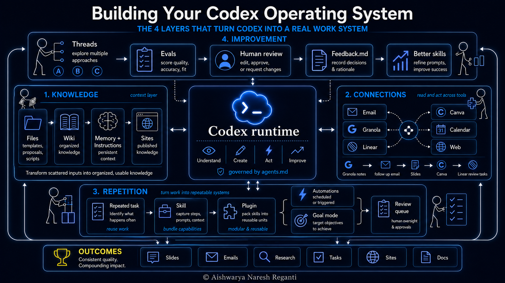

# I Automate My Entire Company With Codex (Full System)

[Watch on YouTube](https://www.youtube.com/watch?v=bHfoEBO2AP4) · 2026-07-13

<!-- agenda slide -->

## In this video

- **00:00** How Do You Run a Company on Codex? (The 4-Layer System)
- **00:47** Layer 1: Build an AI Knowledge Base (Wiki) for Codex
- **03:56** Layer 2: Connecting Codex to Your Tools (Email, Linear, Canva)
- **06:33** Layer 3: Codex Skills, Plugins & Automations
- **10:34** Layer 4: Evals & Feedback Loops That Improve Your AI

## Resources

- [AI Engineering course cohort](https://maven.com/aishwarya-kiriti/o/d4b008)
- [LevelUp Labs](https://levelup-labs.ai/)
- [The Nuanced Perspective (newsletter)](https://thenuancedperspective.substack.com/)
- [LevelUp Labs education](https://levelup-labs.ai/education)
- [Awesome Generative AI Guide](https://github.com/aishwaryanr/awesome-generative-ai-guide)
- [My courses on Maven](https://maven.com/aishwarya-kiriti)

## Transcript

_Auto-generated captions from YouTube, lightly cleaned._

Most people think Codex is just for writing code. It does so much more than that. You can hand it a huge range of your actual work, and it will automate entire workflows for you, and also build a second brain that can keep running while you sleep. Now, I spent a decade as an AI researcher and a tech lead before leaving Amazon to build my own AI native startup, and we are doing millions in revenue with a very small team. We've moved a huge part of our workflows over to Codex, and the gains have been super massive. But, in my honest opinion, the gains come from one thing more than any other.

It's the operating system that we've built around the tool. That's what I'm going to walk you through in this video. The exact four-layer operating system we use to run our entire company, and how Codex supercharges that so that you can build it on your own. So, layer one is knowledge. Now, Codex is only as useful as what you've told it. Most people have never set up their knowledge layer the right way, which is why they keep getting a lot of generic AI answers. There are essentially three steps to setting up this layer. You're using maybe 10% of what Codex can do if you haven't told it anything about your work.

Here's how to get it up to speed so that you can get outputs that are actually useful. Step one is for you to gather your knowledge. Take everything relevant to the work you do and put it in one folder. For instance, for me, that would be design templates, proposal documents, brand voice samples, contracts, and all of that. And let's say you were a content creator, it would be scripts, research notes, reference videos, et cetera. Now, if you work across multiple different projects, it's all of the documents that drive each one of them. Step two is for you to turn that folder into a wiki. Now, this is the part that most people miss.

A pile of documents is just a scattered mess for agents to look at, and a wiki or an index is a knowledge base that the agent can actually navigate easily. And it's super simple to set up. Go into Codex and run a prompt like this. Build me a wiki from everything in this folder, divide it into clear categories so you can search it easily instead of scanning raw files every time you need something. Now, watch Codex do the work for you. It will create folders, pull out themes, and build a structured knowledge base where everything will be findable in seconds. Now, step three is super important, which is telling your Codex to look at the wiki every time it's talking to you.

You can go to Codex and say, "Update the agents.md file to first look at my wiki folder in this directory for any context about my work, projects, and also my brand templates." And that's pretty much it. Every session, Codex knows exactly where to look. Now, the fourth step is super fun, which is showing you how this looks in practice. I'll ask Codex to build me a presentation for a sample client and watch what happens. It pulled the right design template, the brand voice, the offering details from the wiki on its own. And the output already speaks the right voice and shows the right offerings that we have, all from the wiki context alone, and I didn't have to specifically tell it all of this.

And here's where it gets incredibly more better. Once the knowledge base exists, I don't have to keep it locked on my machine. I can go tell Codex, "Take this wiki and deploy it as an internal site that my team can read." Now, Codex builds the site, hosts it, and hands me back a link that only my team will be able to see. Now, this feature is called sites, and my knowledge layer goes from being just a folder on my laptop to living in our internal hub where the whole team can operate on. Now, here's what you want to do this week. Pick a section of your work, gather everything relevant into a folder, and run this prompt.

"Build me a wiki from everything in this folder, divide it into clear categories so that you can search it easily, and edit the wiki where it needs editing." Then you can also open your agents.md file and add one line. "I have a wiki folder in this directory with everything about my work, my projects, and my brand templates. Look there first when you need context." Test it on a real task and watch what happens. You can also continuously keep updating your wiki to improve the quality of work. Now, let's go to layer two, connections. Now, this is the move that turns Codex from something you talk to into something that actually can do your work.

Now, this is where a lot of people get stuck. There's one move that turns Codex from a chatbot into a co-worker, and most people never make it. Let me show you what it looks like. I'm going to go open Codex, and there's a list of connectors that I can plug in. I want my email, click. I want Granola where my meeting notes live, click. I want Linear where my team tracks our work, click. And I want Canva where my team collaborates on design, click. Now, Codex has access to all of these four places where actual work happens. Let me show you a few things this actually unlocks.

Back to the presentation in layer one, remember I told you that I want my team to review it. Watch how we do it in an agent-native way. So, I go up to Codex and tell, "Push the presentation to Canva so the whole team can edit it together. Then create a linear ticket for each reviewer with a link to the Canva file and the specific feedback I want from each." Codex can pretty much do it. Presentation in Canva, tickets in Linear, each reviewer routed and assigned. All done and dusted. Now, same idea with meetings. After every client call, I ask Codex, "Pull the notes from Granola and draft a follow-up email for me." It does.

I just review it, edit, and send. Or in the morning before a coffee chat, "Research this person on the web and give me three things to bring up." Done in under a minute. Now, while all of this is super magical, remember one quick rule before you start. Give Codex or any AI tool only the access the task needs. Read-only by default. Now, here's why I'm super strict about this. Every tool you connect is one more thing your agent can do on its own. If you connect too many tools at once, you lose track of what it's doing. It sends emails you never saw, takes actions you never approved, and if you give it enough room, the agent ends up steering while you are along for the ride.

That's backwards, right? You're the one who should be in command and one tool at a time. Always know what it can touch and keep your agents working for you. Now, here's what you want to do this week. List the three tools you use the most in your actual work, your email, your calendar, your ticketing system, a meeting recorder, your CRM, whatever it is. Connect those first and skip the rest until you have a specific need for them. And for the next 2 weeks, deliberately route your work through Codex. Draft emails through it, query tickets through it, and also pull research through it. Now, the point at first is familiarity.

Speed comes after you build that muscle. Now, after a couple of weeks of routing your work through Codex, you'll notice that the same asks keep coming over and over again. That's your signal for going to layer three. So, our layer three is repetition. Now, every time you explain the same task to Codex, you're doing the work the system should be already doing for you. When you set up Codex the right way, you never have to explain it to do task twice. And it only takes 30 seconds to set up. Build a skill. Now, let me show you how that works. Take the post-meeting follow-up that I demoed earlier.

I've probably asked Codex to do this maybe about 20 times by now, and always in the same way. Pull the notes from Granola, summarize action items, and draft a follow-up email. So, this time I tell Codex, "Save this as a skill. Call it post-meeting skill." And Codex will build an artifact and save it. Now, that artifact is a skill. It's essentially like a codified process that Codex can use several times without me having to re-explain each time. And here's a pro tip almost nobody ever talks about. Whenever Codex or any AI tool builds a skill for you, open it and read it. See the prompt it wrote for itself.

See the instructions that are baked in. Test it once even before you start using it and automating it. A lot of people blindly trust skills that are written by their AI agents, and they they drifting in subtle ways. Now, the 5 minutes you spend on reading the skill will save you weeks of bad output downstream. Now, once you start getting comfortable with building and using skills, it's time to go one level higher, which is using plugins. Think of a skill as an entry point that teaches Codex one process or one workflow. A plugin is pretty much a hyper version of a skill. It bundles skills together with app connections and the tools they need all in one package that you can install in a single move.

So, a skill teaches Codex one step and a plugin hands it a whole capability. And the really cool part is that OpenAI ships their own role-based plugins, which are ready-made bundles built for specific kinds of work. Think sales, creative production, etc. with dozens of apps and skills that are already wired in. You install the plugin for your role and you're productive from day one. And one more important thing in this layer, did you know that you can also make a skill run even without you being around? In Codex, that's called automations. Now, the skill that I demoed above, it pretty much runs when I type it, but that's the manual way.

With an automation, I can set the same skill to run on a schedule or kick off when something else happens like a webhook. Here's a concrete example. Every time I finish my one-on-one with my reports, Codex runs an automation for me. It checks my calendar to confirm that the meeting actually happened, looks at the granola notes from that call, and creates linear tickets for the action items that we discussed in the call. Now, I also make sure I stay in the loop. The results land in a review queue that I can glance and change anything if needed and then send over to Linear so that my team can take a look at the action items.

And for bigger jobs in Codex, there's another gear to pull. It's called the goal mode. Now, automations handle the small recurring stuff, but when I have one large objective that takes hours, I hand it over to goal mode. For example, I can tell Codex to migrate every old proposal into our new template and flag anything that doesn't fit. I give it the goal and a clear finish line and can work through all of it on its own, check its own progress, and also comes back when everything is done. So, recurring work runs on automations, but big pushes run on goals. Either way, the work happens without me having to sit down there and watch if I set up the right system around it.

As you start using Codex more, you don't need to remember every recurring task yourself. You can literally go to Codex and ask, "What are the few things I've been doing over and over? Could we turn any of them into skills?" Now, since Codex saves your past conversations and has memory about your discussions, it can look back and surface the patterns. But, always remember to stay in control. Don't accept everything it suggests blindly. Use the suggestion as your starting point for ideation, then decide what becomes a skill. Now, remember that skills get sharper or duller depending on what you do with the corrections you make. And without a system for capturing those corrections, they'll pretty much evaporate.

Now, that's what the next layer is for. Layer four, improvement. Now, most people build a system once and wonder why it stops working. The answer is always the same. They never built the loop that makes it improve. Save the corrections somewhere they actually compound. Here's how. Now, I use two distinct pieces to make sure that Codex keeps improving as I talk to it. One of them is feedback.md and the other is what I call personal evals. Now, let's start with the piece that runs even before Codex generates anything. Personal evals. The question is pretty simple here. What does good look for the skill you're building? Whatever is your answer, just write it down as a rule and tell Codex to check against that rule every time.

Let me show you what I mean with the meeting summary skill we built earlier. When I created it, I told Codex, "Add two evals to this skill. First, every summary must follow the format: What was discussed? What are the action items for the team? What were the decisions made? And open questions." Second, every summary must stay under 600 characters. That's it. Now, every time the skill runs, Codex checks the output against both those evals before showing me anything. If the format is off or the summary is too long, Codex rewrites the output. Now, you can stack as many evals as the work needs. For instance, another one that I use in the same skill is before you finalize, look up slop words file in my wiki and make sure none of them appear in the summary.

That's the third eval. Just with one line in your prompt, you get consistency every single run. Now, here's a new feature on Codex that I've really come to like and it makes your evals far more powerful. It's called threads. A thread is almost like one working conversation in Codex and the key thing is you can run several at once in parallel side by side each like its own agent. It's almost like having multiple assistants work on the same task in parallel. Here's how I love to use it coupled with evals. Say I want to draft a client proposal and I'm not sure which angle is the strongest.

I ask Codex to open three threads and perform the same task with a prompt like this. Draft the Acme proposal using our template and brand voice from the wiki, but generate three versions of it from three different angles, business outcomes, cost savings, and revenue generation. Now, Codex generates three different versions of it using parallel threads and then I can check which of them matches what I would like using my evals giving a prompt like this. Compare the three proposal drafts my threads just produced, score each one against the eval rules in my wiki, and tell me which one wins and why. Now, the threads give me options while my eval chooses the winner.

I'm running multiple attempts at once and keeping only the best and my own judgment is baked into the rule that chooses the part that I love. Now, piece two is feedback. Evals can fix the problems you already know about, but as you start building more use cases, you'll start hitting new ones that need more fixing over time. Now, there two ways to handle that. One is just the simple way. Keep talking to Codex, and when something's off, tell it right in the conversation. And if there's a specific spot, annotate it and mark the exact part that's wrong, and say what it has to fix. Another more advanced way, or a durable way, is to give each skill or plugin its own feedback file, so that your corrections get written down and actually stick.

You can also set this once in agents.md, which is Codex's playbook, and it applies to everything. So, you could write something like this in your agents.md, or directly talk to Codex and make it happen. Every skill or plugin that I create or install should have a feedback file attached to it. After every run, ask me for feedback and write what I say into that file, so that we can continuously keep improving my skills. Now, every skill collects its own corrections, and those corrections will keep compounding, and you can decide when to update your skill, so all of those corrections are incorporated. Now, here's what you want to do this week.

Pick one workflow where quality matters, build a skill around it, and add a couple of evals so Codex checks its own outputs before showing you anything. Now, add a feedback file, so that you can correct the skill over time, then start running it. As you correct things, the skill improves. And as patterns emerge, you tell Codex to remember them because it has durable memory that can carry across sessions. Now, any workflow you build compounds over time because the loop has pretty much shaped it. And one real loop running beats 10 clever prompts. And that's pretty much the four layers: knowledge, connections, repetition, and improvement. And let's just step back and see the whole thing put together.

Imagine you're hiring a new person to work with you. Day one is when you give them context. That's exactly what we did with the wiki, the brand voice, the projects you're working on, all of that. That's layer one. Week one, you connect them to the whole ecosystem of tools that you have in your company. Email, calendar, your ticketing system, your meeting recorder, that's the layer two. In month one, maybe you walk them through the work that happens every week and let them practice that. Now, the post-meeting follow-up I built, the pre-call research, the daily wrap, that is layer three. And pretty much forever, you keep giving them feedback.

You correct what's off, you teach them how actually you want things done, and you make sure that those connections stick. That's layer four. You wouldn't hire someone and skip any of these steps, right? That's exactly the same with AI tools like Codex. Now, most people assume that you can automate everything on day one, and it couldn't be further from the truth. And here's the part I want you to remember, our promise from the start. Tools will keep changing, and the new ones keep showing up all the time. But these four layers that you build will work no matter which tool you're using. Now, when your underlying system is solid, you can pretty much always grab the best tool at the moment and swap it in, because the system underneath pretty much stays the same.

The tool was always the easy part. The system you build is what lasts forever. If you remember nothing else from this video, remember just these four things. Knowledge gives Codex context, connections give it reach, repetition gives it leverage, and improvement closes that loop. That's the operating system you want to build with Codex or any other tool. So, what's our biggest lesson from this video? Codex, or any AI tool for that matter, is only as powerful as the system you build around it. And now you know how to unlock it. If this resonated, you can check out all our offerings on leveluplevels.ai. We help teams and individuals go AI native using exact systems like the one I just spoke about.

And I'll be coming up with more battle-tested and experience-driven videos just like this one. So, make sure you subscribe and don't miss them. All the very best.
