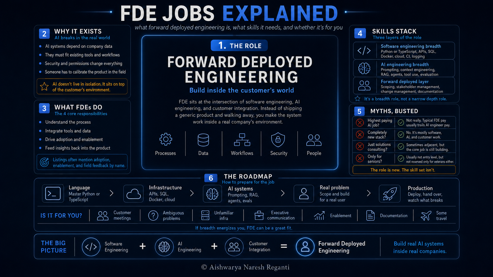
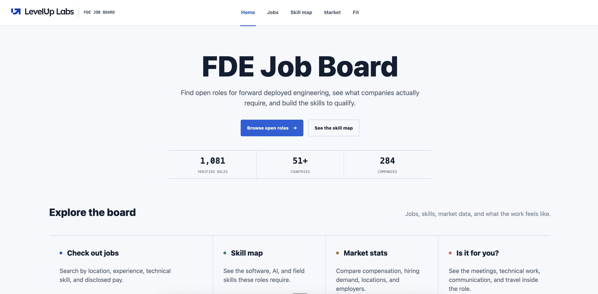

# Forward Deployed Engineer: Hype, Reality & a Realistic Roadmap

[Watch on YouTube](https://www.youtube.com/watch?v=9MfwdJUTKzw) · 2026-09-11

<!-- agenda slide -->

## In this video

- **What forward deployed engineering is**: the Palantir origin, and why selling one capability to many customers puts engineers in the field
- **Why it took off in the AI era**: AI sits on top of a company's own tools, data, workflows and security, and someone has to make that work inside their environment
- **What these engineers actually do**: 4 responsibilities, and what the listings say about travel and sales
- **The skills it asks for**: software engineering breadth, AI engineering breadth, and the forward deployed layer on top
- **4 myths busted against the listing data**: the pay, the stack, the solutions consultant question, and the experience bar
- **Is the role for you**: what the week looks like, and the signal we hire on
- **The roadmap**: the 3 layers in order, and how to learn the last one before anyone hires you

## The job board

Every role in this video is on the board, and it's kept updated:
**[fde.levelup-labs.ai](https://fde.levelup-labs.ai)**

Filter by location, by experience asked for, and by the skill signals in the listing, then
apply at the source. The skill map breaks the roadmap into all 3 layers and shows how often
the listings name each skill.

## The cheat sheet

The roadmap, the listing test, and the myths in one file:
**[forward-deployed-engineering-cheatsheet.md](forward-deployed-engineering-cheatsheet.md)**

## Resources

- [FDE job board](https://fde.levelup-labs.ai)
- [LevelUp Labs](https://levelup-labs.ai/)
- [The Nuanced Perspective (newsletter)](https://thenuancedperspective.substack.com)
- [LevelUp Labs education](https://levelup-labs.ai/education)
- [Awesome Generative AI Guide](https://github.com/aishwaryanr/awesome-generative-ai-guide)
- [My courses on Maven](https://maven.com/aishwarya-kiriti)

## Sources

- **The job data in this video.** 1000+ live postings, read directly from companies' own applicant tracking endpoints, and measured against ordinary AI engineering roles at the same kind of companies. Browse and filter all of it at [fde.levelup-labs.ai](https://fde.levelup-labs.ai).
- Cadie Thompson and Lakshmi Varanasi, Business Insider, updated 18 May 2026, for the growth figure behind the "hottest job" framing. The piece carries a correction: *"An earlier version of this story misstated Indeed's data on forward-deployed engineer job postings as individual job posts. The figures cited are indexed values relative to a January 2025 baseline."* The corrected text reads that April 2026 postings were 5,230% above January 2025 levels, roughly 729% year over year. These are index values against a January 2025 baseline, not counts of jobs, and the underlying data was shared privately with the outlet, so no reader can check it. The uncorrected version is what reached the trade press and the popular videos.
- Newcomer, on Decagon, for the argument that the role may be transient as AI systems converge and the software starts to sell itself. [newcomer.co](https://newcomer.co/p/decagon-hit-100-million-betting-against)
- Palantir originated the role, and had more forward deployed engineers than software engineers until roughly 2016, when Foundry shipped and the ratio flipped.

## Transcript

A million-dollar salary.

That's what people say the hottest job in AI is paying right now.

It's called forward deployed engineering, and most AI companies are racing to hire for it.

But how much of this is real, and how much is just hype?

To find out, I pulled more than 1,000 live job listings for this role, straight from the companies that are actually hiring.

I built a job board out of them that you can use, and ran a deep analysis on all of it, so I can tell you the truth about it.

By the end of this video you'll know what the job actually means and the skills it really asks for, grounded in these live listings. We'll also bust the 4 biggest myths about it.

And after all that, if you still want the job, I'll take you through a detailed roadmap.

Here's everything we're covering. Screenshot this.

(stay on 08, or cut to camera) And if you're new to this channel, I'm Aishwarya Reganti. I spent a decade as an AI researcher and a tech lead at AWS, and I now run my own startup, LevelUp Labs.

I've also been hiring forward deployed engineers myself for the past couple of years. So alongside the data, I'll give you my own take from the hiring side.

So let's start with what this job actually is, because there are tons of definitions floating around it right now.

Now, the first time this job was really put together was at Palantir, about 10 years ago. They were working with governments and very large institutions, where the data sat in old, locked down systems that looked completely different at every single customer. So unlike a traditional software company, they couldn't build one product and have everybody use it the same way. Their engineers had to go there, be in the field, and essentially be forward deployed, to make the thing actually work inside that environment.

And the whole thing comes down to this. A traditional engineer builds a capability inside a product, and many customers use that same capability. A forward deployed engineer builds a lot of capabilities, because one product shape is just not enough for all these different customers to use.

So a forward deployed engineer is expected to go into the company, learn how that business actually runs and what tools they use, and build inside their world, instead of shipping them something and expecting them to self-serve. And that's where the role came into play.

Now, the reason this role got so much more popular in the AI era comes down to pretty much one thing, which is that AI products demo really well and then break under real world, production style use cases.

And the reason they break is that AI systems fundamentally sit on top of your existing tools and your existing data environment. They aren't something you can isolate from the environment they're going into.

So to make one of these work well and actually take it to production, you can't make it self-serve the way traditional software applications are. Somebody has to come in and calibrate it inside the company.

Which is why a lot of product companies started selling not just the AI software, but also a bunch of engineers who come along with it, so that it actually works in your environment.

And there are essentially 4 things these engineers do.

One, they understand your processes. They sit with your team, work out how you actually operate today, and make sure the features in the product are genuinely solving those processes rather than something adjacent to them.

Two, they build systems for you. They make sure the product can actually see all of your tooling, your data and everything else you have, which is usually where the real work is.

Three, they drive adoption. Because AI fundamentally changes the way people work, so somebody has to lead the enablement and get the team to actually use it.

And four, they bring insights back into the product. And this one runs the other way, back to their own company. A lot of these companies are still building their product as they go, based on what they're seeing in the field, so they want the person sitting with the customer to bring that back.

So understand, build, make them adopt, and then feed it back. And I'm not making this up, right? This comes straight from the listings. About 40% of them ask for adoption, enablement or change management by name, and about a fifth specifically say you're expected to bring insights back so that it shapes the roadmap.

Now, there's another side to this coin, which is that this is also why some CEOs, Decagon's for instance, think forward deployed engineering might be a transient role. It might not be something that stays forever.

And their argument is that as AI systems converge and become more commonplace, you might not need engineers going in and embedding themselves to make it work. The software would be able to sell itself, pretty much like traditional software does.

But given how early we are in this space, we don't really know. So it's just something you want to keep in mind.

So that's the role and why it exists. Now let me get into the part that actually matters if you're considering this, which is what skills it asks for.

Now, before we go straight into the skills, you want to understand where this role actually sits, because it pretty much explains everything that comes after.

Forward deployed engineering is essentially an overlap of 3 things.

The first is software engineering, and that's the biggest part of it, because these are the people who have to go and build. So a lot of plain software engineering is required here, and remember that how you scale something and actually take it to production doesn't change just because AI showed up.

The second is AI engineering. And the simplest way to think about that is the API you're calling is now non-deterministic. You send the same thing twice and you can get two different answers, so everything you build on top of it has to account for that.

And the third is what makes it forward deployed, which is taking all of that and integrating it into a company whose infrastructure you know nothing about. Their data, their systems, their security, their people.

And given that it's those 3 buckets, that's where your skills need to be.

And remember, forward deployed engineering is a breadth role, not a depth role.

Now, if you pull out the most common keywords across all of these forward deployed listings, they're things like customer facing, stakeholder management, change management, documentation, discovery and scoping, and deploying into an environment you don't control, right?

And I'm not going to just put that on a slide, because the job board actually shows you this properly. So let me pull it up.

And the way I'd put it is you want to be wearing a strategist's hat and a product manager's hat, while also being the person who actually builds it.

And we'll talk a lot more about the exact roadmap for all of this a little later.

Okay, now let's get to the spicy part of this video, which is busting the myths that are floating around about this role. And we'll do all of it using the data we have.

So the first myth is that this is the highest paying job in AI. And this is the one you hear constantly, usually with a very big number attached to it.

So what I did is I took the salary bands that these listings actually disclose. And to give you a proper comparison, I also pulled about 800 ordinary AI engineering roles at the same kind of companies, so that you can really see where these numbers sit.

And forward deployed comes out below AI engineering. Around $150,000 to $210,000, against roughly $198,000 to $292,000.

And you don't have to take my word for any of this, it's sitting on the board, so let me show you.

Now, that million dollar number you're probably seeing is real. But it's a principal level package at a frontier lab. And AI engineers and researchers at those same labs are paid in that range too, so that number is telling you something about those companies rather than about this role. So I'd take it with a pinch of salt.

The second myth is that this is completely a new role, and that you have to go and learn a completely new stack. And we covered this one already, so I'll be quick. It's software engineering breadth, plus AI engineering breadth, plus the customer work. The stack barely moves, apart from having to understand somebody else's environment.

The third myth is that this is just a rebranded solutions consultant role. And this one comes up a lot, usually phrased as, this is just a customer consultant or a solutions consultant with a fancier name.

And based on the data, some companies genuinely are doing that. There are listings that are essentially a solutions engineering role dressed up in AI language, and you can see it.

But there's one clear difference. Those solutions roles talk about supporting the sales cycle in about 63% of postings. And across the forward deployed postings, it's around 20%. So sales isn't really what these roles are about. They're about going into the field and building things.

So this one isn't exactly a myth. It's more that you want to be sure about what a specific listing is actually asking for, and the way to check is to read it for sales cycle language, and for a quota attached to your name.

And the fourth myth is that this role is only for senior people. Or, depending on who you ask, the complete opposite, which is that it needs no experience at all.

And from the data, the reality is somewhere in between. The median minimum experience across these listings is about 4 years, so it's genuinely not a first job. But close to 40% of them don't state an experience requirement at all, which means a lot of these companies are open to newer people coming in, as long as they actually have the skills.

And both of those numbers are on the board too, so let me quickly show you where they come from.

Now, remember that this role is a culmination of multiple roles. So if you have a background in any one of these, especially if you've done software engineering and then picked up AI engineering, that's pretty much exactly what employers are looking for here. Just because the role is new doesn't mean the skill set is new.

Just don't expect the salaries to be crazy. They'll look like typical software engineering salaries, and the data backs that up.

So those are the 4 myths. But before I give you the roadmap, let's talk about what the job actually feels like week to week, because that is how you decide whether you want it at all.

And the most useful way to answer that is to look at what your week actually looks like.

You're in a lot of meetings with people who don't work at your company.

You're sitting with somebody's team trying to work out what they actually need, which is usually different from what they asked for.

You're writing code, but often in an environment you don't control, with tools you didn't choose.

You're explaining technical decisions to executives in language they can act on.

You're running enablement sessions so that somebody else's team will actually use what you built.

You're writing things down so the next person doesn't start from scratch.

And there's some travel.

If that sounds good to you, this is a genuinely great role, and it'll stretch you in ways a pure engineering job won't.

And I've mapped this whole thing out on the board as well, so you can go through it in your own time. Let me show you.

And if listening to all of that made you tired, and what actually makes you happy is going deep on one hard technical problem for 6 months, then this isn't your role, and that's a completely reasonable thing to know about yourself.

I'll tell you from the hiring side, when we hire forward deployed people, one of the biggest things we look at is communication. Whether somebody can hold a room and bring it with them. And that's pretty much the job.

So if that still sounds like the kind of work you want, here is the roadmap I would follow, in order.

So here's how I'd sequence it, and it's the same 3 buckets, from the bottom up.

And I've actually put all 3 of these layers on the job board as a skill map, so you can click into any layer and see every skill inside it, along with how often these listings actually name it. And from any skill you can jump straight to the roles asking for it.

The first layer is software engineering breadth. This is the one people want to skip, and you can't.

So the first thing you want is one language that you know properly, and that's usually going to be either Python or TypeScript. Python, because pretty much all of the AI tooling out there is written in it, so that's where all the libraries and the examples live. And TypeScript, because a lot of what you end up building is something a person actually clicks on.

Then you want to understand APIs, which is essentially how one piece of software talks to another. And you want to be able to do both sides of it, so consuming somebody else's API and designing one of your own, because most of this job is connecting your system to theirs.

Then databases and SQL, which is where the customer's data actually lives, and SQL is how you go and ask it questions. And in a normal engineering job you'd usually be designing your own database. Here, you're walking into a company and reading somebody else's on day one, so you want to be genuinely comfortable with this.

Then containers and Docker, which is essentially packaging up your application along with everything it needs to run, so that it behaves the same way on their infrastructure as it does on your laptop. And this matters a lot more in this role than in a normal one, because you're deploying into environments you don't control.

After that, you want to get comfortable in at least one cloud, and understand CI and deployment, which is how your code actually gets from your machine to something that's running, safely and repeatably.

And then monitoring and logging, so that you know something has broken before the customer calls you to tell you.

And the goal across all of that is pretty simple. You should be able to take an application from your laptop to something real people are using, and then keep it alive.

The second layer is AI engineering breadth, which is essentially building against a non-deterministic API. You send the same thing twice and you can get two different answers, and everything here exists to deal with that.

So the first thing here is prompting and context engineering. Prompting is how you ask the model for something. And context engineering is the bigger piece, which is you deciding what information actually goes into the model on any given call, and what stays out. And this one matters enormously in this role, because the context is the customer's. It's their documents, their data, their tools. So getting the right slice of all of that in front of the model is pretty much the job.

Then you want to understand retrieval, or RAG, which is how your system goes and finds the right information before it answers, instead of relying only on what the model was trained on. And that's what lets you build on a company's own knowledge rather than on general knowledge.

Then agents and tool use, which is essentially giving the model the ability to go and do things, like call an API, query a database, or run a step in a workflow. And most of what you end up building in these roles is some version of this.

And then evaluation, which is how you know whether the thing is genuinely working. This is the part most people skip. And in this role you're usually the one deciding what good even looks like for this particular customer, so you really can't skip it.

Now, I have a whole video that walks through all of this properly and I'll link it below, and the AI Builder's Handbook goes deeper again.

And the third layer is the forward deployed layer, which is mostly about how you scope. Sitting with somebody and finding the real problem underneath the one they described, driving adoption once the thing works, and documenting what you learn so somebody else can use it.

Now, there isn't really anything you can go and read for this, right? So if you're a beginner and you haven't done this before, the only way to learn it is to go and find a real problem and build something for it.

And it genuinely doesn't have to be impressive. It can be a mom and pop shop down the road with a scheduling problem. Talk to them, work out what's actually wrong, build it, get them using it, and watch what happens over the next 2 months.

That one exercise teaches you scoping, system design, adoption and handover all at once, and you can do all of it before anybody hires you.

So if you've got this far and you still want it, I've put a few things together for you.

There's a job board with every one of these roles I collected, which we'll keep updating, so you can go and actually apply.

And you can filter it down by location, by how much experience is being asked for, and by the skill signals in the listing, so you can see which of these are genuinely a good fit for you before you spend time on an application.

Now, I'm not going to give you a 30 day plan, because it depends completely on where you're starting from.

But hopefully you now have a much better view of whether you should do this at all.

