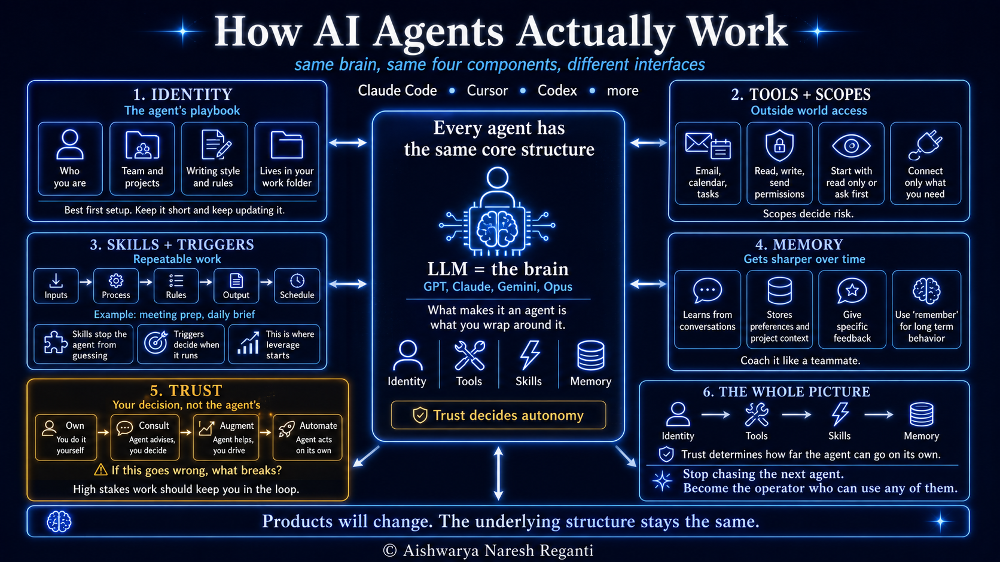

# How to Use AI Agents Better Than 99% of People | Ex-Amazon AI Scientist

[Watch on YouTube](https://www.youtube.com/watch?v=StlKtZLyxw0) · 2026-06-24

<!-- agenda slide -->

## In this video

- **00:00** How Do AI Agents Actually Work? (The 4 Components)
- **01:42** Component 1: The Identity File (How to Set It Up)
- **04:57** Component 2: Connecting Tools Safely (Gmail Scopes & Permissions)
- **06:43** Component 3: Skills e Triggers (Make Your Agent Sharper)
- **09:43** Component 4: Agent Memory That Compounds
- **11:35** Bonus: The 4 Trust Levels (Own, Consult, Augment, Automate)

## Resources

- [LevelUp Labs](https://levelup-labs.ai/)
- [The Nuanced Perspective (newsletter)](https://thenuancedperspective.substack.com)
- [LevelUp Labs education](https://levelup-labs.ai/education)
- [Awesome Generative AI Guide](https://github.com/aishwaryanr/awesome-generative-ai-guide)
- [My courses on Maven](https://maven.com/aishwarya-kiriti)

## Transcript

_Auto-generated captions from YouTube, lightly cleaned._

Most people using AI agents today are doing it wrong, and the reason has nothing to do with being technical. I've been working in AI for about a decade now. Today, I run a multi-million dollar company where agents do a huge amount of operating work. So, I've seen both the magic that they can create and the mess up close. Now, most videos teach you the newest features in agents, the latest prompts, and the exact buttons to click. But, if that's all you learn, you're still operating with a black box. And the moment the product changes or a new agent drops, you're lost all over again. I want to show you how agents actually work underneath because most of them are surprisingly similar once you look past the interface.

Every AI agent on the market, Claude Code, Cursor, Codex, Open Claw, all of them, is built on the same four components. Once you know what they are, any tool you pick up will make immediate sense. In this video, I'm going to walk you through those four components so you can start using agents to automate your work and do more in 1 week than most can do in a month. Here's what's actually happening inside every one of these products. At the center sits a large language model, Opus, Sonnet, GPT, Gemini, whichever one the product runs on. That's kind of like the brain of the system. Now, what turns that large language model into an agent is everything you wrap around it.

And this is the fun part, right? That everything is always the same four things: identity, tools, triggers, and memory. We're going to go through each one of them, and there's one more thing in the end, but that really depends on you. The four components are almost like your map, and there's always one place to start on that map, and it's the same in every agent product. And that is component one, the identity. This is the file your agent reads before every single conversation with you. Most people never bother to tweak it, and that's obvious in the kind of outputs that they get from their agents. Every product uses different names and structures for identity, but they pretty much do the same thing.

When I first started using one of these agents, every single conversation began the same way. I had to remind it what my company did, who was on my team, that I don't like long paragraphs, we use linear for tasks, what voice I write in, what good looks like for a brief versus an email, and all of those stuff, right? And after doing it enough number of times, I just sat down and wrote it all down in one file. The very next conversation, I didn't have to re-explain myself. The agent already knew. And by the second one, I stopped noticing I had an agent at all. It almost felt like a really smart colleague who already knew me.

And that is why the identity files are the highest leverage files in your entire setup. The agent literally reads it at the start of every conversation, every skill, every task, every chat you have with it. And anything you put in there changes how the agent shows up from then on. So, where does it live? Inside the folder where your work actually lives. So, step one when you start talking with any new agent is pointing it at your work folder, wherever you keep your projects, your docs, your notes, that's the folder you want to connect it to. And the moment you do that, the agent finds the identity file and reads it before every interaction with you.

Think of it almost like writing an employee playbook for someone joining your team on day one. So, next question is what goes into the identity files. Part one is information about you. For example, what your company does, your role, the projects you're currently working on, the people on your team that your agent should know by name, and just a few sentences on each one of these. Just enough context that any new colleague who you'd like to have on day one. Part two is how you want the agent to work for you. For example, never use emojis, always get my approval before sending emails, keep summaries under 200 words, or anything that's basically a set of preferences that you have.

And make sure you use plain English, not complex jargon. Two things to keep in mind. One is keep it very succinct. A bloated identity file is worse than no file at all because the agent kind of tries to act on everything in there. And two, this is not going to be a one-time setup. You'll keep tweaking it over time as the agent makes mistakes and as your work changes. It almost evolves and grows with you. And here's a pro tip, right? You don't have to write this from scratch all alone. You can literally chat with your agent so that you can set up its identity. Open your agent inside your work folder and tell it, "I want to set up your identity and how we should work together.

Look at the docs in my folder, get a sense of who I am and what I do, and write a first draft for me." So, what the agent will do is pull from all of your notes, your past writing, your project briefs, everything that's in your folder, and it will generate something that's mostly there. You want to read it line by line, edit anything that doesn't sound like you, and remove anything that's generic. You want to make sure that the file is yours. Once your agent knows you and how to work with you, the next move is giving it reach into places where your real work lives.

Which now brings us to component two, outside world access. Now, tools are how your agent gets reach into the outside world. Most people connect them without reading the fine print, and that's exactly where things start to go wrong. So, I was on this call with the CEO of a large tech company recently, and you'd think that a CEO of a company of that size would have thought about something like this, but these tools are moving so quickly that people tend to almost overlook these things. So, he told me that his agent had sent out an email to one of his clients with information that should have never left the company.

And he was sitting there afraid, trying to figure out how this had even happened. But after doing a deeper pass at his setup, we'd figured out that he'd given the agent full write access to his email on day one. Here's what almost nobody realizes. Every tool you connect to from your agent comes with the idea of scopes, and most people don't even look at them. They just click connect and assume that's about it. But, each tool has settings for what the agent can read, what it can write, and what it can send. Let me show you exactly what this looks like in Claude. When I go to connect Gmail right now, watch what comes up.

So, these three options are sitting right in front of you every time you connect to a new tool, and almost nobody sees them. You need to tighten them as you connect each one. Default to read-only or ask me first until you watch the agent work on that tool enough to trust how it's behaving. The first tools to connect are the three places where your real work actually happens. And for most people, that's your email, your calendar, and your task system, something like a linear or Jira or whatever you work with. Connect those three with the right scopes, then skip the rest until a specific task needs them.

Now, the agent knows you, and it can see where your work happens. The next move is teaching it the work you keep doing over and over, which brings me to component three, skills. Skills are where your agent stops guessing and starts delivering for you. Think of this as the move that takes an agent from occasionally helpful to something that you cannot work without. Picture this, you've started working with your agent, you're asking what meetings you have today, asking it to research a particular person you're meeting before your call, and you're already doing in minutes what would previously take an hour. But, after you've done this a bunch of times, you'll notice the same kinds of asks are coming up over and over, and you start realizing that every time the answer comes back a little different.

Maybe different format, different sections, sometimes also maybe missing pieces that you actually wanted. Now, that's because the agent is guessing at your version every single time. So, what's the problem? You're missing some skills. Well, not you, but your agent. So, a skill is where you write down exactly what your version of a task should look like, so the agent can stop guessing. For instance, I run a skill called meeting prep. I'm in calls every day with customers, with my team, with leaders at some of the largest companies in the world. Now, I need a brief on every person I'm meeting that morning, exactly the way I like it.

So, I built that as a skill with three parts. Part one is the input, which is what the agent needs in order to do the job, like my calendar, my notes on these people, and even web search. The second part is the process, which is the steps that the agent should take in order to complete my task. Pull everyone on my calendar with whom I have a meeting today, research what they're currently working on, find the last few things that they've published, and format that into one-page brief for each call. And to make sure there's consistent quality in the output, I put in some hard rules as well, which is what the skill must never do.

Never include confidential information from internal threads, never run longer than one page per person, and all of that, right? Now, once the skill is doing exactly what you want, you can take the next step, which is the real power move. For the meeting prep skill that I have, I use a scheduled trigger. Every morning at 6:00 a.m., the briefs are waiting before I even open my laptop. And here's the best part, right? You don't have to write the skills or the triggers all on your own. As we've been doing so far, you can just chat with your agent to set it up for you. Let's say you want to get started with building a simple daily brief skill for yourself.

This is what you can tell your agent. The inputs should come from these websites, this folder of notes, and my calendar. This is what I want the brief to look like. Paste your format of choice, this is the format I like. You can also mention some hard rules. For instance, keep it under 300 words, group items by project, never include items I mark done, and any other preferences that you have. And this is the part where you ask it to schedule a trigger. Once it's working, run it every morning at 7:00 a.m., and save the output to my Notion daily brief page. That's pretty much it.

The agent writes your skill file, sets the trigger, and starts running it. And the cool part is that the longer it runs, the sharper it gets. Which brings us to the last component on the agent side. Component four, memory that compounds. Memory is the component that makes your agent get sharper every week. And since most people don't know about it, they do not completely reap the benefits of memory. Beyond the identity files that I set up in the start, my agent has learned a bunch of other things about me. For instance, it knows that I don't like hyperbolic messages, I prefer reading my AI news from Hugging Face.

It also knows the status and progress of each of my projects, and none of this was mentioned on my identity file. The agent picked it up through our conversations. So, here's the thing that nobody tells you. Memory in your agents only compounds if you're communicative with it. When something the agent does isn't right, be very specific as to why you don't like it. Tell the agent exactly what's off. Stuff like, "Your summary is too long. I always like summaries to stay within 300 words." Or, "You used the wrong tone for that email you wrote for one of my clients. Always remember to use diplomatic and professional tone when you're writing emails to my clients." And here's also a pro tip for you.

Whenever you give feedback you want the agent to save for long term, make sure you use the word remember. Say, "Remember to do this next time." Or, "Remember that I never want emojis in any email replies that you draft from now on." Most agents are trained to listen to that word as a signal that something should land in their memory permanently. So, you're almost giving an explicit signal to the agent. They'll often pick up your preferences without using the word "do", but using the word is a power move that takes it from likely to certain. So, here's what you want to do over the next few weeks.

Coach your agent like you'd coach your teammate. Be very specific when something isn't right, and tell it to remember when it actually even does something right. The whole shift here is that you have to talk to your agent the way you talk to a person who's still learning from you. The more you communicate, the better your agent gets over time. Now, we're in the last part of the map, and that is one decision that's not on the agent at all. It's on you. And that is why I'm calling this a bonus component, and the component is called trust. Here's an example to think about it, right?

Take the daily brief skill that we talked about earlier. Now, imagine that you have two versions of the same skill. In the first version, the brief lands in your inbox every morning at 7:00 a.m. You open it, scan it, and move on. If something looks a little off, it's not a huge deal. You can correct it or tweak it later. Now, imagine there's a second version of that skill. You want that same agent to send a daily brief to every member of your team so that they can stay on track. Now, the stakes become completely different. If the agent accidentally includes some of your personal details, confidential information, or something that wasn't even meant to be shared with the whole team, that mistake can really not be undone.

Same kind of skill, but completely different stakes. The first one can probably run on its own, but the second one should never run without you reading every line of it, at least in the beginning. So, there's really four levels of trust you can set on any skill. The lowest is own, where you do all the work yourself, just maybe chat with the agent, and there's no agent involved while doing these tasks. One above that is consult. It's almost like the agent gives you options, you pick one, and then the agent goes ahead and does the task. One above that is augment. The agent can draft something for you, but it doesn't ship it until you've specifically reviewed it and given it a green signal.

And the highest one is automate. That's where the agent fires and the output goes wherever you told it to without you having to be part of that loop. Every skill you build sits at one of these four levels, and the question you want to be asking yourself, even before you build a skill and fire it, is if this goes wrong, what really breaks? And if your answer is nothing big, you are ready to automate. But if the answer is a relationship, a deal, or your reputation, you want to stay firmly in the loop until the agent has built its trust with you. All right, let me leave you with the whole picture.

Identity gives your agent a playbook to work with. Tools connected to the outside world, but you want to be careful about the right scopes. Skills are almost like recipes you build by talking to your agent. You can also download skills from the internet because a lot of people have published it, but make sure you read what the skill is doing before you install it. And triggers decide when those skills should fire, and memory is almost like this connective layer of how the agent can get sharper over time, and you need to communicate well in order to improve your agent's memory. And trust is that one decision that's on you.

So, the products will keep landing, the names will keep changing, they'll have new features, new interfaces, and all of that, right? But everything will fall into the same structure underneath. The brain in the middle and the four components around it, and trust, which is the call that you need to be taking. If you want to go deeper on any of these concepts, we have a bunch of courses at Level Up Labs. Some of them are free and taken by thousands of individuals where we share battle-tested patterns from running our own company on agents, and also from working with some of the largest companies in the world.

And all of it is linked below for your reference, and make sure to follow along on YouTube. I'll keep breaking down each new wave as it lands. So, what's the biggest lesson from this video? It's to stop chasing the next agent and instead become the kind of operator who could use any of them. So, all the very best.
