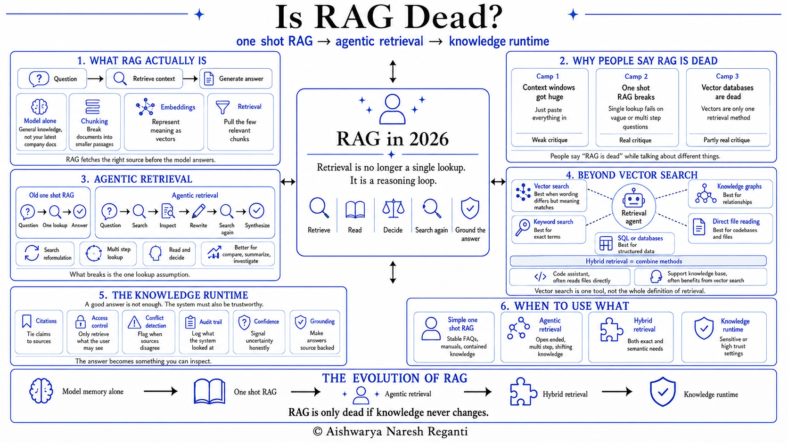

# Is RAG Dead?

[Watch on YouTube](https://youtu.be/FJQTT2B-imk) · 2026-08-18

<!-- agenda slide -->

## In this video

- **What RAG actually is**: chunking, embeddings, retrieval, and why the retrieval half is where the real work happens
- **Why people say RAG is dead**: camp 1 context windows got huge, camp 2 one-shot RAG breaks, camp 3 vector databases are dead
- **Agentic retrieval**: search, inspect, rewrite, search again, synthesise, instead of one lookup
- **Beyond vector search**: keyword, SQL, knowledge graphs, direct file reading, and hybrid retrieval
- **The knowledge runtime**: citations, access control, conflict detection, audit trail, grounding
- **When to use what**: one-shot RAG, agentic, hybrid, or a full knowledge runtime

## Resources

- [LevelUp Labs](https://levelup-labs.ai/)
- [The Nuanced Perspective (newsletter)](https://thenuancedperspective.substack.com)
- [LevelUp Labs education](https://levelup-labs.ai/education)
- [Awesome Generative AI Guide](https://github.com/aishwaryanr/awesome-generative-ai-guide)
- [My courses on Maven](https://maven.com/aishwarya-kiriti)

## Sources

- Menlo Ventures, *2024: The State of Generative AI in the Enterprise*: enterprise RAG adoption rose to 51%, from 31% the year before. [menlovc.com](https://menlovc.com/2024-the-state-of-generative-ai-in-the-enterprise/)
- Databricks, *State of Data + AI*: roughly 70% of generative AI companies use retrieval or vector databases; vector database use grew 377% year over year. [databricks.com](https://www.databricks.com/resources/analyst-paper/state-of-data-ai)
- Latent Space, *"RAG is Dead, Context Engineering is King"*, with Jeff Huber of Chroma, 19 Aug 2025. The phrase is the episode's headline, not a quote from him; in the episode he says he dislikes the term RAG. [latent.space](https://www.latent.space/p/chroma)
- Nicolas Bustamante, *"The RAG Obituary: Killed by agents, buried by context windows"*, 2025. [nicolasbustamante.com](https://www.nicolasbustamante.com/p/the-rag-obituary-killed-by-agents)

## Transcript

_Transcribed from the recording. Will be replaced with the YouTube captions once they are generated._

The internet can't agree on RAG. Half say it's dead, half say it's the single most important thing you can learn in AI right now.

So this video settles it. I'll break down what RAG actually is, the three camps calling it dead, and which of them are actually right, how it's quietly evolved into what the best teams now build, a knowledge runtime, and what you need to keep in mind building with RAG today so you're not stuck doing it the outdated way.

I've been building these systems since 2024, first as a tech lead at AWS and now for my own company. This is what I've been seeing firsthand in the field, not what I'm hearing about online.

Let's get started.

So, first things first: what actually is RAG? At its simplest, it's the step that runs in the gap between your question and the AI's answer: it goes and finds the right information before the model responds. Let me show you what that looks like.

Think about a brilliant new hire on their first day. They've read everything out in the world, they're sharp, and they'll answer any question with total confidence. But they have never opened a single one of your company's documents.

So ask them something specific about how your company works, and you'll get a confident, reasonable-sounding answer that's completely made up. That's an AI model on its own: answering from general memory, with no idea what's actually in your files.

RAG is what happens when you hand that new hire your documents before they answer. Same person, except now they're working from your real sources instead of guessing.

So picture a real question. Someone asks, how much vacation time do I actually get? That answer lives in your company handbook, which the model has never read, so on its own all it can do is guess. RAG's job is to go find that page before the model says a word.

And right away you hit the reason this isn't trivial: you can't just hand the model everything you've got. There's a limit on how much text it can take in at once, called the context window, and your handbook, your policies, years of documents, don't come close to fitting. So retrieval has to walk in and pull the one page that actually answers the question.

So how does it find that page? First, you can't search a whole document as one lump, so you break it into small passages called chunks, and now you can pull back a single paragraph instead of the entire manual.

Then comes the real problem. You asked about vacation time, but the page you need might say paid time off, or annual leave. Not one shared word, so matching on the words alone would miss it.

So instead, you match on meaning. You run each chunk through a model that turns it into a long list of numbers that captures what it means, called an embedding, or a vector. Passages that mean similar things end up with similar numbers, sitting close together, and you store all of them in what's called a vector database.

Now your question gets turned into that same kind of numbers, and the system pulls back the chunks sitting closest to it. Vacation time finds annual leave instantly, with no words in common.

That's the retrieval half, and it's where all the real work is. Generation is the easy part after it: the model takes that page and writes your answer from it.

And hold onto one thing, because it matters later. Searching by meaning like this is called vector search, and it's just one way to find the right page. It's the one that took off, but it isn't the only option.

So the whole point of RAG is that your AI stops guessing and starts working from the source: the policy that changed last week, the document your team updated yesterday, the data that lives in your systems.

In its original form, this was simple and static. You index your documents once, and every question runs a single lookup and gets one answer. Call that one-shot RAG. For knowledge that's stable and contained, a product manual, a benefits policy, a support FAQ, it's genuinely enough, and it still works today.

And for a while, one-shot RAG on a vector database was everywhere, one of the first things anyone building with AI learned. Then the tone flipped, and the same rooms that couldn't stop talking about it started calling it dead.

So is RAG dead? That depends entirely on who you ask, because they're not all talking about the same thing.

"RAG is dead" never gets settled because it isn't one argument, it's three, coming from three different camps. And each camp is usually talking about something different, so let's take them one at a time.

When AI models first arrived, they could only read a little text at once, a few thousand tokens, roughly a few pages. That cap is the context window. So if you wanted AI to answer questions about your company's documents, you had to be very selective about what you fed it, which is exactly the problem RAG was built to solve.

Then something changed. The newest models can now take in a million words or more at once. And that gave rise to camp one, the context-window argument: if the window is that big, why retrieve anything? Just dump your entire knowledge base, meaning all your documents, in with every question, and let the model sort it out.

There are two problems with that, and you feel both the moment you try it on real data.

The first: a big context window doesn't mean the model actually reasons well across all of it. The detail that matters gets buried in the pile, and the answers quietly get worse the more you stuff in. Capacity is not the same as attention.

The second is cost, and this is the one that settles it in practice. You pay for every word you put into a model, on every single question. Paste your whole knowledge base into every question, and you're paying to re-read all of it every time anyone asks anything, and a company's knowledge only grows.

Retrieval exists precisely so you can send the few right pages instead of the entire library: cheaper, faster, and a better answer. Even if context windows got ten or twenty times bigger tomorrow, you'd still want what you send to stay small and clean.

So when someone tells you RAG is dead because context windows got bigger, that's the one to push back on. Bigger windows are useful, but they don't replace retrieval.

That leaves two more camps, and unlike this one, they're not wrong. One says the basic version of RAG is finished, the other says the technology it runs on is dead, and both are worth taking seriously.

And both of them got there through the same shift, the one that turned retrieval from something you set up into something the model does for itself.

Camp two is about the original version of RAG: one question, one lookup, one answer. Real questions got more complicated than that could handle.

The original version worked like this: one question, one lookup, one answer. Simple, and for a while, enough. But as questions got more complex, one lookup wasn't enough.

You'd ask something with multiple parts. Compare these options. Summarize what changed this quarter. Brief me on something I don't understand yet. And the system would come back with half an answer, or the wrong one.

So engineers started building manual workarounds, and it became a game of whack-a-mole. Across 2023 and 2024 there was a flood of research into fixing it.

Rewrite the vague question into sharper search terms. Invent a fake ideal answer and search with that, a trick that even got its own name, HyDE. Re-rank the results. Fire several searches at once and merge what came back. Every one a workaround an engineer had to build and wire in by hand.

Then the question flipped. Instead of hand-engineering those fixes, what if the model itself was smart enough to do this, to notice its first search came back weak and decide, on its own, to go again?

That's exactly what happened, and the word for it is agentic retrieval.

An agent is a model that doesn't just answer in one shot. It works toward a goal in a loop: it looks at what it has, decides the next move, runs a search, reads the result, and keeps going until it has enough. Which is more or less how you research something you don't understand yet. You search, you skim, you realize you asked the wrong thing, you search again.

The newer models are post-trained, meaning deliberately taught, to work this way. So when the first search is weak, the model rewrites its own search and tries again, with nobody scripting it. Everything engineers used to wire in by hand, the search rewrites, the re-ranking, the multiple searches, the model now does on its own.

Camp two says one-shot RAG is dead, and they're right, but only about that. Open-ended questions, multi-step problems, knowledge that keeps shifting, one-shot is going to keep letting you down, and agentic retrieval is what handles those.

It costs more per answer, because the model is thinking and looping instead of doing one quick fetch, so it gets used when the problem actually calls for it. This is what most companies run now.

And once the agent is deciding how to search, it's no longer stuck with one way to do it. That's exactly what camp three is about.

The third camp goes after the technology underneath RAG. They're half right, and once you see which half, the rest of the debate falls into place.

The argument goes like this: vector databases are the foundation RAG was built on, and vector databases are dead, so RAG must be dead too.

The clearest test is sitting inside tools developers already use every day. A lot of the coding assistants that go find the right code for you don't embed your codebase into a vector database at all. They open folders, scan file names, and read the relevant files directly, almost exactly the way a developer would.

Same goal, find the right context before answering, completely different method. And for that particular job, reading the files directly turns out to be the better one.

This is the thing I told you to hold onto at the start. People glued the word RAG to vector database so tightly that the moment vector databases looked like the wrong tool for some jobs, it sounded like all of retrieval was dying. But vector search was always just one method.

Once the agent is the one driving, it picks whichever one fits the question in front of it. Keyword search, the plain word-matching that powered search engines for years, for exact terms. An ordinary database query for structured records. A knowledge graph, a web of entities and how they connect, when the answer is a relationship: this employee is on this team, which owns this product. Or reading the files directly.

And most real systems end up blending several of these at once, common enough that it has a name, hybrid retrieval.

So are vector databases actually dead? It depends entirely on your domain, and this is the clean way to say what vector search can and can't do. For code, it's barely needed, because code is full of exact things, function names, file paths, specific terms, and the agent finds those faster by searching keywords and reading files directly.

But move to a customer support knowledge base and it flips. A customer types, my card keeps getting declined. The document that answers them is titled, payment authorization failures. Not a single shared word, and yet the meaning is identical. Keyword search misses that entirely, vector search catches it instantly.

So match the method to your data, and treat anyone selling a single answer for every problem with suspicion.

Between the agent running the search and choosing the right tool for it, the answers get a lot more reliable. So both of the real camps lead to the same place, which leaves just one thing left: where all of this is heading.

Getting RAG to give you a good answer is one problem. Getting it to give you an answer you can actually trust is the harder one, and it's what the next generation of these systems is being built around.

Picture giving two AI tools the exact same question, each using RAG to answer from your company's documents.

The first loops through a few searches and gives you a clean, confident answer. You have no idea which documents it pulled from, whether it was even authorized to read them, or whether two of those sources contradict each other.

The second gives you the same answer, but with every claim tied to the exact source it came from. A note that two of the documents disagree, and a flag on which part of the answer that affects. A signal of how certain it is, so you know whether to act or dig deeper.

And underneath all of it, access rules: a contractor asking about salary bands won't get that answer, because access is restricted by role. The first answer you take at face value. The second you could hand to an auditor.

Underneath, it's the same agentic retrieval we just talked about. What's being added is a layer of guardrails: every claim tied to its source, a record of what it looked at, a flag when two sources disagree, an honest signal of how sure it is, and access control. Some people call this a knowledge runtime.

This is also why the death of the vector database was always overblown. The same companies everyone wrote off are quietly racing to become exactly this trustworthy layer that sits around retrieval and makes it safe to rely on.

And what both real camps were reacting to, without knowing it, is the same underlying mistake: treating retrieval as a one-time decision rather than something that evolves. One camp thought one-shot RAG could be set up and left alone, the other thought one retrieval method could handle every task, and both got proven wrong by the next version exposing a problem the previous one couldn't handle.

Worth noting too: memory, the thing that lets an AI remember your preferences and your past work, is this same retrieval idea, just pointed at remembering you instead of your documents.

Retrieval isn't a feature you bolt on and forget. It's becoming the core of how AI works with real information, in real organizations, with real stakes. This is what the serious settings grow into: regulated industries, sensitive data, many teams with different permissions, anywhere a wrong or unauthorized answer causes real damage. It's not where most people start, it's what they grow into, once trust and access genuinely matter.

So that's where RAG is heading: from a single fixed lookup, to a model that researches on its own, to a system with real guardrails you can trust. Which leaves one last, honest question. When would RAG actually, finally be dead?

So, is RAG dead? No. Basic, one-shot RAG is fading, and retrieval grew up. It went from a single fixed lookup, to a model that runs the search itself across whatever method fits, to a system with real guardrails you can trust.

But let's answer the question properly. When would RAG truly be dead? Picture the one world where it would be. A model reads your entire knowledge base a single time, remembers every detail of it perfectly and forever, and never has to look anything up again. In that world, you wouldn't need retrieval, the model would simply know everything.

Here's why that world doesn't arrive. Your knowledge never stops changing: new documents, new decisions, updated policies, constantly. So even a model with perfect memory would have to keep re-reading all of it just to stay current, and the moment something changes, it has to notice and go pull it in. Which is retrieval, again.

The only way to escape retrieval is a perfect, permanent memory of a world that never moves, and that world doesn't exist.

So retrieval isn't dying. It's quietly becoming the thing that makes AI genuinely useful on your own information, instead of a confident stranger guessing from memory.

The next time someone tells you RAG is dead, you'll know what they actually mean, you'll know they're only half right, and you won't fall for the hype.
