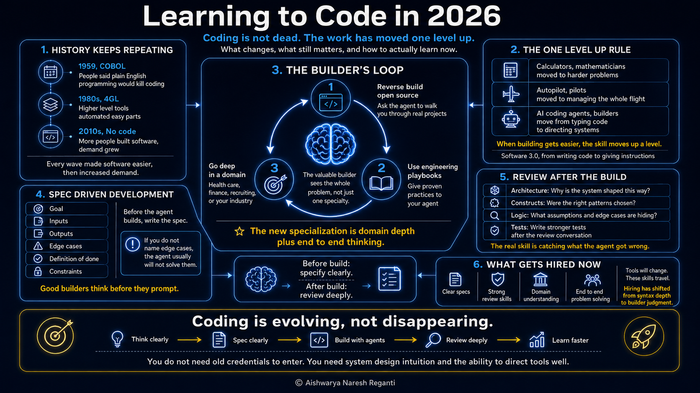

# Is Learning to Code Still Worth It in 2026? | Ex-Amazon AI Scientist

[Watch on YouTube](https://www.youtube.com/watch?v=x5PBvHYt6UE) · 2026-07-21

<!-- agenda slide -->

## In this video

- **00:00** Is Coding Dead in 2026? (What's Actually Happening)
- **00:27** The "One Level Up" Rule: Why Coding Never Dies
- **03:10** How to Learn to Code with AI: The Builder's Loop
- **05:57** Spec-Driven Development: Write a Spec Before Your AI Agent Builds
- **09:52** How to Review AI-Generated Code (Like a Senior Engineer)

## Resources

- [addyosmani/agent-skills](https://github.com/addyosmani/agent-skills)
- [humanlayer/12-factor-agents](https://github.com/humanlayer/12-factor-agents)
- [LevelUp Labs](https://levelup-labs.ai/)
- [The Nuanced Perspective (newsletter)](https://thenuancedperspective.substack.com/)
- [LevelUp Labs education](https://levelup-labs.ai/education)
- [Awesome Generative AI Guide](https://github.com/aishwaryanr/awesome-generative-ai-guide)
- [My courses on Maven](https://maven.com/aishwarya-kiriti)

## Sources

- Nvidia's CEO said people no longer need to learn to code — [Jensen Huang, World Governments Summit](https://www.tomshardware.com/tech-industry/artificial-intelligence/jensen-huang-advises-against-learning-to-code-leave-it-up-to-ai)
- IBM released COBOL in 1959, pitched as simple enough that anyone could write software in plain English — [COBOL, 1959](https://en.wikipedia.org/wiki/COBOL)

## Transcript

_Auto-generated captions from YouTube, lightly cleaned._

We are in the middle of the biggest shift coding has ever had. Nvidia CEO recently went up saying that nobody has to learn to code anymore, and engineers at Anthropic are literally posting that software engineering might be dead within a year. Now, I have spent a decade in AI research, and I run an AI-native company in San Francisco, and I pretty much interview engineers every week. So, I'll tell you exactly what I've seen on the ground and whether learning to code is still worth it in 2026. Let's maybe start by taking a look at history, right? The last three times someone said coding was dead, something very specific happened, and it happened every other time.

In 1959, IBM released a new programming language called COBOL, and the whole pitch was pretty much that it was so simple that anybody could write software like they wrote in plain English. And that was the first time that the industry was convinced that coding is going to be dead. Why hire a coder when your accountant can literally do the same thing? But, to everybody's surprise, the opposite happened. Everyone wanted more software than an accountant could build between doing their actual job, and new people poured in to fill that gap. And writing software all day made them new-age coders, and the demand didn't shrink. It multiplied. It happened again in the '80s with the idea of 4GL or fourth-generation languages like dBASE, where you could just describe the data you wanted instead of writing code to compute it.

So, researchers again predicted that coding would be finished. But, these tools only automated the easy part. Somebody still had to design how the data was structured, what was the logic around it, and what happened when things actually broke. Now, that work was the new coding, one level up from the old one. Then again in the 2010s, drag-and-drop or no-code tools like Webflow, Zapier, and Bubble let anybody build software without writing a single line of code. And this was supposed to be the nail in the coffin, right? But instead, marketers and founders just became new builders. Now, every time a new tool threatens a skill, the same thing ends up happening.

The skill moves one level up into the hands of people who actually adapt. Calculators pushed mathematicians up to harder problems. Autopilot pushed pilots up to managing the whole flight. And that is the one level up rule. And it's being played out in coding for decades now. When building gets easier, it gets cheaper, so more people and companies want way more software than before. And that is exactly why the number of coders have multiplied after every one of these waves, and why this wave will pull in more builders than anyone before it. Now, AI researcher Andre Karpathy calls this software 3.0, where we've gone from writing code to giving instructions in plain English.

What replaces the credential of a computer science degree is the ability to think clearly about your problem and direct the tools that build them. So, that is where the real skill is moved. And most advice still misses this. It teaches the old way of coding with AI kind of sprinkled on top. So, what is coding actually evolving into? Now, the old way was pretty simple. You pick a coding language, a specialty, master it, and then you get hired. But AI has changed that and replaced it with something I'd like to call the builder's loop. You used to have to spend a few months learning a stack, then get hired into a narrow specialty, say back-end, front-end, data, or whatever the curriculum was.

That model worked when each specialty was genuinely hard to learn and took years to get good at. But in 2026 and beyond, agents like Codex, Cloud Code, etc., do most of the work for you. So, specialties are collapsing. The builder who can see the whole problem at once becomes much more valuable than the specialist who can only see a part of it. So, the goal for anyone who would be to become that end-to-end problem solver. And the way you get there is what I call the builder's loop, which consists of three moves that together add up to what coding actually is in 2026. First, reverse build open-source projects.

Find an open-source project someone else has already built in a domain you care about and ask the agent to walk you through that and how it was built piece by piece. Second, put the engineering playbooks to work. Now, decades of software engineering experience now exists in forms that your agent can directly use. Now, for instance, there's a repo on GitHub called agent skills that takes Google's software engineering principles and turns them into skills that you can hand your agent. So, it basically picks them up and you have senior engineer habits baked right into your building system. Now, there's also a 12-factor app method that spells out what reliable apps look like in production.

And you don't need to master all of this up front. You can give it your agent so that it can reason much better and follow these best practices. Point your agent at these when you build and skim through them yourself so that you start learning these good engineering practices when you review your agent's work. Now, the third part of the builder's loop is to pick a domain and go deep in it. The new specialization is about domain. So, you become the person who understands health care better than anyone else, or finance, or recruiting, or whatever industry you're trying to work in. Now, continue that loop until you're comfortable building solutions for newer problems.

That's the builder's loop. So, start with two basics. Pick your language and pick your problem. Then choose one of the two moves as your entry point. You either reverse build something in a domain you care about or hand your agent the playbooks for your very first build. Either of them should work. And the more you study how things are built, the more naturally your thinking expands to see the whole problem, and the third move starts happening on its own. Now, let's get into what actually makes you good at coding today. What you do before the agent builds, and what you do after. Now, your AI agent, anything Claude Code or Code X, will literally build anything that you tell it to with no questions asked.

And I know that sounds like a positive thing, but it's actually what leads to most builds failing in 2026 and beyond. And the worst coders in 2026 can write code just fine. That's not the problem. What they can't write is a clear spec or specification, and that's what sinks most of their builds. Picture this, right? You're building an app, and you ask Claude Code to add a user image upload feature. It builds something, and it's working in 10 minutes. It looks great. Users can upload images, they appear in the UI, and you say, "Okay, fine. Let me just ship it." Then, someone uploads a 50 MB photo, and your hosting bill spikes up because the agent never thought to compress images or to even limit file sizes.

You didn't ask, and the agent also. It just built the thing you said you wanted. Now, the old coder writing this by hand would have hit the file size question while writing it because they had to make a decision at every line of the code. But the new coder has to anticipate it up front, and they have to write a spec even before the agent ever starts. Now, this is an example of what I would call spec-driven development, and it's pretty simple. Here's an example. Before I prompt an agent for anything more than a one-liner, I write a spec with six fields, and I paste that spec in the agent's context.

Here's what they are. One is the goal in one sentence. Pretty much like, "What is this thing for?" Write about two, three lines so that you understand the product well enough. Two and three are essentially the inputs and the outputs for this process. For instance, what data, signals, or user actions feed in, and what the thing produces. Is it a UI, a file, or an API response? And be very specific about both of these. And four is edge cases. Now, these are essentially unexpected situations that can break your product. Start with writing at least three. And this is essentially where spec becomes super critical because the agent will not invent edge cases for you.

You know, things like what happens if the input is empty, when it's malformed, or when a downstream service is broken. If you don't think through these before the agent starts, you'll find them later. And finding them later is always super painful. And if you're wondering how you're even supposed to know what these edge cases might look like, this is the time to also brainstorm with your agent even before you finalize the spec. So, pretty much describe the feature and ask what usually breaks when such kind of features are built. And the fifth component of the spec is the definition of done. How will you know that the thing is finished?

Now, this can be the trickiest field because most learners think done means the code runs. When actually, done means that the code does what your spec says under all of the edge cases that you listed. And the last part is constraints, which is essentially what you don't want your agent to do. For instance, don't use external APIs, don't write to production databases, don't change the existing auth flow, and all of these things, right? Remember, you learned in the builders loop should pretty much feed into these decisions because you would have reviewed a lot of real-world use cases and will be in a position to write the spec.

So, once the spec is written, give it to your agent and let it build. And then compare what came back to what you actually wanted. Now, that gap is where learning happens, and it sharpens every spec after. But the biggest lesson I want you to take from here is to do a lot of thinking even before you go to the build part. So write a six-field spec for the next thing you want your agent to build even it's a tiny feature. Just try and write it and see how different or good your output starts looking. Now here's the truth, right? Being an end-to-end builder doesn't just stop at the spec.

It actually means knowing what to do even after the agent has finished building. And everybody that teaches you AI coding tells you how to make the agent build things, but almost nobody teaches you how to catch what it gets wrong. That is really the actual skill. Now let's say you ask Claude Code to pull together user data from three different places in your app and package it into a single clean response your dashboard can display. It comes back with a clean working code that passes the test, but those tests were written by Claude Code itself. Now what the agent never asked is what happens when one of those three services was so slow to respond or maybe returns partial data.

So the endpoint runs beautifully for the first time, then starts breaking the moment one of those three services runs into a problem. Now the old coder who wrote code by hand would have asked that question while writing it because they would have run and tested it so many times. Now the new coder has to develop the eye to ask that question without writing the code themselves. What I do again here is the idea of reverse build. Now it's the same walk-through conversation from the builder's loop pointed at what your agent wrote. Now after your agent generates something, you have a conversation with it about what it built at three specific layers.

So you're shipping something you actually understand end-to-end. Layer one is architectural choices. I ask about the shape of the thing. Why did it structure the code this way? Does the data flow make sense for what you're actually doing? Did it create new abstractions when existing ones in the code base would have pretty much worked? Architectural mistakes are one of the most expensive to fix later, which is why senior engineers spend most of their time doing code review here, and you should do the same, too. Now, the second layer is coding constructs. The question here goes from architecture to the building blocks. What patterns did the agent pick?

Did it overcomplicate something that could have been done in a much more simpler manner, or take a shortcut somewhere that it shouldn't have? Agents default to the most common approach that they've seen, which is often fine, but sometimes it's lazy. And this is where you catch the shortcuts hiding behind working code. And the third layer is actual logic. Like, I want to know the decisions that are made inside the code. What does the agent assume about the input? And what does it do when something unexpected happens? And where are the edge cases hiding? This is pretty much the layer where silent failures live. The code runs, the tests also pass, but the assumptions inside the logic don't hold up in the real world.

And the goal pretty much here is to surface those unstated assumptions. And then there's the fourth layer that ties all of these three layers together, which is tests. After the conversation, have the agent write comprehensive tests for what it just built, but with all of the context of the conversation that you've had with it so far, so that it actually looks at everything that you discussed and keeps that in mind while writing these new tests. Now, this is what forces the agent to articulate the edge cases that it should have thought about while writing the code, and it gives you a concrete check on whether those cases actually pass.

Now, tests are how you catch the agent in its own mistakes. Think of yourself as a senior engineer reviewing the agent's work. You need to look at the structure, question the choices that feel off, and catch what doesn't fit. And if the same prompt gives you three different answers, tighten it until your output is predictable. And And more you start doing this, the better you get at catching problems even before they reach your users. Now, coding has survived every wave that was supposed to make it obsolete. So, you came into this video wanting to know if it's worth learning to code in 2026 and beyond, and I think the answer is definitely yes, but what coding means and how you learn it has completely changed, and you need to adapt to the new medium and the new meaning of what coding is.

Now, predictions about the future of AI are cheap, but hiring decisions are expensive, so they always tell the truth. Now, I interview engineers every week for my company, and what gets someone hired today has completely flipped in the last 2 years. So, I'm going to be thinking about the future through the lens of hiring, and one thing has become clear. The skills that got coders hired 2 years ago barely come up in our interviews anymore. Companies interview for the work that they need next. So, the interview room shows you more about where a field is going even before the curriculum catches up. So, when people ask me what coding is going to look like in the next 5 years, I go back to the one level up rule.

I really have no idea which model or which tool wins, and nobody does, right? And the AI tools will eventually become dated, something else will replace them, but the spec, the review, the domain depth, those are the ones that let you climb with confidence, no matter where the field is heading next. And that pattern holding is the best news in this whole video. So, what's the biggest lesson we learned in this video? Coding isn't dying, but only evolving into a completely different practice. And for the first time in software history, you don't need years of masters, undergrad, or credentials to be part of it. You need to be learning it in a very different way than before and build a very good system design intuition around it.

And if this video helped you see coding differently, share it with someone who's been asking the same question that you entered this video with. All the very best.
