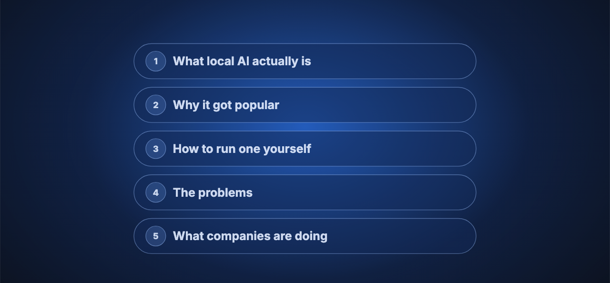

# You need to learn Local AI in 2026

[Watch on YouTube](https://www.youtube.com/watch?v=KJgAn4CZNso) · 2026-10-01

<!-- agenda slide -->

## In this video

- **What local AI actually is**: every AI product has 2 layers, the model (the brain) and the harness (the scaffolding), and for something to count as local, both must run on your own hardware
- **Why it got popular**: cost and control, from agents that burn far more tokens than chat to an incident where access to a major model was suspended overnight for a group of users, plus open models closing the gap with closed ones
- **How to run one yourself**: a no-code walkthrough with Unsloth and a small open model, and how Claude Code and Codex can point at local models
- **What actually goes wrong when you run it at scale**: model size and memory are the bottleneck, so you ask 3 questions (what should it do, will it fit, will it be fast enough), and a back-of-the-envelope rule of about 0.5 GB per billion parameters
- **How companies are thinking about it**: sovereign AI, owning infrastructure, and why the realistic future is hybrid, with frontier models for work that has to be right and local models for private, repetitive, or high-volume work

## The cheat sheet

The 3 questions, the memory rule, and a RAM to model size table in one file:
**[local-ai-cheatsheet.md](local-ai-cheatsheet.md)**

## Resources

- [What do you want Local AI to do (tool)](https://localai.levelup-labs.ai/), estimates the model size and memory your use case needs
- [LinkedIn: Aishwarya Reganti](https://www.linkedin.com/in/areganti/)
- [LevelUp Labs](https://levelup-labs.ai/)
- [The Nuanced Perspective (newsletter)](https://thenuancedperspective.substack.com)
- [LevelUp Labs education](https://levelup-labs.ai/education)
- [Awesome Generative AI Guide](https://github.com/aishwaryanr/awesome-generative-ai-guide)
- [My courses on Maven](https://maven.com/aishwarya-kiriti)

## Sources

- Anthropic, *"Statement on the directive to suspend Fable 5 access"*, June 2026, the US export control directive covering foreign nationals that led to access being suspended. [anthropic.com](https://www.anthropic.com/news/fable-mythos-access)
- Anthropic, *"Claude Fable 5 and Mythos 5 redeployed"*, July 1, 2026, confirming the export controls were lifted on June 30 and access restored. [anthropic.com](https://www.anthropic.com/news/redeploying-fable-5)
- Jake Angelo, Fortune, May 26, 2026, on Uber using its entire 2026 AI coding tools budget in 4 months after an internal leaderboard encouraged adoption. [fortune.com](https://fortune.com/2026/05/26/uber-coo-ai-spending-tokens-claude-code/)
- Artificial Analysis, on the shrinking gap between open weights and proprietary models on the Artificial Analysis Intelligence Index. [artificialanalysis.ai](https://artificialanalysis.ai/articles/recent-open-weights-model-launches)
- Deloitte, *"State of AI in the Enterprise 2026"* press release, a survey of 3,235 business and IT leaders across 24 countries, which reports 83% viewing sovereign AI as important to strategic planning. The video describes this as a board level discussion; the release states the 83% figure. [deloitte.com](https://www.deloitte.com/us/en/about/press-room/state-of-ai-report-2026.html)
- Gartner's strategic technology trends for 2026, as reported by Help Net Security, October 23, 2025: by 2030, more than 75% of European and Middle Eastern enterprises will geopatriate their virtual workloads into solutions designed to reduce geopolitical risk. [helpnetsecurity.com](https://www.helpnetsecurity.com/2025/10/23/gartner-2026-technology-trends/)

## Transcript

_Auto-generated captions from YouTube, lightly cleaned._

Local AI is one of the most discussed topics in AI right now. There are people running full-blown AI agents on their own hardware for free, telling you that it's private, it's secure, and that local AI is the future of AI. But almost nobody seems to explain the foundations properly, what it takes to run AI locally, and what issues you might encounter. Right? So that's exactly what we'll be doing in this video in a very beginner friendly way.

We'll go through what local AI actually is, why it's gotten so popular just in the past few months, and how you can run one yourself in less than 5 minutes with no code at all. Then the problems, which is what actually goes wrong when you run these at scale, and how companies are thinking about it, so that you can see where this whole trend is going.

And if you're new here, I'm Aishwarya. I've been working in AI for about 10 years now, previously as an AI scientist and researcher at AWS, and now I'm building my own AI native startup in San Francisco. It's called LevelUp Labs, and we help companies and teams go AI native through education, engineering, and strategy.

So, let's start off with the basics, right? What is local AI? Because you think it's obvious, but there's some confusion around this as well. So, local AI is pretty much AI that runs locally on your device, right? But there is some nuance to this. So, let's understand that first.

Remember that pretty much every AI product you've ever used has 2 layers to it. The first layer is the AI model that runs it, which essentially is the brain and the part that does the thinking. But an AI model on its own is pretty much like a data in and data out. It cannot access your files. It can't execute code, and a bunch of other stuff which essentially entails working with your ecosystem. So the companies who build these AI products build a whole layer of scaffolding around the AI model to make this possible. Think of something like a database to hold memory of your conversation and retrieve whatever is needed, or maybe a sandbox where the model can execute code that it writes, and things like that, right?

So the scaffolding itself, which is usually called a harness, is written in traditional software code, and there's pretty much no AI to that component. Only the model is the AI piece. So the model is still the part that's deciding what should happen, and the scaffolding or the harness is the part that makes it happen. So whenever you're playing around with apps like Claude Code, Codex, or even ChatGPT, you're actually working with the application, with the harness, not just the base model.

Now a common misconception is that if the app is available locally, which means that if you're running Claude Code on a desktop app, that makes it local AI, which is kind of incorrect, because if you're running Claude Code with Anthropic's models, these models are being called from the cloud, and you're pretty much using Anthropic's API every time you're conversing with these agents. So for anything to qualify as local AI, you'd want the model that's powering the application to be running on your own system, not just the application, right? Both the model and the application should be running locally.

And if you're getting confused, a simple way to understand this is to think of it as electricity. The model is pretty much like a generator that can generate electricity, and the harness or the application is everything in your house that uses this electricity. Using a Sonnet or an Opus or a GPT model is like being on an electricity grid where someone else generates electricity for you and sends it across. But running the model on your own machine, say your laptop or your computer, is like putting solar panels on your own roof instead of using an electricity grid, right?

That's also why local AI is free. Just like electricity grids bill you by the number of units you use, the models you use through APIs from a provider are billed based on the number of input and output tokens, because they are the ones that are generating it for you. Once you run it on your own machine, you don't have to pay for it, right? Because you're pretty much having the generator of the electricity right in your house.

So hopefully that clears up some confusion about what local AI is. The model itself should be running on your own computer or your hardware for it to qualify as local. And that's what it means when people say that you're not paying for it and not sending any of your requests out, which is also why it's private, it's secure, your data never leaves your system.

Now, getting that out of our way, let's understand why it's gotten so much more popular just in the past few months. There are essentially 2 main reasons for this. The very first reason was cost and control.

Now remember, this whole generative AI boom started with ChatGPT back in November 2022, and over the next couple of years the usage kept climbing. In 2024 and 2025 it really burst out, to a point where people were using these models at a completely different scale than before, and the kind of usage also changed. People moved from chatting with AI systems, where you just ask questions and get answers, to running agents that go off and can complete end-to-end tasks for you. So instead of asking it to explain something, you're telling it to refactor an entire codebase, or research something across 50 sources and write you a report, or build a complete website or an app and keep fixing it until the unit tests pass. And with those kinds of use cases, you have these AI systems running for hours or sometimes days, right? That also means that they burn a lot of tokens as compared to just chat style use cases.

And in 2026, it further increased to a point where there was this term of token maxing introduced, which is people treating the number of tokens they burned as a measure of their productivity. In early 2026, companies were also running internal leaderboards where the heaviest users came out on top. And you've also probably seen the news that Uber got through its entire token budget for the year just in the first 4 months of the year.

All of this was possible because in the beginning, the companies making these models, think OpenAI, Google, Anthropic, all of them, wanted to increase adoption. So the cost was much lower and it was heavily subsidized. But as the heat started hitting them, the subsidies came down, the cost of models started going up, and the weekly limits also started reducing. So there was a real crunch and everybody started to feel the heat.

Now, apart from the cost itself, there was also another major trigger in June of 2026, when Anthropic released their strongest model yet. It was called Fable, and it was supposed to be incredibly more powerful than the previous models that they had released. A few days after the release, the US government ordered Anthropic to suspend access to Fable to everyone who was a foreign national, keeping in mind security. It was eventually reversed a few weeks later. But consumers who were sitting in the middle of all of this watched it happen, and what they took away from this incident is that your access to models can be cut off, can be taken away, often without notice, and there's not really a way you could control it. So that's pretty much our first reason, which is cost and control.

The first reason is more of a necessity. The second reason is more of availability that showed up to meet this necessity. Before we go into the second reason, I want you to remember one thing, right? In order for you to run a model locally, it has to be an open-source model, because you're literally taking that model and putting it on your own laptop or computer, which means the company that built it has to give you access to those model files. With a closed source model, you only ever get to call it through an API. You never get the model files themselves.

Which brings us to the second reason, and this one really accelerated just this year, which is that open-source models got a lot better as compared to previous years. Now obviously this has been happening gradually over the past few years, but in 2026 they started catching up very quickly, and on some tasks open-source models were even better than closed source models.

Here's a chart from a website called Artificial Analysis, which I love to use in order to compare models, and it shows how much the gap between open-weight models and proprietary models has closed just in 2026. You can see that the blue line here is so much closer to the black line. The blue is open-weight models and the black is closed-weight models. So you can kind of see how the gap has been closing over the years and how close open-source models have gotten in terms of performance. The y-axis here is basically the intelligence index and the x-axis is the timeline. If you look at the chart, you can see that back in 2024, open models were lagging by a long way. Today, that gap is closed not just by one provider, but by several open-source providers.

So if you zoom out and see this pattern, you notice that there was a push and a pull happening at the same time. The cost and control were pushing people away from closed API based models, and open models were also getting good enough so that people could run them on their own. So that's essentially why the entire trend of local AI models started happening, which is: can I use my own models and my own hardware or infrastructure to run stuff at a much lower cost instead of relying on an external provider?

Which brings us to the next question, which is, if you were to run your own local AI agents, how hard is it and what does it actually take? Well, if you want to get started and start playing around, it's pretty straightforward. There are plenty of options to choose from, and I'll show you one option that needs no code. It's an app called Unsloth. So all you have to do is go on their website and click the download button, which should give you access to their desktop app. Go to their model hub and choose the model that you want to download, for instance Qwen 3.5, and click on run, and it'll load up the model for you and you can start chatting with it instantly. It downloads the open source model on your laptop.

So it's loaded up Qwen 3.5, and I can pretty much chat with it like I would do with ChatGPT. And if you go to the model hub, you can find other models as well, right? There's a huge list of models that you can choose from.

Now the hard part is not setting this up. The hard part is the fact that some models are extremely large in size. For instance, let's look at Kimi K3, which is a popular model. You'll see that it's 467 GB, which is incredibly huge for you to download on your laptop and run. Also, quick heads up that you can configure your Claude Code and Codex to also point to local models on your system if you're using the CLI version of them. It's not super hard to replace it.

But let's talk about the size of these models. Complications start to occur when you want to start running much larger models, which need more memory and better hardware. To understand why, you want to know what model parameters are, not at a very deep level, but to give you enough intuition. All models have a certain number of parameters, and for the sake of this discussion you can think of parameters as a rough indication of how large the model is. It's essentially the number of units that make up a model. Generally, an 8 billion parameter model is considered a small model and a 30 billion parameter model is much larger. The biggest open-source models that we have available now, say GLM or Kimi K3 or your DeepSeek models, are made up of hundreds of billions of parameters, or sometimes even trillions of parameters. These larger models need more memory and they need better hardware to run on. They're also the ones that hold up on more complicated and agentic style work.

Now, to decide which model you need and what hardware it takes, you want to ask yourself 3 questions. The first is what you want your local AI to do, because that decides the size of the model you need. If you want your local AI to do things like writing emails or summarizing documents, small models should do fine and you can pretty much run them on your laptop as well. But say you're looking at use cases like coding copilots, a Claude Code level system, you probably need models that are 70 to 80 billion parameters or even more for complex use cases.

The second thing you want to think about is whether that size of the model fits into your machine's memory, or what extra hardware you need to bring in. On your Windows or Linux machine, that's essentially your RAM, and on a Mac, it's the unified memory. A back of the envelope calculation is that you need about half a GB for every billion parameters. So an 8 billion model will need somewhere around 4 to 5 GB and a 30 billion model will need 15 to 20 GB. And all of this is just to hold the model in your memory, not to run anything.

The third question you want to ask yourself is whether it'll be fast enough with your hardware. The machine that you have might have enough memory to hold the model and still not be able to run it well, because running an AI model requires a huge number of matrix multiplications. So the computation should happen on your machine's CPU or GPU, and your machine should be fast enough to do that. That essentially determines how many words or tokens per second your system can generate.

And if you're getting overwhelmed by all of these calculations, don't worry. I built a small website for you where you can go and see what kind of models you need and what kind of hardware you need. I'll leave a link in the description below, but I'll also show you how the tool works.

So here's the tool that I built in order to figure out what kind of hardware you need. What you can essentially do here is mention what you want your local AI to do, and it can be a bunch of different tasks. For instance, whether you need a document and knowledge assistant, whether you want to build agentic automations, or autonomous coding style use cases. Depending on your use case, it estimates the size of the model you need. There's also this legend on what different use cases mean. Remember that for more complicated use cases, for autonomous coding style use cases, you need much larger models, but for simple use cases, which is to chat, write, or summarize information, you can do away with smaller models, right?

Then you can also mention the kind of machine you have, whether it's a PC or a Mac, and what is the memory that's available on it. If you're using a PC then that's your VRAM or RAM, or if you're using a Mac it's your unified memory. When you select these options, it'll tell you what are the sizes of the models that you can use. It'll also tell you if you have enough memory for the use case.

For instance, you can see here, if I need to run a local coding copilot on a 16 GB Mac, it says that more memory is needed and it recommends an upgrade, and it also gives you a target of how many tokens per second you need for these kinds of use cases, right? Then you need a much smaller size model, but you still need memory more than 16 GB. If I change this to maybe 24 GB, that's enough to get started. It also gives you suggestions on which models you can try and what kind of hardware options you need. It has links to where you can find these models and download them, and you can also use them directly in Unsloth, which is the app that I showed you. And in case you need to buy hardware, it also gives you suggestions on what's the best hardware to buy and how much it costs, and links to buy it.

So this is a quick fun prototype that you can play with to understand what kind of machine you need, depending on the kind of use cases you're running. Remember, everybody doesn't need a very fancy local AI setup. Depending on your use cases, you might need only your laptop or sometimes a more powerful laptop.

Now all of what we discussed is pretty much about individuals running things on their own machines, and how you as an individual can make a decision as to whether local AI is for you, depending on the use cases that you have and how much it costs you to actually build a local AI setup, right? But the bigger question is whether local AI is actually going anywhere. What are the trends? One way to look at it is to see how companies are thinking about it, because they are the ones with the most on the line.

The conversation there looks quite different, because these costs are hitting larger companies much harder than they're hitting you. They're not running an agent on a laptop. They're essentially serving a lot of customers at once, and at that volume, the bill becomes a serious line item. So a lot of companies have started asking whether they should be running their own models instead of relying on these frontier model providers.

There's been some recent research on this. For instance, Deloitte surveyed over 3,000 senior leaders across 24 countries and found that sovereign AI, which essentially means keeping all of the AI inside the company's infrastructure, has become a board level discussion in 2026, and leaders are actively thinking about moving to sovereign AI. And there was research done by Gartner that expects that by 2030, more than 75% of European and Middle East companies will move workloads into infrastructure that they control. This is specifically to reduce geopolitical risk. And the EU AI Act is pushing in the same direction too, for auditability reasons.

But remember that companies run into the same 2 problems that you probably run into, right? Owning the infrastructure costs money upfront, and even though companies are willing to pay that, keeping it running reliably is also your problem, not the model provider's. So even though running it themselves is genuinely more private and more secure, most companies haven't completely moved away, but they are considering it seriously. A lot of the research says so as well.

Which now brings us to our last question, which is whether local AI is actually the future, based on all of these things that we have discussed. I think the honest answer is that the reality sits somewhere in between, and what most people and companies will end up doing is a hybrid. For companies, hybrid might mean running their own models for things that are private or repetitive or high volume, where the cost and control matter most, and then calling frontier models for the work that has to be right and precise.

I think in the future the space is moving to more of something like that, which is that there will probably be a super app or a super agent that's the orchestration engine, and then a hybrid which can either run locally or on-prem. We're seeing the same trend of hybrid usage happening with some power users as well, which is they're having frontier models route and orchestrate while smaller models run more repetitive or high volume tasks. For instance, you can set up agents like Claude Code or Codex to use one large API based model, but for all of the sub-agents, you can use local models that are much smaller and can get the work done more quickly.

So that's pretty much the state of local AI, and it shouldn't be hard for you to get started, play around with something, and also understand what the quality of these models are. Hopefully this has cleared up the confusion around the state of local AI, whether it's really for you, and whether companies are adopting it.

Thanks for watching this video, and if you like these kinds of breakdowns and research-backed videos, do consider subscribing. All the very best.
